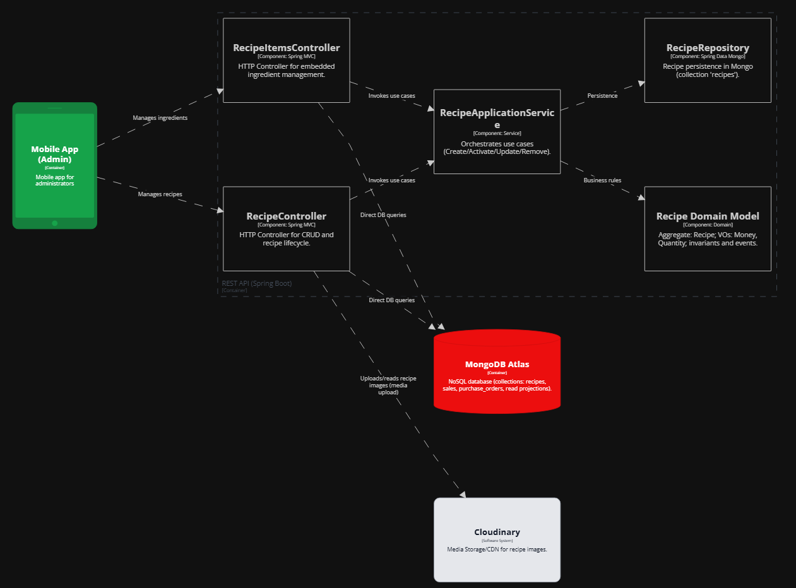

# Capítulo II: Requirements Elicitation & Analysis

## 2.1 Competidores

- **Oracle Simphony**  (competidor directo): Es una plataforma basada en la nube que permite a los propietarios de restaurantes automatizar sus procesos, lo que contribuye a mantener un control óptimo del inventario, minimizar el desperdicio de alimentos y gestionar eficazmente el flujo de caja. Se enfoca en empresas de hospitalidad, cadenas de restaurantes grandes, y resorts. Su uso está presente especialmente en Estados Unidos, Canadá y en países de Europa como Reino Unido.
- **RestroWorks** (competidor directo): Es una solución integral basada en la nube para la gestión de restaurantes. Incluye funciones de control de inventario, manejo de pedidos, informes financieros y gestión de operaciones en tiempo real. Se enfoca en restaurantes de tamaño pequeño a mediano. Se usa principalmente en Latinoamérica, con una fuerte presencia en países como México, Colombia, y Argentina.
- **SoftRestaurant** (competidor directo): Es un software de gestión para restaurantes que permite controlar inventarios, ventas, compras, reportes y más. Enfocado en restaurantes pequeños y medianos. Es utilizado principalmente en Latinoamérica para mejorar la eficiencia operativa y el control de los procesos internos en restaurantes.

### 2.1.1 Análisis Competitivo

**¿Por qué llevar a cabo este análisis?**

> El objetivo de este análisis es evaluar las oportunidades reales de competir en el mercado, identificando los segmentos objetivos, características de producto y estrategias de venta de los principales actores.
> A través de este estudio, buscamos tomar decisiones informadas para diseñar una propuesta de valor diferenciada que nos permita destacar en el mercado objetivo.

<table>
  <thead>
    <tr>
      <th></th>
      <th style="text-align: center;">
        <b>Restock (Nuestro producto)</b><br>
        
      </th>
      <th style="text-align: center;">
        <b>Oracle Simphony</b><br>
        
      </th>
      <th style="text-align: center;">
        <b>RestroWorks</b><br>
        
      </th>
      <th style="text-align: center;">
        <b>SoftRestaurant</b><br>
        
      </th>
    </tr>
  </thead>
  <tbody>
    <tr><th><b>Perfil</b></th><td></td><td></td><td></td><td></td></tr>
    <tr><td>Overview</td><td>Plataforma para automatizar la gestión de inventarios y pedidos de restaurantes.</td><td>Solución POS basada en la nube para gestión integral de restaurantes grandes y retail.</td><td>Plataforma en la nube con herramientas de operación para restaurantes y cocinas en la nube.</td><td>Software administrativo integral para restaurantes pequeños, medianos y franquicias emergentes en Latinoamérica.</td></tr>
    <tr><td>Ventaja competitiva</td><td>Enfoque exclusivo en automatizar inventarios y pedidos con costos accesibles y alta usabilidad para LATAM.</td><td>Integración total de operaciones con analítica en tiempo real.</td><td>Plataforma modular y escalable con enfoque en optimización de procesos.</td><td>Solución todo en uno con 20+ años de experiencia en el mercado latinoamericano.</td></tr>
    <tr><th><b>Perfil de Marketing</b></th><td></td><td></td><td></td><td></td></tr>
    <tr><td>Estrategias de marketing</td><td>Enfocada en eficiencia operativa, reducción de pérdidas y facilidad de uso.</td><td>Destaca escalabilidad, integración y confiabilidad en la nube.</td><td>Resalta confianza de más de 23,000 clientes y casos de éxito.</td><td>Énfasis en experiencia de 20 años y cobertura regional en 11 países LATAM.</td></tr>
<tr><td>Mercado objetivo</td><td>Restaurantes medianos y grandes que no cuentan con automatización. Proveedores como segmento indirecto.</td><td>Grandes cadenas de restaurantes, locales de comida rápida y retail con POS integrado.</td><td>Restaurantes de todos los tamaños y cocinas en la nube.</td><td>Restaurantes pequeños, medianos y franquicias emergentes.</td></tr>
    <tr><th><b>Perfil de Producto</b></th><td></td><td></td><td></td><td></td></tr>
    <tr><td>Productos & Servicios</td><td>Inventario, pedidos internos, conexión con proveedores, reportes, alertas.</td><td>POS, pedidos online, gestión de cocina, análisis en tiempo real.</td><td>Gestión de pedidos, inventario, suite de cocina, pedidos digitales y más.</td><td>Gestión de pedidos, stock, personal, menús, clientes, facturación.</td></tr>
    <tr><td>Precios & Costos</td><td>Modelo freemium o de suscripción escalable según tamaño del restaurante.</td><td>Essentials: 55 USD/mes. Plus: 75 USD/mes.</td><td>Desde 200 USD/año según módulos.</td><td>LITE: 37 USD/mes. PRO: 54 USD/mes.</td></tr>
    <tr><td>Canales de distribución (Web y/o Móvil)</td><td>Web responsive, planes para versión móvil.</td><td>Distribuidores autorizados, venta directa.</td><td>Consultas y demostraciones online.</td><td>Web oficial con opciones de contacto directo.</td></tr>
    <tr><th><b>Análisis SWOT</b></th><td></td><td></td><td></td><td></td></tr>
    <tr><td>Fortalezas</td><td>Facilidad de uso, enfoque LATAM, solución accesible y ágil, integración con proveedores.</td><td>Analítica avanzada, operación completa, escalabilidad global.</td><td>Plataforma completa en la nube adaptable a distintos tamaños.</td><td>Sistema todo-en-uno para mejorar procesos operativos y atención al cliente.</td></tr>
    <tr><td>Debilidades</td><td>Aún sin validación en mercado real, sin presencia internacional.</td><td>Costos de implementación y configuración elevados, curva de aprendizaje.</td><td>Puede ser costoso por su estructura modular para pequeños negocios.</td><td>Enfocado solo en LATAM, limitada presencia fuera de la región.</td></tr>
    <tr><td>Oportunidades</td><td>Baja digitalización en el sector gastronómico en LATAM, alta demanda por automatización eficiente.</td><td>Expansión a mercados emergentes, integración con nuevas tecnologías de IA.</td><td>Penetración en mercados poco desarrollados con cloud kitchens.</td><td>Consolidarse en mercados locales con alta informalidad en gestión.</td></tr>
    <tr><td>Amenazas</td><td>Alta competencia con soluciones consolidadas y resistencia al cambio en negocios tradicionales.</td><td>Emergencia de nuevas plataformas SaaS más ligeras y económicas.</td><td>Nuevos actores con soluciones más económicas o integraciones verticales.</td><td>Competidores con mayor capacidad de innovación o expansión.</td></tr>
  </tbody>
</table>

### 2.1.2 Estrategias y tácticas frente a competidores

#### Enfoque Estratégico de UI-Topic

UI-Topic surge como una solución enfocada y especializada en la **gestión automatizada de inventarios y pedidos**, con una propuesta de valor centrada en la **usabilidad, automatización predictiva** y **conectividad con proveedores locales**, diferenciándose de sus competidores en simplicidad, escalabilidad y precio. A continuación, se detallan las estrategias y tácticas específicas frente a los principales actores del mercado.

#### 1. Frente a Oracle Simphony

- **Estrategia de nicho accesible**: Dirigido a **PYMEs gastronómicas** con presupuesto limitado, ofreciendo una alternativa más asequible y fácil de implementar.
- **Táctica centrada en experiencia de usuario**: Interfaz intuitiva que facilita la adopción sin necesidad de formación técnica avanzada.
- **Soporte localizado**: Asistencia personalizada con enfoque regional, fortaleciendo la cercanía con el cliente.
- **Agilidad en implementación**: Reducción de tiempos y costos para comenzar a operar, en contraste con soluciones complejas.

#### 2. Frente a RestroWorks

- **Estrategia de especialización funcional**: Concentración exclusiva en la automatización de inventarios y pedidos para ofrecer mayor profundidad y eficiencia.
- **Táctica de simplicidad operativa**: Modelo todo-en-uno sin cargos ocultos, ideal para negocios con necesidades específicas y sin recursos para soluciones complejas.
- **Adaptación al modelo de cloud kitchens**: Funcionalidades diseñadas para cocinas virtuales, optimizando abastecimiento y rotación de insumos.
- **Optimización del uso de recursos**: Minimización de dependencia tecnológica avanzada, facilitando el uso en entornos con conectividad limitada.

#### 3. Frente a SoftRestaurant

- **Estrategia cloud-native**: Oferta basada en la nube, moderna y accesible desde cualquier dispositivo, eliminando instalaciones locales.
- **Táctica de actualización generacional**: Captación de negocios que desean migrar desde sistemas antiguos mediante herramientas de **migración y capacitación gratuita**.
- **Enfoque en automatización inteligente**: Énfasis en reducir desperdicios y prever necesidades operativas con inteligencia de datos.
- **Propuesta visual moderna**: Interfaz fresca y ágil como ventaja frente a sistemas visualmente obsoletos.

## 2.2 Entrevistas

### 2.2.1 Diseño de entrevistas

#### **Segmento 1: Dueños o administradores de Restaurantes**

##### **Preguntas principales:**

1. ¿Cuál es su nombre y cuánto tiempo lleva administrando su restaurante?
2. ¿Podría indicarme su edad, estado civil y el distrito en el que reside actualmente?
3. ¿Cómo describiría su trayectoria profesional hasta convertirse en administrador(a) de su restaurante?
4. ¿Cuáles son los principales desafíos que enfrenta en la gestión de su restaurante?
5. ¿Cómo maneja actualmente el inventario y los pedidos de insumos?
6. ¿Utiliza algún software o herramienta digital para gestionar su negocio? Si es así, ¿cuáles son sus principales beneficios y limitaciones?
7. ¿Qué tan importante es para usted mejorar la experiencia del cliente a través de tecnología?
8. ¿Cuáles son las principales dificultades al momento de recibir y gestionar pedidos de proveedores?

##### **Preguntas complementarias:**

9. ¿Cuáles son los criterios clave que considera al elegir un proveedor?
10. ¿Ha intentado digitalizar su negocio en el pasado? ¿Qué obstáculos ha encontrado?
11. ¿Qué tipo de dispositivos tecnológicos utiliza para gestionar su restaurante? ¿Hay marcas,  modelos de negocio o referentes que influyen en su forma de administrar?
12. ¿Cuánto estaría dispuesto a invertir en una solución tecnológica para mejorar la gestión de su restaurante?

---

#### **Segmento 2: Proveedores para Restaurantes**

##### **Preguntas principales:**

1. ¿Cuál es su nombre y qué tipo de productos ofrece a los restaurantes?
2. ¿Podría indicarme su edad, estado civil y el distrito en el que reside actualmente?
3. ¿Cómo describiría su trayectoria profesional hasta convertirse en administrador(a) de su restaurante?
4. ¿Cómo suelen contactar los restaurantes con usted para hacer pedidos?
5. ¿Qué desafíos enfrenta en la entrega de productos a los restaurantes?
6. ¿Cómo gestiona el inventario y la logística de distribución?
7. ¿Qué tan importante es para su negocio la relación a largo plazo con los restaurantes?
8. ¿Utiliza alguna plataforma digital para gestionar pedidos y clientes?
9. ¿Qué aspectos considera clave para ofrecer un servicio confiable y eficiente a los restaurantes?

##### **Preguntas complementarias:**

10. ¿Ha experimentado problemas con pagos o facturación en su relación con los restaurantes?
11. ¿Qué tan abierto estaría a utilizar una plataforma digital para mejorar la gestión de sus pedidos y relaciones comerciales?
12. ¿Qué tipo de dispositivos tecnológicos utiliza para gestionar su restaurante? ¿Hay marcas,  modelos de negocio o referentes que influyen en su forma de administrar?
13. ¿Cómo maneja la comunicación con los dueños o administradores de restaurantes para asegurar la calidad y puntualidad de las entregas?

### 2.2.2 Registro de entrevistas

#### Segmento 1: Dueños o administradores de Restaurantes

##### Entrevista 1:

**Nombre:** Alex Guardia
**Edad:** 38 años
**Distrito:** Chorrillos
**Timing:** (00:05- 05:00 min)


Ver entrevista (00:05 - 05:00 min): https://shorturl.at/aNnes

**Resumen:**
Alex Guardia, gerente de restaurantes con 5 a 6 años de experiencia, tiene 38 años, es casado y vive en el distrito de Chorrillos, Lima. Es una persona analítica, comprometida y orientada a la mejora continua. Utiliza dispositivos como un celular Android y una laptop con Windows, y su navegador habitual es Google Chrome.

Para comunicarse, recurre frecuentemente a canales como WhatsApp y YouTube. Se inspira en figuras del rubro gastronómico como Gastón Acurio y realiza compras en establecimientos como Makro o Plazavea. Actualmente enfrenta desafíos relacionados con las modalidades de pago y la coordinación de horarios de entrega con proveedores, los cuales no siempre se ajustan a las necesidades operativas del restaurante.

En cuanto a la gestión de inventarios, realiza controles físicos diarios y verificaciones electrónicas semanales o quincenales. Aunque utiliza software de gestión, considera que la mayoría carece de personalización y el soporte postventa suele ser deficiente. Estaría dispuesto a invertir entre 500 y 800 dólares en una solución tecnológica integral que incluya implementación, capacitación y soporte, siempre que se adapte a sus procesos y contribuya a mejorar la eficiencia del negocio.

##### Entrevista 2:

**Nombre:** Lincoln Chauca Rubio
**Edad:** 36 años
**Distrito:** Breña
**Timing:** (05:01 - 09:09 min)


Ver entrevista (05:01 - 09:09 min): https://shorturl.at/aNnes

**Resumen:**

Lincoln Chauca Rubio, propietario del “Amazonas Restaurant”, tiene 36 años, es casado y vive en el distrito de Breña, Lima. Administra su restaurante desde hace 5 años y se describe como una persona disciplinada, responsable y dedicada. Ocupa el cargo de gerente propietario, con una participación directa en la gestión operativa del negocio.

En términos tecnológicos, utiliza un celular con sistema operativo Android y una laptop con Windows. Su navegador habitual es Google Chrome. Para comunicarse con su equipo y proveedores, emplea canales como WhatsApp y llamadas telefónicas. En cuanto a influencias y marcas, menciona que busca referencias en otros restaurantes reconocidos de cocina regional, y realiza compras en proveedores mayoristas como Makro.

Uno de los principales desafíos que enfrenta es la rotación constante del personal, ya que no cuenta con un equipo estable y se ve obligado a contratar nuevos empleados con frecuencia. Este problema afecta la eficiencia del servicio y genera un esfuerzo adicional en capacitación y adaptación.

Otro reto significativo es el manejo del inventario, que incide directamente en la operatividad diaria del restaurante. Aunque utiliza un software llamado Vidal, el cual facilita la gestión del negocio al permitir que los mozos tomen pedidos desde tablets o celulares y se mantenga una base de datos de clientes, reconoce que aún hay oportunidades de mejora.

Respecto a los proveedores, trabaja con 2 o 3 distintos con el objetivo de conseguir mejores precios, ya que los costos suelen variar con regularidad. Actualmente invierte alrededor de 300 soles mensuales en herramientas tecnológicas, pero está dispuesto a incrementar esa inversión hasta 500 soles si la solución mejora sustancialmente la gestión del restaurante.

##### Entrevista 3:

**Nombre:** Amparo Soledad Robles Vásquez
**Edad:** 56 años
**Distrito:** Bellavista
**Timing:** (09:10 - 14:12 min)


Ver entrevista (09:10 - 14:12 min): https://shorturl.at/aNnes

**Resumen:**

La señora Amparo Robles Vásquez tiene 56 años, vive en el distrito de Bellavista y es propietaria del restaurante y cevichería "El 1er Puerto", el cual gestiona desde hace 20 años. Se describe como una persona perseverante, responsable y amable. Usa un celular con Android y una laptop con Windows, y suele navegar usando Google Chrome.

Entre los principales desafíos que enfrenta están la dificultad para encontrar personal adecuado y la falta de conocimientos en marketing digital, lo que limita la promoción de su restaurante. Reconoce que adaptarse a la tecnología es un reto, pero también una necesidad en el contexto actual.

Actualmente gestiona el inventario de manera manual, lo que le toma tiempo y esfuerzo. Por ello, tiene la intención de implementar un sistema digital que le permita agilizar los procesos y mejorar la atención al cliente, considerando esto clave para crecer y ofrecer un mejor servicio.

En cuanto a sus proveedores, valora mucho la seriedad, puntualidad y calidad de productos. Está dispuesta a invertir en un software que automatice su negocio si este se adapta a sus necesidades. Se informa por canales como WhatsApp y YouTube, y tiene afinidad con marcas como Makro y figuras del sector gastronómico como Gastón Acurio.

---

#### Segmento 2: Proveedores para Restaurantes

##### Entrevista 1:

**Nombre:** José Santos Tapia Bustamente
**Edad:** 68 años
**Distrito:** Chorrillos
**Timing:** (14:27 - 09:09 min)


Ver entrevista (14:27 - 09:09 min): https://shorturl.at/aNnes

**Resumen:**
El señor José Santos Tapia Bustamante es un proveedor de abarrotes, productos de limpieza y licores. Tiene 68 años, vive en el distrito de Chorrillos y se caracteriza por ser responsable, comprometido y contar con gran experiencia en el sector. Utiliza un celular con Android y una laptop básica con Windows, navegando ocasionalmente con Google Chrome.

Con 38 años de trayectoria, José establece relaciones comerciales principalmente mediante recomendaciones o visitas presenciales, tratando directamente con los dueños o administradores de restaurantes. Prefiere mantener un trato cercano y personalizado con sus clientes.

Realiza la gestión de pedidos de forma manual, revisando uno por uno los productos antes del envío para asegurar su correcto despacho. Utiliza WhatsApp como su principal canal de comunicación para coordinar pedidos y resolver dudas de los clientes.

Valora la calidad del producto, la atención al cliente y las facilidades de pago como claves en el servicio. Aunque no está familiarizado con sistemas digitales, está abierto a usar una plataforma tecnológica si esta le permite mejorar su facturación y optimizar las entregas. Tiene afinidad con marcas como PlazaVea y confía en recomendaciones de otros proveedores de confianza.

##### Entrevista 2:

**Nombre:** Percy Polo Ferrera
**Edad:** 38 años
**Distrito:** Chorrillos
**Timing:** (19:22 - 23:40 min)


Ver entrevista (19:22 - 23:40 min): https://shorturl.at/aNnes

**Resumen:**

El señor Percy Polo Ferrera es proveedor especializado en la distribución de bebidas como aguas y gaseosas. Tiene 38 años, vive en Chorrillos y se destaca por ser trabajador, responsable y organizado. Utiliza un celular Android, accede a Internet mediante Google Chrome, y usa una laptop con Windows para gestiones administrativas.

Suele contactar a los restaurantes por medio de redes sociales y WhatsApp, donde recibe pedidos iniciales y mantiene comunicación con sus clientes. Este canal es su principal medio para coordinar entregas y resolver inquietudes rápidamente.

La gestión de inventario la realiza al finalizar el día junto a los supervisores mediante un cuadre, asegurando control y precisión. Además, Percy utiliza una plataforma digital para recibir pedidos de forma inmediata, lo que le permite acelerar su flujo de trabajo y mantener el orden.

Percy considera que la buena atención al cliente es clave para mantener relaciones comerciales sólidas. En cuanto a pagos y facturación, resalta la importancia de una comunicación clara y constante con los clientes para evitar problemas y garantizar confianza. Se siente influenciado por marcas como Makro y sigue canales como YouTube para información logística y de ventas.

##### Entrevista 3:

**Nombre:** Benjamín Pacheco Quesada
**Edad:** 57 años
**Distrito:** Miraflores
**Timing:** (23:41 - 29:13 min)


Ver entrevista (23:41 - 29:13 min): https://shorturl.at/aNnes

**Resumen:**
El señor Benjamín Pacheco Quesada es proveedor de licores para la bodega Santiago Queirolo, con 57 años de edad y residente en el distrito de Miraflores. Se describe como una persona cordial, organizada y comprometida. Utiliza un celular Android y una laptop con Windows para sus gestiones. Navega principalmente con Google Chrome.

Distribuye marcas como Santiago Queirolo, Intipalka y Don Santiago a restaurantes de Lima. El contacto con los clientes lo realiza a través de WhatsApp, correo electrónico y ocasionalmente de manera presencial, siendo estos sus principales canales de comunicación.

Uno de sus retos más frecuentes es la coordinación de entregas, ya que muchos restaurantes restringen los horarios en los que pueden recibir productos. Aunque su empresa cuenta con una página web para el contacto inicial, el resto del proceso es gestionado directamente por los vendedores.

Benjamín valora las relaciones comerciales duraderas, basadas en la honestidad y el cumplimiento. Está abierto a utilizar una plataforma digital que le permita optimizar la coordinación de entregas y mejorar la eficiencia de sus rutas de distribución. Entre sus influencias o marcas de referencia se encuentran Makro, y se informa o entretiene mediante YouTube.

---

### 2.2.3 Análisis de entrevistas

#### Segmento 1: Dueños o administradores de Restaurantes

Se analizaron **3 entrevistas** a administradores con amplia experiencia en el manejo de restaurantes. La información obtenida permitió identificar características objetivas y subjetivas clave para construir al arquetipo de dueño de restaurantes.

##### Características

| Característica                                   | Mención | %     | Evidencia                                                                                     |
| ------------------------------------------------- | -------- | ----- | --------------------------------------------------------------------------------------------- |
| Más de 5 años de experiencia en gestión        | 3/3      | 100%  | Todos los entrevistados mencionan su trayectoria (“5 a 6 años”, “5 años”, “20 años”) |
| Utilizan software para facturación o pedidos     | 3/3      | 100%  | Uso de software como Dibal, sistemas de caja, o intención de implementarlo pronto            |
| Gestión de inventario parcial o manual           | 2/3      | 66.7% | Uso mixto entre registros físicos y digitales; uno usa solo gestión manual                  |
| Han cambiado de software por deficiencias         | 2/3      | 66.7% | Señalan haber probado varias herramientas antes de una funcional                             |
| Dispuestos a invertir en tecnología              | 3/3      | 100%  | Declaran presupuestos o escalas de disposición al 10                                         |
| Reconocen que la tecnología mejora la eficiencia | 3/3      | 100%  | Vinculan tecnología con mejora de control, marketing y atención                             |
| Dificultades por complejidad o soporte deficiente | 2/3      | 66.7% | Señalan postventa lenta y sistemas poco intuitivos                                           |
| Necesidad de personalización                     | 3/3      | 100%  | Indican que los sistemas son genéricos y complicados de adaptar                              |
| Valor por facilidad de uso y adaptabilidad        | 3/3      | 100%  | Expresan deseo de una solución autogestionable                                               |
| Canales usados                                    | 3/3      | 100%  | Usan Whatsapp, youtube, facebook                                                              |
| Tecnología usada                                 | 3/3      | 100%  | Utilizan Android y Windows                                                                    |

##### Insights

**1. Alta disposición hacia la digitalización, pero con obstáculos prácticos**
Existe interés por parte de todos los entrevistados en incorporar tecnología para mejorar su gestión. Sin embargo, su adopción ha sido limitada por barreras como sistemas complejos o falta de capacitación. Sugiere que la plataforma debería ser intuitiva y estar diseñada pensando en la realidad operativa del usuario.

**2. Necesidad crítica de herramientas flexibles y adaptables**
La estandarización de los sistemas actuales no responde a las particularidades de cada restaurante. Mencionan la dificultad de modificar configuraciones o adaptarse a actualizaciones frecuentes. Un sistema que permita editar menús, precios o funcionalidades sin asistencia externa sería lo ideal.

**3. El soporte técnico deficiente afecta la confianza y el uso**
Los usuarios se sienten desatendidos cuando enfrentan incidencias en momentos críticos. El soporte técnico lento o ineficaz reduce la confianza en el sistema. Una solución que ofrezca soporte ágil y confiable podría diferenciarse en el mercado.

**4. Inversión justificable si existe retorno tangible**
Todos los entrevistados señalan estar dispuestos a invertir en tecnología si esta genera beneficios claros como control, personalización, eficiencia o mejora de ingresos. Esto valida la viabilidad comercial de una solución enfocada.

---

#### Segmento 2: Proveedores para Restaurantes

Se analizaron **3 entrevistas** a proveedores de productos para restaurantes (abarrotes, bebidas, licores), todos con una trayectoria considerable en el rubro. A partir de sus respuestas se identificaron aspectos clave para construir el arquetipo del proveedor.

##### Características

| Característica                                            | Mención | %     | Evidencia                                                              |
| ---------------------------------------------------------- | -------- | ----- | ---------------------------------------------------------------------- |
| Más de 10 años de experiencia                            | 3/3      | 100%  | Trayectorias de 38 años, experiencia amplia en distribución y ventas |
| Uso de WhatsApp para pedidos                               | 3/3      | 100%  | Mencionan WhatsApp como canal primario para recibir pedidos            |
| Manejo logístico manual o con supervisores                | 2/3      | 66.7% | No usan plataformas; dependen de listas físicas y personal de reparto |
| No utilizan plataformas digitales especializadas           | 2/3      | 66.7% | Uno menciona tener app, los otros usan WhatsApp y gestión manual      |
| Trato directo con dueños o administradores de restaurante | 3/3      | 100%  | Priorizan relaciones directas como parte de su estrategia comercial    |
| Apertura a digitalizar su operación                       | 3/3      | 100%  | Dispuestos a adoptar apps si estas mejoran su gestión                 |
| Importancia de la confianza con el cliente                 | 3/3      | 100%  | Señalan que la confianza es clave para continuidad y créditos        |
| Valoración de la puntualidad y cumplimiento               | 3/3      | 100%  | Mencionan cumplimiento de horario y entregas completas como vitales    |
| Necesidad de mejorar la facturación con tecnología       | 2/3      | 66.7% | Describen problemas con gestión manual de facturas y cobros           |
| Tecnología usada                                          | 3/3      | 100%  | Utilizan Android y Windows                                             |
| Canales usados                                             | 3/3      | 100%  | Whatsapp, telefono, facebook                                           |

##### Insights

**1. Confianza, cumplimiento y atención**
La relación con el restaurante se construye sobre la confianza, y esta se gana a través de entregas puntuales, cumplimiento de pedidos y buena atención. Cualquier solución digital debe reforzar esta relación en lugar de reemplazarla, manteniendo la cercanía con el cliente.

**2. Alta apertura hacia plataformas tecnológicas funcionales**
Los proveedores no solo están abiertos al uso de apps, sino que identifican directamente beneficios como organización de rutas, mejor facturación y eficiencia operativa. Esto representa una oportunidad concreta para implementar soluciones simples pero potentes adaptadas a su entorno.

**3. Procesos de logística e inventario poco tecnificados**
Aún con estructuras operativas consolidadas, la mayoría depende de medios manuales para controlar entregas e inventario. Esto implica un margen de error y retrasos, los cuales podrían disminuirse mediante una herramienta que digitalice el flujo operativo.

**4. La facturación digital resolvería un punto crítico**
El manejo de facturas y pagos al crédito es visto como una parte vulnerable de la operación. Señalan que automatizar este proceso (emisión, seguimiento, entrega) permitiría ahorrar tiempo, reducir errores y fortalecer la relación financiera con el restaurante.

## 2.3. Needfinding

### 2.3.1. User Personas

En esta sección se presentan dos User Personas que representan los segmentos clave del proyecto: los Dueños o Administradores de Restaurantes y los Proveedores para Restaurantes. Estos perfiles permiten comprender en profundidad las necesidades, motivaciones, frustraciones y comportamientos de los usuarios potenciales del sistema, el cual busca mejorar la gestión de inventarios, pedidos y relaciones comerciales en el sector gastronómico.

El User Persona **Carolina Rivas** representa a las administradoras y propietarias de restaurantes con trayectoria, principalmente medianos y grandes negocios ubicados en zonas urbanas de alta competencia. Carolina tiene amplia experiencia en la gestión operativa, y aunque ha intentado digitalizar procesos clave como el inventario o la facturación, se ha encontrado con soluciones poco intuitivas y difíciles de adaptar. Su motivación principal es lograr un control más riguroso de su inventario y aumentar la eficiencia general del negocio sin perder autonomía. Busca una plataforma accesible, personalizable y fácil de usar, que le permita mejorar la toma de decisiones operativas sin requerir soporte técnico constante.


Por otro lado, el User Persona **Jorge Torres** encarna al proveedor tradicional de productos para restaurantes, especialmente aquellos dedicados a la distribución de abarrotes y bebidas. Con más de una década en el rubro, Jorge opera principalmente con métodos manuales apoyados por WhatsApp y Excel. Valora las relaciones comerciales de confianza con sus clientes y la puntualidad en las entregas como pilares de su éxito. Aunque no es nativo digital, muestra alta apertura hacia plataformas tecnológicas que le permitan organizar mejor sus rutas, facturación y seguimiento de pagos. Su mayor necesidad es una solución que simplifique su operación sin romper la cercanía con los restaurantes a los que abastece.


### 2.3.2. User Task Matrix

Se presenta el User Task Matrix, que reúne las tareas que ambos User Persona, administradores de restaurantes y proveedores de restaurantes, realizan para lograr sus objetivos. Estas tareas comprenden funciones específicas, son actividades que los usuarios llevan a cabo en su día a día, independientemente de la existencia de una solución tecnológica.

Los segmentos considerados para este análisis son:

- Dueños o administradores de Restaurantes
- Proveedores para Restaurantes

##### Task Matrix

| Tarea                                                      | Carolina Rivas |             | Jorge Torres |             |
| ---------------------------------------------------------- | -------------- | ----------- | ------------ | ----------- |
|                                                            | Frecuencia     | Importancia | Frecuencia   | Importancia |
| Supervisar y controlar el inventario                       | often          | high        | sometimes    | high        |
| Capacitar al personal o asistente operativo                | sometimes      | medium      | sometimes    | medium      |
| Coordinar pedidos y abastecimiento                         | often          | high        | often        | high        |
| Comunicarse con clientes/proveedores                       | sometimes      | medium      | often        | high        |
| Evaluar precios, rentabilidad y condiciones de venta       | sometimes      | high        | sometimes    | medium      |
| Revisar ingresos, gastos y pagos                           | often          | high        | often        | high        |
| Gestionar incidencias e imprevistos                        | sometimes      | medium      | sometimes    | medium      |
| Preparar, despachar o recibir productos del día           | sometimes      | high        | often        | high        |
| Optimizar rutas o flujos logísticos internos              | rarely         | low         | sometimes    | medium      |
| Buscar herramientas para mejorar la gestión/organización | rarely         | medium      | rarely       | medium      |

**Análisis:**

- Ambos segmentos comparten varias tareas operativas esenciales, como la supervisión de inventario, la coordinación de pedidos, el control de ingresos y pagos, y la gestión de imprevistos. Estas actividades son frecuentes y de alta importancia en ambos casos, aunque con enfoques distintos: el administrador de restaurante busca eficiencia y control interno, mientras que el proveedor se centra en la entrega oportuna.
- Otras tareas como capacitar al personal, evaluar rentabilidad o buscar herramientas de mejora son menos frecuentes, pero igualmente presentes en ambos perfiles. Esto evidencia un interés común por profesionalizar sus procesos.
- Por otro lado, tareas como la optimización de rutas logísticas son mucho más relevantes para el proveedor, dado que forman parte directa de su operación diaria, mientras que para el administrador su frecuencia e impacto es menor. Esta diferencia permite identificar funcionalidades que deben ser priorizadas según el perfil del usuario.

### 2.3.3. User Journey Mapping

En esta sección se presentan los User Journey Maps (As-Is) de los segmentos representados, correspondientes a sus respectivas User Personas. Se ilustra el recorrido actual de los usuarios sin la intervención de la solución UI-Topic, con el fin de identificar sus necesidades, puntos de fricción y oportunidades de mejora. Cada mapa refleja las etapas clave de interacción, acciones realizadas, puntos de contacto, experiencias emocionales, dificultades enfrentadas y posibles mejoras.

#### Carolina Rivas

A continuacion se presenta el User Journey Map de Carolina Rivas.


#### Jorge Torres

A continuacion se presenta el User Journey Map de Jorge Torres.


### 2.3.4. Empathy Mapping

En esta sección, el equipo resume el proceso de elaboración y presenta los Empathy Maps realizados para cada User Persona. El proceso implicó centrar cada User Persona y plasmar las observaciones del equipo, respondiendo a preguntas clave sobre qué piensan, sienten, ven, oyen, dicen y hacen. Finalmente, se identificaron los "Pains" y "Gains" para comprender sus preocupaciones y las soluciones que les convencerían.

#### Carolina Rivas

Esta sección presenta el Empathy Map elaborado para Carolina Rivas, nuestra User Persona clave que representa a la propietaria de un restaurante. Este mapa visualiza de forma integral sus pensamientos, sentimientos, necesidades y desafíos en el contexto de la gestión de su negocio. A través de este análisis empático, hemos identificado sus principales frustraciones (Pains) y las oportunidades de valor (Gains) que nuestra solución podría ofrecerle.


#### Jorge Torres

Por otro lado, esta sección presenta el Empathy Map elaborado para Jorge Torres, nuestro User Persona clave que representa a un distribuidor de bebidas y abarrotes en Arequipa, Perú. Este mapa visualiza de forma integral sus pensamientos, sentimientos, necesidades y desafíos en el contexto de la gestión y optimización de su negocio de distribución. A través de este análisis empático, hemos identificado sus principales frustraciones (Pains) y las oportunidades de valor (Gains) que nuestra solución podría ofrecerle.


## 2.4. Ubiquitous Language

En esta sección se presentan los términos clave del proyecto UI-Topic. Estos términos han sido acordados en el equipo del proyecto y serán usados de manera consistente en la comunicación, documentación y desarrollo del sistema.

| **Term (EN)**                                               | **Definición (ES)**                                                                                          |
| ----------------------------------------------------------------- | ------------------------------------------------------------------------------------------------------------------- |
| **Supply item** *(Insumo)*                                | Ingrediente o producto consumible necesario para la preparación de platos. Su stock se monitorea continuamente.    |
| **Product** *(Producto)*                                  | Elemento registrado en el inventario; puede ser consumible (alimentos) o no consumible (utensilios, envases).       |
| **Supplier** *(Proveedor)*                                | Entidad externa que abastece insumos al restaurante según los pedidos realizados.                                  |
| **Inventory manager** *(Administrador de inventario)*     | Persona responsable de supervisar niveles de stock y realizar pedidos a proveedores.                                |
| **Stock level** *(Nivel de stock)*                        | Cantidad disponible de un insumo o producto en el sistema.                                                          |
| **Critical stock level** *(Nivel crítico de stock)*      | Umbral mínimo para un insumo; si se supera a la baja dispara una alerta.                                           |
| **Supply request** *(Solicitud de insumos)*               | Pedido formal al proveedor cuando un insumo necesita reabastecerse.                                                 |
| **Inventory alert** *(Alerta de inventario)*              | Notificación automática cuando un insumo llega a nivel crítico o se detecta consumo inesperado.                  |
| **Verified supplier** *(Proveedor verificado)*            | Proveedor aprobado para recibir pedidos automáticos; cumple criterios de calidad y plazos.                         |
| **Internal consumption** *(Consumo interno)*              | Uso de insumos que no genera ventas (p.ej. pruebas de recetas, merma, caducidad).                                   |
| **Supply history** *(Historial de insumos)*               | Registro de entradas, salidas, consumos y pedidos de cada insumo.                                                   |
| **Menu dependency** *(Dependencia de menú)*              | Relación entre los platos del menú y los insumos requeridos para prepararlos.                                     |
| **Order / Ticket** *(Comanda)*                            | Solicitud registrada que agrupa los platos y bebidas que un comensal o mesa desea consumir; se sigue hasta su pago. |
| **Order item** *(Ítem de comanda)*                       | Elemento individual dentro de una comanda (plato o bebida) con cantidad y posibles modificadores.                   |
| **Waiter / Server** *(Mozo / Camarero)*                   | Personal que toma las comandas, entrega platos y atiende a los comensales en sala.                                  |
| **Menu item** *(Plato del menú)*                         | Producto final listo para la venta; se deriva de uno o varios insumos y aparece impreso en la carta.                |
| **Check / Bill** *(Cuenta)*                               | Documento que resume los ítems consumidos, impuestos y cargos; se presenta al cliente para pago.                   |
| **Payment** *(Pago)*                                      | Transacción financiera que liquida una cuenta (efectivo, tarjeta, billetera digital, etc.).                        |
| **Service charge / Tip** *(Cargo por servicio / Propina)* | Porcentaje o monto fijo añadido a la cuenta por concepto de atención.                                             |
| **Promotion** *(Promoción)*                              | Regla o campaña que aplica descuentos o beneficios a ciertos ítems o cuentas.                                     |
| **Reservation** *(Reserva)*                               | Bloqueo anticipado de una mesa y horario solicitado por uno o más comensales.                                      |
| **Sale** *(Venta)*                                        | Transacción que registra la venta de un ítem del menú a un comensal.                                             |

## 2.4 Requirements Specification

### 2.4.1 User Stories

Para el presente proyecto, se definieron historias de usuario a partir de las epics principales identificadas durante la fase de análisis. Estas historias permiten describir, de forma concreta y centrada en el usuario, las funcionalidades clave del sistema, sirviendo como base para su diseño, desarrollo y validación.

<table border="1" cellpadding="8" cellspacing="0" width="100%" style="margin-bottom:18px;">
  <thead>
    <tr>
      <th>Epic ID</th>
      <th>User</th>
      <th>Priority</th>
      <th>Epic</th>
    </tr>
    <tr>
      <td>EP-01</td>
      <td>Visitante</td>
      <td>High</td>
      <td>EP-01</td>
    </tr>
  </thead>
  <tbody>
    <tr>
      <td><strong>Title</strong></td>
      <td colspan="3">Comunicación de Valor y Conversión en la Página de Inicio</td>
    </tr>
    <tr>
      <td colspan="4" align="left"><strong>Description</strong><br/>
      Como visitante, quiero entender claramente el valor de la plataforma y ser guiado mediante acciones concretas, para sentirme motivado a registrarme o descargar la aplicación.</td>
    </tr>
  </tbody>
</table>

<table border="1" cellpadding="8" cellspacing="0" width="100%" style="margin-bottom:18px;">
  <thead>
    <tr>
      <th>Epic ID</th>
      <th>User</th>
      <th>Priority</th>
      <th>Epic</th>
    </tr>
    <tr>
      <td>EP-02</td>
      <td>Visitante (todos los segmentos)</td>
      <td>High</td>
      <td>EP-02</td>
    </tr>
  </thead>
  <tbody>
    <tr>
      <td><strong>Title</strong></td>
      <td colspan="3">Accesibilidad de la plataforma</td>
    </tr>
    <tr>
      <td colspan="4" align="left"><strong>Description</strong><br/>
      Como visitante con cualquier tipo de dispositivo o capacidad, quiero que la página de inicio sea clara, rápida y accesible, para navegar sin dificultades y tener una buena primera impresión de la plataforma.</td>
    </tr>
  </tbody>
</table>

<table border="1" cellpadding="8" cellspacing="0" width="100%" style="margin-bottom:18px;">
  <thead>
    <tr>
      <th>Epic ID</th>
      <th>User</th>
      <th>Priority</th>
      <th>Epic</th>
    </tr>
    <tr>
      <td>EP-03</td>
      <td>Visitante / Usuario</td>
      <td>High</td>
      <td>EP-03</td>
    </tr>
  </thead>
  <tbody>
    <tr>
      <td><strong>Title</strong></td>
      <td colspan="3">Gestión de autenticación y acceso de usuarios</td>
    </tr>
    <tr>
      <td colspan="4" align="left"><strong>Description</strong><br/>
      Como usuario de la plataforma, quiero poder registrarme, iniciar sesión y recuperar mi contraseña, para acceder a mis funcionalidades de forma segura y sin inconvenientes, incluso si olvido mis credenciales.</td>
    </tr>
  </tbody>
</table>

<table border="1" cellpadding="8" cellspacing="0" width="100%" style="margin-bottom:18px;">
  <thead>
    <tr>
      <th>Epic ID</th>
      <th>User</th>
      <th>Priority</th>
      <th>Epic</th>
    </tr>
    <tr>
      <td>EP-04</td>
      <td>Usuario</td>
      <td>Medium</td>
      <td>EP-04</td>
    </tr>
  </thead>
  <tbody>
    <tr>
      <td><strong>Title</strong></td>
      <td colspan="3">Gestión de Suscripción y Acceso al Dashboard</td>
    </tr>
    <tr>
      <td colspan="4" align="left"><strong>Description</strong><br/>
      Como usuario, quiero gestionar mi suscripción desde el dashboard, para poder renovar, ver el estado de mi plan y saber cuándo expira.</td>
    </tr>
  </tbody>
</table>

<table border="1" cellpadding="8" cellspacing="0" width="100%" style="margin-bottom:18px;">
  <thead>
    <tr>
      <th>Epic ID</th>
      <th>User</th>
      <th>Priority</th>
      <th>Epic</th>
    </tr>
    <tr>
      <td>EP-05</td>
      <td>Usuario</td>
      <td>Medium</td>
      <td>EP-05</td>
    </tr>
  </thead>
  <tbody>
    <tr>
      <td><strong>Title</strong></td>
      <td colspan="3">Gestión de perfil</td>
    </tr>
    <tr>
      <td colspan="4" align="left"><strong>Description</strong><br/>
      Como usuario, quiero poder visualizar y actualizar mi información personal o comercial, para mantener mis datos actualizados, generar confianza y facilitar la comunicación dentro de la plataforma.</td>
    </tr>
  </tbody>
</table>

<table border="1" cellpadding="8" cellspacing="0" width="100%" style="margin-bottom:18px;">
  <thead>
    <tr>
      <th>Epic ID</th>
      <th>User</th>
      <th>Priority</th>
      <th>Epic</th>
    </tr>
    <tr>
      <td>EP-06</td>
      <td>Usuario (admin restaurante / proveedor)</td>
      <td>High</td>
      <td>EP-06</td>
    </tr>
  </thead>
  <tbody>
    <tr>
      <td><strong>Title</strong></td>
      <td colspan="3">Gestión de Stock de Inventario</td>
    </tr>
    <tr>
      <td colspan="4" align="left"><strong>Description</strong><br/>
      Como usuario, quiero gestionar los niveles de inventario de todos los insumos, para asegurar la continuidad operativa, reducir el desperdicio y mantener el control del stock en todo momento.</td>
    </tr>
  </tbody>
</table>

<table border="1" cellpadding="8" cellspacing="0" width="100%" style="margin-bottom:18px;">
  <thead>
    <tr>
      <th>Epic ID</th>
      <th>User</th>
      <th>Priority</th>
      <th>Epic</th>
    </tr>
    <tr>
      <td>EP-07</td>
      <td>Administrador de restaurante</td>
      <td>High</td>
      <td>EP-07</td>
    </tr>
  </thead>
  <tbody>
    <tr>
      <td><strong>Title</strong></td>
      <td colspan="3">Gestión de Compras de Insumos</td>
    </tr>
    <tr>
      <td colspan="4" align="left"><strong>Description</strong><br/>
      Como administrador de restaurante, quiero registrar y consultar las compras de insumos realizadas, para tener control del abastecimiento, reducir pérdidas y mantener actualizado el inventario.</td>
    </tr>
  </tbody>
</table>

<table border="1" cellpadding="8" cellspacing="0" width="100%" style="margin-bottom:18px;">
  <thead>
    <tr>
      <th>Epic ID</th>
      <th>User</th>
      <th>Priority</th>
      <th>Epic</th>
    </tr>
    <tr>
      <td>EP-08</td>
      <td>Administrador de restaurante</td>
      <td>Medium</td>
      <td>EP-08</td>
    </tr>
  </thead>
  <tbody>
    <tr>
      <td><strong>Title</strong></td>
      <td colspan="3">Gestión de recetas para pedidos</td>
    </tr>
    <tr>
      <td colspan="4" align="left"><strong>Description</strong><br/>
      Como administrador de restaurante, quiero gestionar recetas vinculadas a insumos del inventario, para controlar mejor el consumo y tener trazabilidad en la preparación de platos.</td>
    </tr>
  </tbody>
</table>

<table border="1" cellpadding="8" cellspacing="0" width="100%" style="margin-bottom:18px;">
  <thead>
    <tr>
      <th>Epic ID</th>
      <th>User</th>
      <th>Priority</th>
      <th>Epic</th>
    </tr>
    <tr>
      <td>EP-09</td>
      <td>Administrador de restaurante</td>
      <td>Medium</td>
      <td>EP-09</td>
    </tr>
  </thead>
  <tbody>
    <tr>
      <td><strong>Title</strong></td>
      <td colspan="3">Panel de control y estadísticas</td>
    </tr>
    <tr>
      <td colspan="4" align="left"><strong>Description</strong><br/>
      Como administrador del restaurante, quiero visualizar un panel con métricas clave, para tomar decisiones estratégicas.</td>
    </tr>
  </tbody>
</table>

<table border="1" cellpadding="8" cellspacing="0" width="100%" style="margin-bottom:18px;">
  <thead>
    <tr>
      <th>Epic ID</th>
      <th>User</th>
      <th>Priority</th>
      <th>Epic</th>
    </tr>
    <tr>
      <td>EP-10</td>
      <td>Administrador de restaurante</td>
      <td>Medium</td>
      <td>EP-10</td>
    </tr>
  </thead>
  <tbody>
    <tr>
      <td><strong>Title</strong></td>
      <td colspan="3">Notificaciones inteligentes</td>
    </tr>
    <tr>
      <td colspan="4" align="left"><strong>Description</strong><br/>
      Como administrador de restaurante, quiero recibir notificaciones automáticas sobre el estado del inventario y eventos importantes, para tomar decisiones oportunas que eviten la escasez de insumos o el exceso de stock.</td>
    </tr>
  </tbody>
</table>

<table border="1" cellpadding="8" cellspacing="0" width="100%" style="margin-bottom:18px;">
  <thead>
    <tr>
      <th>Epic ID</th>
      <th>User</th>
      <th>Priority</th>
      <th>Epic</th>
    </tr>
    <tr>
      <td>EP-11</td>
      <td>Administrador de restaurante / Proveedor</td>
      <td>Medium</td>
      <td>EP-11</td>
    </tr>
  </thead>
  <tbody>
    <tr>
      <td><strong>Title</strong></td>
      <td colspan="3">Seguimiento de entregas</td>
    </tr>
    <tr>
      <td colspan="4" align="left"><strong>Description</strong><br/>
      Como administrador de restaurante, quiero consultar el estado actual de mis pedidos, para tener visibilidad en tiempo real del progreso de cada entrega y planificar mejor mi operación interna. Y como proveedor, quiero actualizar el estado de las órdenes, para mantener informados a los restaurantes y organizar mis despachos de forma eficiente.</td>
    </tr>
  </tbody>
</table>

<table border="1" cellpadding="8" cellspacing="0" width="100%" style="margin-bottom:18px;">
  <thead>
    <tr>
      <th>Epic ID</th>
      <th>User</th>
      <th>Priority</th>
      <th>Epic</th>
    </tr>
    <tr>
      <td>EP-12</td>
      <td>Administrador de restaurante</td>
      <td>Low</td>
      <td>EP-12</td>
    </tr>
  </thead>
  <tbody>
    <tr>
      <td><strong>Title</strong></td>
      <td colspan="3">Calificaciones y feedback a proveedores</td>
    </tr>
    <tr>
      <td colspan="4" align="left"><strong>Description</strong><br/>
      Como administrador de restaurante, quiero calificar y dejar comentarios sobre los proveedores con los que trabajo, para compartir mi experiencia, ayudar a otros restaurantes a tomar decisiones informadas y brindar retroalimentación útil a los proveedores.</td>
    </tr>
  </tbody>
</table>

<table border="1" cellpadding="8" cellspacing="0" width="100%" style="margin-bottom:18px;">
  <thead>
    <tr>
      <th>Epic ID</th>
      <th>User</th>
      <th>Priority</th>
      <th>Epic</th>
    </tr>
    <tr>
      <td>EP-13</td>
      <td>Proveedor</td>
      <td>Medium</td>
      <td>EP-13</td>
    </tr>
  </thead>
  <tbody>
    <tr>
      <td><strong>Title</strong></td>
      <td colspan="3">Gestión de Productos Ofrecidos</td>
    </tr>
    <tr>
      <td colspan="4" align="left"><strong>Description</strong><br/>
      Como proveedor, quiero registrar, editar y eliminar los productos que ofrezco a los restaurantes, para asegurar que mi catálogo esté siempre actualizado y facilitar la gestión de pedidos.</td>
    </tr>
  </tbody>
</table>

<table border="1" cellpadding="8" cellspacing="0" width="100%" style="margin-bottom:18px;">
  <thead>
    <tr>
      <th>Epic ID</th>
      <th>User</th>
      <th>Priority</th>
      <th>Epic</th>
    </tr>
    <tr>
      <td>EP-14</td>
      <td>Proveedor</td>
      <td>Medium</td>
      <td>EP-14</td>
    </tr>
  </thead>
  <tbody>
    <tr>
      <td><strong>Title</strong></td>
      <td colspan="3">Recepción y Gestión de Órdenes</td>
    </tr>
    <tr>
      <td colspan="4" align="left"><strong>Description</strong><br/>
      Como proveedor, quiero recibir, visualizar y actualizar el estado de las órdenes realizadas por restaurantes, para organizar mis entregas, garantizar puntualidad y mantener una buena comunicación con mis clientes.</td>
    </tr>
  </tbody>
</table>

<table border="1" cellpadding="8" cellspacing="0" width="100%" style="margin-bottom:18px;">
  <thead>
    <tr>
      <th>Epic ID</th>
      <th>User</th>
      <th>Priority</th>
      <th>Epic</th>
    </tr>
    <tr>
      <td>EP-15</td>
      <td>Proveedor</td>
      <td>Low</td>
      <td>EP-15</td>
    </tr>
  </thead>
  <tbody>
    <tr>
      <td><strong>Title</strong></td>
      <td colspan="3">Historial de Ventas, para Proveedores</td>
    </tr>
    <tr>
      <td colspan="4" align="left"><strong>Description</strong><br/>
      Como proveedor, quiero acceder a un historial detallado de mis ventas a cada restaurante, para poder descargar reportes e identificar a mis mejores clientes.</td>
    </tr>
  </tbody>
</table>

<table border="1" cellpadding="8" cellspacing="0" width="100%" style="margin-bottom:18px;">
  <thead>
    <tr>
      <th>Epic ID</th>
      <th>User</th>
      <th>Priority</th>
      <th>Epic</th>
    </tr>
    <tr>
      <td>EP-16</td>
      <td>Administrador de restaurante</td>
      <td>Medium</td>
      <td>EP-16</td>
    </tr>
  </thead>
  <tbody>
    <tr>
      <td><strong>Title</strong></td>
      <td colspan="3">Gestión de Proveedores</td>
    </tr>
    <tr>
      <td colspan="4" align="left"><strong>Description</strong><br/>
      Como administrador de restaurante, quiero poder agregar, editar, visualizar y eliminar proveedores desde la plataforma, para tener un control eficiente de quiénes suministran los insumos y facilitar la comunicación.</td>
    </tr>
  </tbody>
</table>

<table border="1" cellpadding="8" cellspacing="0" width="100%" style="margin-bottom:18px;"> <thead> <tr> <th>Story ID</th> <th>User</th> <th>Priority</th> <th>Epic</th> </tr> <tr> <td>US-01</td> <td>Visitante o usuario</td> <td>High</td> <td>EP-03</td> </tr> </thead> <tbody> <tr> <td><strong>Title</strong></td> <td colspan="3">Acceso a la plataforma</td> </tr> <tr> <td colspan="4" align="left"><strong>Description</strong><br/> Como visitante o usuario, quiero tener la posibilidad de registrarme si no tengo una cuenta o iniciar sesión si ya la tengo, para poder acceder a los servicios de la plataforma.</td> </tr> <tr> <td colspan="4" align="left"><strong>Acceptance Criteria</strong> <ul> <li><strong>Escenario 1: Registro de nuevo usuario</strong> <br/> Dado que el visitante no posee una cuenta registrada, <br/> cuando solicita iniciar el registro como nuevo usuario, <br/> entonces el sistema debe permitir el ingreso de datos personales requeridos <br/> y registrar al visitante como nuevo usuario de la plataforma</li> <li><strong>Escenario 2: Inicio de sesión de usuario existente</strong> <br/> Dado que el usuario ya cuenta con una cuenta registrada, <br/> cuando proporciona sus credenciales para iniciar sesión, <br/> entonces el sistema debe validarlas <br/> y permitir el acceso a la plataforma.</li> </ul> </td> </tr> </tbody> </table>

<table border="1" cellpadding="8" cellspacing="0" width="100%" style="margin-bottom:18px;"> <thead> <tr> <th>Story ID</th> <th>User</th> <th>Priority</th> <th>Epic</th> </tr> <tr> <td>US-02</td> <td>Visitante</td> <td>Low</td> <td>EP-01</td> </tr> </thead> <tbody> <tr> <td><strong>Title</strong></td> <td colspan="3">Inclusión de videos explicativos en el sitio web</td> </tr> <tr> <td colspan="4" align="left"><strong>Description</strong><br/> Como visitante, quiero visualizar videos sobre el equipo de Restock y sobre el funcionamiento del producto para conocer quiénes están detrás del proyecto y entender mejor cómo funciona antes de usarlo.</td> </tr> <tr> <td colspan="4" align="left"><strong>Acceptance Criteria</strong> <ul> <li><strong>Escenario 1: Visualización del video sobre el equipo.</strong><br />Dado que el visitante ha interactuado hasta la sección “Sobre nosotros” <br />cuando llega al final de dicha sección <br />entonces debe visualizarse un video incrustado con una breve presentación del equipo<br /> y este debe estar embebido, ser responsivo y reproducible desde diferentes dispositivos.</li> <li><strong>Escenario 2: Visualización del video sobre el producto.</strong> <br />Dado que el visitante ha interactuado hasta la sección “Tutorial” <br />cuando llega al final de dicha sección <br />entonces debe visualizar un video incrustado que explique brevemente cómo funciona la plataforma <br />y este debe mostrarse con diseño limpio, accesibilidad adecuada y compatibilidad móvil y de escritorio.</li> </ul> </td> </tr> </tbody> </table>

<table border="1" cellpadding="8" cellspacing="0" width="100%" style="margin-bottom:18px;"> <thead> <tr> <th>Story ID</th> <th>User</th> <th>Priority</th> <th>Epic</th> </tr> <tr> <td>US-03</td> <td>Usuario</td> <td>Medium</td> <td>EP-04</td> </tr> </thead> <tbody> <tr> <td><strong>Title</strong></td> <td colspan="3">Soporte de acceso según estado de suscripción</td> </tr> <tr> <td colspan="4" align="left"><strong>Description</strong><br/> Como usuario, quiero poder usar todas las funcionalidades del sistema solo mientras mi suscripción esté activa, para tener control sobre mi acceso y asegurarme de que no se me cobre ni se me brinde el servicio si ya no quiero continuar con el plan.</td> </tr> <tr> <td colspan="4" align="left"><strong>Acceptance Criteria</strong> <ul> <li><strong>Escenario 1: Acceso completo con suscripción activa</strong> <br/> Dado que el usuario posee una suscripción vigente, <br/>cuando inicia sesión en la plataforma, <br/> entonces el sistema permite el uso completo de las funcionalidades habilitadas por su plan</li> <li><strong>Escenario 2: Acceso restringido con suscripción inactiva</strong> <br/> Dado que el usuario tiene una suscripción vencida o inactiva, <br/>cuando intenta acceder a funcionalidades del sistema, <br/>entonces el sistema restringe su acceso, muestra un mensaje que informa sobre el estado de la suscripción <br/> y ofrece la opción de renovar o actualizar su plan.</li> <li><strong>Escenario 3: Restauración del acceso tras renovación.</strong> <br/> Dado que el usuario ha renovado su suscripción de forma exitosa, <br/> cuando vuelve a ingresar al sistema,<br/> entonces el sistema actualiza su estado<br /> y permite nuevamente el uso de todas las funcionalidades correspondientes a su plan.</li> </ul> </td> </tr> </tbody> </table>

<table border="1" cellpadding="8" cellspacing="0" width="100%" style="margin-bottom:18px;"> <thead> <tr> <th>Story ID</th> <th>User</th> <th>Priority</th> <th>Epic</th> </tr> <tr> <td>US-04</td> <td>Administrador de restaurante</td> <td>High</td> <td>EP-06</td> </tr> </thead> <tbody> <tr> <td><strong>Title</strong></td> <td colspan="3">Gestión manual de stock e insumos</td> </tr> <tr> <td colspan="4" align="left"><strong>Description</strong><br/> Como administrador de restaurante, quiero gestionar manualmente el stock de los insumos en el inventario, para asegurar una gestión precisa de existencias y evitar errores en la disponibilidad de productos.</td> </tr> <tr> <td colspan="4" align="left"><strong>Acceptance Criteria</strong> <ul> <li><strong>Escenario 1: Registro de insumo</strong><br/> Dado que el administrador de restaurante se encuentra en la sección de inventario, <br/> cuando agrega un insumo al catalogo de insumos y registra el stock mínimo y máximo, <br/> entonces el sistema actualiza el inventario y muestra un mensaje de éxito.</li> <li><strong>Escenario 2: Registro manual de stock</strong> <br/> Dado que el administrador de restaurante está en la sección de inventario, <br/> cuando agrega un insumo del catálogo, registra el stock actual y, si es perecible, la fecha de expiración, <br/> entonces, el sistema actualiza el inventario y muestra un mensaje de éxito</li> <li><strong>Escenario 3: Validación de datos de stock</strong> <br/> Dado que el administrador ingresa datos para el stock, <br/> cuando los datos son negativos o no numéricos, <br />entonces el sistema muestra un mensaje de error y evita la actualización <br/><br/></li> </ul> </td> </tr> </tbody> </table>

<table border="1" cellpadding="8" cellspacing="0" width="100%" style="margin-bottom:18px;"> <thead> <tr> <th>Story ID</th> <th>User</th> <th>Priority</th> <th>Epic</th> </tr> <tr> <td>US-05</td> <td>Administrador de restaurante</td> <td>Medium</td> <td>EP-10</td> </tr> </thead> <tbody> <tr> <td><strong>Title</strong></td> <td colspan="3">Gestión integral de notificaciones de inventario</td> </tr> <tr> <td colspan="4" align="left"><strong>Description</strong><br/> Como administrador de restaurante, quiero recibir notificaciones automáticas por vencimiento próximo, exceso o escasez de stock en los insumos, para tomar decisiones logísticas y oportunas, y evitar pérdidas, desperdicios o quiebres de stock.</td> </tr> <tr> <td colspan="4" align="left"><strong>Acceptance Criteria</strong> <ul> <li><strong>Escenario 1: Notificación del sistema por vencimiento próximo.</strong><br />Dado que un insumo tiene una fecha de vencimiento registrada <br />cuando faltan 5 días o menos para su vencimiento <br />entonces el sistema marca el insumo en la lista de inventario.</li> <li><strong>Escenario 2: Notificación del sistema por exceso de stock.</strong> <br />Dado que un insumo tiene definido un stock máximo permitido <br />cuando el stock actual es igual o mayor a ese valor <br />entonces el sistema resalta el insumo como excedente en el listado de inventario.</li> <li><strong>Escenario 3: Notificación del sistema por bajo stock.</strong> <br />Dado que un insumo tiene un stock mínimo de referencia <br />cuando el stock actual es menor o igual al mínimo establecido <br />entonces el sistema resalta el insumo como escaso en el listado de inventario.</li> </ul> </td> </tr> </tbody> </table>

<table border="1" cellpadding="8" cellspacing="0" width="100%" style="margin-bottom:18px;"> <thead> <tr> <th>Story ID</th> <th>User</th> <th>Priority</th> <th>Epic</th> </tr> <tr> <td>US-06</td> <td>Administrador de restaurante</td> <td>Low</td> <td>EP-12</td> </tr> </thead> <tbody> <tr> <td><strong>Title</strong></td> <td colspan="3">Enviar comentarios y calificaciones sobre pedidos</td> </tr> <tr> <td colspan="4" align="left"><strong>Description</strong><br/> Como administrador de restaurante, quiero calificar y dejar comentarios sobre los pedidos recibidos de los proveedores, para dar retroalimentación sobre la calidad del servicio y los productos.</td> </tr> <tr> <td colspan="4" align="left"><strong>Acceptance Criteria</strong> <ul> <li><strong>Escenario 1: Registro exitoso de retroalimentación.</strong><br />Dado que el pedido ha sido entregado, <br/>cuando el administrador de restaurante proporciona una calificación válida y un comentario <br />entonces el sistema registra la retroalimentación y la asocia al pedido y proveedor correspondiente.</li> <li><strong>Escenario 2: Intento de calificación de pedido no entregado.</strong> <br />Dado que el pedido aún no ha sido marcado como entregado <br />cuando el administrador de restaurante intenta registrar una calificación <br />entonces el sistema rechaza la operación e informa que solo se pueden calificar pedidos entregados.</li> <li><strong>Escenario 3: Datos inválidos en la retroalimentación.</strong> <br />Dado que el administrador de restaurante proporciona un comentario vacío, <br />cuando intenta registrar la retroalimentación <br />entonces el sistema muestra un mensaje de error indicando los datos inválidos.</li> </ul> </td> </tr> </tbody> </table>

<table border="1" cellpadding="8" cellspacing="0" width="100%" style="margin-bottom:18px;"> <thead> <tr> <th>Story ID</th> <th>User</th> <th>Priority</th> <th>Epic</th> </tr> <tr> <td>US-07</td> <td>Proveedor de restaurante</td> <td>High</td> <td>EP-06</td> </tr> </thead> <tbody> <tr> <td><strong>Title</strong></td> <td colspan="3">Gestionar productos en el inventario</td> </tr> <tr> <td colspan="4" align="left"><strong>Description</strong><br/> Como proveedor, quiero gestionar la información de los productos que ofrezco a los restaurantes, para mantener mi catálogo de productos actualizado y facilitar los pedidos de mis clientes.</td> </tr> <tr> <td colspan="4" align="left"><strong>Acceptance Criteria</strong> <ul> <li><strong>Escenario 1: Visualizar listado de productos</strong><br />Dado que el proveedor ha iniciado sesión <br />cuando accede a la sección de inventario, <br />entonces el sistema muestra todos los productos que tiene registrados y que están actualmente ofrecidos.</li> <li><strong>Escenario 2: Registrar un nuevo producto.</strong> <br />Dado que el proveedor selecciona un insumo, proporciona descripción y proporciona precio unitario del producto, <br />cuando confirma el registro del nuevo producto, <br />entonces el sistema agrega el producto en el inventario.</li> <li><strong>Escenario 3: Editar un producto existente.</strong><br /> Dado que un producto ya existe en el inventario del proveedor, <br />cuando actualiza uno o más de sus datos, <br />entonces el sistema guarda los cambios y los refleja en el inventario actualizado.</li> <li><strong>Escenario 4: Eliminar un producto.</strong> <br />Dado que un producto existe en el inventario del proveedor <br />cuando el proveedor decide eliminarlo y confirma la acción, <br />entonces el sistema remueve el producto del inventario.</li> <li><strong>Escenario 5: Intento de gestión con datos incompletos o inválidos.</strong> <br />Dado que el proveedor omite uno o más campos obligatorios al crear o actualizar un producto, <br />cuando intenta completar la acción <br />entonces el sistema muestra un mensaje de error indicando que faltan datos o son incorrectos.</li> </ul> </td> </tr> </tbody> </table>

<table border="1" cellpadding="8" cellspacing="0" width="100%" style="margin-bottom:18px;"> <thead> <tr> <th>Story ID</th> <th>User</th> <th>Priority</th> <th>Epic</th> </tr> <tr> <td>US-08</td> <td>Visitante</td> <td>Medium</td> <td>EP-02</td> </tr> </thead> <tbody> <tr> <td><strong>Title</strong></td> <td colspan="3">Navegación fluida entre secciones</td> </tr> <tr> <td colspan="4" align="left"><strong>Description</strong><br/> Como visitante, quiero que cada sección del sitio esté claramente diferenciada, para comprender fácilmente la estructura del contenido y recorrerlo sin perderme.</td> </tr> <tr> <td colspan="4" align="left"><strong>Acceptance Criteria</strong> <ul> <li><strong>Escenario 1: Identificación clara de secciones.</strong><br />Dado que un visitante accede al sitio web desde cualquier dispositivo <br />cuando se desplaza por el contenido <br />entonces identifica cada sección como una unidad separada <br />y comprende el flujo natural de lectura sin necesidad de interacción adicional.</li> <li><strong>Escenario 2: Separación visual consistente de secciones.</strong><br />
Dado que un visitante accede al sitio web desde cualquier dispositivo <br />
cuando recorre el contenido <br />
entonces cada sección presenta un encabezado visible y un espaciado que delimita su inicio y fin, permitiendo distinguirla sin confusiones.</li>
</ul> </td> </tr> </tbody> </table>

<table border="1" cellpadding="8" cellspacing="0" width="100%" style="margin-bottom:18px;"> <thead> <tr> <th>Story ID</th> <th>User</th> <th>Priority</th> <th>Epic</th> </tr> <tr> <td>US-09</td> <td>Administrador de restaurante</td> <td>Medium</td> <td>EP-08</td> </tr> </thead> <tbody> <tr> <td><strong>Title</strong></td> <td colspan="3">Gestión de receta</td> </tr> <tr> <td colspan="4" align="left"><strong>Description</strong><br/> Como administrador de restaurante, quiero mantener actualizadas las recetas del menú según las necesidades del negocio, para asegurar que solo estén disponibles las preparaciones activas y relevantes.</td> </tr> <tr> <td colspan="4" align="left"><strong>Acceptance Criteria</strong> <ul> <li><strong>Escenario 1: Agregar una nueva receta.</strong><br />Dado que el administrador necesita incluir una nueva preparación en el menú, <br />cuando indica su nombre, ingredientes e insumos adicionales, <br />entonces el sistema registra la receta.</li> <li><strong>Escenario 2: Ajustar una receta existente.</strong> <br />Dado que una receta contiene información desactualizada o requiere cambios, <br />cuando el administrador actualiza sus detalles, <br /> entonces el sistema almacena los cambios.</li> <li><strong>Escenario 3: Retirar una receta no vigente.</strong> <br />Dado que una receta ya no forma parte del menú actual, <br /> cuando el administrador solicita su retiro,<br />entonces el sistema la remueve de sus recetas.</li> </ul> </td> </tr> </tbody> </table>

<table border="1" cellpadding="8" cellspacing="0" width="100%" style="margin-bottom:18px;"> <thead> <tr> <th>Story ID</th> <th>User</th> <th>Priority</th> <th>Epic</th> </tr> <tr> <td>US-10</td> <td>Administrador de restaurante</td> <td>Medium</td> <td>EP-08</td> </tr> </thead> <tbody> <tr> <td><strong>Title</strong></td> <td colspan="3">Consultar detalles de una receta registrada</td> </tr> <tr> <td colspan="4" align="left"><strong>Description</strong><br/> Como administrador de restaurante, quiero consultar la información detallada de una receta, para revisar los ingredientes utilizados y sus cantidades por porción.</td> </tr> <tr> <td colspan="4" align="left"><strong>Acceptance Criteria</strong> <ul> <li><strong>Escenario 1: Consulta general.</strong><br />Dado que existen recetas registradas, <br />cuando el administrador de restaurante accede a una receta específica, <br />entonces el sistema muestra el nombre porciones insumos y cantidades asociadas.</li> <li><strong>Escenario 2: Receta inexistente.</strong> <br />Dado que el administrador de restaurante busca una receta eliminada o inexistente, <br/> cuando el administrador de restaurante la busca por nombre, <br />entonces el sistema muestra un mensaje indicando que no se encontraron resultados.</li> </ul> </td> </tr> </tbody> </table>

<table border="1" cellpadding="8" cellspacing="0" width="100%" style="margin-bottom:18px;"> <thead> <tr> <th>Story ID</th> <th>User</th> <th>Priority</th> <th>Epic</th> </tr> <tr> <td>US-11</td> <td>Usuario</td> <td>Low</td> <td>EP-05</td> </tr> </thead> <tbody> <tr> <td><strong>Title</strong></td> <td colspan="3">Gestión de perfil</td> </tr> <tr> <td colspan="4" align="left"><strong>Description</strong><br/> Como usuario quiero actualizar mi perfil para mantener mi información al día y asegurar que sea correctamente mostrada a otros usuarios en la plataforma.</td> </tr> <tr> <td colspan="4" align="left"><strong>Acceptance Criteria</strong> <ul> <li><strong>Escenario 1: Edición de datos básicos.</strong><br />Dado que el usuario ha accedido a su sección de perfil, <br />cuando actualiza datos como nombre, correo electrónico, teléfono, dirección o descripción del negocio, <br /> entonces el sistema guarda los cambios y los refleja en su perfil.</li> <li><strong>Escenario 2: Carga de imagen de perfil o logo.</strong> <br />Dado que el usuario desea personalizar la imagen de su perfil, <br />cuando selecciona una imagen válida y la carga, <br/>entonces el sistema la almacena y la muestra correctamente en el panel de perfil.</li> <li><strong>Escenario 3: Validación de campos obligatorios.</strong> <br />Dado que el usuario está editando su perfil, <br />cuando deja campos obligatorios en blanco o introduce datos inválidos como un correo con formato incorrecto, <br />entonces el sistema muestra mensajes de error claros <br />y no permite guardar los cambios hasta que los datos sean válidos.</li> </ul> </td> </tr> </tbody> </table>

<table border="1" cellpadding="8" cellspacing="0" width="100%" style="margin-bottom:18px;"> <thead> <tr> <th>Story ID</th> <th>User</th> <th>Priority</th> <th>Epic</th> </tr> <tr> <td>US-12</td> <td>Visitante</td> <td>Low</td> <td>EP-02</td> </tr> </thead> <tbody> <tr> <td><strong>Title</strong></td> <td colspan="3">Optimización para dispositivos móviles</td> </tr> <tr> <td colspan="4" align="left"><strong>Description</strong><br/> Como visitante del sitio web que accede desde un dispositivo móvil, quiero que el contenido de inicio se ajuste adecuadamente al tamaño de pantalla, para poder leer la información sin dificultad e interactuar por el contenido de forma cómoda.</td> </tr> <tr> <td colspan="4" align="left"><strong>Acceptance Criteria</strong> <ul> <li><strong>Escenario 1: Visualización optimizada en pantallas móviles.</strong><br />Dado que el visitante accede al sitio web desde un dispositivo con resolución menor a 768px <br />cuando se carga el sitio <br />entonces el contenido debe reorganizarse en una disposición vertical con bloques apilados<br /> y los textos e imágenes deben escalarse correctamente para garantizar legibilidad <br />y evitar desbordes o desplazamiento horizontal innecesario.</li> <li><strong>Escenario 2: Navegación y gestos táctiles accesibles.</strong><br />
Dado que el visitante navega desde un dispositivo móvil <br />
cuando interactúa con menús, botones y campos de formulario mediante toque <br />
entonces los objetivos táctiles tienen un tamaño adecuado, el foco es visible y no se producen superposiciones ni desplazamiento horizontal; además los formularios muestran teclados apropiados según el tipo de campo</li>
</ul> </td> </tr> </tbody> </table>

<table border="1" cellpadding="8" cellspacing="0" width="100%" style="margin-bottom:18px;"> <thead> <tr> <th>Story ID</th> <th>User</th> <th>Priority</th> <th>Epic</th> </tr> <tr> <td>US-13</td> <td>Administrador de restaurante</td> <td>Low</td> <td>EP-10</td> </tr> </thead> <tbody> <tr> <td><strong>Title</strong></td> <td colspan="3">Ver notificaciones recientes</td> </tr> <tr> <td colspan="4" align="left"><strong>Description</strong><br/> Como administrador, quiero ver notificaciones importantes (productos por vencer, bajo stock, etc.), para tomar acciones correctivas a tiempo.</td> </tr> <tr> <td colspan="4" align="left"><strong>Acceptance Criteria</strong> <ul> <li><strong>Escenario 1: Visualización de notificaciones.</strong><br />Dado que el administrador accede al panel de control, <br />cuando el sistema detecta productos por vencer o con bajo stock<br /> entonces se muestran notificaciones clasificadas por tipo (vencimiento, stock, etc.).</li> <li><strong>Escenario 2: Filtro de notificaciones por tipo</strong> <br />Dado que el administrador accede a la sección de notificaciones, <br />cuando selecciona un panel de un tipo de notificaciones, <br />entonces el sistema muestra únicamente las notificaciones de ese tipo.</li> </ul> </td> </tr> </tbody> </table>

<table border="1" cellpadding="8" cellspacing="0" width="100%" style="margin-bottom:18px;"> <thead> <tr> <th>Story ID</th> <th>User</th> <th>Priority</th> <th>Epic</th> </tr> <tr> <td>US-14</td> <td>Usuario o visitante</td> <td>Low</td> <td>EP-02</td> </tr> </thead> <tbody> <tr> <td><strong>Title</strong></td> <td colspan="3">Optimización para pantallas de tablet</td> </tr> <tr> <td colspan="4" align="left"><strong>Description</strong><br/> Como usuario o visitante que accede desde una tablet u otro dispositivo con pantalla intermedia, quiero que el contenido de la plataforma se reorganice para ese formato,, para acceder a las funcionalidades sin esfuerzo adicional y con la información claramente presentada.</td> </tr> <tr> <td colspan="4" align="left"><strong>Acceptance Criteria</strong> <ul> <li><strong>Escenario 1: Visualización optimizada en pantallas intermedias.</strong><br />Dado que el usuario o visitante accede a la plataforma desde un dispositivo con resolución entre 768px y 1024px <br />cuando se carga la interfaz principal <br />entonces el contenido debe presentarse con una estructura ajustada a ese ancho <br />y la información clave debe estar organizada de forma que sea legible <br />y accesible sin acciones adicionales</li> <li><strong>Escenario 2: Disposición y componentes adaptados a pantallas intermedias.</strong><br />
Dado que el usuario o visitante accede desde un dispositivo con resolución entre 768px y 1024px <br />
cuando visualiza listados, tarjetas o formularios <br />
entonces el contenido se organiza en dos columnas con espaciado adecuado, los formularios se muestran en una sola columna con agrupación clara de campos y no se produce desplazamiento horizontal</li>
 </ul> </td> </tr> </tbody> </table>

<table border="1" cellpadding="8" cellspacing="0" width="100%" style="margin-bottom:18px;">
  <thead>
    <tr>
      <th>Story ID</th>
      <th>User</th>
      <th>Priority</th>
      <th>Epic</th>
    </tr>
    <tr>
      <td>US-15</td>
      <td>Administrador de restaurante</td>
      <td>High</td>
      <td>EP-06</td>
    </tr>
  </thead>
  <tbody>
    <tr>
      <td><strong>Title</strong></td>
      <td colspan="3">Actualización manual de estado del inventario</td>
    </tr>
    <tr>
      <td colspan="4" align="left"><strong>Description</strong><br/>
      Como administrador de restaurante, quiero actualizar manualmente el estado del inventario, para asegurar que los insumos sean descontados correctamente y el inventario refleje información actualizada.</td>
    </tr>
    <tr>
      <td colspan="4" align="left"><strong>Acceptance Criteria</strong>
        <ul>
          <li><strong>Escenario 1 - Visualización previa a la actualización del inventario:</strong> Dado que existen ventas registradas pendientes de aplicar al inventario cuando el administrador de restaurante accede a la sección de actualización manual del inventario entonces el sistema muestra una lista con información completa de cada venta pendiente a registrar en el inventario.</li>
          <li><strong>Escenario 2 - Actualización manual del estado del inventario:</strong> Dado que existen ventas registradas pendientes de aplicar al inventario cuando el administrador de restaurante confirma la acción entonces el sistema descuenta los insumos correspondientes y actualiza el stock del inventario.</li>
        </ul>
      </td>
    </tr>
  </tbody>
</table>

<table border="1" cellpadding="8" cellspacing="0" width="100%" style="margin-bottom:18px;">
  <thead>
    <tr>
      <th>Story ID</th>
      <th>User</th>
      <th>Priority</th>
      <th>Epic</th>
    </tr>
    <tr>
      <td>US-16</td>
      <td>Empleado del restaurante</td>
      <td>Medium</td>
      <td>EP-15</td>
    </tr>
  </thead>
  <tbody>
    <tr>
      <td><strong>Title</strong></td>
      <td colspan="3">Gestión de ventas</td>
    </tr>
    <tr>
      <td colspan="4" align="left"><strong>Description</strong><br/>
      Como empleado del restaurante, quiero registrar y gestionar las ventas del restaurante según las recetas e insumos disponibles, para para mantener un registro preciso del consumo.</td>
    </tr>
    <tr>
      <td colspan="4" align="left"><strong>Acceptance Criteria</strong>
        <ul>
          <li><strong>Escenario 1 - Selección de platos e insumos adicionales:</strong> Dado que el cliente del restaurante realiza una compra cuando el empleado indica los platos e insumos adicionales vendidos entonces el sistema registra la venta incluyendo fecha, hora y los elementos seleccionados.</li>
          <li><strong>Escenario 2 - Registro de venta pendiente de actualización en el inventario:</strong> Dado que la venta incluye platos con recetas registradas e insumos adicionales cuando se confirma la venta entonces el sistema marca la venta como pendiente de descontar del inventario y la registra en el sistema para futuras actualizaciones de stock.</li>
          <li><strong>Escenario 3 - Edición previa a la actualización de inventario:</strong> Dado que el administrador de restaurante visualiza ventas aún no aplicadas al inventario cuando edita o elimina una venta entonces el sistema ajusta el estado de las ventas pendientes antes de que se confirme su aplicación al inventario.</li>
        </ul>
      </td>
    </tr>
  </tbody>
</table>

<table border="1" cellpadding="8" cellspacing="0" width="100%" style="margin-bottom:18px;">
  <thead>
    <tr>
      <th>Story ID</th>
      <th>User</th>
      <th>Priority</th>
      <th>Epic</th>
    </tr>
    <tr>
      <td>US-17</td>
      <td>Proveedor</td>
      <td>High</td>
      <td>EP-14</td>
    </tr>
  </thead>
  <tbody>
    <tr>
      <td><strong>Title</strong></td>
      <td colspan="3">Seguimiento de una orden</td>
    </tr>
    <tr>
      <td colspan="4" align="left"><strong>Description</strong><br/>
      Como proveedor, quiero establecer el estado de una orden, para que el restaurante conozca la etapa actual de la orden.</td>
    </tr>
    <tr>
      <td colspan="4" align="left"><strong>Acceptance Criteria</strong>
        <ul>
          <li><strong>Escenario 1 - Cambio exitoso de estado de una orden:</strong> Dado que el proveedor visualiza una orden pendiente de actualización cuando establece el nuevo estado de la orden con “Preparando”, “En camino” o “Entregado” entonces el sistema actualiza el estado y notifica al restaurante sobre el cambio.</li>
          <li><strong>Escenario 2 - Fallo al cambiar el estado por falta de permisos:</strong> Dado que el proveedor intenta modificar una orden ya finalizada cuando intenta establecer un nuevo estado entonces el sistema muestra un mensaje de error indicando que no se puede modificar una orden finalizada.</li>
        </ul>
      </td>
    </tr>
  </tbody>
</table>

<table border="1" cellpadding="8" cellspacing="0" width="100%" style="margin-bottom:18px;">
  <thead>
    <tr>
      <th>Story ID</th>
      <th>User</th>
      <th>Priority</th>
      <th>Epic</th>
    </tr>
    <tr>
      <td>US-18</td>
      <td>Proveedor</td>
      <td>Low</td>
      <td>EP-12</td>
    </tr>
  </thead>
  <tbody>
    <tr>
      <td><strong>Title</strong></td>
      <td colspan="3">Visualización de calificaciones recibidas</td>
    </tr>
    <tr>
      <td colspan="4" align="left"><strong>Description</strong><br/>
      Como proveedor, quiero ver los comentarios y calificaciones de mis órdenes completadas, para evaluar mi desempeño y mejorar la calidad de mis servicios.</td>
    </tr>
    <tr>
      <td colspan="4" align="left"><strong>Acceptance Criteria</strong>
        <ul>
          <li><strong>Escenario 1 - Consulta general de feedback:</strong> Dado que el proveedor desea revisar su desempeño cuando accede a la sección de calificaciones entonces el sistema muestra los puntajes y comentarios asociados a sus servicios.</li>
          <li><strong>Escenario 2 - Visualizar promedio total de calificaciones:</strong> Dado que el proveedor accede a la sección de calificaciones cuando el sistema carga todos los comentarios y puntajes de las órdenes completadas entonces muestra un valor numérico con el promedio total de las calificaciones recibidas.</li>
        </ul>
      </td>
    </tr>
  </tbody>
</table>

<table border="1" cellpadding="8" cellspacing="0" width="100%" style="margin-bottom:18px;">
  <thead>
    <tr>
      <th>Story ID</th>
      <th>User</th>
      <th>Priority</th>
      <th>Epic</th>
    </tr>
    <tr>
      <td>US-19</td>
      <td>Proveedor</td>
      <td>High</td>
      <td>EP-14</td>
    </tr>
  </thead>
  <tbody>
    <tr>
      <td><strong>Title</strong></td>
      <td colspan="3">Visualizar y gestionar ordenes recibidas</td>
    </tr>
    <tr>
      <td colspan="4" align="left"><strong>Description</strong><br/>
      Como proveedor, quiero visualizar la lista de órdenes solicitadas por los restaurantes, para preparar las entregas y gestionar los despachos eficientemente.</td>
    </tr>
    <tr>
      <td colspan="4" align="left"><strong>Acceptance Criteria</strong>
        <ul>
          <li><strong>Escenario 1 - Visualizar todas las órdenes entrantes:</strong> Dado que hay órdenes pendientes asignadas al proveedor cuando accede a la sección de órdenes entonces el sistema muestra una lista con el nombre del restaurante los ítems solicitados las cantidades y la fecha de entrega requerida.</li>
          <li><strong>Escenario 2 - Confirmar una orden para despacho:</strong> Dado que una orden está en situación “pendiente” cuando el proveedor la confirma entonces el sistema cambia su estado a “aprobada” y notifica al restaurante.</li>
          <li><strong>Escenario 3 - Rechazar una orden:</strong> Dado que una orden no es viable cuando el proveedor la rechaza entonces el sistema marca la orden como “rechazada” y notifica al restaurante con el motivo.</li>
        </ul>
      </td>
    </tr>
  </tbody>
</table>

<table border="1" cellpadding="8" cellspacing="0" width="100%" style="margin-bottom:18px;">
  <thead>
    <tr>
      <th>Story ID</th>
      <th>User</th>
      <th>Priority</th>
      <th>Epic</th>
    </tr>
    <tr>
      <td>US-20</td>
      <td>Proveedor</td>
      <td>Medium</td>
      <td>EP-14</td>
    </tr>
  </thead>
  <tbody>
    <tr>
      <td><strong>Title</strong></td>
      <td colspan="3">Visualizar información específica de una orden</td>
    </tr>
    <tr>
      <td colspan="4" align="left"><strong>Description</strong><br/>
      Como proveedor, quiero ver todos los datos asociados a una orden específica, para prepararla correctamente.</td>
    </tr>
    <tr>
      <td colspan="4" align="left"><strong>Acceptance Criteria</strong>
        <ul>
          <li><strong>Escenario 1 - Seleccionar una orden desde el listado:</strong> Dado que el proveedor ha seleccionado una orden desde el listado, cuando se presenta la vista de detalle de la orden entonces el sistema muestra todos los productos incluidos, sus cantidades, precios y descripción de la orden.</li>
        </ul>
      </td>
    </tr>
  </tbody>
</table>

<table border="1" cellpadding="8" cellspacing="0" width="100%" style="margin-bottom:18px;">
  <thead>
    <tr>
      <th>Story ID</th>
      <th>User</th>
      <th>Priority</th>
      <th>Epic</th>
    </tr>
    <tr>
      <td>US-21</td>
      <td>Administrador de restaurante</td>
      <td>Low</td>
      <td>EP-12</td>
    </tr>
  </thead>
  <tbody>
    <tr>
      <td><strong>Title</strong></td>
      <td colspan="3">Registrar calificación a proveedor</td>
    </tr>
    <tr>
      <td colspan="4" align="left"><strong>Description</strong><br/>
      Como administrador de restaurante, quiero registrar una calificación y comentario sobre un proveedor después de recibir una orden, para evaluar la calidad de su servicio y productos.</td>
    </tr>
    <tr>
      <td colspan="4" align="left"><strong>Acceptance Criteria</strong>
        <ul>
          <li><strong>Escenario 1 - Calificación exitosa tras una orden completada:</strong> Dado que una orden ha sido entregada correctamente cuando el administrador accede a la opción de calificar al proveedor entonces el sistema permite asignar un puntaje y un comentario que quedan registrados.</li>
          <li><strong>Escenario 2 - Intento de calificación sin orden completada:</strong> Dado que el administrador intenta calificar a un proveedor sin órdenes finalizadas cuando realiza la acción entonces el sistema muestra un mensaje de error indicando que no hay órdenes completadas para evaluar.</li>
        </ul>
      </td>
    </tr>
  </tbody>
</table>

<table border="1" cellpadding="8" cellspacing="0" width="100%" style="margin-bottom:18px;">
  <thead>
    <tr>
      <th>Story ID</th>
      <th>User</th>
      <th>Priority</th>
      <th>Epic</th>
    </tr>
    <tr>
      <td>US-22</td>
      <td>Administrador de restaurante</td>
      <td>Medium</td>
      <td>EP-11</td>
    </tr>
  </thead>
  <tbody>
    <tr>
      <td><strong>Title</strong></td>
      <td colspan="3">Gestión de proveedores registrados</td>
    </tr>
    <tr>
      <td colspan="4" align="left"><strong>Description</strong><br/>
      Como administrador de restaurante, quiero visualizar y gestionar a los proveedores registrados, para elegir con cuál trabajar y realizar pedidos de insumos.</td>
    </tr>
    <tr>
      <td colspan="4" align="left"><strong>Acceptance Criteria</strong>
        <ul>
          <li><strong>Escenario 1 - Listado de proveedores disponibles:</strong> Dado que existen proveedores registrados cuando el administrador de restaurante accede a la sección de proveedores entonces el sistema muestra una lista con nombre, productos ofrecidos, calificación y datos de contacto de cada proveedor.</li>
          <li><strong>Escenario 2 - Selección de un proveedor específico:</strong> Dado que el administrador visualiza la lista de proveedores cuando selecciona uno en específico entonces el sistema muestra la información detallada del proveedor y los insumos que ofrece.</li>
          <li><strong>Escenario 3 - Eliminación de un proveedor:</strong> Dado que el administrador desea dejar de trabajar con un proveedor cuando selecciona la opción de eliminarlo entonces el sistema lo quita de su lista de proveedores registrados.</li>
        </ul>
      </td>
    </tr>
  </tbody>
</table>

<table border="1" cellpadding="8" cellspacing="0" width="100%" style="margin-bottom:18px;">
  <thead>
    <tr>
      <th>Story ID</th>
      <th>User</th>
      <th>Priority</th>
      <th>Epic</th>
    </tr>
    <tr>
      <td>US-23</td>
      <td>Administrador de restaurante</td>
      <td>Medium</td>
      <td>EP-11</td>
    </tr>
  </thead>
  <tbody>
    <tr>
      <td><strong>Title</strong></td>
      <td colspan="3">Visualizar información específica de proveedor</td>
    </tr>
    <tr>
      <td colspan="4" align="left"><strong>Description</strong><br/>
      Como administrador de restaurante, quiero visualizar toda la información de un proveedor específico, para revisar sus insumos, calificación y detalles de contacto antes de realizar pedidos.</td>
    </tr>
    <tr>
      <td colspan="4" align="left"><strong>Acceptance Criteria</strong>
        <ul>
          <li><strong>Escenario 1 - Acceso al detalle de un proveedor:</strong> Dado que el administrador de restaurante selecciona un proveedor de la lista cuando ingresa a la vista de detalles entonces el sistema muestra nombre, productos disponibles, calificaciones, contacto y condiciones de entrega del proveedor.</li>
        </ul>
      </td>
    </tr>
  </tbody>
</table>

<table border="1" cellpadding="8" cellspacing="0" width="100%" style="margin-bottom:18px;">
  <thead>
    <tr>
      <th>Story ID</th>
      <th>User</th>
      <th>Priority</th>
      <th>Epic</th>
    </tr>
    <tr>
      <td>US-24</td>
      <td>Administrador de restaurante</td>
      <td>High</td>
      <td>EP-11</td>
    </tr>
  </thead>
  <tbody>
    <tr>
      <td><strong>Title</strong></td>
      <td colspan="3">Gestión de pedidos de insumos a proveedor</td>
    </tr>
    <tr>
      <td colspan="4" align="left"><strong>Description</strong><br/>
      Como administrador de restaurante, quiero realizar pedidos de insumos a un proveedor, para mantener el stock del inventario abastecido.</td>
    </tr>
    <tr>
      <td colspan="4" align="left"><strong>Acceptance Criteria</strong>
        <ul>
          <li><strong>Escenario 1 - Creación de un nuevo pedido:</strong> Dado que el administrador necesita insumos cuando selecciona un proveedor y genera un pedido entonces el sistema permite indicar los productos, cantidades y fecha de entrega requerida.</li>
          <li><strong>Escenario 2 - Registro exitoso del pedido:</strong> Dado que el administrador completa la información requerida cuando confirma el pedido entonces el sistema registra la orden con estado “pendiente” y la notifica al proveedor.</li>
        </ul>
      </td>
    </tr>
  </tbody>
</table>

<table border="1" cellpadding="8" cellspacing="0" width="100%" style="margin-bottom:18px;">
  <thead>
    <tr>
      <th>Story ID</th>
      <th>User</th>
      <th>Priority</th>
      <th>Epic</th>
    </tr>
    <tr>
      <td>US-25</td>
      <td>Administrador de restaurante</td>
      <td>High</td>
      <td>EP-11</td>
    </tr>
  </thead>
  <tbody>
    <tr>
      <td><strong>Title</strong></td>
      <td colspan="3">Visualización de órdenes enviadas a proveedores</td>
    </tr>
    <tr>
      <td colspan="4" align="left"><strong>Description</strong><br/>
      Como administrador de restaurante, quiero visualizar la lista de órdenes enviadas a los proveedores, para hacer seguimiento de su estado y entrega.</td>
    </tr>
    <tr>
      <td colspan="4" align="left"><strong>Acceptance Criteria</strong>
        <ul>
          <li><strong>Escenario 1 - Listado de órdenes creadas:</strong> Dado que el administrador de restaurante tiene pedidos generados cuando accede a la sección de órdenes enviadas entonces el sistema muestra una lista con proveedor, insumos solicitados, fecha y estado de cada pedido.</li>
          <li><strong>Escenario 2 - Filtro por estado de orden:</strong> Dado que el administrador accede a la lista de órdenes enviadas cuando selecciona un estado específico como “pendiente” o “en camino” entonces el sistema muestra únicamente las órdenes con dicho estado.</li>
        </ul>
      </td>
    </tr>
  </tbody>
</table>

<table border="1" cellpadding="8" cellspacing="0" width="100%" style="margin-bottom:18px;">
  <thead>
    <tr>
      <th>Story ID</th>
      <th>User</th>
      <th>Priority</th>
      <th>Epic</th>
    </tr>
    <tr>
      <td>US-26</td>
      <td>Administrador de restaurante</td>
      <td>Medium</td>
      <td>EP-11</td>
    </tr>
  </thead>
  <tbody>
    <tr>
      <td><strong>Title</strong></td>
      <td colspan="3">Visualizar información específica de una orden enviada</td>
    </tr>
    <tr>
      <td colspan="4" align="left"><strong>Description</strong><br/>
      Como administrador de restaurante, quiero visualizar toda la información de una orden enviada a proveedor, para verificar detalles de los insumos solicitados y el estado actual de la orden.</td>
    </tr>
    <tr>
      <td colspan="4" align="left"><strong>Acceptance Criteria</strong>
        <ul>
          <li><strong>Escenario 1 - Selección de una orden enviada:</strong> Dado que el administrador de restaurante selecciona una orden de la lista cuando ingresa a la vista de detalles entonces el sistema muestra proveedor, insumos, cantidades, fecha de entrega, estado actual y situación de la orden.</li>
        </ul>
      </td>
    </tr>
  </tbody>
</table>

<table border="1" cellpadding="8" cellspacing="0" width="100%" style="margin-bottom:18px;">
  <thead>
    <tr>
      <th>Story ID</th>
      <th>User</th>
      <th>Priority</th>
      <th>Epic</th>
    </tr>
    <tr>
      <td>US-27</td>
      <td>Administrador de restaurante</td>
      <td>High</td>
      <td>EP-11</td>
    </tr>
  </thead>
  <tbody>
    <tr>
      <td><strong>Title</strong></td>
      <td colspan="3">Actualizar estado de una orden enviada a proveedor</td>
    </tr>
    <tr>
      <td colspan="4" align="left"><strong>Description</strong><br/>
      Como administrador de restaurante, quiero actualizar el estado de una orden enviada, para registrar correctamente el avance de su procesamiento y recepción de insumos.</td>
    </tr>
    <tr>
      <td colspan="4" align="left"><strong>Acceptance Criteria</strong>
        <ul>
          <li><strong>Escenario 1 - Actualización de estado a “recibido”:</strong> Dado que una orden ha sido entregada cuando el administrador de restaurante actualiza el estado a “recibido” entonces el sistema marca la orden como finalizada y actualiza el historial de órdenes.</li>
          <li><strong>Escenario 2 - Estado intermedio “en espera”:</strong> Dado que la orden aún no ha sido despachada completamente cuando el administrador de restaurante lo indica entonces el sistema registra la orden como “en espera” manteniendo su seguimiento activo.</li>
        </ul>
      </td>
    </tr>
  </tbody>
</table>

<table border="1" cellpadding="8" cellspacing="0" width="100%" style="margin-bottom:18px;">
  <thead>
    <tr>
      <th>Story ID</th>
      <th>User</th>
      <th>Priority</th>
      <th>Epic</th>
    </tr>
    <tr>
      <td>US-28</td>
      <td>Administrador de restaurante</td>
      <td>Medium</td>
      <td>EP-06</td>
    </tr>
  </thead>
  <tbody>
    <tr>
      <td><strong>Title</strong></td>
      <td colspan="3">Visualización del historial de inventario</td>
    </tr>
    <tr>
      <td colspan="4" align="left"><strong>Description</strong><br/>
      Como administrador de restaurante, quiero visualizar el historial de movimientos del inventario, para revisar los cambios realizados en stock por ventas, compras o ajustes manuales.</td>
    </tr>
    <tr>
      <td colspan="4" align="left"><strong>Acceptance Criteria</strong>
        <ul>
          <li><strong>Escenario 1 - Acceso al historial completo:</strong> Dado que existen movimientos registrados cuando el administrador de restaurante accede a la sección de historial entonces el sistema muestra una lista con fecha, tipo de movimiento, insumos afectados y cantidades.</li>
          <li><strong>Escenario 2 - Filtro por rango de fechas:</strong> Dado que el administrador necesita revisar un período específico cuando aplica un rango de fechas al historial entonces el sistema muestra solo los movimientos comprendidos en dicho rango.</li>
        </ul>
      </td>
    </tr>
  </tbody>
</table>

<table border="1" cellpadding="8" cellspacing="0" width="100%" style="margin-bottom:18px;"> <thead> <tr> <th>Story ID</th> <th>User</th> <th>Priority</th> <th>Epic</th> </tr> <tr> <td>US-29</td> <td>Visitante del sitio web</td> <td>Medium</td> <td>EP-01</td> </tr> </thead> <tbody> <tr> <td><strong>Title</strong></td> <td colspan="3">Acceso a secciones principales del sitio</td> </tr> <tr> <td colspan="4" align="left"><strong>Description</strong><br/> Como visitante del sitio web, quiero acceder fácilmente a las distintas secciones del sitio desde la página principal, para orientarme y navegar sin dificultad.</td> </tr> <tr> <td colspan="4" align="left"><strong>Acceptance Criteria</strong> <ul> <li><strong>Escenario 1 - Acceso a secciones clave:</strong> Dado que el visitante accede al sitio web cuando el contenido inicial está disponible entonces puede acceder a las secciones principales del sitio tales como Inicio, Beneficios, Cómo funciona y Contacto.</li> </ul> </td> </tr> </tbody> </table>
<table border="1" cellpadding="8" cellspacing="0" width="100%" style="margin-bottom:18px;"> <thead> <tr> <th>Story ID</th> <th>User</th> <th>Priority</th> <th>Epic</th> </tr> <tr> <td>US-30</td> <td>Visitante del sitio web</td> <td>Medium</td> <td>EP-01</td> </tr> </thead> <tbody> <tr> <td><strong>Title</strong></td> <td colspan="3">Conocer el funcionamiento general de la plataforma</td> </tr> <tr> <td colspan="4" align="left"><strong>Description</strong><br/> Como visitante del sitio web, quiero que se presenten de forma clara y estructurada las etapas para usar la plataforma, para comprender rápidamente el flujo general de funcionamiento.</td> </tr> <tr> <td colspan="4" align="left"><strong>Acceptance Criteria</strong> <ul> <li><strong>Escenario 1 - Presentación estructurada:</strong> Dado que el visitante accede al sitio web cuando revisa la información sobre el funcionamiento de la plataforma entonces puede ver hasta cuatro etapas claramente definidas que explican el proceso de uso.</li> </ul> </td> </tr> </tbody> </table>
<table border="1" cellpadding="8" cellspacing="0" width="100%" style="margin-bottom:18px;"> <thead> <tr> <th>Story ID</th> <th>User</th> <th>Priority</th> <th>Epic</th> </tr> <tr> <td>US-31</td> <td>Visitante del sitio web</td> <td>Medium</td> <td>EP-01</td> </tr> </thead> <tbody> <tr> <td><strong>Title</strong></td> <td colspan="3">Opción de comprender el funcionamiento mediante recurso audiovisual</td> </tr> <tr> <td colspan="4" align="left"><strong>Description</strong><br/> Como visitante del sitio web, quiero tener la opción de acceder a un video explicativo acerca del funcionamiento de la plataforma, para entender su uso de forma visual y dinámica.</td> </tr> <tr> <td colspan="4" align="left"><strong>Acceptance Criteria</strong> <ul> <li><strong>Escenario 1 - Visualización de video:</strong> Dado que un visitante se encuentra en la sección “¿Cómo funciona?” cuando se le muestra la opción de ver el video explicativo entonces el visitante puede reproducir un video embebido directamente en la página.</li> </ul> </td> </tr> </tbody> </table>
<table border="1" cellpadding="8" cellspacing="0" width="100%" style="margin-bottom:18px;"> <thead> <tr> <th>Story ID</th> <th>User</th> <th>Priority</th> <th>Epic</th> </tr> <tr> <td>US-32</td> <td>Visitante del sitio web</td> <td>High</td> <td>EP-01</td> </tr> </thead> <tbody> <tr> <td><strong>Title</strong></td> <td colspan="3">Comprensión del propósito y valor desde el inicio</td> </tr> <tr> <td colspan="4" align="left"><strong>Description</strong><br/> Como visitante del sitio web, quiero entender de inmediato el propósito y los beneficios de la plataforma, para decidir si es relevante para mis necesidades.</td> </tr> <tr> <td colspan="4" align="left"><strong>Acceptance Criteria</strong> <ul> <li><strong>Escenario 1 - Claridad del mensaje principal:</strong> Dado que un visitante accede al sitio web cuando la página ha cargado completamente entonces comprende claramente el propósito y los beneficios de la plataforma.</li> <li><strong>Escenario 2 - Accesibilidad del mensaje:</strong> Dado que un visitante accede al sitio desde un dispositivo móvil o de escritorio cuando se muestra la sección principal entonces percibe el mensaje de valor de forma legible y comprensible sin importar el dispositivo.</li> </ul> </td> </tr> </tbody> </table>
<table border="1" cellpadding="8" cellspacing="0" width="100%" style="margin-bottom:18px;"> <thead> <tr> <th>Story ID</th> <th>User</th> <th>Priority</th> <th>Epic</th> </tr> <tr> <td>US-33</td> <td>Visitante del sitio web</td> <td>High</td> <td>EP-01</td> </tr> </thead> <tbody> <tr> <td><strong>Title</strong></td> <td colspan="3">Visualización de beneficios según perfil de usuario</td> </tr> <tr> <td colspan="4" align="left"><strong>Description</strong><br/> Como visitante del sitio web, quiero ver beneficios adaptados a mi perfil (dueño o administrador de restaurante, o proveedor), para entender cómo la plataforma me ayuda específicamente.</td> </tr> <tr> <td colspan="4" align="left"><strong>Acceptance Criteria</strong> <ul> <li><strong>Escenario 1 - Segmentación por perfil:</strong> Dado que un visitante se desplaza hasta la sección de beneficios cuando visualiza el contenido de dicha sección entonces encuentra información diferenciada según el perfil.</li> <li><strong>Escenario 2 - Accesibilidad móvil:</strong> Dado que un visitante accede desde un dispositivo móvil cuando se desplaza hasta la sección de beneficios entonces el contenido segmentado se presenta de forma legible y comprensible desde pantallas pequeñas.</li> </ul> </td> </tr> </tbody> </table>
<table border="1" cellpadding="8" cellspacing="0" width="100%" style="margin-bottom:18px;"> <thead> <tr> <th>Story ID</th> <th>User</th> <th>Priority</th> <th>Epic</th> </tr> <tr> <td>US-34</td> <td>Visitante o usuario</td> <td>High</td> <td>EP-02</td> </tr> </thead> <tbody> <tr> <td><strong>Title</strong></td> <td colspan="3">Selección de idioma para una experiencia personalizada</td> </tr> <tr> <td colspan="4" align="left"><strong>Description</strong><br/> Como visitante o usuario, quiero cambiar entre los idiomas inglés y español fácilmente, para interactuar con la plataforma en el idioma que me resulte más cómodo.</td> </tr> <tr> <td colspan="4" align="left"><strong>Acceptance Criteria</strong> <ul> <li><strong>Escenario 1 - Cambio de idioma:</strong> Dado que el idioma actual de la plataforma está en inglés cuando el visitante solicita el español entonces el sistema actualiza todo el contenido textual visible a español.</li> <li><strong>Escenario 2 - Persistencia del idioma:</strong> Dado que el visitante ha cambiado el idioma predeterminado cuando se produce una nueva solicitud dentro de la misma sesión entonces el idioma previamente seleccionado se mantiene sin reconfiguración.</li> </ul> </td> </tr> </tbody> </table>
<table border="1" cellpadding="8" cellspacing="0" width="100%" style="margin-bottom:18px;"> <thead> <tr> <th>Story ID</th> <th>User</th> <th>Priority</th> <th>Epic</th> </tr> <tr> <td>US-35</td> <td>Visitante o usuario con discapacidad visual</td> <td>High</td> <td>EP-02</td> </tr> </thead> <tbody> <tr> <td><strong>Title</strong></td> <td colspan="3">Navegación accesible para personas con discapacidad visual</td> </tr> <tr> <td colspan="4" align="left"><strong>Description</strong><br/> Como visitante o usuario con discapacidad visual, quiero utilizar un lector de pantalla para acceder al contenido del sitio, para comprender toda la información disponible sin barreras.</td> </tr> <tr> <td colspan="4" align="left"><strong>Acceptance Criteria</strong> <ul> <li><strong>Escenario 1 - Accesibilidad con lector:</strong> Dado que un visitante accede al sitio usando un lector de pantalla cuando interactúa con las secciones entonces el lector interpreta y vocaliza contenido textual, enlaces y botones de forma comprensible y en orden lógico.</li> <li><strong>Escenario 2 - Alternativas textuales:</strong> Dado que el sitio incluye imágenes o íconos relevantes cuando un visitante usa el lector de pantalla entonces el sistema proporciona alternativas textuales descriptivas mediante alt, aria-label o etiquetas semánticas.</li> </ul> </td> </tr> </tbody> </table>
<table border="1" cellpadding="8" cellspacing="0" width="100%" style="margin-bottom:18px;"> <thead> <tr> <th>Story ID</th> <th>User</th> <th>Priority</th> <th>Epic</th> </tr> <tr> <td>US-36</td> <td>Proveedor</td> <td>High</td> <td>EP-02</td> </tr> </thead> <tbody> <tr> <td><strong>Title</strong></td> <td colspan="3">Optimización para pantallas de escritorio</td> </tr> <tr> <td colspan="4" align="left"><strong>Description</strong><br/> Como proveedor, quiero marcar el estado de una entrega, para que el restaurante sepa en qué etapa va.</td> </tr> <tr> <td colspan="4" align="left"><strong>Acceptance Criteria</strong> <ul> <li><strong>Escenario 1 - Visualización en escritorio:</strong> Dado que el usuario accede desde un navegador ≥1280px cuando se carga la interfaz principal entonces el contenido se organiza para que la información relevante esté visible sin interacción adicional y los elementos estén distribuidos claramente.</li> </ul> </td> </tr> </tbody> </table>

<table border="1" cellpadding="8" cellspacing="0" width="100%" style="margin-bottom:18px;">
  <thead>
    <tr>
      <th>Story ID</th>
      <th>User</th>
      <th>Priority</th>
      <th>Epic</th>
    </tr>
    <tr>
      <td>TS-01</td>
      <td>Desarrollador</td>
      <td>Medium</td>
      <td>EP-03</td>
    </tr>
  </thead>
  <tbody>
    <tr>
      <td><strong>Title</strong></td>
      <td colspan="3">Registro y autenticación de usuarios mediante API RESTful	</td>
    </tr>
    <tr>
      <td colspan="4" align="left"><strong>Description</strong><br/>
      Como desarrollador, quiero enviar enlaces de recuperación de contraseña a través del servicio de correo Resend, para que los usuarios puedan restablecer su contraseña de forma segura desde la aplicación web.</td>
    </tr>
    <tr>
      <td colspan="4" align="left"><strong>Acceptance Criteria</strong>
        <ul>
          <li><strong>Escenario 1 - Solicitud de recuperación exitosa:</strong> Dado que el endpoint /api/v1/auth/forgot-password está disponible Y existe un usuario registrado con el correo proporcionado Cuando se envía una solicitud POST con un email válido Entonces el sistema responde con estado 200 OK Y se envía un correo electrónico con un enlace único de recuperación Y el enlace contiene un token de restablecimiento con expiración temporal</li>
          <li><strong>Escenario 2 - Correo no registrado:</strong> Dado que el endpoint /api/v1/auth/forgot-password está disponible Y el correo enviado no pertenece a ningún usuario registrado Cuando se envía la solicitud POST con ese email Entonces el sistema responde con estado 404 Not Found Y se incluye un mensaje indicando que el correo no está asociado a ninguna cuenta</li>
          <li><strong>Escenario 3 - Campo de email faltante o inválido:</strong> Dado que se envía una solicitud POST sin el campo email o con un formato inválido Cuando el sistema intenta procesarla Entonces responde con estado 422 Unprocessable Entity Y se incluye un mensaje de error describiendo la validación fallida</li>
           <li><strong>Escenario 4 - Falla al enviar el correo con Resend:</strong> Dado que se envía una solicitud POST sin el campo email o con un formato inválido Cuando el sistema intenta procesarla Entonces responde con estado 422 Unprocessable Entity Y se incluye un mensaje de error describiendo la validación fallida</li>
        </ul>
      </td>
    </tr>
  </tbody>
</table>

<table border="1" cellpadding="8" cellspacing="0" width="100%" style="margin-bottom:18px;">
  <thead>
    <tr>
      <th>Story ID</th>
      <th>User</th>
      <th>Priority</th>
      <th>Epic</th>
    </tr>
    <tr>
      <td>TS-02</td>
      <td>Desarrollador</td>
      <td>Medium</td>
      <td>EP-04</td>
    </tr>
  </thead>
  <tbody>
    <tr>
      <td><strong>Title</strong></td>
      <td colspan="3">Gestión del estado de suscripción mediante API RESTful</td>
    </tr>
    <tr>
      <td colspan="4" align="left"><strong>Description</strong><br/>
      Como desarrollador, quiero consultar el estado de suscripción de un usuario mediante una API, para que el sistema pueda determinar su nivel de acceso según su vigencia y ofrecer opciones de renovación.</td>
    </tr>
    <tr>
      <td colspan="4" align="left"><strong>Acceptance Criteria</strong>
        <ul>
          <li><strong>Escenario 1: Obtener estado actual de suscripción:</strong> Dado que el endpoint /api/v1/subscription/status/:id está disponible Y el usuario está autenticado correctamente Cuando se realiza una solicitud GET Entonces el sistema responde con estado 200 OK Y retorna un objeto JSON con el estado de la suscripción: active, expired, expiring_soon o none, Y también incluye campos como start_date, end_date y days_remaining si aplica</li>
          <li><strong>Escenario 2: Renovación de suscripción:</strong> Dado que el endpoint /api/v1/subscription/renew está disponible Y el usuario tiene una suscripción expired o expiring_soon Cuando se envía una solicitud POST con los datos de pago o plan Entonces el sistema responde con estado 200 OK Y la suscripción se reactiva con una nueva start_date y end_date</li>
        </ul>
      </td>
    </tr>
  </tbody>
</table>

<table border="1" cellpadding="8" cellspacing="0" width="100%" style="margin-bottom:18px;">
  <thead>
    <tr>
      <th>Story ID</th>
      <th>User</th>
      <th>Priority</th>
      <th>Epic</th>
    </tr>
    <tr>
      <td>TS-03</td>
      <td>Desarrollador</td>
      <td>High</td>
      <td>EP-10</td>
    </tr>
  </thead>
  <tbody>
    <tr>
      <td><strong>Title</strong></td>
      <td colspan="3">Sistema de notificaciones de inventario mediante API RESTful Y One Signal</td>
    </tr>
    <tr>
      <td colspan="4" align="left"><strong>Description</strong><br/>
      Como desarrollador, quiero integrar los endpoints de notificaciones de inventario (vencimiento próximo y exceso de stock) con OneSignal, para que los administradores de restaurante reciban notificaciones automáticas en sus dispositivos y puedan actuar de inmediato.</td>
    </tr>
    <tr>
      <td colspan="4" align="left"><strong>Acceptance Criteria</strong>
        <ul>
          <li><strong>Escenario: Obtener insumos con vencimiento próximo:</strong> Dado que el endpoint /api/v1/notifications/expiring-supplies está disponible, cuando se hace una solicitud GET, entonces se recibe una lista JSON de insumos con vencimiento en 5 días o menos, incluyendo nombre, fecha de vencimiento y días restantes.</li>
          <li><strong>Escenario: Obtener insumos con exceso de stock:</strong> Dado que el endpoint /api/v1/notifications/exceeding-stock está disponible, cuando se hace una solicitud GET, entonces se recibe una lista JSON de insumos que superan su stock máximo, incluyendo nombre, stock actual y stock máximo permitido.</li>
        </ul>
      </td>
    </tr>
  </tbody>
</table>

<table border="1" cellpadding="8" cellspacing="0" width="100%" style="margin-bottom:18px;">
  <thead>
    <tr>
      <th>Story ID</th>
      <th>User</th>
      <th>Priority</th>
      <th>Epic</th>
    </tr>
    <tr>
      <td>TS-04</td>
      <td>Desarrollador</td>
      <td>High</td>
      <td>EP-16</td>
    </tr>
  </thead>
  <tbody>
    <tr>
      <td><strong>Title</strong></td>
      <td colspan="3">Gestión de proveedores mediante API RESTful</td>
    </tr>
    <tr>
      <td colspan="4" align="left"><strong>Description</strong><br/>
      Como desarrollador, quiero gestionar proveedores (crear, editar, eliminar, buscar y filtrar) mediante una API REST, para que pueda construir funcionalidades de gestión de proveedores en la aplicación del administrador de restaurante.</td>
    </tr>
    <tr>
      <td colspan="4" align="left"><strong>Acceptance Criteria</strong>
        <ul>
          <li><strong>Escenario: Agregar nuevo proveedor:</strong> Dado que el endpoint /api/v1/proveedores está disponible, cuando se envía una solicitud POST con datos válidos (nombre, contacto, tipo de insumo), entonces se recibe una respuesta 201 con el proveedor creado.</li>
          <li><strong>Escenario: Visualizar lista de proveedores:</strong> Dado que el endpoint /api/v1/proveedores está disponible, cuando se hace una solicitud GET, entonces se recibe una lista JSON con nombre, contacto y estado de cada proveedor.</li>
          <li><strong>Escenario: Editar información de proveedor:</strong> Dado que el endpoint /api/v1/proveedores/{id} está disponible, cuando se envía una solicitud PUT con nueva información, entonces el sistema actualiza los datos y devuelve el proveedor actualizado.</li>
          <li><strong>Escenario: Eliminar proveedor:</strong> Dado que el endpoint /api/v1/proveedores/{id} está disponible, cuando se envía una solicitud DELETE y se confirma la operación, entonces el proveedor es eliminado y se recibe una respuesta 204.</li>
          <li><strong>Escenario: Búsqueda por nombre:</strong> Dado que el endpoint /api/v1/proveedores?nombre=valor está disponible, cuando se envía un parámetro de búsqueda por nombre, entonces la respuesta incluye solo proveedores cuyo nombre coincide parcial o totalmente.</li>
          <li><strong>Escenario: Filtrado por estado:</strong> Dado que existen proveedores con estados distintos, cuando se usa el parámetro estado=activo inactivo, entonces la lista devuelta corresponde a proveedores en ese estado.</li>
          <li><strong>Escenario: Combinación de filtros:</strong> Dado que se usa una consulta como /api/v1/proveedores?nombre=agua&estado=activo, cuando se hace la solicitud, entonces solo se retornan proveedores activos cuyo nombre coincide.</li>
        </ul>
      </td>
    </tr>
  </tbody>
</table>

<table border="1" cellpadding="8" cellspacing="0" width="100%" style="margin-bottom:18px;">
  <thead>
    <tr>
      <th>Story ID</th>
      <th>User</th>
      <th>Priority</th>
      <th>Epic</th>
    </tr>
    <tr>
      <td>TS-05</td>
      <td>Desarrollador</td>
      <td>High</td>
      <td>EP-06</td>
    </tr>
  </thead>
  <tbody>
    <tr>
      <td><strong>Title</strong></td>
      <td colspan="3">Gestionar insumos mediante API RESTful</td>
    </tr>
    <tr>
      <td colspan="4" align="left"><strong>Description</strong><br/>
      Como desarrollador, quiero gestionar productos (listar, crear, actualizar, eliminar, activar y desactivar) a través de una API REST, para  o en la plataforma.</td>
    </tr>
    <tr>
      <td colspan="4" align="left"><strong>Acceptance Criteria</strong>
        <ul>
          <li><strong>Escenario: Visualizar listado de productos:</strong> Dado que el endpoint /api/v1/supplies está disponible, cuando se hace una solicitud GET con el token del proveedor, entonces se recibe una lista JSON con todos los productos registrados.</li>
          <li><strong>Escenario: Registrar un nuevo producto:</strong> Dado que el endpoint /api/v1/supplies está disponible, cuando se envía una solicitud POST con name, description, category y price, entonces se recibe una respuesta 201 y el producto es creado con un ID único y visible en el catálogo del proveedor.</li>
          <li><strong>Escenario: Editar un producto existente:</strong> Dado que el endpoint /api/v1/supplies/{id} está disponible, cuando se envía una solicitud PUT con nuevos valores para uno o más atributos, entonces se recibe una respuesta 200 y el producto es actualizado correctamente.</li>
          <li><strong>Escenario: Eliminar un producto:</strong> Dado que el endpoint /api/v1/supplies/{id} está disponible, cuando se envía una solicitud DELETE con un producto válido, entonces se recibe una respuesta 204 y el producto deja de estar disponible para los restaurantes.</li>
          <li><strong>Escenario: Desactivar un producto temporalmente:</strong> Dado que el endpoint /api/v1/supplies/{id}/estado está disponible, cuando se envía una solicitud PATCH con el estado "inactivo", entonces el sistema actualiza el estado y deja de mostrar el producto en el catálogo.</li>
          <li><strong>Escenario: Reactivar un producto:</strong> Dado que el producto está inactivo, cuando se envía una solicitud PATCH a /api/v1/supplies/{id}/status con estado "active", entonces el producto vuelve a mostrarse en el catálogo disponible.</li>
          <li><strong>Escenario: Gestión con datos incompletos o inválidos:</strong> Dado que el endpoint /api/v1/supplies está disponible, cuando se envía una solicitud POST o PUT con datos faltantes o inválidos, entonces se recibe una respuesta 400 o 422 Y un mensaje de error detallado en el cuerpo de la respuesta.</li>
        </ul>
      </td>
    </tr>
  </tbody>
</table>

<table border="1" cellpadding="8" cellspacing="0" width="100%" style="margin-bottom:18px;">
  <thead>
    <tr>
      <th>Story ID</th>
      <th>User</th>
      <th>Priority</th>
      <th>Epic</th>
    </tr>
    <tr>
      <td>TS-06</td>
      <td>Desarrollador</td>
      <td>Medium</td>
      <td>EP-12</td>
    </tr>
  </thead>
  <tbody>
    <tr>
      <td><strong>Title</strong></td>
      <td colspan="3">Registrar comentarios y calificaciones sobre pedidos mediante API RESTful</td>
    </tr>
    <tr>
      <td colspan="4" align="left"><strong>Description</strong><br/>
      Como desarrollador, quiero registrar comentarios y calificaciones sobre pedidos mediante una API REST, para que pueda construir funcionalidades que permitan a los administradores de restaurante dejar retroalimentación útil sobre los proveedores.</td>
    </tr>
    <tr>
      <td colspan="4" align="left"><strong>Acceptance Criteria</strong>
        <ul>
          <li><strong>Escenario: Registro exitoso de retroalimentación:</strong> Dado que el endpoint /api/v1/feedback está disponible, cuando se envía una solicitud POST con un pedidoId, calificación válida y comentario, entonces se recibe una respuesta con estado 201 y el cuerpo contiene la retroalimentación registrada con su respectivo ID, pedido asociado y proveedor correspondiente.</li>
          <li><strong>Escenario: Intento de calificación de pedido no entregado:</strong> Dado que el endpoint /api/v1/feedback está disponible, cuando se envía una solicitud POST con pedidoId no entregado, entonces se recibe una respuesta con estado 400 y el cuerpo contiene el mensaje: "No se puede registrar calificación: el pedido aún no ha sido entregado."</li>
          <li><strong>Escenario: Datos inválidos en la retroalimentación:</strong> Dado que el endpoint /api/v1/feedback está disponible, cuando se envía una solicitud POST con una calificación fuera del rango permitido o un comentario vacío, entonces se recibe una respuesta con estado 422 y el cuerpo contiene un mensaje de error indicando los campos inválidos.</li>
        </ul>
      </td>
    </tr>
  </tbody>
</table>

<table border="1" cellpadding="8" cellspacing="0" width="100%" style="margin-bottom:18px;">
  <thead>
    <tr>
      <th>Story ID</th>
      <th>User</th>
      <th>Priority</th>
      <th>Epic</th>
    </tr>
    <tr>
      <td>TS-07</td>
      <td>Desarrollador</td>
      <td>Medium</td>
      <td>EP-10</td>
    </tr>
  </thead>
  <tbody>
    <tr>
      <td><strong>Title</strong></td>
      <td colspan="3">Registro histórico de eventos críticos de insumos</td>
    </tr>
    <tr>
      <td colspan="4" align="left"><strong>Description</strong><br/>
      Como desarrollador, quiero implementar un sistema de registro automático de eventos críticos (vencimientos, bajo stock, sobre stock) en una colección de historial, para que el administrador de restaurante pueda auditar cuándo y por qué ocurrieron problemas con insumos.</td>
    </tr>
    <tr>
      <td colspan="4" align="left"><strong>Acceptance Criteria</strong>
        <ul>
          <li><strong>Escenario: Registro de vencimiento próximo:</strong> Dado que un insumo se encuentra a 5 días o menos de su fecha de vencimiento, cuando se detecta esta condición en el proceso automático, entonces se guarda un evento en la colección supply_event_logs con el tipo "EXPIRATION_SOON" y los datos del insumo afectado.</li>
          <li><strong>Escenario: Registro de exceso de stock:</strong> Dado que el stock actual supera el stock máximo, cuando se detecta esta condición, entonces se guarda un evento "OVERSTOCKED" con los valores relevantes en supply_event_logs.</li>
          <li><strong>Escenario: Registro de bajo stock:</strong> Dado que el stock actual está por debajo del stock mínimo, cuando se detecta esta condición, entonces se guarda un evento "LOW_STOCK" con los valores relevantes en supply_event_logs.</li>
          <li><strong>Escenario: Consulta del historial de eventos:</strong> Dado que el endpoint /api/v1/supplies/events permite consultar registros, cuando se hace una petición GET, entonces se devuelve una lista paginada de eventos filtrables por fecha, tipo y código de insumo.</li>
        </ul>
      </td>
    </tr>
  </tbody>
</table>

<table border="1" cellpadding="8" cellspacing="0" width="100%" style="margin-bottom:18px;">
  <thead>
    <tr>
      <th>Story ID</th>
      <th>User</th>
      <th>Priority</th>
      <th>Epic</th>
    </tr>
    <tr>
      <td>TS-08</td>
      <td>Desarrollador</td>
      <td>High</td>
      <td>EP-08</td>
    </tr>
  </thead>
  <tbody>
    <tr>
      <td><strong>Title</strong></td>
      <td colspan="3">Crear recetas mediante API RESTful</td>
    </tr>
    <tr>
      <td colspan="4" align="left"><strong>Description</strong><br/>
      Como desarrollador, quiero crear una receta mediante un API REST, para registrar nuevas recetas y permitir su integración con el módulo de gestión de platos e inventario.</td>
    </tr>
    <tr>
      <td colspan="4" align="left"><strong>Acceptance Criteria</strong>
        <ul>
          <li><strong>Escenario 1: Creación exitosa de una receta:</strong> Dado que se recibe una solicitud POST con nombre y lista de ingredientes válidos Cuando se envía la solicitud al recurso /api/v1/recipes Entonces el sistema responde con estado 201 Created Y retorna en el cuerpo de la respuesta el identificador único de la receta creada.</li>
          <li><strong>Escenario 2: Solicitud rechazada por datos inválidos:</strong> Dado que se recibe una solicitud POST con información faltante o inválida Cuando se intenta registrar una receta mediante el recurso /api/v1/recipes Entonces el sistema responde con estado 422 Unprocessable Entity Y retorna en el cuerpo de la respuesta un mensaje de error detallando los campos inválidos o ausentes.</li>
        </ul>
      </td>
    </tr>
  </tbody>
</table>

<table border="1" cellpadding="8" cellspacing="0" width="100%" style="margin-bottom:18px;">
  <thead>
    <tr>
      <th>Story ID</th>
      <th>User</th>
      <th>Priority</th>
      <th>Epic</th>
    </tr>
    <tr>
      <td>TS-09</td>
      <td>Desarrollador</td>
      <td>Medium</td>
      <td>EP-08</td>
    </tr>
  </thead>
  <tbody>
    <tr>
      <td><strong>Title</strong></td>
      <td colspan="3">Consultar recetas mediante API RESTful</td>
    </tr>
    <tr>
      <td colspan="4" align="left"><strong>Description</strong><br/>
      Como desarrollador, quiero consultar recetas mediante una API REST, para permitir la obtención de la lista completa de recetas registradas y facilitar su visualización o integración con otros módulos del sistema.</td>
    </tr>
    <tr>
      <td colspan="4" align="left"><strong>Acceptance Criteria</strong>
        <ul>
          <li><strong>Escenario 1: Consulta exitosa de recetas registradas:</strong> Dado que existen recetas previamente registradas en el sistema Cuando se envía una solicitud GET al recurso /api/v1/recipes Entonces el sistema responde con estado 200 OK Y retorna en el cuerpo de la respuesta un arreglo JSON con los datos de las recetas registradas.</li>
          <li><strong>Escenario 2: Consulta sin resultados:</strong> Dado que no existen recetas registradas en el sistema Cuando se envía una solicitud GET al recurso /api/v1/recipes Entonces el sistema responde con estado 200 OK Y retorna en el cuerpo de la respuesta un arreglo JSON vacío.</li>
        </ul>
      </td>
    </tr>
  </tbody>
</table>

<table border="1" cellpadding="8" cellspacing="0" width="100%" style="margin-bottom:18px;">
  <thead>
    <tr>
      <th>Story ID</th>
      <th>User</th>
      <th>Priority</th>
      <th>Epic</th>
    </tr>
    <tr>
      <td>TS-10</td>
      <td>Desarrollador</td>
      <td>Medium</td>
      <td>EP-08</td>
    </tr>
  </thead>
  <tbody>
    <tr>
      <td><strong>Title</strong></td>
      <td colspan="3">Actualizar recetas mediante API RESTful</td>
    </tr>
    <tr>
      <td colspan="4" align="left"><strong>Description</strong><br/>
      Como desarrollador, quiero actualizar recetas mediante una API REST, para permitir la actualización de recetas existentes, corrigiendo o ajustando sus ingredientes y otros detalles relevantes.</td>
    </tr>
    <tr>
      <td colspan="4" align="left"><strong>Acceptance Criteria</strong>
        <ul>
          <li><strong>Escenario 1: Actualización exitosa de receta existente:</strong> Dado que existe una receta registrada con identificador 10 Cuando se envía una solicitud PUT al recurso /api/v1/recipes/10 con datos válidos, incluyendo una nueva lista de ingredientes Entonces el sistema actualiza la receta correspondiente Y responde con estado 200 OK Y retorna en el cuerpo de la respuesta la receta actualizada o un mensaje confirmando la modificación.</li>
          <li><strong>Escenario 2: Solicitud rechazada por errores de validación:</strong> Dado que se prepara una solicitud PUT con datos incompletos o inválidos Cuando se intenta actualizar la receta con identificador 10 mediante el recurso /api/v1/recipes/10 Entonces el sistema responde con estado 422 Unprocessable Entity Y retorna un mensaje de error detallando los campos que no cumplen con las reglas de validación.</li>
        </ul>
      </td>
    </tr>
  </tbody>
</table>

<table border="1" cellpadding="8" cellspacing="0" width="100%" style="margin-bottom:18px;">
  <thead>
    <tr>
      <th>Story ID</th>
      <th>User</th>
      <th>Priority</th>
      <th>Epic</th>
    </tr>
    <tr>
      <td>TS-11</td>
      <td>Desarrollador</td>
      <td>Low</td>
      <td>EP-08</td>
    </tr>
  </thead>
  <tbody>
    <tr>
      <td><strong>Title</strong></td>
      <td colspan="3">Eliminar una receta mediante API RESTful</td>
    </tr>
    <tr>
      <td colspan="4" align="left"><strong>Description</strong><br/>
      Como desarrollador, quiero eliminar una receta mediante una API REST, para permitir la eliminación de recetas que ya no se utilizan o fueron creadas por error.</td>
    </tr>
    <tr>
      <td colspan="4" align="left"><strong>Acceptance Criteria</strong>
        <ul>
          <li><strong>Escenario 1: Eliminación exitosa de receta existente:</strong> Dado que existe una receta registrada con identificador 7 Cuando se envía una solicitud DELETE al recurso /api/v1/recipes/7 Entonces el sistema elimina la receta correspondiente Y responde con estado 204 No Content.</li>
          <li><strong>Escenario 2: Eliminación de receta inexistente:</strong> Dado que no existe una receta registrada con identificador 999 Cuando se envía una solicitud DELETE al recurso /api/v1/recipes/999 Entonces el sistema responde con estado 404 Not Found Y retorna en el cuerpo de la respuesta un mensaje indicando que la receta no fue encontrada.</li>
        </ul>
      </td>
    </tr>
  </tbody>
</table>

<table border="1" cellpadding="8" cellspacing="0" width="100%" style="margin-bottom:18px;">
  <thead>
    <tr>
      <th>Story ID</th>
      <th>User</th>
      <th>Priority</th>
      <th>Epic</th>
    </tr>
    <tr>
      <td>TS-12</td>
      <td>Desarollador</td>
      <td>Low</td>
      <td>EP-05</td>
    </tr>
  </thead>
  <tbody>
    <tr>
      <td><strong>Title</strong></td>
      <td colspan="3">Obtener perfil mediante API RESTful</td>
    </tr>
    <tr>
      <td colspan="4" align="left"><strong>Description</strong><br/>
      Como desarrollador, quiero acceder a los datos del perfil del usuario autenticado mediante una API REST, para que el sistema pueda utilizarlos en funcionalidades que dependan de la identidad y atributos del usuario.</td>
    </tr>
    <tr>
      <td colspan="4" align="left"><strong>Acceptance Criteria</strong>
        <ul>
          <li><strong>Escenario 1: Obtener perfil exitosamente:</strong> Dado que el endpoint "api/v1/profile/:id" está disponible Y que se proporciona un token JWT válido en la solicitud Cuando se realiza una petición GET al endpoint Entonces se recibe una respuesta con código 200 Y el cuerpo de la respuesta incluye el id, nombre, email, rol, URL de imagen y estado (activo/inactivo) del usuario.</li>
          <li><strong>Escenario 2: Solicitud no autorizada:</strong> Dado que el endpoint "api/v1/profile/:id" está disponible Y no se proporciona un token válido o el token ha expirado Cuando se realiza una petición GET al endpoint Entonces se recibe una respuesta con código 401 Y el cuerpo de la respuesta indica que el acceso no está autorizado.</li>
        </ul>
      </td>
    </tr>
  </tbody>
</table>

<table border="1" cellpadding="8" cellspacing="0" width="100%" style="margin-bottom:18px;">
  <thead>
    <tr>
      <th>Story ID</th>
      <th>User</th>
      <th>Priority</th>
      <th>Epic</th>
    </tr>
    <tr>
      <td>TS-13</td>
      <td>Desarrollador</td>
      <td>Low</td>
      <td>EP-05</td>
    </tr>
  </thead>
  <tbody>
    <tr>
      <td><strong>Title</strong></td>
      <td colspan="3">Actualizar perfil mediante API RESTful</td>
    </tr>
    <tr>
      <td colspan="4" align="left"><strong>Description</strong><br/>
      Como desarrollador, quiero permitir la actualización del perfil del usuario autenticado mediante una API REST, para asegurar que la información personal pueda mantenerse actualizada.</td>
    </tr>
    <tr>
      <td colspan="4" align="left"><strong>Acceptance Criteria</strong>
        <ul>
          <li><strong>Escenario 1: Actualización exitosa:</strong> Dado que el endpoint "api/v1/profile/:id" está disponible Y que se incluye un token JWT válido y un cuerpo con campos válidos (nombre, descripción, teléfono) Cuando se realiza una solicitud PUT al endpoint Entonces se recibe una respuesta con código 200 Y el cuerpo de la respuesta contiene los datos actualizados junto con el id del usuario.</li>
          <li><strong>Escenario 2: Datos inválidos:</strong> Dado que el endpoint "api/v1/profile/:id" está disponible Y que el cuerpo de la solicitud contiene al menos un campo con formato inválido (por ejemplo, un teléfono con letras) Cuando se realiza una solicitud PUT al endpoint Entonces se recibe una respuesta con código 400 Y el cuerpo de la respuesta contiene detalles de los errores de validación.</li>
        </ul>
      </td>
    </tr>
  </tbody>
</table>

<table border="1" cellpadding="8" cellspacing="0" width="100%" style="margin-bottom:18px;">
  <thead>
    <tr>
      <th>Story ID</th>
      <th>User</th>
      <th>Priority</th>
      <th>Epic</th>
    </tr>
    <tr>
      <td>TS-14</td>
      <td>Desarrollador</td>
      <td>High</td>
      <td>EP-05</td>
    </tr>
  </thead>
  <tbody>
    <tr>
      <td><strong>Title</strong></td>
      <td colspan="3">Subir imagen de perfil mediante API RESTful usando Cloudinary</td>
    </tr>
    <tr>
      <td colspan="4" align="left"><strong>Description</strong><br/>
      Como desarrollador, quiero subir una imagen al servicio Cloudinary desde una API REST, para almacenarla de forma centralizada y referenciarla mediante una URL, permitiendo su uso tanto en el perfil como en la sección de recetas.</td>
    </tr>
    <tr>
      <td colspan="4" align="left"><strong>Acceptance Criteria</strong>
        <ul>
          <li><strong>Escenario 1: Imagen válida:</strong> Dado que el endpoint "api/v1/profile/images/:id" está disponible Y que se recibe un archivo de imagen válido (JPG, PNG o WEBP) junto con un id de usuario Cuando se realiza una solicitud POST al endpoint Entonces se recibe una respuesta con código 200 Y el sistema sube la imagen a Cloudinary, guarda la URL y la asocia al usuario correspondiente.</li>
          <li><strong>Escenario 2: Imagen no válida:</strong> Dado que el endpoint "api/v1/profile/images/:id" está disponible Y que el archivo recibido no corresponde a un formato soportado Cuando se realiza una solicitud POST al endpoint Entonces se recibe una respuesta con código 415 Y el cuerpo de la respuesta indica que el tipo de archivo no es soportado.</li>
          <li><strong>Escenario 3: Imagen faltante en la solicitud:</strong> Dado que se realiza una solicitud POST al endpoint "api/v1/profile/images/:id" Y que no se incluye ningún archivo de imagen en el cuerpo de la solicitud Cuando se procesa la solicitud Entonces se recibe una respuesta con un código 400 Bad Request.</li>
        </ul>
      </td>
    </tr>
  </tbody>
</table>

<table border="1" cellpadding="8" cellspacing="0" width="100%" style="margin-bottom:18px;">
  <thead>
    <tr>
      <th>Story ID</th>
      <th>User</th>
      <th>Priority</th>
      <th>Epic</th>
    </tr>
    <tr>
      <td>TS015</td>
      <td>Desarrollador</td>
      <td>Medium</td>
      <td>EP-09</td>
    </tr>
  </thead>
  <tbody>
    <tr>
      <td><strong>Title</strong></td>
      <td colspan="3">Obtener lista para ingredientes más usados mediante API RESTful</td>
    </tr>
    <tr>
      <td colspan="4" align="left">
        <strong>Description</strong><br/>
        Como desarrollador, quiero consultar los ingredientes más utilizados en un período determinado mediante una API REST, para permitir el análisis de su frecuencia de uso y facilitar decisiones sobre abastecimiento.
      </td>
    </tr>
    <tr>
      <td colspan="4" align="left">
        <strong>Acceptance Criteria</strong>
        <ul>
          <li>Escenario 1: Obtener ingredientes más usados por periodo.<br>
          Dado que el endpoint <code>/api/v1/ingredients/most-used</code> está disponible y se especifica un parámetro de período como <code>?period=7d</code>, cuando se realiza una petición GET al endpoint, entonces se recibe una respuesta con código 200 OK y el cuerpo de la respuesta incluye una lista de ingredientes con los campos id, nombre y cantidad_utilizada.</li>
          <li>Escenario 2: Periodo no especificado.<br>
          Dado que el endpoint <code>/api/v1/ingredients/most-used</code> está disponible y no se especifica el parámetro period, cuando se realiza una petición GET al endpoint, entonces se recibe una respuesta con código 400 Bad Request y un mensaje que indique que el parámetro period es obligatorio.</li>
        </ul>
      </td>
    </tr>
  </tbody>
</table>

<table border="1" cellpadding="8" cellspacing="0" width="100%" style="margin-bottom:18px;">
  <thead>
    <tr>
      <th>Story ID</th>
      <th>User</th>
      <th>Priority</th>
      <th>Epic</th>
    </tr>
    <tr>
      <td>TS016</td>
      <td>Desarrollador</td>
      <td>Medium</td>
      <td>EP-10</td>
    </tr>
  </thead>
  <tbody>
    <tr>
      <td><strong>Title</strong></td>
      <td colspan="3">Obtener lista de alertas recientes  mediante API RESTful</td>
    </tr>
    <tr>
      <td colspan="4" align="left">
        <strong>Description</strong><br/>
        Como desarrollador, quiero consultar las alertas recientes generadas por el sistema mediante una API REST, para integrarlas en paneles de monitoreo o activar respuestas automatizadas.
      </td>
    </tr>
    <tr>
      <td colspan="4" align="left">
        <strong>Acceptance Criteria</strong>
        <ul>
          <li>Escenario 1: Obtener alertas recientes.<br>
          Dado que el endpoint <code>/api/v1/alerts</code> está disponible y existen productos con bajo stock o próximos a vencer, cuando se realiza una petición GET, entonces se recibe una respuesta con código 200 OK y el cuerpo de la respuesta incluye una lista de alertas con los campos id, tipo, mensaje, fecha y producto.</li>
        </ul>
      </td>
    </tr>
  </tbody>
</table>

<table border="1" cellpadding="8" cellspacing="0" width="100%" style="margin-bottom:18px;">
  <thead>
    <tr>
      <th>Story ID</th>
      <th>User</th>
      <th>Priority</th>
      <th>Epic</th>
    </tr>
    <tr>
      <td>TS017</td>
      <td>Desarrollador</td>
      <td>Medium</td>
      <td>EP-09</td>
    </tr>
  </thead>
  <tbody>
    <tr>
      <td><strong>Title</strong></td>
      <td colspan="3">Obtener lista de mejores clientes mediante API RESTful</td>
    </tr>
    <tr>
      <td colspan="4" align="left">
        <strong>Description</strong><br/>
        Como desarrollador, quiero consultar los restaurantes con mayor volumen de compras a un proveedor mediante una API REST, para mostrar un ranking de clientes prioritarios por período definido.
      </td>
    </tr>
    <tr>
      <td colspan="4" align="left">
        <strong>Acceptance Criteria</strong>
        <ul>
          <li>Escenario: Obtener ranking de mejores clientes.<br>
          Dado que el endpoint <code>/api/v1/supplier/top-clients</code> está disponible y se proporcionan los parámetros <code>startDate</code> y <code>endDate</code> en la consulta, cuando se realiza una petición GET al endpoint, entonces se recibe una respuesta con código 200 OK y el cuerpo de la respuesta incluye una lista ordenada de clientes con los campos id, nombre y monto_total.</li>
        </ul>
      </td>
    </tr>
  </tbody>
</table>

<table border="1" cellpadding="8" cellspacing="0" width="100%" style="margin-bottom:18px;">
  <thead>
    <tr>
      <th>Story ID</th>
      <th>User</th>
      <th>Priority</th>
      <th>Epic</th>
    </tr>
    <tr>
      <td>TS018</td>
      <td>Desarrollador</td>
      <td>Medium</td>
      <td>EP-14</td>
    </tr>
  </thead>
  <tbody>
    <tr>
      <td><strong>Title</strong></td>
      <td colspan="3">Actualizar estado de orden mediante API RESTful</td>
    </tr>
    <tr>
      <td colspan="4" align="left">
        <strong>Description</strong><br/>
        Como desarrollador, quiero actualizar el estado de una orden mediante una API RESTful, para que pueda integrarse fácilmente con otros módulos del sistema y automatizar flujos relacionados.
      </td>
    </tr>
    <tr>
      <td colspan="4" align="left">
        <strong>Acceptance Criteria</strong>
        <ul>
          <li>Escenario 1: Estado actualizado correctamente.<br>
          Dado que el endpoint <code>/api/v1/orders/:id/status</code> está disponible, cuando el método PATCH es enviado con el campo <code>estado</code> en el cuerpo, entonces la orden debe actualizar su estado correctamente y responder con código 200 OK y la orden actualizada.</li>
        </ul>
      </td>
    </tr>
  </tbody>
</table>

<table border="1" cellpadding="8" cellspacing="0" width="100%" style="margin-bottom:18px;">
  <thead>
    <tr>
      <th>Story ID</th>
      <th>User</th>
      <th>Priority</th>
      <th>Epic</th>
    </tr>
    <tr>
      <td>TS019</td>
      <td>Desarrollador</td>
      <td>Medium</td>
      <td>EP-11</td>
    </tr>
  </thead>
  <tbody>
    <tr>
      <td><strong>Title</strong></td>
      <td colspan="3">Consultar estado de entrega mediante API RESTful</td>
    </tr>
    <tr>
      <td colspan="4" align="left">
        <strong>Description</strong><br/>
        Como desarrollador, quiero consultar el estado de una orden mediante una API RESTful, para monitorear el progreso de la entrega.
      </td>
    </tr>
    <tr>
      <td colspan="4" align="left">
        <strong>Acceptance Criteria</strong>
        <ul>
          <li>Escenario 1: Recuperación exitosa del estado.<br>
          Dado que el endpoint <code>/api/v1/orders/:id/status</code> está disponible, el desarrollador está autenticado y el id de orden existe, cuando se realiza una petición GET, entonces se recibe una respuesta con código 200 OK y el cuerpo incluye el estado actual de la orden.</li>
        </ul>
      </td>
    </tr>
  </tbody>
</table>

<table border="1" cellpadding="8" cellspacing="0" width="100%" style="margin-bottom:18px;">
  <thead>
    <tr>
      <th>Story ID</th>
      <th>User</th>
      <th>Priority</th>
      <th>Epic</th>
    </tr>
    <tr>
      <td>TS020</td>
      <td>Desarrollador</td>
      <td>Low</td>
      <td>EP-12</td>
    </tr>
  </thead>
  <tbody>
    <tr>
      <td><strong>Title</strong></td>
      <td colspan="3">Obtener calificaciones de servicios de proveedores mediante API RESTful</td>
    </tr>
    <tr>
      <td colspan="4" align="left">
        <strong>Description</strong><br/>
        Como desarrollador, quiero obtener las calificaciones relacionadas a las ordenes completadas de un proveedor, para integrarlas en servicios analíticos que respalden decisiones automatizadas.
      </td>
    </tr>
    <tr>
      <td colspan="4" align="left">
        <strong>Acceptance Criteria</strong>
        <ul>
          <li>Escenario 1: Calificaciones disponibles.<br>
          Dado que el endpoint <code>/api/v1/ratings/supplierId</code> está disponible y el proveedor tiene ratings registrados, cuando se realiza una petición GET, entonces se recibe una respuesta con código 200 OK y un arreglo con las calificaciones y comentarios asociados.</li>
        </ul>
      </td>
    </tr>
  </tbody>
</table>

<table border="1" cellpadding="8" cellspacing="0" width="100%" style="margin-bottom:18px;">
  <thead>
    <tr>
      <th>Story ID</th>
      <th>User</th>
      <th>Priority</th>
      <th>Epic</th>
    </tr>
    <tr>
      <td>TS021</td>
      <td>Desarrollador</td>
      <td>Medium</td>
      <td>EP-14</td>
    </tr>
  </thead>
  <tbody>
    <tr>
      <td><strong>Title</strong></td>
      <td colspan="3">Gestionar órdenes recibidas mediante API RESTful</td>
    </tr>
    <tr>
      <td colspan="4" align="left">
        <strong>Description</strong><br/>
        Como desarrollador, quiero visualizar y gestionar órdenes recibidas, para consultar y actualizar el estado de órdenes recibidas, de forma que se pueda coordinar correctamente el despacho de productos y la comunicación entre proveedor y restaurante.
      </td>
    </tr>
    <tr>
      <td colspan="4" align="left">
        <strong>Acceptance Criteria</strong>
        <ul>
          <li>Escenario 1: Obtener órdenes recibidas.<br>
          Dado que el endpoint <code>/api/v1/orders/supplierId</code> está disponible, cuando se realiza una petición GET con el ID del proveedor, entonces se recibe una respuesta con código 200 OK y una lista de órdenes asignadas al proveedor.</li>
        </ul>
      </td>
    </tr>
  </tbody>
</table>

<table border="1" cellpadding="8" cellspacing="0" width="100%" style="margin-bottom:18px;">
  <thead>
    <tr>
      <th>Story ID</th>
      <th>User</th>
      <th>Priority</th>
      <th>Epic</th>
    </tr>
    <tr>
      <td>TS022</td>
      <td>Desarrollador</td>
      <td>Medium</td>
      <td>EP-14</td>
    </tr>
  </thead>
  <tbody>
    <tr>
      <td><strong>Title</strong></td>
      <td colspan="3">Consultar detalles de una orden mediante API RESTful</td>
    </tr>
    <tr>
      <td colspan="4" align="left">
        <strong>Description</strong><br/>
        Como desarrollador, quiero consultar detalles de una orden específica mediante API RESTful, para obtener los detalles de una orden específica por su ID y visualizar toda la información relevante.
      </td>
    </tr>
    <tr>
      <td colspan="4" align="left">
        <strong>Acceptance Criteria</strong>
        <ul>
          <li>Escenario 1: ID válido de orden.<br>
          Dado que el endpoint <code>/api/v1/orders/supplierId/id</code> está disponible, cuando se realiza una petición GET con un ID válido de orden, entonces se recibe una respuesta con código 200 OK y los detalles completos de la orden.</li>
        </ul>
      </td>
    </tr>
  </tbody>
</table>

<table border="1" cellpadding="8" cellspacing="0" width="100%" style="margin-bottom:18px;">
  <thead>
    <tr>
      <th>Story ID</th>
      <th>User</th>
      <th>Priority</th>
      <th>Epic</th>
    </tr>
    <tr>
      <td>TS023</td>
      <td>Desarrollador</td>
      <td>Medium</td>
      <td>EP-14</td>
    </tr>
  </thead>
  <tbody>
    <tr>
      <td><strong>Title</strong></td>
      <td colspan="3">Obtener historial de ordenes mediante API RESTful</td>
    </tr>
    <tr>
      <td colspan="4" align="left">
        <strong>Description</strong><br/>
        Como desarrollador, quiero obtener todas las órdenes que un proveedor realizó a un restaurante, ordenadas por fecha, para construir funcionalidades que permitan visualizar cronológicamente el historial de pedidos y facilitar análisis de desempeño.
      </td>
    </tr>
    <tr>
      <td colspan="4" align="left">
        <strong>Acceptance Criteria</strong>
        <ul>
          <li>Escenario 1: Recuperación cronológica de órdenes.<br>
          Dado que el endpoint <code>/api/v1/supplier/orders/restaurantId</code> está disponible y se proporciona un restaurantId válido, cuando se realiza una petición GET, entonces se recibe una respuesta con código 200 OK y una lista ordenada de órdenes por fecha.</li>
        </ul>
      </td>
    </tr>
  </tbody>
</table>

<table border="1" cellpadding="8" cellspacing="0" width="100%" style="margin-bottom:18px;">
  <thead>
    <tr>
      <th>Story ID</th>
      <th>User</th>
      <th>Priority</th>
      <th>Epic</th>
    </tr>
    <tr>
      <td>TS024</td>
      <td>Desarrollador</td>
      <td>Medium</td>
      <td>EP-14</td>
    </tr>
  </thead>
  <tbody>
    <tr>
      <td><strong>Title</strong></td>
      <td colspan="3">Exportar reporte de historial de órdenes completados mediante API RESTful</td>
    </tr>
    <tr>
      <td colspan="4" align="left">
        <strong>Description</strong><br/>
        Como desarrollador, quiero generar un reporte en Excel de las órdenes completadas de un proveedor, para facilitar el análisis, la contabilidad y la toma de decisiones mediante la exportación de datos.
      </td>
    </tr>
    <tr>
      <td colspan="4" align="left">
        <strong>Acceptance Criteria</strong>
        <ul>
          <li>Escenario 1: Exportación exitosa del reporte en Excel.<br>
          Dado que el endpoint <code>/api/v1/supplier/orders/supplierId/export</code> está disponible y el proveedor tiene órdenes completadas, cuando se solicita el reporte, entonces el sistema genera y responde con un archivo Excel descargable con el historial de órdenes completadas.</li>
        </ul>
      </td>
    </tr>
  </tbody>
</table>

<table border="1" cellpadding="8" cellspacing="0" width="100%" style="margin-bottom:18px;">
  <thead>
    <tr>
      <th>Story ID</th>
      <th>User</th>
      <th>Priority</th>
      <th>Epic</th>
    </tr>
    <tr>
      <td>TS025</td>
      <td>Desarrollador</td>
      <td>Medium</td>
      <td>EP-15</td>
    </tr>
  </thead>
  <tbody>
    <tr>
      <td><strong>Title</strong></td>
      <td colspan="3">Gestionar ventas e inventario mediante API RESTful</td>
    </tr>
    <tr>
      <td colspan="4" align="left">
        <strong>Description</strong><br/>
        Como desarrollador, quiero implementar funcionalidades, para registrar y gestionar ventas, así como actualizar manualmente el estado del inventario mediante APIs RESTful.
      </td>
    </tr>
    <tr>
      <td colspan="4" align="left">
        <strong>Acceptance Criteria</strong>
        <ul>
          <li>Escenario 1: Registro de venta con platos e insumos adicionales.<br>
          Dado que el endpoint <code>/api/v1/restaurant/sales</code> está disponible para registrar ventas, cuando se recibe una solicitud POST con los datos de la venta, entonces el sistema registra la venta y responde con un identificador único.</li>
          <li>Escenario 2: Actualización manual del estado del inventario.<br>
          Dado que el endpoint <code>/api/v1/restaurant/inventory/update</code> está disponible, cuando se recibe una solicitud PATCH con los datos de actualización, entonces el sistema ajusta los niveles de inventario y responde con los datos actualizados.</li>
        </ul>
      </td>
    </tr>
  </tbody>
</table>

<table border="1" cellpadding="8" cellspacing="0" width="100%" style="margin-bottom:18px;">
  <thead>
    <tr>
      <th>Story ID</th>
      <th>User</th>
      <th>Priority</th>
      <th>Epic</th>
    </tr>
    <tr>
      <td>TS026</td>
      <td>Desarrollador</td>
      <td>Medium</td>
      <td>EP-03</td>
    </tr>
  </thead>
  <tbody>
    <tr>
      <td><strong>Title</strong></td>
      <td colspan="3">Cambio de contraseña mediante API RESTful</td>
    </tr>
    <tr>
      <td colspan="4" align="left">
        <strong>Description</strong><br/>
        Como desarrollador, quiero permitir el cambio de contraseña mediante un endpoint REST, para que los usuarios puedan mantener su cuenta segura actualizando sus credenciales cuando lo deseen.
      </td>
    </tr>
    <tr>
      <td colspan="4" align="left">
        <strong>Acceptance Criteria</strong>
        <ul>
          <li>Escenario 1: Cambio de contraseña exitoso.<br>
          Dado que el recurso <code>/api/v1/auth/change-password</code> está disponible y el usuario está autenticado correctamente y proporciona la contraseña actual junto con la nueva, cuando realiza la petición PATCH, entonces el sistema actualiza la contraseña y responde con código 200 OK.</li>
        </ul>
      </td>
    </tr>
  </tbody>
</table>

<table border="1" cellpadding="8" cellspacing="0" width="100%" style="margin-bottom:18px;">
  <thead>
    <tr>
      <th>Story ID</th>
      <th>User</th>
      <th>Priority</th>
      <th>Epic</th>
    </tr>
    <tr>
      <td>TS027</td>
      <td>Desarrollador</td>
      <td>Medium</td>
      <td>EP-03</td>
    </tr>
  </thead>
  <tbody>
    <tr>
      <td><strong>Title</strong></td>
      <td colspan="3">Eliminar cuenta mediante API RESTful</td>
    </tr>
    <tr>
      <td colspan="4" align="left">
        <strong>Description</strong><br/>
        Como desarrollador, quiero permitir que los usuarios eliminen su cuenta a través de un endpoint REST, para que puedan ejercer control sobre su información personal y cerrar su cuenta cuando lo deseen.
      </td>
    </tr>
    <tr>
      <td colspan="4" align="left">
        <strong>Acceptance Criteria</strong>
        <ul>
          <li>Escenario 1: Eliminación exitosa de cuenta.<br>
          Dado que el recurso <code>/api/v1/auth/delete-account</code> está disponible y el usuario está autenticado correctamente y confirma la eliminación, cuando realiza la petición DELETE, entonces el sistema elimina la cuenta y responde con código 204 No Content.</li>
        </ul>
      </td>
    </tr>
  </tbody>
</table>

<table border="1" cellpadding="8" cellspacing="0" width="100%" style="margin-bottom:18px;">
  <thead>
    <tr>
      <th>Story ID</th>
      <th>User</th>
      <th>Priority</th>
      <th>Epic</th>
    </tr>
    <tr>
      <td>SP-01</td>
      <td>Equipo de desarollo</td>
      <td>High</td>
      <td>EP-07</td>
    </tr>
  </thead>
  <tbody>
    <tr>
      <td><strong>Title</strong></td>
      <td colspan="3">Evaluación de Pagos con Stripe</td>
    </tr>
    <tr>
      <td colspan="4" align="left"><strong>Description</strong><br/>
      Como equipo de desarrollo (móvil y backend) quiero investigar y prototipar la integración de Stripe en nuestra aplicación móvil Kotlin y Flutter. Y backend Spring Boot Java para la plataforma Restock, para que podamos entender las aplicaciones técnicas, riesgos potenciales y esfuerzo requerido para la implementación completa en los componentes móvil y backend.</td>
    </tr>
    <tr>
      <td colspan="4" align="left"><strong>Acceptance Criteria</strong>
        <ul>
          <li><strong>Escenario 1: Revisa la Documentación de la API de Stripe:</strong> Dado que el equipo de desarrollo necesita entender las capacidades de Stripe para el procesamiento de pagos en web y móvil, cuando el desarrollador revisa la documentación de la API de Stripe. Entonces el desarrollador identifica y documenta el producto o flujo de Stripe más adecuado para la plataforma Restock en un informe compartido.</li>
          <li><strong>Escenario 2: Evalúa la Compatibilidad Móvil con Kotlin:</strong> Dado la arquitectura Kotlin para android e iOS, cuando el desarrollador evalúa la compatibilidad con los Mobile SDKs de Stripe, Entonces el desarrollador documenta los requisitos de integración móvil en el informe compartido.</li>
          <li><strong>Escenario 3: Evalúa la Compatibilidad del Backend:</strong> Dado el backend Spring Boot 3.5.5 usando Java 24 para servicios RESTful, cuando el desarrollador evalúa la compatibilidad con la librería Java de Stripe, entonces el desarrollador documenta los requisitos de integración del backend en el informe compartido.</li>
          <li><strong>Escenario 4: Identifica Implicaciones de Seguridad:</strong> Dado la necesidad de garantizar un procesamiento de pagos seguro en móvil y backend, Cuando el desarrollador analiza los riesgos de seguridad potenciales, Entonces el desarrollador incluye un resumen de riesgos y las características de mitigación de Stripe en el informe.</li>
        </ul>
      </td>
    </tr>
  </tbody>
</table>

<table border="1" cellpadding="8" cellspacing="0" width="100%" style="margin-bottom:18px;">
  <thead>
    <tr>
      <th>Story ID</th>
      <th>User</th>
      <th>Priority</th>
      <th>Epic</th>
    </tr>
    <tr>
      <td>SP-02</td>
      <td>Equipo de desarollo</td>
      <td>High</td>
      <td>EP08</td>
    </tr>
  </thead>
  <tbody>
    <tr>
      <td><strong>Title</strong></td>
      <td colspan="3">Evaluación de Gestión de imágenes con Cloudinary</td>
    </tr>
    <tr>
      <td colspan="4" align="left"><strong>Description</strong><br/>
      Como equipo de desarrollo (móvil y backend), quiero investigar y prototipar la integración de Cloudinary en la app móvil (Kotlin y Flutter) y en el backend (Spring Boot), para entender cómo almacenar, optimizar y servir imágenes de manera eficiente y segura en la plataforma Restock.</td>
    </tr>
    <tr>
      <td colspan="4" align="left"><strong>Acceptance Criteria</strong>
        <ul>
          <li><strong>Escenario 1: Revisión de la API de Cloudinary:</strong> Dado que el equipo necesita conocer las capacidad de Cloudinary, Cuando se revisa la documentación oficial de la API, Entonces se identifican y documenta los endpoints clave para subida y entrega de imágenes.</li>
          <li><strong>Escenario 2: Compatibilidad móvil (Kotlin/Flutter):</strong> Dado que la aplicación móvil requiere gestión de imágenes, Cuando se integran los SDKs de Cloudinary en Kotlin y Flutter, Entonces se valida la compatibilidad y se documentan los requisitos de integración.</li>
          <li><strong>Escenario 3: Compatibilidad Backend (Spring Boot):</strong> Dado que el backend usa Spring Boot con Java, Cuando se prueba la librería de Cloudinary para Java, Entonces se documentan los pasos de integración y los resultados de la prueba.</li>
        </ul>
      </td>
    </tr>
  </tbody>
</table>

<table border="1" cellpadding="8" cellspacing="0" width="100%" style="margin-bottom:18px;">
  <thead>
    <tr>
      <th>Story ID</th>
      <th>User</th>
      <th>Priority</th>
      <th>Epic</th>
    </tr>
    <tr>
      <td>SP-03</td>
      <td>Equipo de desarrollo</td>
      <td>Medium</td>
      <td>EP10</td>
    </tr>
  </thead>
  <tbody>
    <tr>
      <td><strong>Title</strong></td>
      <td colspan="3">Evaluación de Notificaciones Push con OneSignal</td>
    </tr>
    <tr>
      <td colspan="4" align="left"><strong>Description</strong><br/>
      Como equipo de desarrollo (móvil y backend), quiero investigar y prototipar la integración de OneSignal en la app móvil (Kotlin y Flutter) y en el backend (Spring Boot), para habilitar notificaciones push confiables que permitan alertar a los usuarios sobre eventos relevantes en Restock.</td>
    </tr>
    <tr>
      <td colspan="4" align="left"><strong>Acceptance Criteria</strong>
        <ul>
          <li><strong>Escenario 1: Revisión de la API de OneSignal:</strong> Dado que el equipo necesita entender el flujo de integración, Cuando se revisa la documentación de la API y el panel de OneSignal, Entonces se documentan los pasos o el flujo de OneSignal requeridos para móvil y backend.</li>
          <li><strong>Escenario 2: Compatibilidad móvil (Kotlin/Flutter):</strong> Dado que el equipo necesita una automatización de mensaje y/o notificaciones, Cuando se integra el SDK de OneSignal en Kotlin y Flutter, Entonces el desarrollador documenta los requisitos de integración móvil en el informe.</li>
          <li><strong>Escenario 3: Integración backend (Spring Boot):</strong> Dado que el backend maneja servicios RESTful, Cuando se implementa un endpoint para enviar notificaciones vía OneSignal, Entonces el backend logra enviar una notificación de prueba a la aplicación móvil.</li>
          <li><strong>Escenario 4: Identificación de limitaciones:</strong> Dado que se requiere garantizar la escalabilidad, Cuando se analizan las restricciones del plan gratuito y compatibilidad con iOS y Android, Entonces se documentan limitaciones y consideraciones para la implementación final.</li>
        </ul>
      </td>
    </tr>
  </tbody>
</table>

### 2.4.2 Impact Mapping

A continuación se presenta el Impact Map de Restock , el cual permite visualizar de manera clara cómo las funcionalidades clave de la aplicación se alinean con los objetivos de negocio, considerando a los actores involucrados y los impactos esperados en su comportamiento.


### 2.4.3 Product Backlog

En esta sección se presenta el Product Backlog de Restock, que contiene las historias de usuario priorizadas y sus respectivas estimaciones de esfuerzo en puntos de historia. Este backlog es una herramienta clave para la planificación y gestión del desarrollo del producto, permitiendo al equipo enfocarse en las funcionalidades más importantes y valiosas para los usuarios.

<table>
    <tr>
        <td># Order</td>
        <td>User Story ID</td>
        <td>Título</td>
        <td>Descripcion</td>
        <td>Story Points</td>
    </tr>
    <tr>
        <td>1</td>
        <td>US-01</td>
        <td>Acceso a la plataforma</td>
        <td>Como visitante o usuario, quiero tener la posibilidad de registrarme si no tengo una cuenta o iniciar sesión si ya la tengo, para poder acceder a los servicios de la plataforma.</td>
        <td>1</td>
    </tr>
    <tr>
        <td>2</td>
        <td>US-02</td>
        <td>Inclusión de videos explicativos en el sitio web</td>
        <td>Como visitante, quiero visualizar videos sobre el equipo de Restock y sobre el funcionamiento del producto para conocer quiénes están detrás del proyecto y entender mejor cómo funciona antes de usarlo.</td>
        <td>1</td>
    </tr>
    <tr>
        <td>3</td>
        <td>US-03</td>
        <td>Soporte de acceso según estado de suscripción</td>
        <td>Como usuario, quiero poder usar todas las funcionalidades del sistema solo mientras mi suscripción esté activa, para tener control sobre mi acceso y asegurarme de que no se me cobre ni se me brinde el servicio si ya no quiero continuar con el plan.</td>
        <td>2</td>
    </tr>
    <tr>
        <td>4</td>
        <td>US-04</td>
        <td>Gestión manual de stock e insumos</td>
        <td>Como administrador de restaurante, quiero gestionar manualmente el stock de los insumos en el inventario, para asegurar una gestión precisa de existencias y evitar errores en la disponibilidad de productos.</td>
        <td>3</td>
    </tr>
    <tr>
        <td>5</td>
        <td>US-05</td>
        <td>Gestión integral de notificaciones de inventario</td>
        <td>Como administrador de restaurante, quiero recibir notificaciones automáticas por vencimiento próximo, exceso o escasez de stock en los insumos, para tomar decisiones logísticas y oportunas, y evitar pérdidas, desperdicios o quiebres de stock.</td>
        <td>1</td>
    </tr>
    <tr>
        <td>6</td>
        <td>US-06</td>
        <td>Enviar comentarios y calificaciones sobre pedidos</td>
        <td>Como administrador de restaurante, quiero calificar y dejar comentarios sobre los pedidos recibidos de los proveedores, para dar retroalimentación sobre la calidad del servicio y los productos.</td>
        <td>1</td>
    </tr>
    <tr>
        <td>7</td>
        <td>US-07</td>
        <td>Gestionar productos en el inventario</td>
        <td>Como proveedor, quiero gestionar la información de los productos que ofrezco a los restaurantes, para mantener mi catálogo de productos actualizado y facilitar los pedidos de mis clientes.</td>
        <td>2</td>
    </tr>
    <tr>
        <td>8</td>
        <td>US-08</td>
        <td>Navegación fluida entre secciones</td>
        <td>Como visitante, quiero que cada sección del sitio esté claramente diferenciada, para comprender fácilmente la estructura del contenido y recorrerlo sin perderme.</td>
        <td>2</td>
    </tr>
    <tr>
        <td>9</td>
        <td>US-09</td>
        <td>Gestión de receta</td>
        <td>Como administrador de restaurante, quiero mantener actualizadas las recetas del menú según las necesidades del negocio, para asegurar que solo estén disponibles las preparaciones activas y relevantes.</td>
        <td>2</td>
    </tr>
    <tr>
        <td>10</td>
        <td>US-10</td>
        <td>Consultar detalles de una receta registrada</td>
        <td>Como administrador de restaurante, quiero consultar la información detallada de una receta, para revisar los ingredientes utilizados y sus cantidades por porción.</td>
        <td>3</td>
    </tr>
    <tr>
        <td>11</td>
        <td>US-11</td>
        <td>Gestión de perfil</td>
        <td>Como usuario quiero actualizar mi perfil para mantener mi información al día y asegurar que sea correctamente mostrada a otros usuarios en la plataforma.</td>
        <td>1</td>
    </tr>
    <tr>
        <td>12</td>
        <td>US-12</td>
        <td>Optimización para dispositivos móviles</td>
        <td>Como visitante del sitio web que accede desde un dispositivo móvil, quiero que el contenido de inicio se ajuste adecuadamente al tamaño de pantalla, para poder leer la información sin dificultad e interactuar por el contenido de forma cómoda.</td>
        <td>1</td>
    </tr>
    <tr>
        <td>13</td>
        <td>US-13</td>
        <td>Ver notificaciones recientes</td>
        <td>Como administrador, quiero ver notificaciones importantes (productos por vencer, bajo stock, etc.), para tomar acciones correctivas a tiempo.</td>
        <td>1</td>
    </tr>
    <tr>
        <td>14</td>
        <td>US-14</td>
        <td>Optimización para pantallas de tablet</td>
        <td>Como usuario o visitante que accede desde una tablet u otro dispositivo con pantalla intermedia, quiero que el contenido de la plataforma se reorganice para ese formato,, para acceder a las funcionalidades sin esfuerzo adicional y con la información claramente presentada.</td>
        <td>1</td>
    </tr>
    <tr>
        <td>15</td>
        <td>US-15</td>
        <td>Actualización manual de estado del inventario</td>
        <td>Como administrador de restaurante, quiero actualizar manualmente el estado de una orden enviada, para registrar correctamente el avance de su procesamiento y recepción de insumos.</td>
        <td>2</td>
    </tr>
    <tr>
        <td>16</td>
        <td>US-16</td>
        <td>Gestión de ventas</td>
        <td>Como empleado del restaurante, quiero registrar y gestionar las ventas del restaurante según las recetas e insumos disponibles, para para mantener un registro preciso del consumo.</td>
        <td>3</td>
    </tr>
    <tr>
        <td>17</td>
        <td>US-17</td>
        <td>Seguimiento de una orden</td>
        <td>Como proveedor, quiero establecer el estado de una orden, para que el restaurante conozca la etapa actual de la orden.</td>
        <td>3</td>
    </tr>
    <tr>
        <td>18</td>
        <td>US-18</td>
        <td>Visualización de calificaciones recibidas</td>
        <td>Como proveedor, quiero ver los comentarios y calificaciones de mis órdenes completadas, para evaluar mi desempeño y mejorar la calidad de mis servicios.</td>
        <td>2</td>
    </tr>
    <tr>
        <td>19</td>
        <td>US-19</td>
        <td>Visualizar y gestionar ordenes recibidas</td>
        <td>Como proveedor, quiero visualizar la lista de órdenes solicitadas por los restaurantes, para preparar las entregas y gestionar los despachos eficientemente.</td>
        <td>3</td>
    </tr>
    <tr>
        <td>20</td>
        <td>US-20</td>
        <td>Visualizar información específica de una orden</td>
        <td>Como proveedor, quiero ver todos los datos asociados a una orden específica, para prepararla correctamente.</td>
        <td>3</td>
    </tr>
    <tr>
        <td>21</td>
        <td>US-21</td>
        <td>Registrar calificación a proveedor</td>
        <td>Como administrador de restaurante, quiero registrar una calificación y comentario sobre un proveedor después de recibir una orden, para evaluar la calidad de su servicio y productos.</td>
        <td>3</td>
    </tr>
    <tr>
        <td>22</td>
        <td>US-22</td>
        <td>Gestión de proveedores registrados</td>
        <td>Como administrador de restaurante, quiero visualizar y gestionar a los proveedores registrados, para elegir con cuál trabajar y realizar pedidos de insumos.</td>
        <td>3</td>
    </tr>
    <tr>
        <td>23</td>
        <td>US-23</td>
        <td>Visualizar información específica de proveedor</td>
        <td>Como administrador de restaurante, quiero visualizar toda la información de un proveedor específico, para revisar sus insumos, calificación y detalles de contacto antes de realizar pedidos.</td>
        <td>2</td>
    </tr>
    <tr>
        <td>24</td>
        <td>US-24</td>
        <td>Gestión de pedidos de insumos a proveedor</td>
        <td>Como administrador de restaurante, quiero realizar pedidos de insumos a un proveedor, para mantener el stock del inventario abastecido.</td>
        <td>2</td>
    </tr>
    <tr>
        <td>25</td>
        <td>US-25</td>
        <td>Visualización de órdenes enviadas a proveedores</td>
        <td>Como administrador de restaurante, quiero visualizar la lista de órdenes enviadas a los proveedores, para hacer seguimiento de su estado y entrega.</td>
        <td>3</td>
    </tr>
    <tr>
        <td>26</td>
        <td>US-26</td>
        <td>Visualizar información específica de una orden enviada</td>
        <td>Como administrador de restaurante, quiero visualizar toda la información de una orden enviada a proveedor, para verificar detalles de los insumos solicitados y el estado actual de la orden.</td>
        <td>2</td>
    </tr>
    <tr>
        <td>27</td>
        <td>US-27</td>
        <td>Actualizar estado de una orden enviada a proveedor</td>
        <td>Como administrador de restaurante, quiero actualizar el estado de una orden enviada, para registrar correctamente el avance de su procesamiento y recepción de insumos.</td>
        <td>2</td>
    </tr>
    <tr>
        <td>28</td>
        <td>US-28</td>
        <td>Visualización del historial de inventario</td>
        <td>Como administrador de restaurante, quiero visualizar el historial de movimientos del inventario, para revisar los cambios realizados en stock por ventas, compras o ajustes manuales.</td>
        <td>2</td>
    </tr>
    <tr>
        <td>29</td>
        <td>US-29</td>
        <td>Acceso a secciones principales del sitio</td>
        <td>Como visitante del sitio web, quiero acceder fácilmente a las distintas secciones del sitio desde la página principal, para orientarme y navegar sin dificultad.</td>
        <td>1</td>
    </tr>
    <tr>
        <td>30</td>
        <td>US-30</td>
        <td>Conocer el funcionamiento general de la plataforma</td>
        <td>Como visitante del sitio web, quiero que se presenten de forma clara y estructurada las etapas para usar la plataforma, para comprender rápidamente el flujo general de funcionamiento.</td>
        <td>1</td>
    </tr>
    <tr>
        <td>31</td>
        <td>US-31</td>
        <td>Opción de comprender el funcionamiento mediante recurso audiovisual</td>
        <td>Como visitante del sitio web, quiero tener la opción de acceder a un video explicativo acerca del funcionamiento de la plataforma, para entender su uso de forma visual y dinámica.</td>
        <td>1</td>
    </tr>
    <tr>
        <td>32</td>
        <td>US-32</td>
        <td>Comprensión del propósito y valor desde el inicio</td>
        <td>Como visitante del sitio web, quiero entender de inmediato el propósito y los beneficios de la plataforma, para decidir si es relevante para mis necesidades.</td>
        <td>2</td>
    </tr>
    <tr>
        <td>33</td>
        <td>US-33</td>
        <td>Visualización de beneficios según perfil de usuario</td>
        <td>Como visitante del sitio web, quiero ver beneficios adaptados a mi perfil (dueño o administrador de restaurante, o proveedor), para entender cómo la plataforma me ayuda específicamente.</td>
        <td>2</td>
    </tr>
    <tr>
        <td>34</td>
        <td>US-34</td>
        <td>Selección de idioma para una experiencia personalizada</td>
        <td>Como visitante o usuario, quiero cambiar entre los idiomas inglés y español fácilmente, para interactuar con la plataforma en el idioma que me resulte más cómodo.</td>
        <td>2</td>
    </tr>
    <tr>
        <td>35</td>
        <td>US-35</td>
        <td>Navegación accesible para personas con discapacidad visual</td>
        <td>Como visitante o usuario con discapacidad visual, quiero utilizar un lector de pantalla para acceder al contenido del sitio, para comprender toda la información disponible en la plataforma sin barreras.</td>
        <td>3</td>
    </tr>
    <tr>
        <td>36</td>
        <td>US-36</td>
        <td>Optimización para pantallas de escritorio</td>
        <td>Como proveedor, quiero marcar el estado de una entrega, para que el restaurante sepa en qué etapa va.</td>
        <td>2</td>
    </tr>
    <tr>
        <td>37</td>
        <td>TS-01</td>
        <td>Registro y autenticación de usuarios mediante API RESTful </td>
        <td>Como desarrollador, quiero enviar enlaces de recuperación de contraseña a través del servicio de correo Resend, para que los usuarios puedan restablecer su contraseña de forma segura desde la aplicación web.</td>
        <td>2</td>
    </tr>
    <tr>
        <td>38</td>
        <td>TS-02</td>
        <td>Gestión del estado de suscripción mediante API RESTful</td>
        <td>Como desarrollador, quiero consultar el estado de suscripción de un usuario mediante una API, para que el sistema pueda determinar su nivel de acceso según su vigencia y ofrecer opciones de renovación.</td>
        <td>1</td>
    </tr>
    <tr>
        <td>39</td>
        <td>TS-03</td>
        <td>Sistema de notificaciones de inventario mediante API RESTful Y One Signal</td>
        <td>Como desarrollador, quiero integrar los endpoints de notificaciones de inventario (vencimiento próximo y exceso de stock) con OneSignal, para que los administradores de restaurante reciban notificaciones automáticas en sus dispositivos y puedan actuar de inmediato.</td>
        <td>1</td>
    </tr>
    <tr>
        <td>40</td>
        <td>TS-04</td>
        <td>Gestión de proveedores mediante API RESTful</td>
        <td>Como desarrollador, quiero gestionar proveedores (crear, editar, eliminar, buscar y filtrar) mediante una API REST, para que pueda construir funcionalidades de gestión de proveedores en la aplicación del administrador de restaurante.</td>
        <td>2</td>
    </tr>
    <tr>
        <td>41</td>
        <td>TS-05</td>
        <td>Gestionar insumos mediante API RESTful</td>
        <td>Como desarrollador, quiero gestionar productos (listar, crear, actualizar, eliminar, activar y desactivar) a través de una API REST, para o en la plataforma.</td>
        <td>2</td>
    </tr>
    <tr>
        <td>42</td>
        <td>TS-06</td>
        <td>Registrar comentarios y calificaciones sobre pedidos mediante API RESTful</td>
        <td>Como desarrollador, quiero registrar comentarios y calificaciones sobre pedidos mediante una API REST, para que pueda construir funcionalidades que permitan a los administradores de restaurante dejar retroalimentación útil sobre los proveedores.</td>
        <td>1</td>
    </tr>
    <tr>
        <td>43</td>
        <td>TS-07</td>
        <td>Registro histórico de eventos críticos de insumos</td>
        <td>Como desarrollador, quiero implementar un sistema de registro automático de eventos críticos (vencimientos, bajo stock, sobre stock) en una colección de historial, para que el administrador de restaurante pueda auditar cuándo y por qué ocurrieron problemas con insumos.</td>
        <td>1</td>
    </tr>
    <tr>
        <td>44</td>
        <td>TS-08</td>
        <td>Crear recetas mediante API RESTful</td>
        <td>Como desarrollador, quiero crear una receta mediante un API REST, para registrar nuevas recetas y permitir su integración con el módulo de gestión de platos e inventario.</td>
        <td>1</td>
    </tr>
    <tr>
        <td>45</td>
        <td>TS-09</td>
        <td>Consultar recetas mediante API RESTful</td>
        <td>Como desarrollador, quiero consultar recetas mediante una API REST, para permitir la obtención de la lista completa de recetas registradas y facilitar su visualización o integración con otros módulos del sistema.</td>
        <td>1</td>
    </tr>
    <tr>
        <td>46</td>
        <td>TS-10</td>
        <td>Actualizar recetas mediante API RESTful</td>
        <td>Como desarrollador, quiero actualizar recetas mediante una API REST, para permitir la actualización de recetas existentes, corrigiendo o ajustando sus ingredientes y otros detalles relevantes.</td>
        <td>1</td>
    </tr>
    <tr>
        <td>47</td>
        <td>TS-11</td>
        <td>Eliminar una receta mediante API RESTful</td>
        <td>Como desarrollador, quiero eliminar una receta mediante una API REST, para permitir la eliminación de recetas que ya no se utilizan o fueron creadas por error.</td>
        <td>1</td>
    </tr>
    <tr>
        <td>48</td>
        <td>TS-12</td>
        <td>Obtener perfil mediante API RESTful</td>
        <td>Como desarrollador, quiero acceder a los datos del perfil del usuario autenticado mediante una API REST, para que el sistema pueda utilizarlos en funcionalidades que dependan de la identidad y atributos del usuario.</td>
        <td>1</td>
    </tr>
    <tr>
        <td>49</td>
        <td>TS-13</td>
        <td>Actualizar perfil mediante API RESTful</td>
        <td>Como desarrollador, quiero permitir la actualización del perfil del usuario autenticado mediante una API REST, para asegurar que la información personal pueda mantenerse actualizada.</td>
        <td>1</td>
    </tr>
    <tr>
        <td>50</td>
        <td>TS-14</td>
        <td>Subir imagen de perfil mediante API RESTful usando Cloudinary</td>
        <td>Como desarrollador, quiero subir una imagen al servicio Cloudinary desde una API REST, para almacenarla de forma centralizada y referenciarla mediante una URL, permitiendo su uso tanto en el perfil como en la sección de recetas.</td>
        <td>1</td>
    </tr>
    <tr>
        <td>51</td>
        <td>TS015</td>
        <td>Obtener lista para ingredientes más usados mediante API RESTful</td>
        <td>Como desarrollador, quiero consultar los ingredientes más utilizados en un período determinado mediante una API REST, para permitir el análisis de su frecuencia de uso y facilitar decisiones sobre abastecimiento.</td>
        <td>1</td>
    </tr>
    <tr>
        <td>52</td>
        <td>TS016</td>
        <td>Obtener lista de alertas recientes mediante API RESTful</td>
        <td>Como desarrollador, quiero consultar las alertas recientes generadas por el sistema mediante una API REST, para integrarlas en paneles de monitoreo o activar respuestas automatizadas.</td>
        <td>1</td>
    </tr>
    <tr>
        <td>53</td>
        <td>TS017</td>
        <td>Obtener lista de mejores clientes mediante API RESTful</td>
        <td>Como desarrollador, quiero consultar los restaurantes con mayor volumen de compras a un proveedor mediante una API REST, para mostrar un ranking de clientes prioritarios por período definido.</td>
        <td>2</td>
    </tr>
    <tr>
        <td>54</td>
        <td>TS018</td>
        <td>Actualizar estado de orden mediante API RESTful</td>
        <td>Como desarrollador, quiero actualizar el estado de una orden mediante una API RESTful, para que pueda integrarse fácilmente con otros módulos del sistema y automatizar flujos relacionados.</td>
        <td>2</td>
    </tr>
    <tr>
        <td>55</td>
        <td>TS019</td>
        <td>Consultar estado de entrega mediante API RESTful</td>
        <td>Como desarrollador, quiero consultar el estado de una orden mediante una API RESTful, para monitorear el progreso de la entrega.</td>
        <td>3</td>
    </tr>
    <tr>
        <td>56</td>
        <td>TS020</td>
        <td>Obtener calificaciones de servicios de proveedores mediante API RESTful</td>
        <td>Como desarrollador, quiero obtener las calificaciones relacionadas a las ordenes completadas de un proveedor, para integrarlas en servicios analíticos que respalden decisiones automatizadas.</td>
        <td>1</td>
    </tr>
    <tr>
        <td>57</td>
        <td>TS021</td>
        <td>Gestionar órdenes recibidas mediante API RESTful</td>
        <td>Como desarrollador, quiero visualizar y gestionar órdenes recibidas, para consultar y actualizar el estado de órdenes recibidas, de forma que se pueda coordinar correctamente el despacho de productos y la comunicación entre proveedor y restaurante.</td>
        <td>2</td>
    </tr>
    <tr>
        <td>58</td>
        <td>TS022</td>
        <td>Consultar detalles de una orden mediante API RESTful</td>
        <td>Como desarrollador, quiero consultar detalles de una orden específica mediante API RESTful, para obtener los detalles de una orden específica por su ID y visualizar toda la información relevante.</td>
        <td>1</td>
    </tr>
    <tr>
        <td>59</td>
        <td>TS023</td>
        <td>Obtener historial de ordenes mediante API RESTful</td>
        <td>Como desarrollador, quiero obtener todas las órdenes que un proveedor realizó a un restaurante, ordenadas por fecha, para construir funcionalidades que permitan visualizar cronológicamente el historial de pedidos y facilitar análisis de desempeño.</td>
        <td>1</td>
    </tr>
    <tr>
        <td>60</td>
        <td>TS024</td>
        <td>Exportar reporte de historial de órdenes completados mediante API RESTful</td>
        <td>Como desarrollador, quiero generar un reporte en Excel de las órdenes completadas de un proveedor, para facilitar el análisis, la contabilidad y la toma de decisiones mediante la exportación de datos.</td>
        <td>2</td>
    </tr>
    <tr>
        <td>61</td>
        <td>TS025</td>
        <td>Gestionar ventas e inventario mediante API RESTful</td>
        <td>Como desarrollador, quiero implementar funcionalidades, para registrar y gestionar ventas, así como actualizar manualmente el estado del inventario mediante APIs RESTful.</td>
        <td>3</td>
    </tr>
    <tr>
        <td>62</td>
        <td>TS026</td>
        <td>Cambio de contraseña mediante API RESTful</td>
        <td>Como desarrollador, quiero permitir el cambio de contraseña mediante un endpoint REST, para que los usuarios puedan mantener su cuenta segura actualizando sus credenciales cuando lo deseen.</td>
        <td>3</td>
    </tr>
    <tr>
        <td>63</td>
        <td>TS027</td>
        <td>Eliminar cuenta mediante API RESTful</td>
        <td>Como desarrollador, quiero permitir que los usuarios eliminen su cuenta a través de un endpoint REST, para que puedan ejercer control sobre su información personal y cerrar su cuenta cuando lo deseen.</td>
        <td>3</td>
    </tr>
    <tr>
        <td>64</td>
        <td>TS023</td>
        <td>Obtener historial de ordenes mediante API RESTful</td>
        <td>Como desarrollador, quiero obtener todas las órdenes que un proveedor realizó a un restaurante, ordenadas por fecha, para construir funcionalidades que permitan visualizar cronológicamente el historial de pedidos y facilitar análisis de desempeño.</td>
        <td>1</td>
    </tr>
    <tr>
        <td>65</td>
        <td>TS024</td>
        <td>Exportar reporte de historial de órdenes completados mediante API RESTful</td>
        <td>Como desarrollador, quiero generar un reporte en Excel de las órdenes completadas de un proveedor, para facilitar el análisis, la contabilidad y la toma de decisiones mediante la exportación de datos.</td>
        <td>2</td>
    </tr>
    <tr>
        <td>66</td>
        <td>TS025</td>
        <td>Gestionar ventas e inventario mediante API RESTful</td>
        <td>Como desarrollador, quiero implementar funcionalidades, para registrar y gestionar ventas, así como actualizar manualmente el estado del inventario mediante APIs RESTful.</td>
        <td>3</td>
    </tr>
    <tr>
        <td>67</td>
        <td>TS026</td>
        <td>Cambio de contraseña mediante API RESTful</td>
        <td>Como desarrollador, quiero permitir el cambio de contraseña mediante un endpoint REST, para que los usuarios puedan mantener su cuenta segura actualizando sus credenciales cuando lo deseen.</td>
        <td>3</td>
    </tr>
    <tr>
        <td>68</td>
        <td>TS027</td>
        <td>Eliminar cuenta mediante API RESTful</td>
        <td>Como desarrollador, quiero permitir que los usuarios eliminen su cuenta a través de un endpoint REST, para que puedan ejercer control sobre su información personal y cerrar su cuenta cuando lo deseen.</td>
        <td>3</td>
    </tr>
</table>

#### 2.4.3.1 Evidencia del Product Backlog

A continuación, se presenta una captura de pantalla del backlog de historias de usuario gestionado en la herramienta Trello.

El tablero está estructurado en torno a diversas épicas que agrupan funcionalidades afines, y cada historia está vinculada a su correspondiente epic.


Asimismo, se puede acceder directamente al backlog mediante el siguiente enlace:

Ver Product Backlog en Trello: https://short-link.me/11-Cx

## 2.5. Strategic-Level Domain-Driven Design

### 2.5.1. Event Storming

Para la construccion del Event Storming, se coordinó obtener una primera versión del modelo de dominio del proyecto. Para ello, se siguió un proceso estructurado de 9 etapas.

**Paso 1:** Lluvia de ideas de los eventos del dominio relacionados con el dominio empresarial que se está explorando.


**Paso 2:** Ordenar los eventos de dominio (definiendo timelines).


**Paso 3:** Identificar puntos problemáticos (paint points) en el proceso.


**Paso 4:** Identificar eventos comerciales importantes (pivotal points) que indiquen un cambio en el contexto o fase del negocio.


**Paso 5:** Definir comandos que desencadenan eventos.


**Paso 6:**  Definir políticas que desencadenan la ejecución de comandos.


**Paso 7:**  Identificar read models, los cuales son modelos de lectura o vistas que los usuarios necesitan para tomar.


**Paso 8:** Identificar sistemas externos que se conectan con el dominio.


**Paso 9:** Definir aggregates agrupando comandos y eventos relacionados en unidades lógicas.


#### 2.5.1.1. Candidate Context Discovery

A partir del modelo de Event Storming realizado en Miro, se llevó a cabo una sesión de Candidate Context
Discovery para identificar los bounded contexts de la solución. Se utilizó principalmente la técnica
look-for-pivotal-events durante la sesión.

Primero, se buscaron eventos clave que indiquen cambios de estado entre diferentes partes del proceso del negocio:


Luego, se agruparon los eventos de acuerdo a los principales cambios de contexto.


Se trazaron fronteras alrededor de los grupos identificados, estableciendo los límites iniciales de los bounded contexts.


Finalmente, se seleccionaron nombres para los bounded context. Dando como resultado la definición de 6 bounded contexts y la **versión final del Event Storming**:


A continuación, se explicará en qué consiste cada bounded context:

**Identity and Access Management:** También llamado "IAM", este bounded context contiene el proceso de ingreso del usuario a la plataforma, ya sea iniciando sesión o registrandose.


**Subscriptions and Payments:** También llamado "Subscription", este bounded context contiene el proceso de suscribirse a uno de los planes en la plataforma y pagar por dicho plan.


**Profiles and Preferences:** También llamado "Profile", este bounded context contiene el proceso de configuración de datos personales en el perfil.


**Asset and Resource Management:** También llamado "Resource", este bounded context contiene el proceso de gestionar los insumos en el inventario y realizar pedidos a un proveedor.


**Service Design and Planning:** También llamado "Planning", este bounded context contiene el proceso de diseñar/crear una nueva receta en base a los insumos registrados en el inventario.


**Service Operation and Monitoring:** También llamado "Monitoring", este bounded context contiene el proceso de registrar una nueva venta del administrador de restaurante y el proceso de gestionar las órdenes que recibe un proveedor.


#### 2.5.1.2. Domain Message Flows Modeling

Los Domain Message Flows modelan las interacciones entre los diferentes bounded contexts, mostrando cómo se comunican entre sí mediante comandos, eventos y consultas. A continuación, se muestran los flujos de mensaje para los escenarios clave del negocio:

* **Acceso a la plataforma:** En este flujo se muestra la interacción entre el bounded context IAM y el bounded context Profile al momento en que un usuario accede a la plataforma.

  
* **Registrar una receta:** En este flujo se muestra la interacción entre el bounded context Planning y el bounded context Resource al momento en que un administrador de restaurante registra una receta.

  
* **Realizar un pedido a un proveedor:** En este flujo se muestra la interacción entre el bounded context Resource y el bounded context Monitoring al momento en que un administrador de restaurante solicita un pedido a un proveedor.

  
* **Registrar una venta y actualizar el inventario:** En este flujo se muestra la interacción entre el bounded context Monitoring y el bounded context Resource al momento en que un administrador de restaurante registra una nueva venta y actualiza su inventario.

  

Adicionalmente, se presentan flujos de escenarios relevantes para los usuarios, pero en los que no se produce interacción entre distintos bounded contexts:

* **Suscripción a un plan:** En este flujo se muestra el proceso mediante el cual un usuario se suscribe a un plan, modelado en el bounded context Subscription and Payments.

  
* **Registrar un insumo en el inventario:** En este flujo se modela el proceso mediante el cual un usuario registra un insumo en su inventario, modelado en el bounded context Asset and Resource Management.

  

#### 2.5.1.3. Bounded Context Canvases

Para mejorar la organización del dominio y facilitar una comunicación consistente, se elaboraron Bounded Context Canvases para cada subdominio. Estos canvases delimitan claramente las responsabilidades, establecen el lenguaje ubicuo y los modelos clave, y describen los puntos de integración y los flujos de mensajes entre contextos. Los diagramas que siguen consolidan estas decisiones y sirvieron como guía para alinear la arquitectura, las interfaces y la evolución del sistema.

**Identity and Access Management - IAM**


**Profiles and Preferences - PFP**


**Subscriptions and Payments - SAP**


**Service Design and Planning - SDP**


**Assets and Resource Management - ARM**


**Service Operation and Monitoring - SOM**


### 2.5.2. Context Mapping

En esta sección se explica el proceso de elaboración de los contexts maps. Asimismo, se permite la visualizacón de las relaciones estructurales entre vounded contexts, junto a los patrones de relaciones entre Bounded contexts establecidos en Domain Driven Design, como Anti-corruption Layer, Conformist, Customer/Supplier ó Shared Kernel.

Posterior al debate grupal para la contextualización del proyecto, nos hemos proyectado los siguientes Bounded context:

- Profiles and Preferences (PAP)
- Identity and Access Management (IAM)
- Subscriptions and Payments (SAP)
- Assets and Resource Management (ARM)
- Service Design and Planning (SDP)
- Service Operation and Monitoring (SOM)

**Profiles and Preferences(PAP) - Identity and Access Management (IAM)**


En la presente imagen se puede identificar la relación entre Profiles and preferences(PAP) e Identity and Access Management (IAM), los cuales están enfocados en lógicas similares y comparten un subconjunto del modelo de dominio común para evitar la duplicación de código y lógica.
***Profiles and Preferences (PAP)***:
Está enfocada en el listado de accesos y la segmentación de usuarios, ya que nuestro producto está en un contexto de cliente - administrador. De esta manera, se reutiliza (Shared kernel) el modelo de "usuario", el cual comparte logica con cliente y adminsitrador.
***Identity and Access Management (IAM)***:
Está enfocada en la administración y validación de acceso al sistema. Asimismo, comprende la verificacion de usuario con user y contraseña. De esta manera, también se reutiliza (Shared Kernel) la lógica de un usuario.

**Identity and Access Management (IAM) - Subscriptions and Payments (SAP)**


En la presente imagen se puede identificar la relación entre Identity and Access Management (IAM) y subscriptions and payments (SAP), los cuales está enfocada en la comunicación por medio de un acl hacia subscriptions and payment por el uso Stripe como servicio externo que se comunica por medio de OSH y Pl el cual permite la comunicacion entre contextos y la definición de servicios.

***Identity and Access Management (IAM)***:
Está enfocada en la administración, validación y actualización de datos en el acceso al sistema. Asimismo, comprende la verificacion de usuario con user, contraseña y pago por medio de stripe.

***Subscriptions and Payments (SAP)***
Está enfocada en la validación y proceso de pagos, a través de las subscripciones existentes. De esta manera, por medio de Stripe, se puede validar e influenciar en otros bounded contexts.

**Subscriptions and Payments (SAP) - Assets and Resource Management (ARM)**


En la presente imagen se puede identificar la relación entre Subscriptions and Payments (SAP) y Assets and Resource Management (ASM) por medio del patrón Customer / Supplier. Ya que el bounded context ASM actúa o se activa bajo influencia de subscripcions and payments, el cual genera una dependecia enntre estos dos bounded contexts.

***Subscriptions and Payments (SAP)***:
Está enfocada en la validación y proceso de pagos, a través de las subscripciones existentes. De esta manera, por medio de Stripe, se puede validar e influenciar en otros bounded contexts.

***Assets and Resource Management (ARM)***
Está enfocada en la gestión y permisos de inventario, de manera que depende de una subscripción para poder ser usado.

**Assets and Resource Management (ARM) - Service Design and Planning (SDP)**


En la presente imagen se puede identificar el patrón partnership porque existe un trabajo coordinado entre estos dos boundeds contexts.
***Assets and Resource Management (ARM)***
Está enfocada en la gestión y permisos de inventario.

***Service Design and Planning (SDP)***
Está enfocado en la creación de recetas, y trabaja junto a Assets and Resource Management por el inventario que se actualiza constantemente

**Service Design and Planning (SDP) - Service Operation and Monitoring (SOM)**


En la presente imagen se puede identificar el patron conformista de manera que el downstream adopta el modelo del upstream tal cual. Y las ventas son dependientes a las recetgas.

***Service Design and Planning (SDP)***
Está enfocado en la creación de recetas, y trabaja junto a Assets and Resource Management.

***Service Operation and Monitoring(SDM)***
Es un bounded context con relación conformista. Ya que el bounded context Service Operation and Monitoring(SDM) solo recibe parte de las recetas, y de esta manera es influenciado por SDP.

**Final Context Map**


### 2.5.3. Software Architecture

Esta sección aplica el *C4 Model* en dos niveles: **Context** (visión externa / de alto nivel) y **Container** (visión interna / de alto nivel técnico). Se explica cada diagrama y se justifican las decisiones tecnológicas principales.

#### 2.5.3.1. Software Architecture Context Level Diagrams


El Context Diagram muestra **Restock** como un recuadro central con dos actores (Administrador y Proveedor) y los servicios externos principales alrededor (Stripe, OneSignal, Cloudinary). Su propósito es dejar claro el alcance del sistema: todo lo que está dentro del recuadro es responsabilidad del equipo; pagos, email, push y media se delegan a terceros.

#### 2.5.3.2. Software Architecture Container Level Diagrams


El Container Diagram descompone Restock en: landing page (sitio público), apps móviles (Android para administradores y Flutter para proveedores), y un único container de backend que concentra toda la lógica del sistema (los bounded contexts lógicos: IAM, Subscription, Profile, Resource, Planning y Monitoring), la persistencia (MongoDB) y las integraciones externas.

**Decisiones tecnológicas principales (bullet points, muy breves)**

- **Mobile first**: Android nativo (Kotlin) para administradores; Flutter (Dart) para proveedores.
- **Backend**: microservicios por bounded context con **Java + Spring Boot** (REST).
- **Persistencia**: **MongoDB** (schema flexible para insumos/recetas).
- **Integraciones**: **Stripe** (pagos), **SendGrid** (emails), **OneSignal/FCM** (push), **Cloudinary** (medios).
- **Autenticación**: IAM emite JWT; los servicios validan tokens para evitar consultas síncronas constantes.

#### 2.5.3.3. Software Architecture Deployment Diagrams

A continuación se presentan los diagramas de despliegue para el sistema a implementar, los cuales muestran cómo se distribuirán los diferentes componentes del sistema en la infraestructura y otros entornos. Este diagrama visualiza la interacción entre los diferentes servicios y bases de datos, así como su implementación en contenedores y máquinas virtuales. El principal objetivo de estos diagramas es proporcionar una visión clara de la arquitectura del sistema y facilitar su implementación y mantenimiento.


## 2.6. Tactical-Level Domain-Driven Design

### 2.6.1. Bounded Context: Identity and Access Management

**Propósito:** Autenticar y autorizar usuarios. Administra credenciales (en **hash**), el **rol** asignado a cada usuario y expone endpoints para login y la gestión básica de cuentas de los usuarios. Ademas, el diagrama muestra `User` (con `username`, `password`) y `Roles` (con `name`) con relación **Roles (1) — User (1..*)**.

### 2.6.1.1. Domain Layer

En esta sección se documentan las clases que forman el core del bounded context: Aggregates, Entities, Value Objects, Domain Services e interfaces (Repositories).

#### Aggregates

##### User (Aggregate Root)

**Propósito:** Representa a una cuenta de usuario autenticable y su relación con un rol.

**Atributos:**

- `id`
- `username:String`
- `password:String`
- `roleName:String` *(nombre del rol asociado; referencia lógica a `Roles`)*

**Métodos:**

- `displayData()`
- `editData`

**Invarianzas / reglas:**

- `username` **único** y no vacío.
- `password` siempre presente (no texto plano).
- `roleName` no nulo; debe existir en el catálogo `Roles`.

##### Roles (Entity – catálogo)

**Propósito:** Define el rol asignable a uno o varios usuarios.

**Atributos:**

- `name:String` *(`Admin`, `Supplier`, `Customer`)*

**Métodos:**

- `getStringName(): String`
- `getDefaultRole(): Roles`
- `toRoleFromName(name:String): Roles`

**Relación:** **Roles (1)** — **User (1..*)** → cada usuario tiene exactamente **un** rol; un rol pertenece a **muchos** usuarios.

### Value Objects (conceptuales)

- `Username`
- `Password`

### Domain Services

- **PasswordPolicy**: reglas de complejidad y vencimiento.
- **RoleResolutionService**: obtiene el rol por defecto y valida transiciones de rol.

### Repositories (Interfaces en Domain)

**UserRepository**

- `findByUsername(username:String): User?`
- `existsByUsername(username:String): boolean`
- `save(user:User): void`
- `deleteByUsername(username:String): void`

**RolesRepository**

- `findByName(name:String): Roles?`
- `getDefault(): Roles`
- `save(role:Roles): void`

### Domain Events

- `UserCreated`
- `UserPasswordChanged`
- `UserRoleChanged`

### 2.6.1.2. Interface Layer

En esta capa se definen los puntos de entrada/salida del sistema y cómo se exponen los casos de uso a clientes externos. Transforma solicitudes HTTP en *commands/queries* a la **Application Layer** y mapea respuestas del dominio a DTOs.

**Controllers (REST)**

- **AuthController**
  - **POST** `/api/v1/auth/login` → autentica (`username`, `password`) y retorna tokens (infra).
  - **POST** `/api/v1/auth/logout` → invalida refresh token (si aplica).
- **UsersController**
  - **POST** `/api/v1/users` → crea usuario con rol por defecto.
  - **GET** `/api/v1/users/{username}` → obtiene datos básicos del usuario.
  - **PUT** `/api/v1/users/{username}` → renombra usuario o reasigna rol.
  - **PUT** `/api/v1/users/{username}/password` → cambia contraseña.
- **RolesController**
  - **GET** `/api/v1/roles` → lista roles.
  - **GET** `/api/v1/roles/{name}` → detalle de rol.

**Resources (DTOs / Request & Response Models)**

- `LoginRequest { username, password }`
- `TokenResponse { accessToken, refreshToken }`
- `CreateUserRequest { username, password }`
- `UserResource { username, roleName }`
- `ChangePasswordRequest { oldPassword, newPassword }`
- `RoleResource { name }`

**Assemblers / Mappers**

- `CreateUserCommandFromResourceAssembler`
- `UserResourceFromEntityAssembler`
- `ChangePasswordCommandFromResourceAssembler`
- `AssignRoleCommandFromResourceAssembler`

### 2.6.1.3. Application Layer

Coordina interacciones entre dominio e infraestructura, asegurando reglas de negocio y orquestación de casos de uso.

**Command Handlers**

- `CreateUserCommandHandler`Valida unicidad de `username`, calcula `passwordHash`, obtiene `Roles.getDefaultRole()` y persiste.
- `ChangePasswordCommandHandler`Aplica `PasswordPolicy`, recalcula hash y guarda.
- `AssignRoleCommandHandler`
  Verifica existencia del rol y asigna con reglas de `RoleResolutionService`.

**Query Handlers**

- `GetUserQueryHandler`
- `ListRolesQueryHandler`

**Event Handlers (opcionales)**

- `OnUserCreated` → auditar / notificar.
- `OnUserPasswordChanged` → auditar / invalidar sesiones antiguas si aplica.

### 2.6.1.4. Infrastructure Layer

Clases que acceden a servicios externos (base de datos, emisión de tokens, email, mensajería) y **implementaciones concretas** de los *Repositories*.

#### 1 Paquetes y componentes principales

**Persistence**

- `MongoUserRepository` (implementa `UserRepository`)
- `MongoRolesRepository` (implementa `RolesRepository`)
- `mappers` *(Document ↔ Entity)*

**Security / Crypto**

- `BCryptPasswordHasher`

**Auth**

- `JwtTokenProvider` *(emite/valida access/refresh tokens)*

**Events**

- `DomainEventPublisher` *(si se publican eventos a un broker)*

**Configuration**

- `MongoConfig` *(índices, auditoría)*
- `SecurityConfig` *(JWT filters, CORS, CSRF, rate-limiting)*

#### 2 Modelo de datos (MongoDB) y mapeos

**Colección `users`**

```json
{
  "_id": "u:<username>",
  "username": "Robert",
  "password": "password:$2b$...",
  "roleName": "Supplier",
  "audit": { "createdAt": "2025-09-01T00:00:00Z", "updatedAt": "2025-09-01T00:05:00Z" }
}
```

**Índices:**

- Único en `username`.
- Compuesto `{ roleName, username }`.

**Colección `roles`**

```json
{ "_id": "r:Admin", "name": "Admin" }
```

**Índice:** único en `name`.
**Seed inicial:** `Admin`, `Supplier`, `Customer`.

**Colección `refresh_tokens`**

```json
{
  "_id": "rt:uuid",
  "userId": "u:robert",
  "tokenHash": "lewa256:...",
  "issuedAt": "2025-09-01T00:00:02Z",
  "expiresAt": "2025-10-01T00:00:02Z",
  "revoked": false,
  "deviceInfo": "Chrome 140"
}
```

**Índices:** `{ userId, revoked }`, TTL en `expiresAt`.

**Colecciones `email_verifications` / `password_resets`** con **TTL** sobre `expiresAt`.

#### 3 Repositories – Implementación

**MongoUserRepository**

- Mapea `User` ↔ documento `users`.
- Operaciones atómicas para cambios de contraseña.
- Asegura índice único en `username`.

**MongoRolesRepository**

- Resuelve rol por nombre y rol por defecto.
- Provee *seed* inicial (al iniciar la app).

#### 4 Seguridad & Resiliencia

- Nunca almacenar contraseñas en claro; usar **salt + KDF**.
- Firmar JWT con clave rotativa; considerar expiración corta de `accessToken` y rotación de `refreshToken`.
- Rate-limiting en `/auth/login`.
- Auditoría mínima (`createdAt`, `updatedAt`).

### 2.6.1.5. Bounded Context Software Architecture Component Level Diagrams


### 2.6.1.6. Bounded Context Software Architecture Code Level Diagrams

##### 2.6.1.6.1. Bounded Context Domain Layer Class Diagrams


##### 2.6.1.6.2. Bounded Context Database Design Diagram


### 2.6.2. Bounded Context: Subscriptions and Payments

En esta sección para cada uno de los productos, se presenta las clases identificadas y las detalla a manera de diccionario, explicando para cada una su nombre, propósito y la documentación de atributos y métodos considerados, junto con las relaciones entre ellas.

- El propósito de este bounded context contiene y maneja el flujo del proceso de suscripción con respecto a los planes junto a la API de Stripe
- Administra el estado de suscripciones, renovación de planes y pago inmediato con monedas nativas y/o transacciones rápidas.
- Algunos de los modelos del core business hace referencia al plan de suscripción y pago.

#### 2.6.2.1. Domain Layer

En esta capa se explica por medio de clases la representación core de la
aplicación y las reglas de negocio que pertenecen al dominio para el bounded context IAM.
De esta manera se presentan clases de categorías como Entities, Value Objects, Aggregates,
Factories, Domain Services, o abstracciones representadas por interfaces como en el
caso de Repositories.

<table>
  <tr>
    <th>Modelos</th>
    <th>Atributos</th>
    <th>Métodos</th>
    <th>Invarianza / Reglas</th>
  </tr>
  <tr>
    <td>Subscription Plan (Aggregate)</td>
    <td>
      <ul>
        <li> Type (Value Object): Hace referencia a los planes de subscripción disponibles</li>
        <li> Price: Es el costo de un plan de suscripción</li>
        <li> Duration (Value Object): Es el intervalo de tiempo que dura una suuscripcion a un plan (1 mes)</li>
        <li> Auto Renewal: Guarda el permiso para el próximo pago (Sí/No)</li>
        <li> Start Date: Día del pago del plan de suscripción</li>
        <li> End Date: Día de vencimiento del pago del plan de suscripción</li>
        <li> Status: Hace referencia al estado del plan, si sigue vigente o no </li>
      </ul>
    </td>
    <td>
       <ul>
        <li>activate()</li>
        <li>changePlan()</li>
      </ul>
    </td>
    <td>
       Start date y End Date son obligatorios, define el tipo de plan para su próximo manejo en otros bounded y permisos de usuario.
    </td>
  </tr>
  <tr>
    <td>Payment (Entity)</td>
    <td>
      <ul>
        <li> Amount (Value Object): Hace referencia a los planes de subscripción disponibles</li>
        <li> Status: Hace referencia al estado del pago</li>
        <li> Currency: Hace referencia al tipo de moneda del pago </li>
        <li> CreatedAt (Value Object): Fecha el cual se realizó el pago</li>
      </ul>
    </td>
    <td>
      <ul>
        <li>changeStatus()</li>
      </ul>
    </td>
    <td>
      Registrar intentos de pago y su resultado.
    </td>
  </tr>
</table>

#### 2.6.2.2. Interface Layer

En esta sección se introduce introduce, presenta y explica las clases que forman parte de
Interface/Presentation Layer, como clases del tipo Controllers o Consumers.

<table>
  <tr>
    <th>Controllers</th>
    <th>Definiciones</th>
    <th>Endpoints / Propósito</th>
  </tr>
  <tr>
    <td>SubscriptionPlanController</td>
    <td>
      Se crea con el propósito de manejar todos los endpoints de los planes de suscripciones. De esta manera, se permite consultar y crear planes de suscripción.
    </td>
    <td>
       <ul>
        <li>GET /api/v1/subscription-plans → lista de planes</li>
        <li>POST /api/v1/subscription-plans → añadir un plan de suscripción</li>
        <li>GET /api/v1/subscription-plans/{id} → plan de suscripción en específico por id.</li>
        <li>GET /api/v1/subscription-plans?name=basic → plan de suscripción básico.</li>
      </ul>
    </td>
  </tr>
  <tr>
    <td>PaymentController</td>
    <td>
      Se crea con el porpósito de manejar todos los endpoints de los pagos. De esta manera se permite consultar, crear y autorrealizarse junto a el API Externo, Stripe.
    </td>
    <td>
      <ul>
        <li>GET /api/v1/payments → lista de pagos</li>
        <li>POST /api/v1/payments → publicar un pago</li>
        <li>GET /api/v1/payments/{id} -> Buscar el pago con id "id"</li>
        <li>PUT /api/v1/payments/{id}/status -> Cambiar el estado del pago</li>
      </ul>
    </td>
  </tr>
</table>

#### 2.6.2.3. Application Layer

En esta sección se explica a través de qué clases se maneja los flujos de procesos del negocio. Asimismo, se evidencia los capabilities de la aplicación en relación al bounded context.

<table>
  <tr>
    <th>Flujo</th>
    <th>Nombre</th>
    <th>Definición</th>
  </tr>
  <tr>
    <td>Command Handlers</td>
    <td>
     <ul>
      <li>CreateSubscriptionCommandHandler</li>
      <li>CreatePaymentCommandHandler</li>
      <li>UpdatePaymentStatusCommandHandler</li>
     </ul>
    </td>
    <td>
       <ul>
        <li> Maneja la creación de nuevos suscripciones nuevas.</li>
        <li> Maneja la creación de pagos de suscripciones.</li>
        <li> Administra las actualizaciones del estado de un pago</li>
      </ul>
    </td>
  </tr>
  <tr>
    <td>Event Handlers</td>
    <td>
      <ul>
        <li>PaymentCompletedEventHandler</li>
     </ul>
    </td>
    <td>
      <ul>
        <li>Este event handler se encaragará de avisar a otros contextos sobre el pago exitosos y de esta manear acceder a las funcioanldiades de otros boundeds.</li>
      </ul>
    </td>
  </tr>
</table>

#### 2.6.2.4. Infrastructure Layer

En esta se presenta aquellas clases que acceden a servicios externos como
databases, messaging systems o email services. Es en esta capa que se ubica la
implementación de Repositories para las interfaces definidas en Domain Layer.

Asimismo, se muestra la colleción de "Payments", el cual contiene un documento, también conocido como una colección con documetnos anidados.

```
  {
    "_id": ObjectId("5ad5d9cc9f11aed10b84938b"),
    "amount": 98,
    "status": true,
    "currency": "Lorem",
    "created_at": ISODate("2016-04-08T15:06:21.595Z"),
    "subscription_plans": {
        "type": "Lorem",
        "price": 72,
        "duration": ISODate("2016-04-08T15:06:21.595Z"),
        "auto_renewal": true,
        "start_date": ISODate("2016-04-08T15:06:21.595Z"),
        "end_date": ISODate("2016-04-08T15:06:21.595Z"),
        "status": true
    }
  }
```

<table>
  <tr>
    <th>Repositories</th>
    <th>Definición</th>
  </tr>
  <tr>
    <td>PaymentRepositoryImpl</td>
    <td>
     Se implementan los contratos que se definieiron en la capa de domini, tales como: los fetch, find o exists.
    </td>
  </tr>
  <tr>
    <td>SubscriptionRepositoryImpl</td>
    <td>
      Se implementan los contratos que se definieiron en la capa de domini, tales como: los fetch, find o exists.
    </td>
  </tr>
</table>

#### 2.6.2.5. Bounded Context Software Architecture Component Level Diagrams

En esta sección, se explica y presenta los Component Diagrams de C4 Model para cada uno de los Containers considerados para el bounded context correspondiente.


En la imagen se puede observar lo siguiente:

<table>
  <tr>
    <th>Interface/Controller</th>
    <th>Application</th>
    <th>Domain</th>
    <th>Infrastructure</th>
  </tr>
  <tr>
    <th>SubscriptionPlanController: expone endpoints REST para listar, consultar y administrar planes y precios. </th>
    <th>SubscriptionCommandService: aplica las reglas de negocio asignadas al contexto, para la validación y flujo de una suscripción. Asimismo se usa los command handlers y queries</th>
    <th>Modelos centrales como Subscription, Status y SubscriptionAuditory</th>
    <th>Se aplica los endpoints del controller respectivo</th>
  </tr>
  <tr>
    <th>PaymentController: expone endpoints REST para registrar intentos de pago, consultar pagos y actualizar su estado.</th>
    <th>PaymentCommandService: aplica las reglas de negocio asignadas al contexto, para la validación y flujo de un pago. Asimismo se usa los command handlers y queries. </th>
    <th>Modelos centrales como Payment y PaymentAuditory</th>
    <th>Se aplica los endpoints del controller respectivo</th>
  </tr>
    <tr>
    <th>StripeWebhookController: recibe webhooks de Stripe, verifica la firma e invoca el mapeo a eventos de dominio.</th>
    <th>StripeService: Fuera del domino pero se aplicará para la orquestación de pagos, de esta manera interactua con los demás servicios para verificar la lógica de negocio.
    </th>
    <th>-</th>
    <th>Se implementa el repository de stripe y a la ves se integra para validaciones.</th>
  </tr>
</table>

1. POST /payments → se valida en Application → se invoca Stripe → se recibe webhook invoice.paid → Event Handler payment y actualiza Subscription.
2. POST /subscription-plans → administra planes y precios → persiste en Mongo → visible en GET /subscription-plans.
3. POST /stripe/webhooks → Stripe envía evento → Infrastructure valida firma → Application despacha Event Handler apropiado.

#### 2.6.2.6. Bounded Context Software Architecture Code Level Diagrams

En esta sección, se presenta y explica los diagramas que presentan un mayor detalle sobre la implementación de componentes en el bounded context

##### 2.6.2.6.1. Bounded Context Domain Layer Class Diagrams

En esta sección se presenta el Class Diagram de UML para las clases del Domain
Layer en el bounded context.

En esta sección se demuestra la relación de composicion entre Payments y Subscriptions. Ya que para la creación de un objeto payment, se necesita una suscripción inherenemente.


##### 2.6.2.6.2. Bounded Context Database Design Diagram

En esta sección se presenta y explica para cada producto donde se implementa
el bounded context correspondiente, el Database Diagram que incluye los objetos de base de datos que permitirán la persistencia de información para los objetos del bounded context.
Colección: payments

```
Esquema lógico (snake_case):
_id : ObjectId
amount : number
status : bool
currency : string
created_at : date
subscription_plans : document
type : string
price : number
duration : string
auto_renewal : bool
start_date : date
end_date : date
status : bool
```

Ejemplo de documento:

```
{
"_id": "pi_01JABCDE123",
"amount": 499,
"status": "succeeded",
"currency": "USD",
"created_at": ISODate("2025-09-14T15:20:03Z"),
"subscription_plans": {
"type": "STARTER",
"price": 499,
"duration": "Monthly",
"auto_renewal": true,
"start_date": ISODate("2025-09-14T00:00:00Z"),
"end_date": ISODate("2025-10-14T00:00:00Z"),
"status": true
}
}
```

A continuación el diagrama de base de datos:


### 2.6.3. Bounded Context: Profiles and Preferences

**Propósito:** Gestionar el **perfil** del usuario (datos públicos y de contacto) y sus **preferencias**. Mantiene independencia de IAM: la relación con el usuario se modela como `userId` (referencia externa). El modelo contiene: `Profile` como Aggregate Root con **composición** de `Business`; se incorporan mínimos ajustes Domain Driven Degign.

### 2.6.3.1. Domain Layer

En esta sección se documentan las clases que forman el core del bounded context: Aggregates, Entities, Value Objects, Domain Services e interfaces (Repositories).

#### Aggregates

##### Profile (Aggregate Root)

**Propósito:** Representa el perfil visible/administrable del usuario y centraliza sus datos de contacto, ubicación, avatar y preferencias. Contiene a `Business` por **composición** (ciclo de vida dependiente).

**Atributos:**

- `id`
- `userId:String`
- `name:String`
- `lastName:String`
- `email:String`
- `avatar:String`
- `phone:String`
- `address:String`
- `country:String`
- `business:Business`

**Métodos:**

- `getFullName():String`
- `updateContact():void`

**Invarianzas / reglas:**

- `userId` obligatorio y único por perfil.
- `email` válido; coherente con formato.
- `business` no nulo (por composición).
- `getFullName()` retorna nombre normalizado `name + " " + lastName`.

##### Business (Entity – **composición** de Profile)

**Propósito:** Datos del negocio del usuario integrados al perfil.

**Atributos:**

- `name:String`
- `address:String`
- `categories:String`
- `phone:String`
- `email:String`

**Métodos:**

- `getCategoryList():List<String>`
- `updateInfo():void`

**Invarianzas / reglas:**

- `email` válido.
- `name` no vacío.

### Value Objects (conceptuales)

- `Email`
- `PhoneNumber`
- `Address`
- `CountryCode`

### Domain Services

- **ProfileCompletenessService**: evalúa completitud del perfil.
- **AvatarPolicy**: valida tamaños/formatos soportados para `avatar`.

### Repositories (Interfaces en Domain)

**ProfileRepository**

- `findByUserId(userId:String): Profile?`
- `existsByUserId(userId:String): boolean`
- `save(profile:Profile): void`
- `deleteByUserId(userId:String): void`

**BusinessCategoryRepository**

- `findAll(): List<Category>`

### Domain Events

- `ProfileCreated`
- `ProfileUpdated`
- `BusinessUpdated`
- `PreferencesUpdated`

### 2.6.3.2. Interface Layer

En esta capa se definen los puntos de entrada/salida del sistema y cómo se exponen los casos de uso a clientes externos. Transforma solicitudes HTTP en *commands/queries* a la **Application Layer** y mapea respuestas del dominio a DTOs.

**Controllers (REST)**

- **ProfileController**
  - **GET** `/api/v1/profiles/me` → detalle del perfil para el `userId` del token.
  - **PUT** `/api/v1/profiles/me` → actualizar datos de contacto (equivale a `updateContact`).
  - **POST** `/api/v1/profiles/me/avatar` → actualizar `avatar` (equivale a `updateAvatar`).
  - **PUT** `/api/v1/profiles/me/preferences` → actualizar preferencias (equivale a `updatePreferences`).
  - **GET** `/api/v1/profiles/{userId}` → vista pública básica (datos no sensibles).
- **BusinessController**
  - **PUT** `/api/v1/profiles/me/business` → actualizar datos del negocio (equivale a `updateInfo`).

**Resources (DTOs / Request & Response Models)**

- `ProfileResource { userId, name, lastName, email, avatar, phone, address, country, business, notificationPrefs? }`
- `UpdateContactRequest { email, phone, address, country }`
- `UpdateAvatarRequest { avatar }`
- `UpdatePreferencesRequest { email:Boolean, push:Boolean }`
- `UpdateBusinessRequest { name, address, categories, phone, email }`
- `ProfileSummary { userId, fullName, businessName, country, avatar }`

**Assemblers / Mappers**

- `ProfileResourceFromEntityAssembler`
- `UpdateContactCommandFromResourceAssembler`
- `UpdateBusinessCommandFromResourceAssembler`
- `UpdatePreferencesCommandFromResourceAssembler`

### 2.6.3.3. Application Layer

Coordina interacciones entre dominio e infraestructura, garantizando reglas de negocio y orquestación de casos de uso.

**Command Handlers**

- `CreateProfileOnUserVerifiedCommandHandler`Crea perfil inicial al recibir `userId` desde IAM (evento).
- `UpdateContactCommandHandler`Valida email/teléfono y aplica `updateContact`.
- `UpdateBusinessInfoCommandHandler`Normaliza `categories`  y aplica `updateInfo`.
- `UpdatePreferencesCommandHandler`Valida estructura de preferencias y aplica `updatePreferences`.
- `UpdateAvatarCommandHandler`
  Aplica `AvatarPolicy` y actualiza `avatar`.

**Query Handlers**

- `GetProfileByUserIdQueryHandler`
- `SearchProfilesQueryHandler(text?, category?)`

**Event Handlers**

- `OnUserVerified(userId, email)` → ejecuta `CreateProfileOnUserVerifiedCommand`.

### 2.6.3.4. Infrastructure Layer

Clases que acceden a servicios externos (base de datos, almacenamiento de imágenes, mensajería) y **implementaciones concretas** de los *Repositories*.

#### 1 Paquetes y componentes principales

**Persistence**

- `MongoProfileRepository` (implementa `ProfileRepository`)
- `mappers` *(Document ↔ Aggregate)*

**Media / External Services**

- `ImageStorageAdapter` para `avatar`

**Search**

- Índices de texto en Mongo o integración con motor de búsqueda.

**Events**

- `DomainEventPublisher` / `EventSubscriber` (para `OnUserVerified`).

**Configuration**

- `MongoConfig`
- `ExternalClientsConfig`

#### 2 Modelo de datos (MongoDB) y mapeos

**Colección `profiles`**

```json
{
  "_id": "p:<userId>",
  "userId": "u:robert",
  "name": "Robert",
  "lastName": "Doe",
  "email": "robert@example.com",
  "avatar": "https://cdn/...",
  "phone": "+51...",
  "address": "Calle ...",
  "country": "PE",
  "business": {
    "name": "Mi Tienda",
    "address": "Av ...",
    "categories": "comida",  
    "phone": "+51...",
    "email": "ventas@mitienda.com"
  },
  "notificationPrefs": { "email": true, "push": true },
  "audit": { "createdAt": "2025-09-01T00:00:00Z", "updatedAt": "2025-09-01T00:05:00Z" }
}
```

**Índices sugeridos:**

- Único en `userId`.
- Índice de texto en `name`, `lastName`, `business.name` y, si se busca por categorías, en `business.categories`.
- Índice por país `country` para filtros comunes.

**Mappers utilitarios (CSV ↔ lista)**

- **Doc → Dominio**: `categories.split(",").map(trim).filter(notEmpty).unique()`
- **Dominio → Doc**: `categoriesList.map(trim).unique().join(",")`

#### 3 Repositories – Implementación

**MongoProfileRepository**

- Mapea `Profile` ↔ documento `profiles`.
- Asegura índice único en `userId`.
- Expone proyecciones eficientes para listados.

#### 4 Seguridad & Consistencia

- `userId` es referencia lógica a IAM.
- Validar `email`/`phone` en Application antes de persistir.
- Auditar `createdAt`/`updatedAt` y, si aplica, `updatedBy`.

### 2.6.3.5. Bounded Context Software Architecture Component Level Diagrams


### 2.6.3.6. Bounded Context Software Architecture Code Level Diagrams

##### 2.6.3.6.1. Bounded Context Domain Layer Class Diagrams


##### 2.6.3.6.2. Bounded Context Database Design Diagram


#### 2.6.4. Bounded Context: Asset and Resource Management

#### 2.6.4.1. Domain Layer

En esta sección se documentan las clases que forman el core del bounded context: Aggregates, Entities, Value Objects, Domain Services e interfaces (Repositories).

**Aggregates**

**Batch (Aggregate Root)**

Propósito: Representa una porción de inventario (lote) con cantidad, expiración y referencia al `CustomSupply` que lo originó.

Atributos:

- id
- userId
- customSupplyId (referencia al insumo personalizado)
- stock
- expirationDate

Métodos:

- increaseQuantity(delta)
- decreaseQuantity(delta) — valida stock disponible
- reserve(qty, orderId)
- releaseReservation(orderId)
- updateExpirationDate(newDate)
- isExpired()

Invarianzas / reglas:No permitir stock < 0; lote expirado no puede reservarse.

**CustomSupply (Aggregate Root)**

Propósito: Insumo definido por un usuario; mantiene un snapshot del `supply` del catálogo para referencia histórica y datos de unidad.

Atributos:

- id
- userId (owner)
- minStock
- maxStock
- price
- supply (embebido: id, name, description, perishable, category)
- unit (embebido: name, abbreviation)
- auditInfo

Métodos:

- updateDetails(name, description, price, unit, minStock, maxStock)
- isOwnedBy(userId)

Reglas: Solo el owner puede modificar/eliminar.

**Order (Aggregate Root)**

Propósito: Pedido enviado a un proveedor; contiene un array embebido `batches` que funciona como *snapshot* de las líneas de la orden para trazabilidad. Las líneas de órdenes (los *order batches*) difieren de los `batches` del inventario: aquí se guarda la **cantidad solicitada** (`quantity`) y el estado de **aceptación** (`accepted`) porque la línea ya forma parte de una orden concreta.

Atributos:

- id
- supplierId
- adminRestaurantId
- date
- description
- state
- situation
- totalPrice
- partiallyAccepted
- estimatedShipDate
- estimatedShipTime
- batches (lista embebida con snapshot de cada línea)
- auditInfo

Estructura de cada elemento en `batches` (order batch - snapshot):

- id (identificador de la línea)
- userId (owner / quien añadió la línea)
- customSupplyId (referencia al insumo personalizado)
- stock (valor del stock al momento del snapshot — informativo)
- expirationDate (snapshot del lote/insumo al momento)
- quantity (cantidad solicitada en la orden)
- accepted (boolean)
- unitPrice (precio por unidad al momento)
- lineTotal (unitPrice * quantity)
- reservedBatchId (opcional — referencia al `batch` real reservado en inventario, si se asignó)
- notes (opcional)

Métodos (signatures) específicos y comportamiento:

- `addRequestedBatch(batchSnapshot)` — agrega una línea; evita duplicados por `customSupplyId`/userId.
- `removeRequestedBatch(batchId)` — elimina una línea (solo si no está aceptada/procesada según reglas).
- `updateRequestedBatchQuantity(batchId, newQty)` — actualiza la cantidad solicitada (validar límites y estado).
- `setLineAccepted(batchId)` — marca la línea como aceptada (sólo por actor autorizado / tras comprobaciones de stock).
- `setLineRejected(batchId, reason)` — marca la línea como rechazada (razón registrada).
- `allocateReservation(batchId, reservedBatchId)` — asocia la línea de orden a un `batch` real en inventario (uso por InventoryService).
- `revertAllocation(batchId)` — revierte la asignación si falla la transacción de reserva.
- `approve()` — aprueba la orden completa (orquesta reservas, valida stock, publica eventos).
- `cancel()` — cancela la orden (libera reservas, publica eventos).
- `markPreparing()`, `markOnTheWay()`, `markDelivered()` — transiciones de estado de la orden.
- `calculateTotal()` — suma `lineTotal` de las líneas (considerar accepted / partiallyAccepted según política).

Reglas / restricciones importantes:

- Diferencia con `batches` de inventario:
  - `batches` en la colección `batches` representan lotes físicos en inventario (stock disponible).
  - `batches` embebidos en `orders_to_suppliers` son **snapshots** históricos de la línea en la orden y contienen `quantity` y `accepted`.
- Inmutabilidad parcial: Una vez que una línea ha sido **aceptada** y la orden avanzó (p. ej. aprobada o preparada), los campos críticos del snapshot (quantity, unitPrice, stock snapshot) deben considerarse inmutables para efectos de trazabilidad. Cambios posteriores deben registrarse mediante eventos (nota de crédito / ajuste / nueva orden).
- Aceptación y reserva de stock:
  - La transición `approve()` debería orquestar la reserva/consumo de stock en la colección `batches` (p. ej. `findOneAndUpdate` con condición `stock >= quantity`) y, en caso de éxito, marcar `accepted = true` y registrar `reservedBatchId`.
  - Si la reserva falla (stock insuficiente), la orden puede quedar parcialmente aceptada o rechazada según la política; actualizar `partiallyAccepted` y cada `accepted` por línea.
- Auditoría y trazabilidad: Registrar quién aceptó/rechazó una línea y timestamps; mantener `batches` de orden como historial inmutable para auditoría y reporting.

**Value Objects (conceptuales)**

- Quantity
- Money
- ExpirationDate
- AuditInfo

**Domain Services**

**InventoryService**

- reserveForOrder(orderId, requests) -> ReservationResult
- releaseReservation(orderId)
- lógica FEFO / priorización por expiración

**OrderWorkflowService**

- transitionToApproved(order, approver)
- transitionToDelivered(order)
- publicar eventos (OrderApprovedEvent, OrderDeliveredEvent)

**Repositories (Interfaces en Domain)**

**BatchRepository**

- findById(id)
- findByCustomSupplyId(customSupplyId)
- findAvailableByCustomSupplyId(customSupplyId)
- findExpiringBefore(date)
- save(batch)
- delete(id)

**CustomSupplyRepository**

- findById(id)
- findByOwnerId(ownerId)
- save(customSupply)
- delete(id)

**OrderRepository**

- findById(id)
- findBySupplierId(supplierId)
- findByState(state)
- save(order)
- delete(id)

**SupplyRepository**

- findById(id)
- findByNameOrCode(query)
- findAll()
- save(supply)

#### 2.6.4.2. Interface Layer

En esta capa se definen los puntos de entrada/salida del sistema y cómo se exponen los casos de uso a clientes externos (front-end, integraciones en la app móvil). Aquí se transforman solicitudes HTTP (o mensajes) en comandos/consultas hacia la *Application Layer* y mapear las respuestas del dominio a objetos aptos para transporte (DTOs).

Controllers (REST):

* `BatchController`: Administra las operaciones relacionadas con los  batches de inventario. Endpoints trabajados:

  * **GET** `/api/v1/batches` → listar batches.
  * **GET** `/api/v1/batches/{id}` → obtener detalle de un batch.
  * **POST** `/api/v1/batches` → registrar un nuevo batch.
  * **PUT/PATCH** `/api/v1/batches/{id}` → actualizar información de un batch.
  * **DELETE** `/api/v1/batches/{id}` → eliminar un batch.
* `CustomSupplyController`: Gestiona los insumos personalizados que un usuario puede registrar como suyos fuera del catálogo general.

  * **GET** `/api/v1/custom-supplies` → listar insumos personalizados.
  * **GET** `/api/v1/custom-supplies/{id}` → detalle de un insumo personalizado.
  * **POST** `/api/v1/custom-supplies` → crear un nuevo insumo personalizado.
  * **PUT/PATCH** `/api/v1/custom-supplies/{id}` → actualizar datos del insumo.
  * **DELETE** `/api/v1/custom-supplies/{id}` → eliminar insumo.
* `OrderController`: Expone los casos de uso vinculados a las órdenes de pedido y a los  batches asociados a una orden. Endpoints trabajados:

  * **GET** `/api/v1/orders/{orderId}` → obtener orden por Id.
  * **GET** `/api/v1/orders` → listar todas las órdenes
  * **GET** `/api/v1/orders/{orderId}/batches` → listar batches asociados a la orden.
  * **GET** `/api/v1/orders/{orderId}/custom-supplies` → listar insumos personalizados asociados a la orden.
  * **GET** `/api/v1/orders/{orderId}/requested-batches` → listar requested batches de la orden.
  * **GET** `/api/v1/orders/{orderId}/supplies` → listar supplies relacionados a la orden.
  * **POST** `/api/v1/orders` → crear una nueva orden.
  * **PUT** `/api/v1/orders/{orderId}` → actualizar datos de la orden.
  * **DELETE** `/api/v1/orders/{orderId}` → eliminar una orden.
  * **PUT** `/api/v1/orders/{orderId}/requested-batches/{batchId}` → actualizar un requested batch de la orden.
  * **POST** `/api/v1/orders/{orderId}/requested-batches` → agregar requested batches a la orden.
  * **POST** `/api/v1/orders/{orderId}/approvals` → aprobar una orden.
  * **POST** `/api/v1/orders/{orderId}/declines` → rechazar una orden.
  * **POST** `/api/v1/orders/{orderId}/cancellations` → cancelar una orden.
  * **POST** `/api/v1/orders/{orderId}/preparing` → marcar orden como “Preparing.
  * **POST** `/api/v1/orders/{orderId}/on-the-way` → marcar orden como “On The Way.
  * **POST** `/api/v1/orders/{orderId}/delivered` → marcar orden como “Delivered.
* `SupplyController`: Se encarga de las consultas y operaciones sobre el  catálogo general de insumos. Endpoints trabajados:

  * **GET** `/api/v1/supplies` → listar insumos del catálogo.
  * **GET** `/api/v1/supplies/{id}` → obtener detalle de un insumo.
  * **POST** `/api/v1/supplies` → registrar un nuevo insumo en el catálogo.
  * **PUT/PATCH** `/api/v1/supplies/{id}` → actualizar un insumo.
  * **DELETE** `/api/v1/supplies/{id}` → eliminar insumo.
  * **GET** `/api/v1/supplies/categories` → listar categorías únicas de insumos.

Todos estos controller trabajan con Resources (DTOs / Request & Response Models) y Assemblers/Mappers para el procesamiento de datos, los cuales son:

* **Resources (DTOs / Request & Response Models)**

  * **AddOrderToSupplierBatchResource** → request para agregar requested batches a una orden.
  * **BatchResource** → response con datos de un batch.
  * **CreateBatchResource** → request para crear un batch.
  * **CreateCustomSupplyResource** → request para crear un insumo personalizado.
  * **CreateOrderResource** → request para crear una orden.
  * **CustomSupplyResource** → response con datos de un insumo personalizado.
  * **OrderResource** → response con datos de una orden.
  * **OrderToSupplierBatchResource** → response de un *requested batch* en la orden.
  * **SupplyResource** → response con datos de un insumo del catálogo.
  * **UpdateBatchResource** → request para actualizar un batch.
  * **UpdateCustomSupplyResource** → request para actualizar un insumo personalizado.
  * **UpdateOrderResource** → request para actualizar datos de una orden.
  * **UpdateOrderToSupplierBatchResource** → request para actualizar un requested batch en la orden.
  * 
* **Assemblers / Transform**

  Encapsulan la conversión entre el mundo externo (Resources/DTOs) y el interno (Commands/Queries/Domain). Reducen acoplamiento y duplicación.

  * **AddOrderToSupplierBatchFromResourceAssembler** → resource → command para agregar  *requested batches* .
  * **BatchResourceFromEntityAssembler** → entity → resource para batch.
  * **CreateBatchCommandFromResourceAssembler** → resource → command para crear un batch.
  * **CreateCustomSupplyCommandFromResourceAssembler** → resource → command para crear un insumo personalizado.
  * **CreateOrderCommandFromResourceAssembler** → resource → command para crear una orden.
  * **CustomSupplyResourceFromEntityAssembler** → entity → resource para insumo personalizado.
  * **OrderResourceFromEntityAssembler** → entity → resource para orden.
  * **OrderToSupplierBatchResourceFromEntityAssembler** → entity → resource para  *requested batch* .
  * **SupplyResourceFromEntityAssembler** → entity → resource para insumo del catálogo.
  * **UpdateBatchCommandFromResourceAssembler** → resource → command para actualizar un batch.
  * **UpdateCustomSupplyCommandFromResourceAssembler** → resource → command para actualizar un insumo personalizado.
  * **UpdateOrderCommandFromResourceAssembler** → resource → command para actualizar una orden.
  * **UpdateOrderToSupplierBatchCommandFromResourceAssembler** → resource → command para actualizar un  *requested batch* .

### 2.6.4.3. Application Layer

En esta capa se coordinan las interacciones entre las capas de dominio y la infraestructura, asegurando que el comportamiento del sistema sea correcto y eficiente en función de los requerimientos del negocio.

Se dividen principalmente en 3 tipos de clases:

**1. Command Handlers**

Se encargan de procesar comandos y actúan sobre el dominio. Tenemos:

- **`BatchCommandHandler`**: Maneja los comandos relacionados con la operación de insumos registrados en el inventario (batch). Permite validar, agregar, eliminar y actualizar la información de un batch.
- **`CustomSupplyCommandHandler`**: Aquí se gestionan los comandos específicos para el abastecimiento personalizado de insumos. Permite validar, agregar, eliminar y actualizar la información de un insumo propio.
- **`OrderBatchCommandHandler`**: Esta clase se ocupa de gestionar los comandos relacionados a un batch solicitado en una orden, tales como su creación, actualización y eliminación.
- **`OrderCommandHandler`**: Esta clase se ocupa de gestionar los comandos de órdenes, asegurando que los pedidos sean procesados correctamente dentro del sistema. Permite crear una orden, actualizarla y eliminarla, así como aprobarla, cancelarla o rechazarla. También, agregar un batch a la orden, actualizar el valor de un batch y cambiar el estado de una orden.
- **`SupplyCommandHandler`**: Esta clase se ocupa de gestionar los comandos relacionados a un insumo del catalogo de insumos que se maneja en la aplicación. Permite cargar la data inicial del catálogo de insumos mediante un comando seed.

**2. Event Handlers**

Se encargan de escuchar y reaccionar a eventos generados por el sistema, ejecutando acciones específicas sobre el dominio. En este caso contamos con:

* **`ResourceApplicationReadyEventHandler`** : Esta clase se encarga de escuchar el evento **`ApplicationReadyEvent`** (disparado cuando la aplicación inicia correctamente). Su función es inicializar el catálogo de insumos llamando al servicio de comandos de insumos ( **`SupplyCommandService`** ) mediante el comando  **`SeedSuppliesCommand`** . De esta forma, asegura que al inicio de la aplicación se realice automáticamente la carga inicial de datos en el sistema.

**3. Query Handlers**

Se encargan de resolver consultas del sistema. Tenemos:

* **`BatchQueryHandler`**: Gestiona consultas relacionadas con los batches registrados en el inventario. Permite obtener información detallada de los batches disponibles, sus atributos y estado actual.
* **`CustomSupplyQueryHandler`** : Maneja las consultas sobre insumos personalizados registrados por los usuarios. Permite listar, buscar y detallar la información de un insumo propio dentro del sistema.
* **`OrderBatchQueryHandler`** : Atiende las consultas vinculadas a los batches asociados a una orden. Proporciona información como los batches agregados, sus cantidades y valores en el contexto de la orden.
* **`OrderQueryHandler`** : Responde a las consultas sobre órdenes en general. Permite obtener una orden por su identificador, listar todas las órdenes, consultar su estado y los datos asociados a cada pedido.
* **`SupplyQueryHandler`** : Gestiona las consultas sobre el catálogo de insumos del sistema. Permite acceder a la lista completa de insumos, buscar por criterios y obtener categorías únicas, facilitando la navegación y filtrado en la aplicación.

### 2.6.4.4. Infrastructure Layer

En esta capa se encuentran las clases que acceden a servicios externos (base de datos, proveedores de terceros, mensajería) y las implementaciones concretas de los *Repositories* definidos en el Domain Layer. También contiene adaptadores / clients para Cloudinary, OneSignal y Stripe, así como componentes de infraestructura transaccional, mapeadores persistencia↔dominio y utilidades de resiliencia, logging y observabilidad.

**1. Paquetes y componentes principales (sugeridos)**

Persistence

- `MongoBatchRepository` (implementa `BatchRepository`)
- `MongoCustomSupplyRepository` (implementa `CustomSupplyRepository`)
- `MongoOrderRepository` (implementa `OrderRepository`)
- `MongoSupplyRepository` (implementa `SupplyRepository`)
- `mappers` (Document ↔ Aggregate assemblers)

Adapters

- `CloudinaryImageAdapter` / `CloudinaryService`
- `OneSignalNotificationAdapter` / `OneSignalService`
- `StripePaymentAdapter` / `StripeService`

Events

- `DomainEventPublisher` (interface)
- `MongoDomainEventStore` (opcional: persistencia de eventos)
- `EventPublisherImpl` (publicador a broker si aplica)

Configuration

- `MongoConfig` (MongoTransactionManager, indexes, auditing)
- `ThirdPartyClientsConfig` (Cloudinary, OneSignal, Stripe clients)

**2. Implementación de Repositories**

**Contrato (Domain)**

Las interfaces están en Domain (ej.: `BatchRepository`, `OrderRepository`), con métodos como `findById`, `findByCustomSupplyId`, `findAvailableByCustomSupplyId`, `save`, `delete`.

**Implementación (Infrastructure)**

Nombre sugerido: `MongoBatchRepository` (implementa `BatchRepository`)

Responsabilidad:

- Mapear `BatchDocument` ↔ `Batch` (aggregate).
- Realizar queries eficientes sobre colecciones Mongo (`batches`): búsquedas por `custom_supply_id`, `expiration_date`, `stock >= X`.
- Exponer operaciones atómicas para reservas (ej.: `reserveStock(batchId, qty)` con `findOneAndUpdate`).

#### 2.6.4.5. Bounded Context Software Architecture Component Level Diagrams

En este nivel se presenta la descomposición del **bounded context Restock Resource** a nivel de **componentes internos** de cada container.


El diagrama refleja los siguientes elementos clave:

- **Usuarios principales**:

  - *Restaurant Administrator* y *Supplier*, quienes interactúan con el sistema a través de las aplicaciones móviles.
- **Aplicaciones cliente**:

  - **Android App (Admin)**: aplicación nativa en *Kotlin*, enfocada en la gestión de inventario.
  - **Flutter App (Supplier)**: aplicación multiplataforma en *Flutter*, enfocada en la gestión de insumos y pedidos.
- **Persistencia de datos**:

  - **Database**, representada como un cilindro, almacena la información de *batches*, *supplies* y *orders*.
- **Backend principal (Spring Boot Backend)**:Este container se descompone en múltiples capas y componentes:

  - **API Layer (Spring MVC Controllers)**:
    - *BatchController*, *OrderController* y *SupplyController* exponen los endpoints REST, consumidos directamente por las aplicaciones móviles.
  - **Application Layer (Java Services)**:
    - *Batch Application Service*, *Order Application Service* y *Supply Application Service* procesan comandos y queries para cada agregado.
  - **Domain Layer (Domain Services)**:
    - *InventoryService* implementa la lógica de reservas y liberación de lotes siguiendo FEFO.
    - *OrderWorkflowService* orquesta los cambios de estado de las órdenes.
  - **Persistence Layer (Spring Data + Mongo)**:
    - *Repositories* definen interfaces de persistencia.
    - *Mongo Repositories* son las implementaciones concretas sobre *MongoDB*.
  - **Infrastructure Layer (Adapters)**:
    - *CloudinaryAdapter* conecta con el servicio externo *Cloudinary API* para gestión de imágenes.
    - *PushNotificationAdapter* se integra con el *Push Notification Service* para enviar notificaciones en tiempo real.
- **Servicios externos**:

  - *Push Notification Service* entrega notificaciones a administradores y proveedores.
  - *Cloudinary API* gestiona la subida y optimización de imágenes.
- **Flujos de comunicación destacados**:

  - Las aplicaciones cliente (Android App y Flutter App) consumen los endpoints REST expuestos en los *Controllers*.
  - Los *Controllers* delegan a los *Application Services*.
  - Los *Application Services* utilizan *Domain Services* para lógica compleja.
  - La persistencia se realiza a través de *Repositories* y *Mongo Repositories* hacia la base de datos.
  - Los adaptadores gestionan la integración con servicios externos de terceros (Cloudinary y One signal).

#### 2.6.4.6. Bounded Context Software Architecture Code Level Diagrams

##### 2.6.4.6.1. Bounded Context Domain Layer Class Diagrams

En esta sección se presenta el diagrama de clases UML.
El diagrama fue modelado en Java con Spring Boot, siguiendo principios de Domain-Driven Design (DDD).

El nivel de detalle incluye:

- Clases de dominio principales: `OrderToSupplier`, `Inventory`, `Supply`, `CustomSupply`, `Batch`, `Report`, `Notification`, `Comment`.
- Atributos con su tipo de dato y visibilidad (`private`).
- Métodos con su visibilidad (`public`).
- Relaciones entre clases, indicando multiplicidad, dirección y calificación.
- Dependencias con agregaciones y composiciones según corresponda.

A continuación, se muestra el diagrama:


Este diagrama permite visualizar la estructura del modelo de dominio y las responsabilidades principales de cada clase dentro del bounded context, sirviendo como base para la implementación en Java.

##### 2.6.4.6.2. Bounded Context Database Design Diagram

En esta sección se presenta el diagrama de base de datos para la persistencia de los objetos del bounded context.
La implementación se realiza sobre MongoDB, en la cual cada entidad del dominio se mapea a una colección.

El diagrama incluye:

- Colecciones principales: `supplies`, `custom_supplies`, `orders_to_suppliers`, `batches`.
- Campos de cada colección con su tipo (`str`, `num`, `bool`, `date`, `doc`, `fk`).
- Relaciones entre documentos mediante referencias (`_id`, claves foráneas simuladas).
- Estructura embebida para documentos anidados, optimizando consultas.

A continuación, se muestra el diagrama:


Este modelo de base de datos facilita la persistencia de información del dominio y permite gestionar de manera eficiente los objetos, relaciones y consultas en un entorno document-oriented con MongoDB.

### 2.6.5. Bounded Context: Service Design and Planning

Este BC diseña y planifica el catálogo de recetas (platos del menú) y su composición de insumos; exponer una grilla de menús para operación y ventas.

**Relaciones con otros BCs:**

* Resource (Inventario): upstream para consultar/validar insumos y downstream para descontar inventario cuando una receta es consumida.
* Monitoring (Ventas): emite eventos de venta de platos. SDP consume esos eventos para generar la orden de consumo de insumos hacia Resource.

ACL: se implementa un Anti-Corruption Layer para traducir términos/IDs entre SDP y Resource/Monitoring (evita que modelos externos contaminen el dominio de SDP).

Lenguaje ubicuo (Ubiquitous Language): Recipe, RecipeIngredient, Supply, Quantity, Price, Menu Grid, Sale/Consumption.

**Políticas clave:**

Una Recipe no es consumible si cualquiera de sus RecipeIngredients (insumos requeridos) no existe o su Quantity ≤ 0.

La consumición de una Recipe sólo procede si Resource confirma stock suficiente (consistencia eventual con reserva/confirmación).

Una Recipe confirmada mantiene invariantes: nombre no vacío; precio ≥ 0; cada item con cantidad > 0; sin duplicados de insumo.

#### 2.6.5.1. Domain Layer

**Aggregates:**

* Recipe (Aggregate Root)

  * Atributos: RecipeId, Name, Price, Items: List `<RecipeIngredient>`, Status (Draft|Active|Archived), Audit (createdBy, createdAt, …).
  * Invariantes:

    * Name no vacío; Price >= 0.
    * Items no vacía cuando Status = Active.
    * Cada RecipeIngredient.Quantity > 0.
    * No hay dos RecipeIngredient con el mismo SupplyId.
  * Comportamientos:

    * addItem(SupplyId, Quantity) (merge quantities si ya existe).
    * updateItemQuantity(SupplyId, Quantity) (revalida invariantes).
    * removeItem(SupplyId) (no permite quedar vacía si está Active).
    * activate() / archive().

**Entities & Value Objects:**

* RecipeIngredient (VO embebido):

  * SupplyId (referencia externa a Resource), Quantity (decimal > 0, p.ej. kg, L, unid), Unit (opcional, si aplica).
  * Validación: Quantity > 0; SupplyId no nulo.
* Price (VO opcional)

  * amount (decimal >= 0), currency (ISO).
* Quantity (VO)

  * value (decimal > 0), unit (enum opcional).

**Domain Services (reglas que no encajan en una sola entidad)**

* RecipeConsumptionPolicy: Dado un Recipe y una solicitud de consumo (de Monitoring), produce el pedido de descuento a Resource (lista de {SupplyId, Quantity}), aplicando transformaciones de unidades/redondeos si fuese necesario.
* RecipeValidationService: Verifica existencia y vigencia de SupplyId en Resource (vía ACL), antes de activar una receta.

**Factories:**

* RecipeFactory:

  * create(name, price, items?) → Recipe(Draft) (permite crear en Draft incluso sin items; al activar se exige items válidos).

**Domain Events (propios de Service Design and Planning)**

* RecipeCreated {recipeId, name}
* RecipeUpdated {recipeId, changedFields}
* RecipeActivated {recipeId} / RecipeArchived {recipeId}
* RecipeConsumptionRequested {recipeId, saleId, lines: [{supplyId, qty}]} (emitido hacia Resource tras evento de venta de Monitoring, vía Application)
* RecipeConsumptionRejected {recipeId, saleId, reason} (si Resource niega stock)
* RecipeConsumptionCommitted {recipeId, saleId}

**Repositories (interfaces del dominio)**

    interface RecipeRepository {
        fun findById(id: RecipeId): Recipe?
        fun findByName(name: String): Recipe?
        fun save(recipe: Recipe): Unit
        fun delete(id: RecipeId): Unit
        fun search(filter: RecipeFilter, page: Int,
        size: Int): Paged`<Recipe>`
    }

Queries complejas para grilla (búsqueda por nombre, rango de precio, estado) se modelan con Specifications/Filters.

#### 2.6.5.2. Interface Layer

**Usuarios:** Restaurant Administrators (Android).

**Pantallas principales (Android):**

* Menu Grid (RecipeListScreen): grid de recetas con búsqueda/orden y estados (Active/Archived).
* Recipe Editor (RecipeEditorScreen): crear/editar nombre, precio e items (selector de Supply remoto con ACL a Resource).
* Recipe Details: vista de receta con lista de insumos y validaciones.
* Activation Flow: activar/archivar con confirmaciones e impactos.

**Controladores/Consumers (frontera de la app móvil):**

* Controllers (Activities/Fragments) + ViewModels (invocan casos de uso de Application).
* Consumers de notificaciones: para feedback de consumo (p.ej., cuando Resource confirma/rechaza consumo post-venta).

**Controllers:**

* RecipeController
  * Responsabilidad: frontera HTTP para CRUD y ciclo de vida de recetas.
  * Colabora con: CreateRecipeHandler, SearchRecipesHandler, GetRecipeByIdHandler, ActivateRecipeHandler, ArchiveRecipeHandler.

#### 2.6.5.3. Application Layer

**Capabilities (casos de uso):**

* Commands (mutaciones):

  * CreateRecipeCommand {name, price, currency}
  * AddRecipeIngredientCommand {recipeId, supplyId, qty, unit?}
  * UpdateRecipeIngredientQuantityCommand {recipeId, supplyId, qty}
  * RemoveRecipeIngredientCommand {recipeId, supplyId}
  * ActivateRecipeCommand {recipeId} / ArchiveRecipeCommand {recipeId}
  * (Opcional) RenameRecipeCommand, UpdateRecipePriceCommand
* Queries (lecturas):

  * GetRecipeByIdQuery {recipeId}
  * SearchRecipesQuery {text?, status?, minPrice?, maxPrice?, page, size}

**Command Handlers (ejemplos):**

* CreateRecipeHandler: valida nombre/price, crea Recipe(Draft), emite RecipeCreated.
* AddRecipeIngredientHandler: carga aggregate, agrega/merge item, revalida invariantes, save.
* ActivateRecipeHandler: llama a RecipeValidationService (consulta a Resource vía ACL para validar supplies); si ok → activate() → RecipeActivated.

**Event Handlers (integración con Monitoring/Resource):**

* OnSaleRegistered (de Monitoring, externo):

  * Verifica recipeId involucrados.
  * Usa RecipeConsumptionPolicy para construir RecipeConsumptionRequested.
  * Publica evento a Resource (MessageBroker).
* OnInventoryConsumptionConfirmed/Rejected (de Resource, externo):

  * Publica RecipeConsumptionCommitted o RecipeConsumptionRejected (para auditoría/UX).

#### 2.6.5.4. Infrastructure Layer

**Persistencia (Backend NoSQL – MongoDB):**
Colección recipes (un documento por aggregate):

```json
{
  "_id": "recipeId",
  "name": "Spaghetti Carbonara",
  "price": { "amount": 12.5, "currency": "USD" },
  "items": [
    { "supplyId": "supply1", "quantity": 0.2, "unit": "kg" },
    { "supplyId": "supply2", "quantity": 0.1, "unit": "L" }
  ],
  "status": "Active",
  "audit": { "createdBy": "...", "createdAt": "...", ... }
}
```

**Repositorios (implementación):**

* RecipeRepository (mapea Aggregate ↔ documento embebido).

**Mensajería / Integraciones:**

* MessageBroker:

  * Tópico de entrada (desde Monitoring): sales.registered.
  * Tópicos de salida (hacia Resource): inventory.consumption.requested, inventory.consumption.compensate.
  * Tópicos de confirmación (desde Resource): inventory.consumption.confirmed/rejected.

#### 2.6.5.5. Bounded Context Software Architecture Component Level Diagrams

#### 2.6.5.6. Bounded Context Software Architecture Code Level Diagrams



##### 2.6.5.6.1. Bounded Context Domain Layer Class Diagrams


##### 2.6.5.6.2. Bounded Context Database Design Diagram


### 2.6.6. Bounded Context: Service Operation and Monitoring (SOM)

Este BC opera y monitorea el día a día en dos frentes:

1. **Ventas** registradas por *restaurant administrators*.
2. **Órdenes de proveedor** gestionadas por *suppliers* (ciclo PO: crear→aprobar→enviar→recibir).

**Relaciones con otros BCs:**

* **SDP (Service Design & Planning):** usa `recipeId` y `price` vigentes; tras una venta SOM **publica** `SaleRegistered` y SDP deriva el consumo de insumos.
* **Resource (Inventario):** recibe `GoodsReceiptPosted` (aumentos) y confirma/alerta niveles (bajo stock); confirma/rehúsa descuentos por consumo.

**ACL:** traduce ids/unidades con SDP/Resource; todas las cantidades viajan en **unidad base** del supply.

**Lenguaje ubicuo:** *Sale, SaleLine, AdditionalSupply, Ticket, PurchaseOrder (PO), POLine, Supplier*.

**Políticas clave**

* **Sale**: cantidades > 0; totales coherentes; **snapshot** de precio/nombre de receta al momento de la venta.

#### 2.6.6.1. Domain Layer

**Aggregates**

* **Sale** *(Aggregate Root)*

  * **Atributos:** SaleId, adminRestaurantId, dinerName?, occurredAt, currency,
    recipeLines: List `<RecipeLine>`, additionalSupplies: List `<SupplyLine>`,
    totals {subtotal, tax, total}, status (Registered|Voided|Refunded),
    inventoryApplied: Boolean, audit.
  * **Invariantes:** cantidades > 0; total = Σ lineTotal; estados consistentes.
  * **Comportamientos:** register(...), void(reason), markInventoryApplied().
* **PurchaseOrder** *(Aggregate Root)*

  * **Atributos:** PurchaseOrderId, supplierId, orderedAt, expectedAt?,
    lines: List `<POLine>`, receipts: List `<GoodsReceipt>`, status, audit.
  * **Comportamientos:** addLine(...), submit(), approve(), send(), receive(lines), cancel().

**Entities & Value Objects**

* RecipeLine (VO): { recipeId, recipeName_snapshot, unitPrice_snapshot: Money, quantity: Decimal, lineTotal: Money }.
* SupplyLine (VO): { supplyId, quantity: Decimal } *(unidad base de Resource; sin unit en SOM)*.
* PurchaseOrderLine (VO): { supplyId, quantity: Decimal, unitPrice?: Money, currency }.
* GoodsReceipt (Entity): { receiptId, receivedAt, lines[{ supplyId, receivedQty: Decimal }] }.
* Money(amount: Decimal128, currency), Quantity(Decimal128).

**Domain Events (SOM)**

* SaleRegistered {saleId, occurredAt, recipeLines[], additionalSupplies[], totals}
* SaleVoided {saleId, reason}
* InventoryAppliedForSale {saleId}
* PurchaseOrderCreated|Submitted|Approved|Sent
* GoodsReceiptPosted {poId, receiptId, lines[]}

**Repositories (interfaces)**

```kotlin
interface SaleRepository {
  fun findById(id: SaleId): Sale?
  fun save(sale: Sale)
  fun search(filter: SaleFilter, page: Int, size: Int): Paged<Sale>
}
interface PurchaseOrderRepository {
  fun findById(id: PoId): PurchaseOrder?
  fun save(po: PurchaseOrder)
  fun search(filter: PoFilter, page: Int, size: Int): Paged<PurchaseOrder>
}
```

#### 2.6.6.2. Interface Layer

**Usuarios / plataformas**

* *Restaurant Admin* → **Android** (ventas, reportes, POs).
* *Supplier* → **Flutter** (inbox de PO, confirmar envío/entrega).

**Controllers (HTTP – REST)**

* **SalesController**
* **PurchaseOrdersController**

**Consumers (mensajería)**

* InventoryConfirmationsConsumer (Resource: inventory.consumption.confirmed|rejected) → marca inventoryApplied.
* InventoryAlertsConsumer (Resource: inventory.low) → crea/actualiza alertas en UI.

#### 2.6.6.3. Application Layer

**Commands**

* RegisterSaleCommand { dinerName?, adminRestaurantId, occurredAt, currency, recipeLines[{recipeId, quantity}], additionalSupplies[{supplyId, quantity}] }
* VoidSaleCommand { saleId, reason }
* CreatePoCommand { supplierId }, AddPoLineCommand { ... }, SubmitPoCommand, ApprovePoCommand, SendPoCommand, PostGoodsReceiptCommand {poId, lines[{supplyId, receivedQty}]}

**Queries**

* GetSaleByIdQuery, SearchSalesQuery, SalesSummaryQuery, TopRecipesQuery
* GetPurchaseOrderByIdQuery, SearchPurchaseOrdersQuery

**Handlers (ejemplos)**

* RegisterSaleHandler: valida líneas, calcula totales, persiste, **emite SaleRegistered** y despacha consumo (SDP/Resource).

#### 2.6.6.4. Infrastructure Layer

**Colecciones:**

* **sales** — *Aggregate = 1 documento; reemplaza “sales\_recipes” y “sales\_additionalSupplies” con arrays embebidos*:

```json
{
  "_id": "sale_01JKM...",
  "adminRestaurantId": "rest_123",
  "dinerName": "Mesa 5",
  "occurredAt": "2025-09-10T13:15:00Z",
  "currency": "PEN",
  "recipeLines": [
    { "recipeId": "rec_01HZY...", "recipeName_snapshot": "Lomo Saltado",
      "unitPrice_snapshot": { "$numberDecimal": "28.90" },
      "quantity": { "$numberDecimal": "2" },
      "lineTotal": { "$numberDecimal": "57.80" }
    }
  ],
  "additionalSupplies": [
    { "supplyId": "sup_extra_napkins", "quantity": { "$numberDecimal": "3" } }
  ],
  "totals": {
    "subtotal": { "$numberDecimal": "57.80" },
    "tax":      { "$numberDecimal": "10.40" },
    "total":    { "$numberDecimal": "68.20" }
  },
  "status": "Registered",
  "inventoryApplied": false,
  "audit": { "createdBy": "admin_1", "createdAt": "2025-09-10T13:15:01Z" }
}
```

* **purchase_orders** — *Aggregate con líneas y recepciones embebidas*:

```json
{
  "_id": "po_2025_001",
  "supplierId": "sup_ABC",
  "orderedAt": "2025-09-10T09:00:00Z",
  "expectedAt": "2025-09-12T18:00:00Z",
  "status": "Sent",
  "lines": [
    { "supplyId": "sup_beef_topside", "quantity": { "$numberDecimal": "15.0" },
      "unitPrice": { "$numberDecimal": "18.50" }, "currency": "PEN" }
  ],
  "receipts": [
    { "receiptId": "gr_01", "receivedAt": "2025-09-12T19:10:00Z",
      "lines": [{ "supplyId": "sup_beef_topside", "receivedQty": { "$numberDecimal": "15.0" } }] }
  ],
  "audit": { "createdBy": "admin_1", "createdAt": "2025-09-10T09:00:00Z" }
}
```

### 2.6.6.5. Bounded Context Software Architecture Code Level Diagrams

### 2.6.6.6. Bounded Context Software Architecture Component Level Diagrams


##### 2.6.6.6.1. Bounded Context Domain Layer Class Diagrams


##### 2.6.6.6.2. Bounded Context Database Design Diagram


