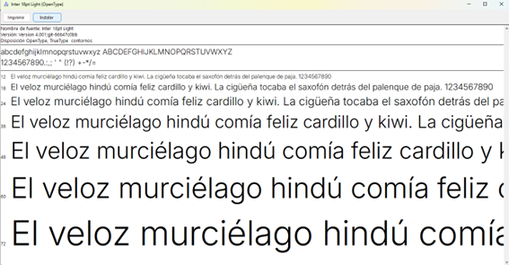
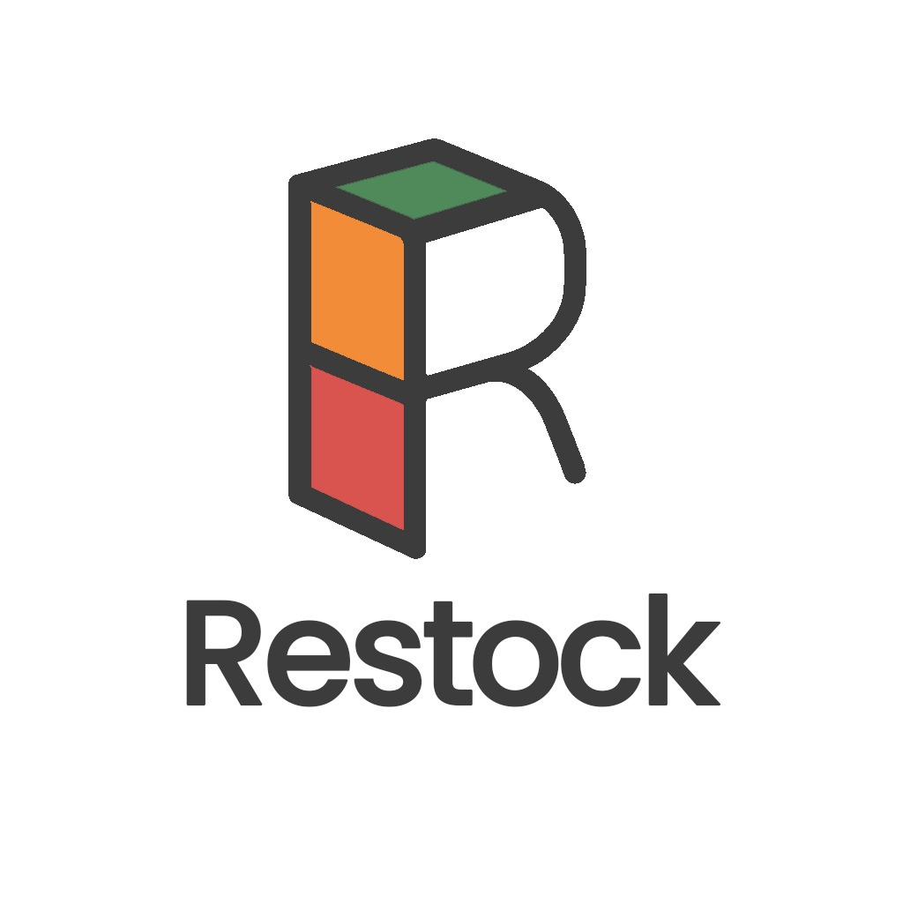
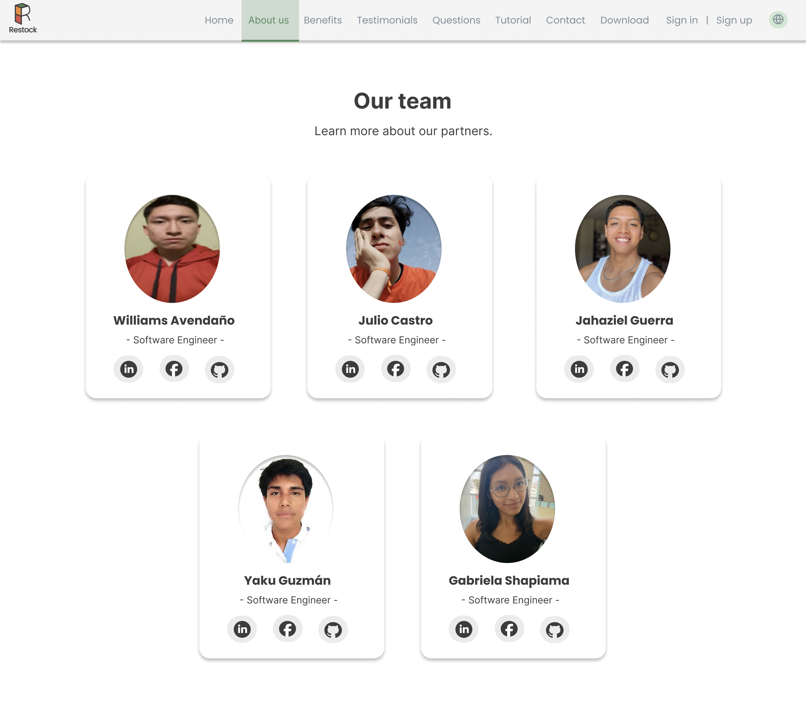

# Capítulo III: Solution UI/UX Design

## 3.1. Product design

### 3.1.1. Style Guidelines

#### 3.1.1.1. General Style Guidelines

En el diseño de Restock, se tomaron decisiones cuidadosas para garantizar una experiencia de usuario coherente y efectiva.

#### Colores

La paleta de colores de Restock fue seleccionada con un enfoque en la armonía visual y la accesibilidad. Cada color cumple un rol específico para mejorar la experiencia del usuario:

- Naranja mandarina – #F28C38: Este color transmite energía, dinamismo y entusiasmo. En Restock, lo utilizamos para incentivar la acción en botones especiales como el del lector de texto o de retroceder. Representa proactividad y movimiento, ideales para un entorno de gestión ágil de inventarios.
- Rojo coral – #D9534F: Este color simboliza urgencia y atención, por lo que lo empleamos estratégicamente en alertas o notificaciones importantes dentro de la plataforma, así como en botones de cancelación. Su intensidad refuerza el enfoque en tareas prioritarias o advertencias, ayudando a los usuarios a tomar decisiones rápidas.
- Verde oscuro – #4F8A5B: Este color está asociado con estabilidad, crecimiento y seguridad. En Restock, este color refuerza la confianza en los procesos, especialmente en la gestión eficiente de productos. Por ello, ser usa en subtítulos principales y botones de confirmación y selección. Aporta equilibrio visual y solidez al diseño general.
- Verde claro – #B5D99C: Este color representa frescura y renovación. Se utiliza en fondos de secciones especiales para transmitir un ambiente amigable y limpio dentro de la interfaz, fomentando una sensación de ligereza y bienestar mientras se interactúa con la plataforma.
- Verde menta claro – #CDE7D3: Este color evoca serenidad, limpieza y claridad. Se usa en fondos y para destacar opciones seleccionadas. Apoya la legibilidad y aporta una atmósfera relajada en las secciones de consulta o visualización de datos, facilitando la concentración.
- Blanco grisáceo - #F4F4F4: Este color simboliza simplicidad, orden y neutralidad. Usado principalmente en los fondos, este color ofrece un lienzo limpio que mejora el contraste con otros elementos y asegura una experiencia visual clara y sin distracciones.
- Gris oscuro – #3C3C3C: Este color refleja profesionalismo y solidez. En Restock, se utiliza para resaltar textos importantes y títulos, aportando un contraste elegante que estructura visualmente la información clave.
- Beige cálido – #FAF1E7: Este color transmite calidez y cercanía. Se usa en fondos pequeños, ya que añade un toque humano al diseño de la plataforma, suavizando los espacios y brindando una sensación acogedora sin perder la sobriedad.

#### Tipografía

Se seleccionó la tipografía “Poppins” como fuente principal para los títulos de la plataforma por su estilo llamativo y su capacidad para captar la atención del usuario. Además, esta fuente es visualmente agradable y de fácil lectura, lo que garantiza una experiencia cómoda y comprensible para el usuario.

Asimismo, optamos por la tipografía "Inter" como fuente secundaria para los textos de nuestra plataforma por su diseño legible, moderno y llamativo. Su apariencia estética y legibilidad garantizan una experiencia de uso accesible y agradable.

 En cuanto al tamaño, se utiliza jerárquicamente para resaltar títulos, botones y texto de soporte. Los tamaños más grandes captan la atención en puntos clave de la navegación, mientras que los más pequeños se emplean para detalles secundarios, lo que mejora tanto la comprensión como la eficiencia en la interacción.

#### Branding

El branding de Restock está diseñado para reflejar simplicidad, confianza y profesionalismo. El logo y los íconos adoptan un enfoque minimalista, con líneas claras y formas simples que comunican el propósito de la plataforma. El diseño incluye la incial del nombre del producto ofrecido, representado de tal manera que simboliza gestión y orden con una apariencia limpia que es fácilmente reconocible, tanto en entornos web como móviles.

#### Espaciado

El diseño de Restock se centra en una estrategia que aprovecha de manera inteligente los espacios en blanco, tanto a gran escala como en detalles más pequeños, con el objetivo de brindar una experiencia de usuario clara y fluida. Estos espacios no solo cumplen una función estética, sino que también son fundamentales para mejorar la comprensión del contenido y resaltar elementos importantes como los botones de acción y las secciones más destacadas. El contenido de cada página se presenta dentro de un ancho máximo definido, lo que previene la sobrecarga visual. Además, los márgenes que rodean los bloques de contenido generan una estructura visual armoniosa. Por su parte, los rellenos laterales se ajustan en función del ancho del navegador, garantizando una distribución adecuada y una interfaz adaptable a distintos dispositivos.

#### Dimensiones para el tono de comunicación y lenguaje aplicado

En Restock, definimos cuidadosamente el tono de nuestra comunicación para alinearlo con la misión de nuestra plataforma: facilitar la gestión de inventarios para dueños o administradores de restaurantes y proveedores, creando una conexión cercana y empática con nuestro público objetivo. Nuestro tono de voz busca motivar y brindar seguridad, combinando una comunicación clara, accesible y profesional.

Optamos por un tono casual pero respetuoso, que permita a los usuarios sentirse cómodos al interactuar con funcionalidades clave para el control y abastecimiento de sus negocios. Queremos que cada interacción refleje entusiasmo, para fomentar el compromiso con una gestión eficiente, pero también serenidad, asegurando que los usuarios mantengan el control y la confianza mientras usan la plataforma. Este equilibrio nos permite inspirar acción, al tiempo que proyectamos confianza y experiencia en el sector gastronómico y logístico.

Además, se han considerado los siguientes aspectos clave en el diseño de Restock:

- Consistencia: La coherencia en el diseño es esencial para brindar una experiencia uniforme y eficiente. Todos los elementos visuales e interactivos de Restock mantienen una línea gráfica y funcional clara, lo que permite que los usuarios se familiaricen rápidamente y operen la plataforma con facilidad. Esto es vital para negocios que requieren respuestas rápidas y precisas en su operación diaria.
- Navegación: La estructura de navegación ha sido pensada para ser intuitiva y ordenada. Los usuarios pueden acceder fácilmente a secciones como control de stock, historial de pedidos, comunicación con proveedores y reportes de abastecimiento. Los menús son claros y las opciones están organizadas para ahorrar tiempo y evitar complicaciones, facilitando la toma de decisiones en entornos exigentes como las cocinas de restaurantes o los centros de distribución.
- Accesibilidad: La plataforma fue diseñada para adaptarse a todo tipo de usuarios y dispositivos. Desde computadoras hasta tablets o celulares, Restock ofrece botones grandes, opciones de ajuste de idioma, lector de texto y navegación simplificada, permitiendo a dueños o administradores de restaurantes y proveedores utilizar la plataforma incluso en ambientes dinámicos y de alta demanda.

#### Elementos de diseño

Además de los lineamientos generales sobre colores, tipografía y branding, en el diseño visual de Restock se han aplicado de manera consciente diversos elementos fundamentales del diseño gráfico que enriquecen la experiencia del usuario y refuerzan la identidad visual de la plataforma.

Uno de los elementos clave es la **línea**, utilizada para dividir secciones, delimitar formularios o separar tarjetas de contenido. Su uso sutil organiza visualmente la interfaz, guiando la lectura y evitando la saturación. El **color** también cumple un rol fundamental, no solo en la identidad visual sino en la comunicación funcional. La paleta incluye tonos como el mandarina, el verde oscuro y el rojo coral, seleccionados por su asociación emocional y su capacidad para transmitir estados como éxito, alerta o error.

En cuanto al **tamaño**, se utiliza jerárquicamente para resaltar títulos, botones y texto de soporte. Los tamaños más grandes captan la atención en puntos clave de la navegación, mientras que los más pequeños se emplean para detalles secundarios, lo que mejora tanto la comprensión como la eficiencia en la interacción. Por su parte, la **textura** es sutil, gracias al uso de fondos suaves como el blanco grisáceo y el beige cálido, los cuales aportan profundidad y calidez sin distraer de la funcionalidad principal.

El **espacio** es uno de los elementos más destacados del diseño de Restock. Se han implementado márgenes amplios, rellenos generosos y separación adecuada entre secciones, lo que permite una interfaz despejada, fácil de recorrer y cómoda para los usuarios, especialmente en contextos de uso intensivo como cocinas o almacenes. A nivel de valor o **brillo** (value), se aplican contrastes suaves que dan lugar a jerarquías visuales claras: botones destacados, hovers, textos principales y elementos de fondo se diferencian sutilmente para guiar al usuario sin abrumarlo.

Respecto a las **formas**, se ha optado por geometrías simples y amigables. Los botones redondeados, las tarjetas con bordes suaves y los íconos estilizados no solo mejoran la estética, sino que también transmiten accesibilidad, orden y modernidad. Estas formas, ya sean geométricas o abstractas, se alinean con la imagen de una herramienta tecnológica funcional pero cercana.

#### Principios de diseño

En cuanto a los principios de diseño, el **contraste** se emplea para asegurar que los elementos importantes, como llamados a la acción (CTA) o errores, sean claramente visibles. Este principio es clave en la accesibilidad visual. La **repetición** de colores, formas e iconografía refuerza la familiaridad y la consistencia del sistema visual, haciendo que los usuarios comprendan rápidamente el uso de cada componente.

La **alineación** contribuye a la profesionalidad del diseño: los formularios, encabezados y listas mantienen una disposición coherente, alineada y clara, lo que facilita la navegación intuitiva. Por último, el principio de **proximidad** agrupa de manera lógica los elementos relacionados (como inputs y botones, o productos y sus descripciones), mejorando la lectura, la interacción y la comprensión de cada bloque de información.

Estos elementos y principios no se aplican de forma aislada, sino como parte integral de un sistema visual que busca ser funcional, estético y coherente con la misión de Restock: facilitar la gestión de inventarios a través de una experiencia clara, empática y eficiente.

### 3.1.2. Information Architecture

#### 3.1.2.1. Organization Systems

En el sistema Restock, se emplea la organización jerárquica para destacar información crítica como alertas de stock, ingredientes próximos a vencer y elementos prioritarios en los dashboards. Esta jerarquía visual permite que el usuario identifique de forma inmediata los datos más relevantes según el contexto.

También se aplica una organización secuencial en procesos que requieren una guía paso a paso, como el registro de compras de insumos, la creación de recetas o la actualización del estado de entrega. Estos flujos siguen una progresión lógica para evitar errores de ingreso y facilitar la experiencia del usuario.

En cuanto a los esquemas de categorización, no se utiliza una organización alfabética ni matricial. Sin embargo, sí se emplea una organización cronológica para visualizar datos históricos, como el historial de ventas, registros de compras y vencimientos de insumos. Además, se clasifica el contenido según el tipo de usuario: los administradores de restaurante y los proveedores acceden a interfaces y funcionalidades adaptadas a sus respectivas necesidades y flujos de trabajo.

#### 3.1.2.2. Labelling Systems

A continuación, se presenta el sistema de etiquetado (labeling system)diseñado para la plataforma Restock. Este sistema busca representar los datos de forma clara, usando etiquetas cortas y familiares que minimicen la carga cognitiva, mejoren la navegación y mantengan coherencia visual con el estilo definido en la guía de diseño.

Se ha priorizado la claridad semántica y la coherencia con el lenguaje visual del producto, especialmente con el tono de comunicación cercano y profesional.

**Landing Page:**

- **Start:** Sección principal de bienvenida. Incluye título principal y acceso a la plataforma
- **Benefits:** Explicación segmentada de las ventajas de Restock para restaurantes y proveedores.
- **Testimonials:** Comentarios reales de usuarios sobre cómo la plataforma les ha ayudado en su gestión.
- **Frequently Asked Questions:** Preguntas comunes con respuestas claras. Ayuda a resolver dudas sin necesidad de contacto directo.

**Aplicación Web – Administradores de Restaurantes**

- **Dashboard:** Vista general de indicadores clave: stock actual, compras recientes, alertas importantes.
- **Inventory:** Listado de insumos registrados. Incluye cantidades, fechas, perecibilidad y opciones para editar.
- **Shopping:** Registro de compras de insumos. Permite agregar nuevas compras y consultar historial.
- **Orders to Suppliers:** Sección para generar y gestionar pedidos a los proveedores registrados.
- **Alerts:** Notificaciones automáticas por stock crítico, vencimientos o anomalías en el uso de insumos.
- **Recipes:** Registro de platos del menú vinculados a insumos. Permite calcular consumo y optimizar compras.
- **Reports:** Acceso a reportes descargables sobre consumo, compras, stock y desempeño operativo.

**Aplicación Web – Proveedores**

- **Orders Received:** Lista de órdenes enviadas por restaurantes. Incluye información de estado, entrega y productos solicitados.
- **My Products:** Catálogo editable con los productos que el proveedor ofrece. Incluye nombre, precio y stock.
- **Sales History:** Registro de pedidos completados. Permite consultar por fechas o restaurante.

**Aplicación Móvil – Administradores de Restaurantes**

* **Home:** Pantalla principal con resumen rápido de stock, alertas y accesos directos a funciones clave.
* **Stock:** Listado de insumos registrados. Muestra cantidades, fechas, vencimientos y permite edición rápida.
* **Buy:** Registro de compras y agregados de nuevos insumos. Consulta historial de compras.
* **Suppliers Orders:** Generación y seguimiento de pedidos a proveedores.
* **Alerts:** Notificaciones de stock crítico, vencimientos y anomalías de consumo.
* **Menu:** Registro de platos y vinculación con insumos para calcular consumo y optimizar compras.
* **Reports:** Acceso rápido a reportes resumidos de consumo, compras y desempeño operativo.
* **Profile:** Gestión de información del restaurante y configuración de notificaciones.

**Aplicación Móvil – Proveedores**

* **Home:** Resumen de pedidos recientes, stock disponible y alertas importantes.
* **Orders:** Lista de órdenes recibidas de restaurantes con estado y detalles de entrega.
* **Catalog:** Gestión del catálogo de productos ofrecidos, incluyendo precio, stock y descripción.
* **Sales:** Historial de ventas completadas, filtrable por fecha o restaurante.
* **Alerts:** Notificaciones de nuevos pedidos, cambios de estado o incidencias.
* **Profile:** Información del proveedor y configuración de contacto y notificaciones.

#### 3.1.2.3. SEO Tags and Meta Tags

**1. Landing Page**

 **Charset**

    `<meta charset="utf-8">`

Su función principal es indicar al navegador cómo debe interpretar y mostrar los caracteres de texto en la página. Al especificar UTF-8, que es un estándar de codificación universal, se asegura la correcta visualización de todos los caracteres, incluyendo tildes, la letra "ñ" y símbolos especiales, evitando que aparezcan como caracteres ilegibles y garantizando una experiencia de usuario consistente para cualquier visitante, independientemente de su idioma o configuración.

 **Viewport (responsive)**

    `<meta name="viewport" content="width=device-width, initial-scale=1">`

Esta línea de código controla cómo la página web se escala y se adapta a diferentes pantallas de dispositivos, especialmente móviles. Su función es hacer que la página sea responsiva, ajustando el ancho del contenido al ancho del dispositivo y estableciendo un zoom inicial de 1:1 para una visualización óptima y legible en cualquier tamaño de pantalla.

 **Title (SEO)**

    `<title>` UI-Topic | Automatiza el inventario y pedidos de tu restaurante  `</title>`

Esta línea de código define el título de la página web que aparece en la pestaña del navegador o en los resultados de búsqueda. Su función es proporcionar una descripción concisa y relevante del contenido de la landing page, siendo crucial para el SEO y la identificación rápida por parte del usuario.

 **Meta Description (SEO)**

    `<meta name="description" content="Plataforma para restaurantes que reduce desperdicios y mejora las ganancias mediante la gestión inteligente de inventarios y pedidos.">`

Esta línea de código provee un resumen breve y descriptivo del contenido de la página. Su función es mostrarse como un "snippet" en los resultados de búsqueda, atrayendo a los usuarios y brindando un adelanto del tema de la landing page.

 **Meta Keywords (SEO, aunque en desuso para Google)**

    `<meta name="keywords" content="restaurantes, gestión de inventario, pedidos, automatización, proveedores, tecnología gastronómica">`

Esta línea de código especifica palabras clave relevantes para el contenido de la página. Aunque su impacto directo en el SEO moderno es limitado, su función es clasificar el tema de la landing page para sistemas de indexación.

 **Meta Author**

    `<meta name="author" content="UI-Topic Team">`

Esta línea de código identifica al creador o la entidad responsable del contenido de la página. Su función es atribuir la autoría del documento HTML.

 **Meta Robots**

    `<meta name="robots" content="index, follow">`

Esta línea de código instruye a los motores de búsqueda sobre cómo interactuar con la página. Su función es indicar a los "robots" que pueden indexar el contenido de la página y seguir los enlaces que contiene.

 **Meta Language**

    `<meta name="language" content="es">`

Esta línea de código declara el idioma principal del contenido de la página. Su función es informar a los navegadores y motores de búsqueda que el texto de la landing page está en español.

 **Meta Copyright**

    `<meta name="copyright" content="UI-Topic 2025">`

Esta línea de código establece el aviso de derechos de autor para el contenido de la página. Su función es indicar legalmente la titularidad de los derechos de autor y el año correspondiente.

**2. Web Application (Frontend)**

 **Charset**

    `<meta charset="utf-8">`

Esta línea de código establece la codificación de caracteres del documento HTML a UTF-8. Su función es asegurar que todos los textos, caracteres especiales, y símbolos de la aplicación web se visualicen correctamente en cualquier navegador y dispositivo, evitando problemas de visualización de texto.

 **Viewport (responsive)**

    `<meta name="viewport" content="width=device-width, initial-scale=1">`

Esta línea de código controla cómo la interfaz de la aplicación web se escala y se adapta a las diferentes pantallas de dispositivos, como computadoras de escritorio, tablets y teléfonos móviles. Su función es garantizar que la aplicación sea responsiva, ajustando el ancho del contenido al ancho del dispositivo y estableciendo un zoom inicial óptimo para una experiencia de usuario consistente y accesible en cualquier tamaño de pantalla.

 **Title (SEO)**

    `<title>` UI-Topic App | Panel de gestión  `</title>`

Esta línea de código define el título que aparece en la pestaña o ventana del navegador para la aplicación web. Su función es proporcionar una identificación clara y concisa de la aplicación o del módulo específico que el usuario está visualizando, lo cual es útil para la navegación del usuario.

 **Meta Description (SEO)**

    `<meta name="description" content="Panel interno de UI-Topic para gestionar inventario, pedidos y proveedores. Solo accesible para usuarios autorizados.">`

Esta línea de código proporciona una breve descripción del propósito o la sección de la aplicación web. Aunque su relevancia para el SEO es limitada en una aplicación interna, su función es describir el contenido para desarrolladores o herramientas de inspección, y en algunos casos, para la interfaz de usuario al compartir enlaces.

 **Meta Author**

    `<meta name="author" content="UI-Topic Team">`

Esta línea de código identifica al creador o al equipo de desarrollo de la aplicación web. Su función es atribuir la autoría del código o del proyecto a una entidad específica.

 **Meta Robots**

    `<meta name="robots" content="noindex, nofollow">`

Esta línea de código instruye a los motores de búsqueda sobre cómo NO deben interactuar con esta parte de la aplicación. Su función es indicar explícitamente a los "robots" que no indexen este contenido (es decir, que no lo incluyan en los resultados de búsqueda) y que no sigan los enlaces que contiene, lo cual es crucial para paneles de gestión internos o áreas privadas de una aplicación.

 **Meta Language**

    `<meta name="language" content="es">`

Esta línea de código declara el idioma principal del contenido de la aplicación web. Su función es informar a los navegadores y herramientas que el texto de la interfaz de la aplicación está en español, ayudando a la correcta renderización y posibles traducciones automáticas.

 **Meta Copyright**

    `<meta name="copyright" content="UI-Topic 2025">`

Esta línea de código establece el aviso de derechos de autor para el código y el contenido de la aplicación web. Su función es indicar legalmente la titularidad de los derechos de autor del software y el año correspondiente de su creación o actualización.

**3. Aplicación Móvil (Mobile App)**

La aplicación móvil de Restock se desarrolla en **Android Studio** utilizando el lenguaje **Kotlin**, garantizando eficiencia, seguridad y modernidad en su construcción. Para el backend, autenticación, base de datos, pruebas y distribución, se emplea **Firebase**, lo que permite un desarrollo ágil y validación continua.

A continuación, se presentan los principales metadatos y configuraciones relevantes para la publicación y optimización de la aplicacion:

 **Application Label**

    `<application android:label="Restock">`

Esta línea de código define el nombre visible de la aplicación en el dispositivo y en Google Play. Su función es representar de forma clara y concisa la misión de la app, facilitando su identificación por parte de los usuarios.

 **Descripción**

    `<meta-data android:name="description" android:value="App para restaurantes y proveedores que optimiza inventarios, pedidos y ventas. Visualiza métricas, gestiona productos y recibe alertas en tiempo real."/>`

Esta línea de código provee una descripción breve sobre el propósito y funcionalidades principales de la aplicación. Su función es informar a los usuarios y a las tiendas de aplicaciones sobre los beneficios clave de Restock, alineados con la arquitectura y experiencia de usuario descritas en el capítulo.

 **Palabras clave**

    `<meta-data android:name="keywords" android:value="restaurantes, inventario, pedidos, proveedores, ventas, recetas, stock, gestión, móvil, Kotlin, Firebase"/>`

Esta línea de código agrega palabras clave relevantes para la búsqueda y clasificación en Google Play. Su función es mejorar la visibilidad y el posicionamiento de la app en los resultados, resaltando tanto el sector como las tecnologías empleadas.

 **Autoría**

    `<meta-data android:name="author" android:value="UI-Topic Team"/>`

Esta línea de código identifica al equipo creador de la aplicación. Su función es atribuir la autoría, fortalecer la credibilidad y facilitar el contacto para soporte o referencias técnicas.

 **Idioma principal**

    `<meta-data android:name="language" android:value="en"/>`

Esta línea de configuración declara el idioma español como principal para la interfaz y la ficha de la aplicación. Su función es informar a la tienda y a los dispositivos sobre el idioma predominante, ayudando a la correcta renderización y segmentación geográfica.

 **Configuraciones de pruebas y distribución (Firebase)**

    // Fragmento de configuración:
    - Firebase Authentication, Firestore, Crashlytics y Test Lab integrados para gestionar usuarios, datos, errores y pruebas automáticas.
    - Firebase App Distribution habilitado para compartir versiones preliminares con testers internos.
    - Firebase Analytics activado para seguimiento de comportamiento y métricas de uso.

Estas configuraciones permiten la validación, monitoreo y mejora continua de la aplicación durante el desarrollo y las fases de prueba.

 **Título de la App**

    Restock - Control inteligente de inventarios y pedidos

Este campo define el nombre comercial bajo el cual los usuarios encuentran la aplicación en la tienda. Su función es captar la atención y comunicar el valor principal del producto.

 **Descripción extendida**

    Plataforma móvil desarrollada en Kotlin y respaldada por servicios de Firebase, diseñada para dueños y administradores de restaurantes, así como proveedores. Permite gestionar inventario, realizar pedidos, consultar métricas, recibir alertas y organizar recetas de forma intuitiva y eficiente.

Este texto ofrece una visión detallada de los beneficios y funcionalidades, guiando la decisión de descarga del usuario.

 **Categoría**

    Negocios / Productividad / Gastronomía

Esta configuración asigna la app al segmento adecuado en la tienda, facilitando la búsqueda por parte de los usuarios interesados en el sector gastronómico y de gestión.

 **Capturas de pantalla y mock-ups**

    Imágenes de las principales pantallas presentadas en los wireframes y mock-ups del capítulo.

Las capturas permiten a los usuarios visualizar la experiencia, accesibilidad y arquitectura de la información antes de instalar la app.

#### 3.1.2.4. Searching Systems

Vista del Administrador de Restaurante

##### 1. Medios de ayuda para la búsqueda de datos

- Barra de búsqueda principal en cada módulo (Inventario, Pedidos, Proveedores).
- Mensajes contextuales si no se encuentran resultados (“¿Desea agregar un nuevo insumo?”).

##### 2. Filtros y opciones

- Por nombre de producto.
- Por categoría de insumo (carnes, bebidas, verduras, etc.).
- Por estado de stock (stock bajo, suficiente, excedente).
- Por pedidos con retraso o por llegar.

##### 3. Visualización de resultados

- Filas con:
  - Nombre del insumo.
  - Cantidad actual.
  - Alerta de stock bajo (ícono y color).
  - Botones de acción rápida: **Editar**, **Eliminar**, **Reordenar**.
- Íconos y colores visuales:
  - Stock crítico.
  - Stock bajo.
  - Stock saludable.

#### Vista del Proveedor

##### 1. Medios de ayuda para la búsqueda de datos

- Buscador centralizado para gestionar productos ofrecidos y pedidos recibidos.

#### 2. Filtros y opciones

- Por restaurante cliente.
- Por producto ofrecido.
- Por estado del pedido (pendiente, entregado, vencido).
- Por fecha de entrega programada.
- Por frecuencia de pedidos (clientes frecuentes o nuevos).

#### 3. Visualización de resultados

- Listas de pedidos con:
  - Nombre del cliente (restaurante).
  - Productos solicitados.
  - Fecha de entrega.
  - Estado (pendiente, entregado, retrasado).
- Colores de estado:
  - Pedido entregado.
  - Pedido pendiente.
  - Pedido retrasado.

#### 3.1.2.5. Navigation Systems

La navegación en el sistema está diseñada para ser intuitiva y guiada mediante componentes de UI que permiten a los usuarios alcanzar sus objetivos de forma fluida. La navegación principal se presenta como una barra lateral fija con acceso rápido a secciones clave: Resumen, Suscripción, Inventario, Proveedores, Alertas, Pedidos y Recetas.

El contenido dentro de cada vista se organiza mediante tabs, filtros y botones de acción, lo que permite al usuario navegar por distintas categorías o ejecutar tareas específicas sin perder el contexto. En la landing page, se utiliza el desplazamiento vertical para explorar los beneficios y llamados a la acción (CTAs), permitiendo un flujo narrativo hasta llegar al punto de registro o descarga de la aplicación.

La navegación también se adapta según el tipo de usuario. Por ejemplo, los proveedores acceden a sus funciones desde una sección separada en el panel, asegurando que su recorrido dentro del sistema sea coherente con sus tareas específicas, como la gestión de productos ofrecidos o visualización de órdenes recibidas.

### 3.1.3. Landing Page UI Design

#### 3.1.3.1. Landing Page Wireframe

A continuación, se presentan los wireframes de las principales secciones de la landing page. Cada imagen ilustra el diseño propuesto para las diferentes funcionalidades, flujos de navegación y elementos de interacción de la plataforma.

#### Principios Aplicados

- **Jerarquía visual clara:**
  Los contenidos se ordenan priorizando la información principal en la parte superior (propuesta de valor) y distribuyendo de manera progresiva los beneficios, testimonios, preguntas frecuentes, tutoriales, contacto y descarga.
- **Consistencia visual:**
  Se mantuvieron patrones visuales uniformes en tipografías, colores y espaciados, respetando la guía de estilos definida para la marca Restock.
- **Contraste y accesibilidad:**
  Se aseguraron contrastes adecuados entre texto y fondo para favorecer la legibilidad, así como tamaños de fuente óptimos para usuarios con diferentes capacidades visuales.
- **Optimización para dispositivos móviles:**
  Los wireframes contemplan un diseño adaptable, reorganizando los componentes en una estructura vertical, botones de mayor tamaño y menús accesibles para pantallas táctiles.
- **Diseño inclusivo:**
  Cada sección permite navegación intuitiva mediante teclado y está pensada para ser compatible con tecnologías de asistencia como lectores de pantalla.

##### Versión Desktop Web Browser:

En esta primera sección se presenta la pantalla Home de la landing page, donde se puede observar un botón call-to-action para los visitantes de tipo emocional y recurrente. Del mismo modo, para los visitantes recurrentes se aprecia el botón call-to-action para registrarse en la plataforma en el toolbar, en la parte superior derecha.

A continuación, se muestran los frames correspondientes al inicio de sesión, registro y olvido de contraseña.

Se presenta la sección de propuesta de valor:

Se presenta la sección de integrantes del equipo:

Los siguientes frames corresponden a los beneficios que ofrece la plataforma Restock a cada uno de sus segmentos objetivos:

A continuación, se presenta la sección de testimonios:

Se presenta la sección de preguntas frecuentes:

Los siguientes frames corresponden al tutorial sobre el uso de la plataforma para los nuevos usuarios. Al final de esta sección se aprecia el botón call-to-action para registrarse dirigido a los visitantes de tipo racional.

Se presenta la sección de contacto:

A continuación, se presenta la sección de descarga de la plataforma en formato móvil:

Se presenta la sección footer:

##### Versión Mobile Web Browser

A continuación, se presentan los wireframes de la versión móvil de la aplicación. Cada imagen muestra la adaptación responsiva de las principales funcionalidades y secciones diseñadasen Wireframes Desktop.

Pantalla Home del landing page e inicio de sesión a la plataforma:

A continuación, se muestran los frames correspondientes al registro y el sidebar con las secciones disponibles en el landing page.

Secciones de olvido de contraseñas	y propuesta de valor de la plataforma:

Sección sobre información de nuestro equipo:

Sección acerca de los beneficios que brinda la plataforma para cada uno de sus segmentos objetivos:

Se presentan las secciones de testimonios y preguntas frecuentes:

Sección de tutorial acerca de cómo usar la plataforma:

Sección de contacto y de descarga de la plataforma en versión móvil:

Sección de footer:

#### 3.1.3.2. Landing Page Mock-up

A continuación, se presentan los mock-ups de las principales secciones de la landing page. Cada imagen ilustra el diseño propuesto para las diferentes funcionalidades, flujos de navegación y elementos de interacción de la plataforma.

##### Versión Desktop Web Browser:

En esta primera sección se presenta la pantalla Home de la landing page, donde se puede observar un botón call-to-action para los visitantes de tipo emocional y recurrente. Del mismo modo, para los visitantes recurrentes se aprecia el botón call-to-action para registrarse en la plataforma en el toolbar, en la parte superior derecha.

A continuación, se muestran los frames correspondientes al inicio de sesión, registro y olvido de contraseña.

Se presenta la sección de propuesta de valor:

Se presenta la sección de integrantes del equipo:

Los siguientes frames corresponden a los beneficios que ofrece la plataforma Restock a cada uno de sus segmentos objetivos:

A continuación, se presenta la sección de testimonios:

Se presenta la sección de preguntas frecuentes:

Los siguientes frames corresponden al tutorial sobre el uso de la plataforma para los nuevos usuarios. Al final de esta sección se aprecia el botón call-to-action para registrarse dirigido a los visitantes de tipo racional.

 

Se presenta la sección de contacto:

A continuación, se presenta la sección de descarga de la plataforma en formato móvil:

Se presenta la sección footer:

##### Versión Mobile Web Browser

A continuación, se presentan los mock-ups de la versión móvil de la aplicación. Cada imagen muestra la adaptación responsiva de las principales funcionalidades y secciones diseñadas para ofrecer una experiencia de usuario optimizada en dispositivos móviles.

Pantalla Home del landing page e inicio de sesión a la plataforma:

A continuación, se muestran los frames correspondientes al registro y el sidebar con las secciones disponibles en el landing page.

Secciones de olvido de contraseñas	y propuesta de valor de la plataforma:

Sección sobre información de nuestro equipo:

Sección acerca de los beneficios que brinda la plataforma para cada uno de sus segmentos objetivos:

Se presentan las secciones de testimonios y preguntas frecuentes:

Sección de tutorial acerca de cómo usar la plataforma:

Sección de contacto y de descarga de la plataforma en versión móvil:

Sección de footer:

### 3.1.4. Mobile Applications UX/UI Design

#### 3.1.4.1. Mobile Applications Wireframes

Los siguientes wireframes corresponden a la aplicación web de Restock

#### Principios aplicados

-**Jerarquía funcional clara:**

 El flujo de navegación prioriza las acciones más relevantes para proveedores, como gestión de productos, visualización de órdenes y acceso a reportes de ventas.

-**Consistencia y patrones de diseño:**

 Los componentes mantienen uniformidad en su comportamiento visual e interactivo, asegurando coherencia entre pantallas y módulos.

-**Accesibilidad en interfaces:**

 Se aplicaron contrastes adecuados, fuentes legibles, botones de tamaño óptimo y estructura de navegación compatible con teclado y lectores de pantalla.

-**Diseño adaptativo:**

 Los wireframes consideran que la aplicación será utilizada tanto en pantallas de laptop como en tablets, por lo que el diseño es responsivo y se ajusta a distintos anchos de pantalla.

-**Arquitectura de información enfocada al flujo de tareas:**

 La estructura prioriza la eficiencia operativa, permitiendo a los proveedores registrar productos, atender pedidos y monitorear métricas clave en el menor número de clics posible.

**Versión Administradores de Restaurante**

Inventario

**Listado y vista general del inventario**
Pantallas del módulo de Inventario para administrador: permite visualizar la lista de insumos, editar cantidades y registrar nuevos productos.

**Formulario de creación y edición de insumos**
Pantallas del flujo de edición y creación de inventario: muestra formularios detallados con campos como nombre, unidad, categoría y fecha.
 

---

##### Pedidos

**Vista general de pedidos**
Pantallas del módulo de Pedidos para administrador: lista de pedidos, detalles individuales, y estado del pedido.

**Edición de pedido y asignación de proveedor**
Pantallas complementarias del flujo de pedidos: edición de pedidos, selección de proveedores y fechas estimadas.

##### Recetas

**Listado de recetas**
Pantallas del módulo de Recetas: listado de recetas con detalles sobre los insumos requeridos y porciones.

**Formulario de creación y edición de recetas**
Flujo de creación y edición de recetas: permite agregar o editar insumos y cantidades requeridas por receta.

##### Ventas

**Historial de ventas**
Pantallas del módulo de Ventas: muestra historial de ventas, métricas clave y búsqueda por rango de fechas.

**Confirmación de eliminación de venta**
Popup de advertencia para confirmar acciones destructivas en la sección de ventas.

##### Suscripciones

**Gestión de planes de suscripción**
Pantallas de Suscripciones: incluye vista de planes activos, cambios de plan y pagos asociados.

##### Perfil

**Configuración y datos del perfil**
Pantallas del perfil del administrador: incluye información personal, configuración de cuenta y opciones de cerrar sesión.

##### Resumen / Dashboard

**Panel principal con métricas clave**
Dashboard/resumen para administrador: muestra órdenes pendientes, alertas y notificaciones clave.

#### Versión Mobile Web Browser - Proveedores

##### Inventario

**Gestión de productos ofrecidos**
Pantallas de Inventario para proveedor: gestión de productos ofrecidos, precios, y actualización de stock.

##### Pedidos

**Lista y estado de pedidos recibidos**
Pedidos para proveedores: lista de pedidos realizados por restaurantes, detalles de cada uno y fechas.

**Detalles de pedido**
Pantallas de gestión de pedidos: incluye opciones para editar, cancelar o confirmar pedidos.

**Actualización de estado de pedidos**
Actualización de estado de pedidos: permite al proveedor actualizar el estado de envío y entrega.

##### Alertas

**Alertas registradas**
Pantallas de Alertas para proveedores: incluye alertas generadas por restaurantes y opciones de respuesta.

##### Calificaciones

**Calificaciones de restaurantes**
Pantallas de calificaciones: permite al proveedor revisar las evaluaciones y comentarios de los restaurantes.

##### Resumen / Dashboard

**Panel principal con métricas clave**
Pantallas de Resumen para proveedores: incluye métricas de clientes frecuentes, ganancias y alertas.

##### Perfil

**Configuración del perfil del proveedor**
Perfil del proveedor: información personal, métricas de ventas, y accesos rápidos a historial.

#### 3.1.4.2. Mobile Applications Wireflow Diagrams

Cada Wireflow Diagram representa el recorrido visual e interactivo que realiza el usuario dentro de la aplicación para cumplir un objetivo específico (User Goal). En cada flujo se detalla la secuencia de pantallas y acciones que permiten alcanzar dicho propósito, desde la navegación inicial hasta la confirmación o registro de una tarea.

<table width="100%">
  <tr>
    <th width="25%">User Goal</th>
    <th width="75%">Imágen</th>
  </tr>
  <tr>
    <td>UG-01 — Gestión de cuenta del suscriptor: El flujo muestra cómo el usuario accede a su perfil desde el menú principal para actualizar sus datos personales o modificar su contraseña. El proceso concluye al guardar los cambios, asegurando que la información de la cuenta se mantenga actualizada en todo momento.</td>
    <td>
       
    </td>
  </tr>
  <tr>
    <td> 
      UG-02 — Adquisición de plan de suscripción: El diagrama evidencia el recorrido del suscriptor al revisar los planes disponibles, seleccionar uno y completar la información de pago. El flujo finaliza cuando la transacción es aceptada, habilitando las funciones premium de la plataforma.
    </td>
    <td>
         
    </td>
  </tr>
  <tr>
    <td> UG-03 — Gestión manual del inventario de insumos: El flujo detalla cómo el usuario crea, edita o cancela insumos dentro del inventario, registrando información relevante como categoría, unidad de medida y stock. Este proceso garantiza un control manual y preciso de los recursos disponibles. </td>
    <td>
         
    </td>
  </tr>
  <tr>
    <td> UG-04 — Consulta del panel de alertas: El usuario accede a la sección de alertas para visualizar el estado de sus insumos, filtrarlos y revisar notificaciones de bajo o alto stock. Al seleccionar un elemento, puede conocer su ubicación y última actualización, facilitando la toma de decisiones.</td>
    <td>
         
    </td>
  </tr>
  <tr>
    <td>UG-05 — Consulta de información de proveedores: El diagrama presenta el acceso del administrador a la sección de proveedores, donde puede registrar nuevos contactos, consultar datos de empresas y ver las categorías de productos que ofrecen, manteniendo actualizada la base de proveedores del restaurante.</td>
    <td>
         
    </td> 
  </tr>
  <tr>
    <td>UG-06 — Solicitud de pedidos a proveedores: Este flujo muestra cómo el administrador genera una nueva orden, selecciona los productos necesarios, define las cantidades y envía la solicitud. El pedido se registra en el sistema, quedando disponible para seguimiento posterior.</td>
    <td>
         
    </td>
  </tr>
  <tr>
    <td>UG-07 — Evaluación de pedidos recibidos: El administrador ingresa a la sección de reseñas para evaluar la calidad de los pedidos entregados por los proveedores. Puede calificar, comentar y registrar su experiencia, contribuyendo a un control de calidad y confiabilidad del abastecimiento.</td>
    <td>
         
    </td>
  </tr>
  <tr>
    <td>UG-08 — Registro de ventas del restaurante: El flujo describe cómo el empleado registra ventas completas desde la carta, seleccionando platos y agregando insumos adicionales. Cada venta queda vinculada al inventario, permitiendo actualizar automáticamente las existencias.</td>
    <td>
         
    </td>
  </tr>
  <tr>
    <td>UG-09 — Creación de recetas vinculadas al inventario: El administrador accede al módulo de recetas para definir nuevos platos, ingresar ingredientes, unidades y precios. Estas recetas se asocian al inventario, optimizando la gestión de insumos y el cálculo de costos de preparación.</td>
    <td>
         
    </td>
  </tr>
  <tr>
    <td>UG-10 — Gestión del catálogo de productos del proveedor: El proveedor ingresa a su sección de supplies para crear, editar o desactivar productos según disponibilidad. Este flujo asegura una administración flexible del catálogo, permitiendo actualizaciones sin afectar registros previos. </td>
    <td>
         
    </td>
  </tr>
  <tr>
    <td>UG-11 — Control de productos en el inventario del proveedor: El flujo evidencia cómo el proveedor revisa y actualiza el estado de sus productos, modificando unidades, corrigiendo información o eliminando ítems vencidos. Con ello, mantiene un inventario preciso y actualizado.</td>
    <td>
         
    </td>
  </tr>
  <tr>
    <td> UG-12 — Gestión y actualización del estado de órdenes recibidas: El proveedor accede a la sección de órdenes para consultar solicitudes de restaurantes, revisar detalles y decidir si aprobarlas o rechazarlas. Este flujo permite mantener una comunicación ágil y transparente en la cadena de suministro.</td>
    <td>
         
    </td>
  </tr>
</table>

#### 3.1.4.3. Mobile Applications Mock-ups

##### Versión Mobile Mockups - Administrador de Restaurantes

**Alertas**
Vista general de alertas importantes para el administrador, con indicadores visuales de color. 

**Inventario**
Listado general de insumos con opciones para editar, buscar y ver detalles. 

**Inventario (Editar/Crear)**
Flujo para registrar o editar un insumo, incluye calendario para fecha de expiración. 

**Pedidos**
Visualización de pedidos realizados, con filtros por estado.
 

**Pedidos (Detalle/Editar)**
Flujo detallado para ver y modificar un pedido específico. 

**Recetas**
Listado de recetas disponibles, con imágenes y composición de insumos. 

**Recetas (Editar/Ver)**
Flujo detallado para modificar recetas o ver su detalle completo. 

**Ventas**
Historial de ventas con filtros por fecha y montos. 

**Ventas (Detalle)**
Detalle específico de una venta con totales y acciones. 

**Ventas (Popup acción)**
Confirmación para anular una venta mediante un diálogo de alerta. 

**Suscripciones**
Vista de gestión de suscripciones y planes de pago. 

**Proveedores**
Listado de proveedores registrados con métricas de ventas. 

**Dashboard / Resumen**
Pantalla de resumen con estadísticas clave como pedidos pendientes y capacidad de stock.
 

---

##### Versión Mobile Mockups - Proveedores

**Alertas**
Resumen de alertas generadas por parte del restaurante. 

**Inventario**
Vista del inventario ofrecido por el proveedor.
 

**Inventario (Editar)**
Formulario para edición o creación de productos ofrecidos. 

**Pedidos**
Vista general de pedidos recibidos, con estado y fechas. 

**Pedidos (Detalle)**
Vista ampliada para gestión individual de cada pedido.
 

**Pedidos (Historial)**
Listado cronológico de pedidos con estado y detalles. 

**Perfil**
Datos personales, empresa, y configuración de cuenta.
 

**Suscripciones**
Panel para gestionar el plan de suscripción del proveedor. 

**Dashboard / Resumen**
Resumen financiero y de pedidos con métricas clave para proveedores.

**Calificaciones**
Valoraciones recibidas por parte de restaurantes con comentarios.
 

#### 3.1.4.4. Mobile Applications User Flow Diagrams

#### User Flows Mobile

**Mobile User Flow 1:**

Relacionado con User Goal 1: Como suscriptor, quiero gestionar mi cuenta para tener acceso completo a la plataforma y asegurarme de que mis datos estén siempre actualizados.

Este flujo se inicia cuando el usuario accede a la sección de configuración con el objetivo de actualizar su información personal. En esta sección, puede editar los datos de su perfil y cambiar su contraseña.

**Mobile User Flow 2:**

Relacionado con User Goal 2: Como suscriptor, quiero gestionar mi plan de suscripción.

En esta etapa, el usuario selecciona uno de los planes de suscripción disponibles. Tras la selección, se le dirige a la pasarela de pagos integrada (Stripe), donde debe proporcionar su información financiera y proceder con el pago.

**Mobile User Flow 3:**

Relacionado con User Goal 3: Como usuario, quiero gestionar manualmente el inventario de insumos (ingresarlos, actualizarlos, descontarlos o registrar compras).

En la sección de gestión de inventario, el usuario (ya sea un administrador de restaurante o proveedor) debe registrar inicialmente los insumos ingresando su información correspondiente. Luego, podrá añadir múltiples unidades de cada insumo según sea necesario.
La interfaz cuenta con herramientas de filtrado, búsqueda y funciones para editar o eliminar insumos y productos previamente añadidos al inventario.

**Mobile User Flow 4:**

Relacionado con User Goal 4: Como usuario, quiero consultar un panel que resuma datos importantes y acceder al historial de alertas.

Tras iniciar sesión, el usuario es dirigido a la sección de resumen, que presenta datos clave como los pedidos recientes o las últimas órdenes registradas. En una sección adicional, el sistema muestra alertas destacadas, notificando al usuario sobre eventos críticos o información relevante para su operación.

**Mobile User Flow 5:**

Relacionado con User Goal 5: Como administrador de restaurante, quiero consultar información de mis proveedores.

En la sección de proveedores, los administradores de restaurantes pueden visualizar un catálogo de productos por proveedor, comparar precios y seleccionar las mejores opciones según sus necesidades. También pueden acceder a información detallada de cada proveedor y añadirlos a su lista personalizada para facilitar la gestión de compras y relaciones comerciales.

**Mobile User Flow 6:**

Relacionado con User Goal 6: Como administrador de restaurante, quiero solicitar pedidos a mis proveedores.

La sección de pedidos a proveedores permite a los administradores de restaurantes revisar el historial completo de solicitudes, consultar los pedidos en proceso y acceder a información detallada de cada uno. Además, se ofrece un sistema de seguimiento que permite monitorear el estado de los pedidos paso a paso.

**Mobile User Flow 7:**

Relacionado con User Goal 7: Como administrador de restaurante, quiero evaluar los pedidos que recibo de los proveedores.

La sección de comentarios a proveedores permite a los usuarios registrar opiniones sobre los pedidos realizados, incluyendo valoraciones de la calidad del servicio y observaciones relevantes. Esta retroalimentación contribuye a mejorar la relación comercial y la toma de decisiones basada en experiencias previas.

**Mobile User Flow 8:**

Relacionado con User Goal 8: Como administrador de restaurante, quiero que mi empleado registre ventas completas desde la carta (platos e insumos adicionales).

La funcionalidad de registro de ventas permite a los administradores ingresar las operaciones comerciales diarias. El sistema también proporciona un listado actualizado de las ventas del día, con acceso a información detallada de cada transacción, lo que facilita la gestión y análisis de las actividades comerciales.

**Mobile User Flow 9:**

Relacionado con User Goal 9: Como administrador de restaurante, quiero crear recetas vinculadas a insumos del inventario.

La sección de recetas permite al administrador del restaurante crear y gestionar platos a partir de los insumos registrados, detallando precios, cantidades y porcentajes de uso de cada ingrediente. Además, es posible adjuntar imágenes representativas de los platos y mantener un catálogo estructurado de recetas, el cual puede integrarse posteriormente en el módulo de ventas.

**Mobile User Flow 10:**

Relacionado con User Goal 10: Como proveedor, quiero gestionar mi catálogo de productos (agregarlos, actualizarlos o desactivarlos temporalmente).

En la sección de catálogo de productos, el proveedor puede agregar y administrar los insumos que ofrece. Esta información se integra con el sistema, permitiendo que los administradores de restaurantes accedan al catálogo para consultar y adquirir productos. Esta funcionalidad es clave en la cadena de suministro y gestión de inventario.

**Mobile User Flow 11:**

Relacionado con User Goal 11: Como proveedor, quiero tener control total sobre los productos de mi inventario.

En la sección de catálogo de productos, el proveedor puede gestionar la eliminación de insumos registrados, asegurando que el catálogo refleje únicamente los productos disponibles para la venta y distribución. Esto contribuye a mantener la precisión y actualización del inventario.

**Mobile User Flow 12:**

Relacionado con User Goal 12: Como proveedor, quiero gestionar y actualizar el estado de las órdenes recibidas.

El proveedor cuenta con una sección dedicada a la gestión de las órdenes realizadas por los restaurantes. En esta área puede visualizar los pedidos recibidos, revisar detalles como cantidades, productos solicitados y fechas de entrega, así como actualizar el estado de cada orden para mantener una comunicación clara y eficiente con los clientes.

#### 3.1.4.5. Mobile Applications Prototyping

En cuanto a la arquitectura de información, el prototipo móvil de RESTOCK emplea una navegación jerárquica clara, acompañada de flujos secuenciales en procesos clave como el registro de compras y la creación de recetas. También se definieron etiquetas intuitivas, categorías adaptadas a cada tipo de usuario y herramientas de búsqueda que facilitan una interacción fluida y dirigida.

Asimismo, se implementaron interacciones responsivas (como estados active), validaciones visuales en formularios y retroalimentaciones inmediatas ante las acciones del usuario. Estos elementos garantizan que tanto el acceso a la información como la ejecución de tareas se realicen de forma eficiente y adaptada al contexto móvil.

Además, se grabó un video donde se explican los principales flujos de interacción del prototipo móvil, mostrando cómo las decisiones de diseño se reflejan en la experiencia del usuario.

Mobile Applications Prototyping: https://shorturl.at/DLy8l
