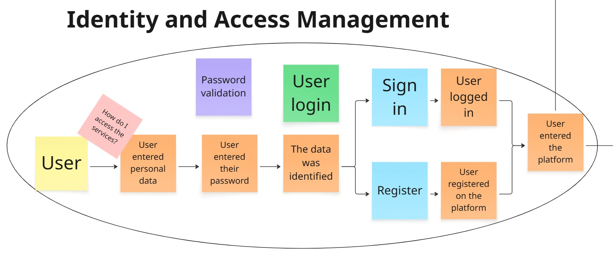
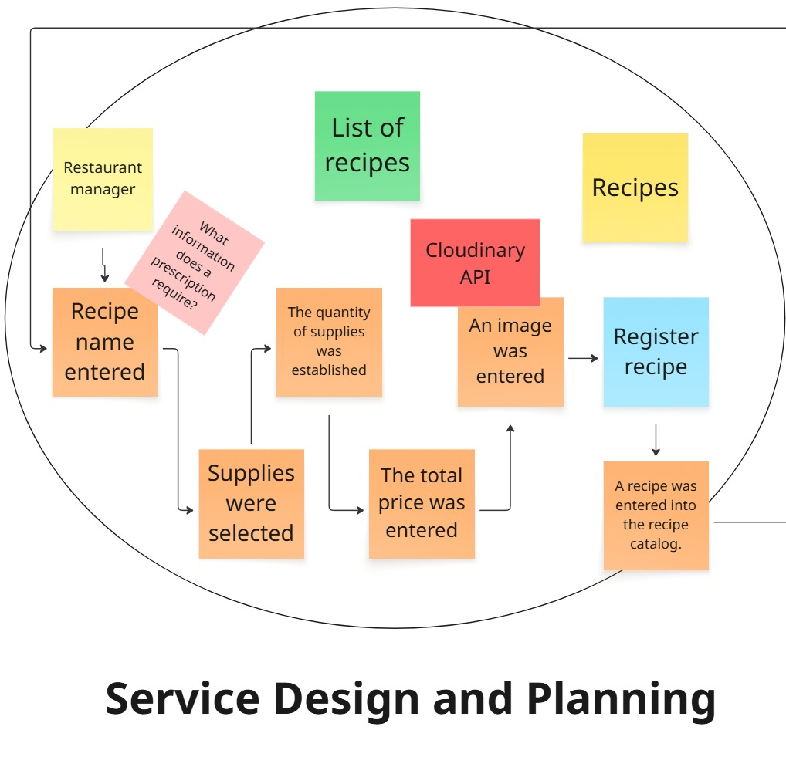
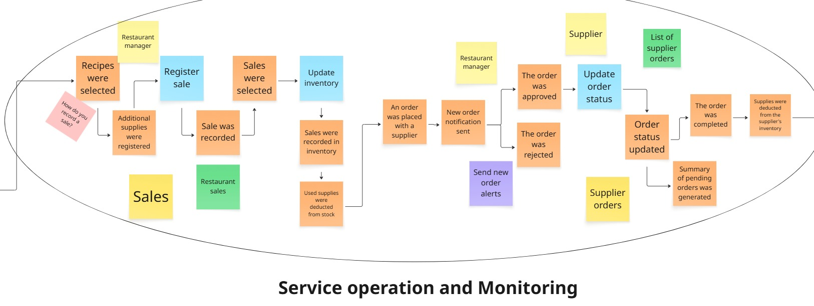
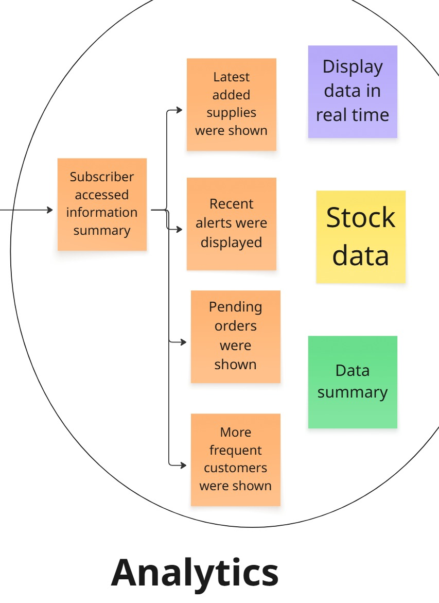
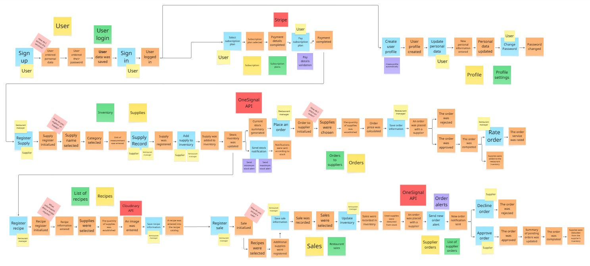

# Capítulo IV: Solution Software Design

## 4.1. Strategic-Level Domain-Driven Design

### 4.1.1. Event Storming

Para la construccion del Event Storming, se coordinó obtener una primera versión del modelo de dominio del proyecto. Para ello, se siguió un proceso estructurado de 9 etapas.

**Paso 1:** Lluvia de ideas de los eventos del dominio relacionados con el dominio empresarial que se está explorando.

**Paso 2:** Ordenar los eventos de dominio (definiendo timelines).

**Paso 3:** Identificar puntos problemáticos (paint points) en el proceso.

**Paso 4:** Identificar eventos comerciales importantes (pivotal points) que indiquen un cambio en el contexto o fase del negocio.

**Paso 5:** Definir comandos que desencadenan eventos.

**Paso 6:**  Definir políticas que desencadenan la ejecución de comandos.

**Paso 7:**  Identificar read models, los cuales son modelos de lectura o vistas que los usuarios necesitan para tomar.

**Paso 8:** Identificar sistemas externos que se conectan con el dominio.

**Paso 9:** Definir aggregates agrupando comandos y eventos relacionados en unidades lógicas.

#### 4.1.1.1. Candidate Context Discovery

A partir del modelo de Event Storming realizado en Miro, se llevó a cabo una sesión de Candidate Context
Discovery para identificar los bounded contexts de la solución. Se utilizó principalmente la técnica
look-for-pivotal-events durante la sesión.

Primero, se buscaron eventos clave que indiquen cambios de estado entre diferentes partes del proceso del negocio:

Luego, se agruparon los eventos de acuerdo a los principales cambios de contexto.

Se trazaron fronteras alrededor de los grupos identificados, estableciendo los límites iniciales de los bounded contexts.

Finalmente, se seleccionaron nombres para los bounded context. Dando como resultado la definición de 6 bounded contexts y la **versión final del Event Storming**:

A continuación, se explicará en qué consiste cada bounded context:

**Identity and Access Management:** También llamado "IAM", este bounded context contiene el proceso de ingreso del usuario a la plataforma, ya sea iniciando sesión o registrandose.

**Subscriptions and Payments:** También llamado "Subscription", este bounded context contiene el proceso de suscribirse a uno de los planes en la plataforma y pagar por dicho plan.

**Profiles and Preferences:** También llamado "Profile", este bounded context contiene el proceso de configuración de datos personales en el perfil.

**Asset and Resource Management:** También llamado "Resource", este bounded context contiene el proceso de gestionar los insumos en el inventario y realizar pedidos a un proveedor.

**Service Design and Planning:** También llamado "Planning", este bounded context contiene el proceso de diseñar/crear una nueva receta en base a los insumos registrados en el inventario.

**Service Operation and Monitoring:** También llamado "Monitoring", este bounded context contiene el proceso de registrar una nueva venta del administrador de restaurante y el proceso de gestionar las órdenes que recibe un proveedor.

#### 4.1.1.2. Domain Message Flows Modeling

Los Domain Message Flows modelan las interacciones entre los diferentes bounded contexts, mostrando cómo se comunican entre sí mediante comandos, eventos y consultas. A continuación, se muestran los flujos de mensaje para los escenarios clave del negocio:

* **Acceso a la plataforma:** En este flujo se muestra la interacción entre el bounded context IAM y el bounded context Profile al momento en que un usuario accede a la plataforma.

  
* **Registrar una receta:** En este flujo se muestra la interacción entre el bounded context Planning y el bounded context Resource al momento en que un administrador de restaurante registra una receta.

  
* **Realizar un pedido a un proveedor:** En este flujo se muestra la interacción entre el bounded context Resource y el bounded context Monitoring al momento en que un administrador de restaurante solicita un pedido a un proveedor.

  
* **Registrar una venta y actualizar el inventario:** En este flujo se muestra la interacción entre el bounded context Monitoring y el bounded context Resource al momento en que un administrador de restaurante registra una nueva venta y actualiza su inventario.

  

Adicionalmente, se presentan flujos de escenarios relevantes para los usuarios, pero en los que no se produce interacción entre distintos bounded contexts:

* **Suscripción a un plan:** En este flujo se muestra el proceso mediante el cual un usuario se suscribe a un plan, modelado en el bounded context Subscription and Payments.

  
* **Registrar un insumo en el inventario:** En este flujo se modela el proceso mediante el cual un usuario registra un insumo en su inventario, modelado en el bounded context Asset and Resource Management.

  

#### 4.1.1.3. Bounded Context Canvases

### 4.1.2. Context Mapping

**Introducción**  
En este apartado se listan y mapean brevemente los *bounded contexts* del sistema **Restock** y sus actores/sistemas externos más relevantes. El objetivo es delimitar responsabilidades y mostrar las dependencias externas principales.

**Bounded contexts (resumen muy breve)**  
- **IAM** — Autenticación / autorización (login, registro, emisión de tokens).  
- **Subscription** — Suscripciones y pagos.  
- **Profile** — Datos y preferencias de usuario.  
- **Resource** — Gestión de insumos, lotes y pedidos a proveedores.  
- **Planning** — Diseño/creación de recetas usando el inventario.  
- **Monitoring** — Registro de ventas y gestión básica de órdenes.

**Actores y sistemas externos clave**  
- *Restaurant Administrator* (app Android)  
- *Supplier* (app Flutter)  
- *Stripe* (pagos) — *SendGrid* (correo) — *OneSignal/FCM* (push) — *Cloudinary* (media)

---

### 4.1.3. Software Architecture

#### 4.1.3.1. Software Architecture Context Level Diagrams

El Context Diagram muestra **Restock** como un recuadro central con dos actores (Administrador y Proveedor) y los servicios externos principales alrededor (Stripe, SendGrid, Push, Cloudinary). Su propósito es dejar claro el alcance del sistema: todo lo que está dentro del recuadro es responsabilidad del equipo; pagos, email, push y media se delegan a terceros.

#### 4.1.3.2. Software Architecture Container Level Diagrams 

#### 4.1.3.3. Software Architecture Deployment Diagrams

A continuación se presentan los diagramas de despliegue para el sistema a implementar, los cuales muestran cómo se distribuirán los diferentes componentes del sistema en la infraestructura y otros entornos. Este diagrama visualiza la interacción entre los diferentes servicios y bases de datos, así como su implementación en contenedores y máquinas virtuales. El principal objetivo de estos diagramas es proporcionar una visión clara de la arquitectura del sistema y facilitar su implementación y mantenimiento.

## 4.2. Tactical-Level Domain-Driven Design

### 4.2.1. Bounded Context: Identity and Access Management

### 4.2.1.1. Domain Layer

### 4.2.1.2. Interface Layer

### 4.2.1.3. Application Layer

### 4.2.1.4. Infrastructure Layer

### 4.2.1.5. Bounded Context Software Architecture Component Level Diagrams

### 4.2.1.6. Bounded Context Software Architecture Code Level Diagrams

##### 4.2.1.6.1. Bounded Context Domain Layer Class Diagrams

##### 2.6.1.6.2. Bounded Context Database Design Diagram

### 4.2.2. Bounded Context: Subscriptions and Payments

### 4.2.2.1. Domain Layer

### 4.2.2.2. Interface Layer

### 4.2.2.3. Application Layer

### 4.2.2.4. Infrastructure Layer

### 4.2.2.5. Bounded Context Software Architecture Component Level Diagrams

### 4.2.2.6. Bounded Context Software Architecture Code Level Diagrams

##### 4.2.2.6.1. Bounded Context Domain Layer Class Diagrams

##### 2.6.2.6.2. Bounded Context Database Design Diagram

### 4.2.3. Bounded Context: Profiles and Preferences

### 4.2.3.1. Domain Layer

### 4.2.3.2. Interface Layer

### 4.2.3.3. Application Layer

### 4.2.3.4. Infrastructure Layer

### 4.2.3.5. Bounded Context Software Architecture Component Level Diagrams

### 4.2.3.6. Bounded Context Software Architecture Code Level Diagrams

##### 4.2.3.6.1. Bounded Context Domain Layer Class Diagrams

##### 2.6.3.6.2. Bounded Context Database Design Diagram

### 4.2.4. Bounded Context: Asset and Resource Management

### 4.2.4.1. Domain Layer

### 4.2.4.2. Interface Layer

### 4.2.4.3. Application Layer

### 4.2.4.4. Infrastructure Layer

### 4.2.4.5. Bounded Context Software Architecture Component Level Diagrams

### 4.2.4.6. Bounded Context Software Architecture Code Level Diagrams

##### 4.2.4.6.1. Bounded Context Domain Layer Class Diagrams

##### 2.6.4.6.2. Bounded Context Database Design Diagram

### 4.2.5. Bounded Context: Service Design and Planning

### 4.2.5.1. Domain Layer

### 4.2.5.2. Interface Layer

### 4.2.5.3. Application Layer

### 4.2.5.4. Infrastructure Layer

### 4.2.5.5. Bounded Context Software Architecture Component Level Diagrams

### 4.2.5.6. Bounded Context Software Architecture Code Level Diagrams

##### 4.2.5.6.1. Bounded Context Domain Layer Class Diagrams

##### 2.6.5.6.2. Bounded Context Database Design Diagram

### 4.2.6. Bounded Context: Service Operation and Monitoring

### 4.2.6.1. Domain Layer

### 4.2.6.2. Interface Layer

### 4.2.6.3. Application Layer

### 4.2.6.4. Infrastructure Layer

### 4.2.6.5. Bounded Context Software Architecture Component Level Diagrams

### 4.2.6.6. Bounded Context Software Architecture Code Level Diagrams

##### 4.2.6.6.1. Bounded Context Domain Layer Class Diagrams

##### 2.6.6.6.2. Bounded Context Database Design Diagram
