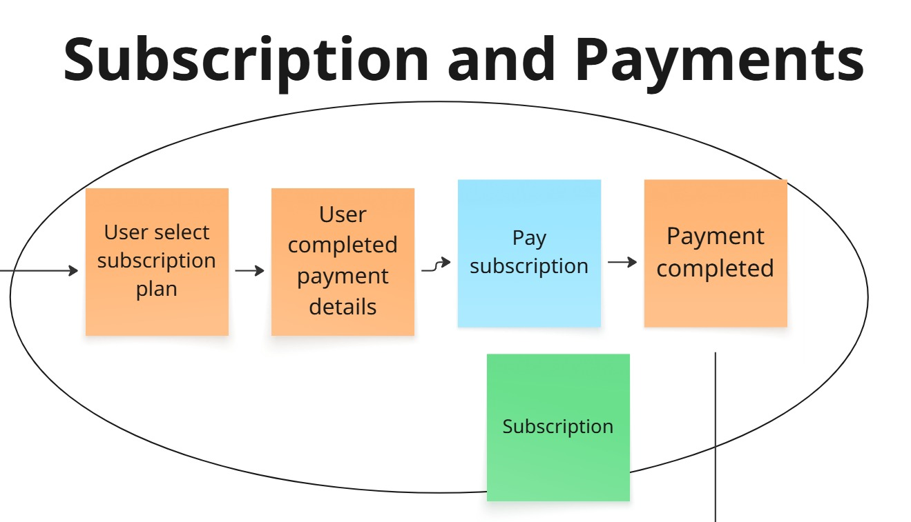
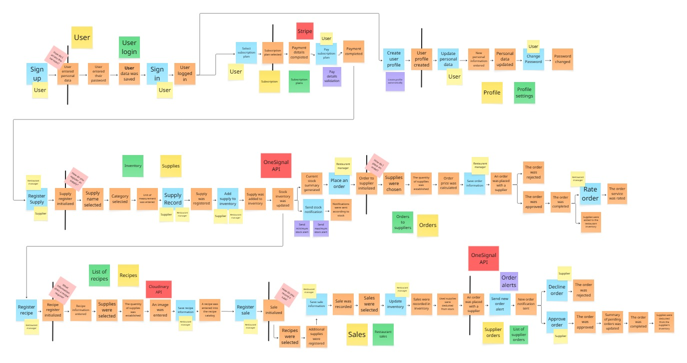
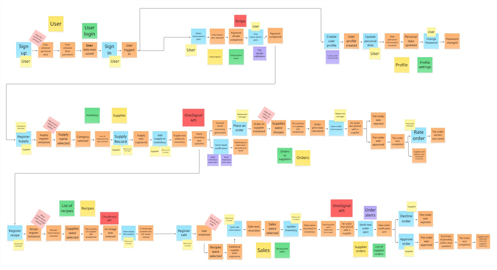
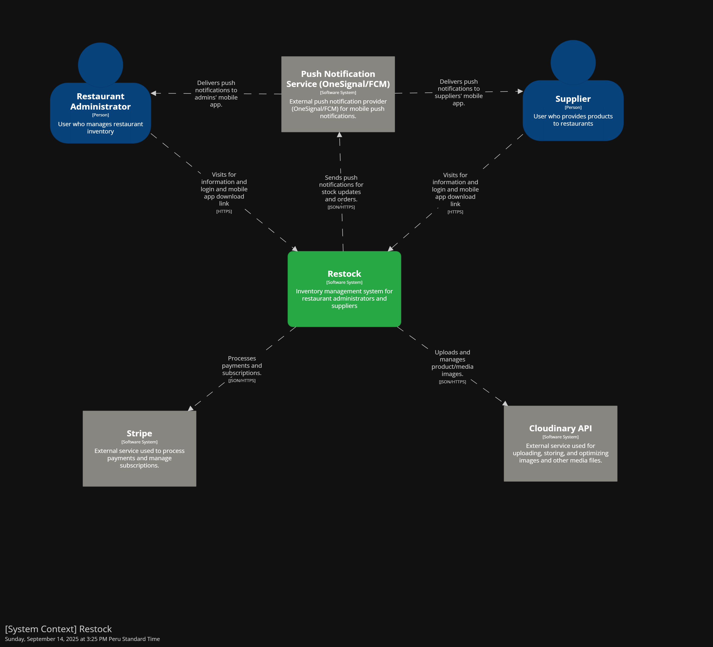
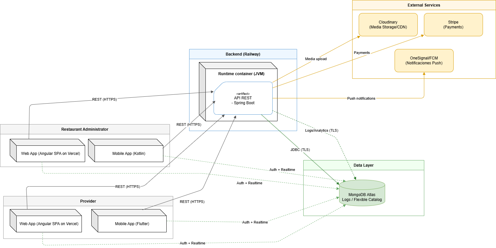
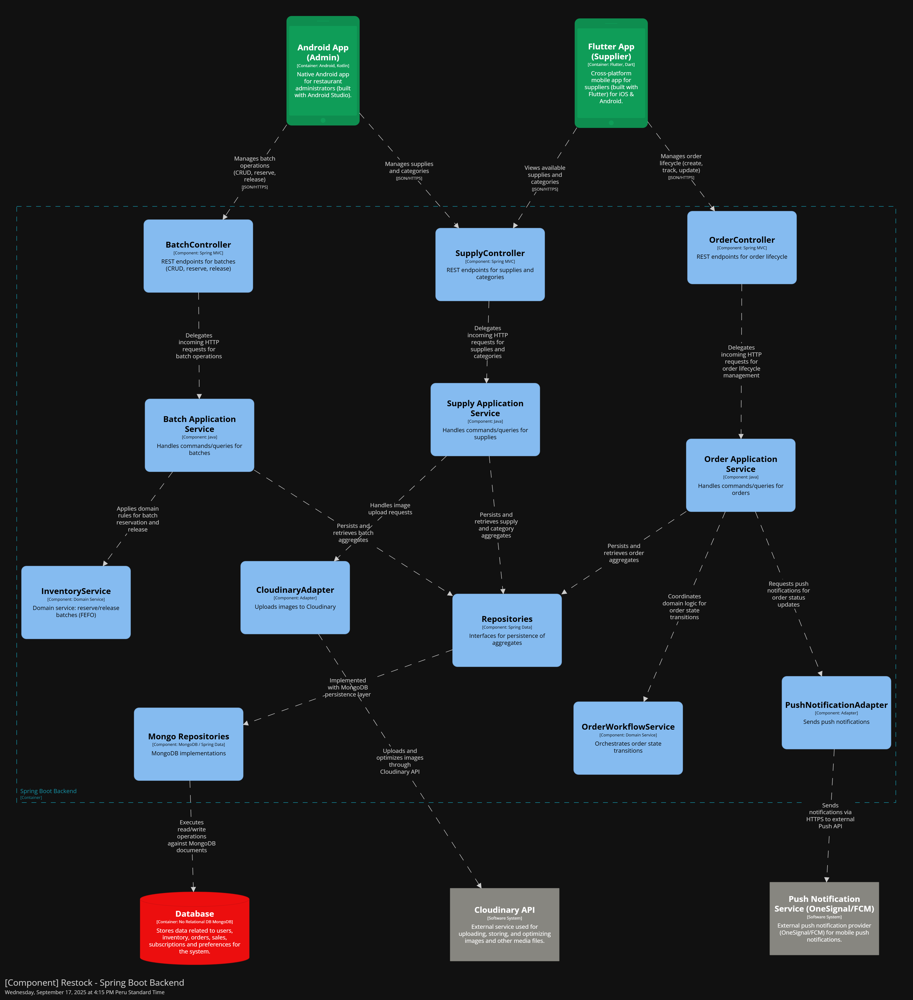
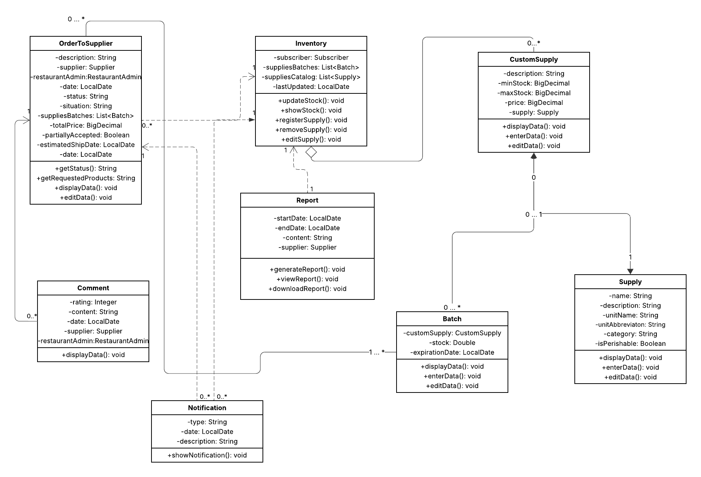
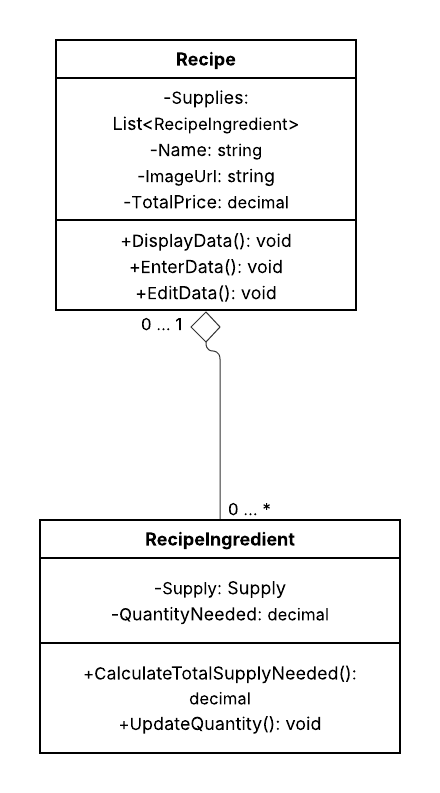

# Capítulo IV: Solution Software Design

## 4.1. Strategic-Level Domain-Driven Design

### 4.1.1. Event Storming

Para la construccion del Event Storming, se coordinó obtener una primera versión del modelo de dominio del proyecto. Para ello, se siguió un proceso estructurado de 9 etapas.

**Paso 1:** Lluvia de ideas de los eventos del dominio relacionados con el dominio empresarial que se está explorando.


**Paso 2:** Ordenar los eventos de dominio (definiendo timelines).



**Paso 3:** Identificar puntos problemáticos (paint points) en el proceso.


**Paso 4:** Identificar eventos comerciales importantes (pivotal points) que indiquen un cambio en el contexto o fase del negocio.


**Paso 5:** Definir comandos que desencadenan eventos.


**Paso 6:**  Definir políticas que desencadenan la ejecución de comandos.


**Paso 7:**  Identificar read models, los cuales son modelos de lectura o vistas que los usuarios necesitan para tomar.


**Paso 8:** Identificar sistemas externos que se conectan con el dominio.


**Paso 9:** Definir aggregates agrupando comandos y eventos relacionados en unidades lógicas.


#### 4.1.1.1. Candidate Context Discovery

A partir del modelo de Event Storming realizado en Miro, se llevó a cabo una sesión de Candidate Context
Discovery para identificar los bounded contexts de la solución. Se utilizó principalmente la técnica
look-for-pivotal-events durante la sesión.

Primero, se buscaron eventos clave que indiquen cambios de estado entre diferentes partes del proceso del negocio:



Luego, se agruparon los eventos de acuerdo a los principales cambios de contexto.



Se trazaron fronteras alrededor de los grupos identificados, estableciendo los límites iniciales de los bounded contexts.


Finalmente, se seleccionaron nombres para los bounded context. Dando como resultado la definición de 6 bounded contexts y la **versión final del Event Storming**:


A continuación, se explicará en qué consiste cada bounded context:

**Identity and Access Management:** También llamado "IAM", este bounded context contiene el proceso de ingreso del usuario a la plataforma, ya sea iniciando sesión o registrandose.


**Subscriptions and Payments:** También llamado "Subscription", este bounded context contiene el proceso de suscribirse a uno de los planes en la plataforma y pagar por dicho plan.


**Profiles and Preferences:** También llamado "Profile", este bounded context contiene el proceso de configuración de datos personales en el perfil.


**Asset and Resource Management:** También llamado "Resource", este bounded context contiene el proceso de gestionar los insumos en el inventario y realizar pedidos a un proveedor.


**Service Design and Planning:** También llamado "Planning", este bounded context contiene el proceso de diseñar/crear una nueva receta en base a los insumos registrados en el inventario.


**Service Operation and Monitoring:** También llamado "Monitoring", este bounded context contiene el proceso de registrar una nueva venta del administrador de restaurante y el proceso de gestionar las órdenes que recibe un proveedor.


#### 4.1.1.2. Domain Message Flows Modeling

Los Domain Message Flows modelan las interacciones entre los diferentes bounded contexts, mostrando cómo se comunican entre sí mediante comandos, eventos y consultas. A continuación, se muestran los flujos de mensaje para los escenarios clave del negocio:

* **Acceso a la plataforma:** En este flujo se muestra la interacción entre el bounded context IAM y el bounded context Profile al momento en que un usuario accede a la plataforma.

  
* **Registrar una receta:** En este flujo se muestra la interacción entre el bounded context Planning y el bounded context Resource al momento en que un administrador de restaurante registra una receta.

  
* **Realizar un pedido a un proveedor:** En este flujo se muestra la interacción entre el bounded context Resource y el bounded context Monitoring al momento en que un administrador de restaurante solicita un pedido a un proveedor.

  
* **Registrar una venta y actualizar el inventario:** En este flujo se muestra la interacción entre el bounded context Monitoring y el bounded context Resource al momento en que un administrador de restaurante registra una nueva venta y actualiza su inventario.

  

Adicionalmente, se presentan flujos de escenarios relevantes para los usuarios, pero en los que no se produce interacción entre distintos bounded contexts:

* **Suscripción a un plan:** En este flujo se muestra el proceso mediante el cual un usuario se suscribe a un plan, modelado en el bounded context Subscription and Payments.

  
* **Registrar un insumo en el inventario:** En este flujo se modela el proceso mediante el cual un usuario registra un insumo en su inventario, modelado en el bounded context Asset and Resource Management.

  

#### 4.1.1.3. Bounded Context Canvases
Para mejorar la organización del dominio y facilitar una comunicación consistente, se elaboraron Bounded Context Canvases para cada subdominio. Estos canvases delimitan claramente las responsabilidades, establecen el lenguaje ubicuo y los modelos clave, y describen los puntos de integración y los flujos de mensajes entre contextos. Los diagramas que siguen consolidan estas decisiones y sirvieron como guía para alinear la arquitectura, las interfaces y la evolución del sistema.
### Identity and Access Management - IAM


### Profiles and Preferences - PFP


### Subscriptions and Payments - SAP


### Service Design and Planning - SDP


### Assets and Resource Management - ARM


### Service Operation and Monitoring - SOM


### 4.1.2. Context Mapping

En esta sección se explica el proceso de elaboración de los contexts maps. Asimismo, se permite la visualizacón de las relaciones estructurales entre vounded contexts, junto a los patrones de relaciones entre Bounded contexts establecidos en Domain Driven Design, como Anti-corruption Layer, Conformist, Customer/Supplier ó Shared Kernel.

Posterior al debate grupal para la contextualización del proyecto, nos hemos proyectado los siguientes Bounded context:

- Profiles and Preferences (PAP)
- Identity and Access Management (IAM)
- Subscriptions and Payments (SAP)
- Assets and Resource Management (ARM)
- Service Design and Planning (SDP)
- Service Operation and Monitoring (SOM)

### *Profiles and Preferences(PAP) - Identity and Access Management (IAM)*


En la presente imagen se puede identificar la relación entre Profiles and preferences(PAP) e Identity and Access Management (IAM), los cuales están enfocados en lógicas similares y comparten un subconjunto del modelo de dominio común para evitar la duplicación de código y lógica.
***Profiles and Preferences (PAP)***:
Está enfocada en el listado de accesos y la segmentación de usuarios, ya que nuestro producto está en un contexto de cliente - administrador. De esta manera, se reutiliza (Shared kernel) el modelo de "usuario", el cual comparte logica con cliente y adminsitrador.
***Identity and Access Management (IAM)***:
Está enfocada en la administración y validación de acceso al sistema. Asimismo, comprende la verificacion de usuario con user y contraseña. De esta manera, también se reutiliza (Shared Kernel) la lógica de un usuario.

### *Identity and Access Management (IAM) - Subscriptions and Payments (SAP)*


En la presente imagen se puede identificar la relación entre Identity and Access Management (IAM) y subscriptions and payments (SAP), los cuales está enfocada en la comunicación por medio de un acl hacia subscriptions and payment por el uso Stripe como servicio externo que se comunica por medio de OSH y Pl el cual permite la comunicacion entre contextos y la definición de servicios.

***Identity and Access Management (IAM)***:
Está enfocada en la administración, validación y actualización de datos en el acceso al sistema. Asimismo, comprende la verificacion de usuario con user, contraseña y pago por medio de stripe.

***Subscriptions and Payments (SAP)***
Está enfocada en la validación y proceso de pagos, a través de las subscripciones existentes. De esta manera, por medio de Stripe, se puede validar e influenciar en otros bounded contexts.

### *Subscriptions and Payments (SAP) - Assets and Resource Management (ARM)*


En la presente imagen se puede identificar la relación entre Subscriptions and Payments (SAP) y Assets and Resource Management (ASM) por medio del patrón Customer / Supplier. Ya que el bounded context ASM actúa o se activa bajo influencia de subscripcions and payments, el cual genera una dependecia enntre estos dos bounded contexts.

***Subscriptions and Payments (SAP)***:
Está enfocada en la validación y proceso de pagos, a través de las subscripciones existentes. De esta manera, por medio de Stripe, se puede validar e influenciar en otros bounded contexts.

***Assets and Resource Management (ARM)***
Está enfocada en la gestión y permisos de inventario, de manera que depende de una subscripción para poder ser usado.

### *Assets and Resource Management (ARM) - Service Design and Planning (SDP)*


En la presente imagen se puede identificar el patrón partnership porque existe un trabajo coordinado entre estos dos boundeds contexts.
***Assets and Resource Management (ARM)***
Está enfocada en la gestión y permisos de inventario.

***Service Design and Planning (SDP)***
Está enfocado en la creación de recetas, y trabaja junto a Assets and Resource Management por el inventario que se actualiza constantemente

### *Service Design and Planning (SDP) - Service Operation and Monitoring (SOM)*


En la presente imagen se puede identificar el patron conformista de manera que el downstream adopta el modelo del upstream tal cual. Y las ventas son dependientes a las recetgas.

***Service Design and Planning (SDP)***
Está enfocado en la creación de recetas, y trabaja junto a Assets and Resource Management.

***Service Operation and Monitoring(SDM)***
Es un bounded context con relación conformista. Ya que el bounded context Service Operation and Monitoring(SDM) solo recibe parte de las recetas, y de esta manera es influenciado por SDP.

### *Final Context Map*


### 4.1.3. Software Architecture

Esta sección aplica el *C4 Model* en dos niveles: **Context** (visión externa / de alto nivel) y **Container** (visión interna / de alto nivel técnico). Se explica cada diagrama y se justifican las decisiones tecnológicas principales.

#### 4.1.3.1. Software Architecture Context Level Diagrams



El Context Diagram muestra **Restock** como un recuadro central con dos actores (Administrador y Proveedor) y los servicios externos principales alrededor (Stripe, OneSignal, Cloudinary). Su propósito es dejar claro el alcance del sistema: todo lo que está dentro del recuadro es responsabilidad del equipo; pagos, email, push y media se delegan a terceros.

#### 4.1.3.2. Software Architecture Container Level Diagrams


El Container Diagram descompone Restock en: landing page (sitio público), apps móviles (Android para administradores y Flutter para proveedores), y un único container de backend que concentra toda la lógica del sistema (los bounded contexts lógicos: IAM, Subscription, Profile, Resource, Planning y Monitoring), la persistencia (MongoDB) y las integraciones externas.

**Decisiones tecnológicas principales (bullet points, muy breves)**

- **Mobile first**: Android nativo (Kotlin) para administradores; Flutter (Dart) para proveedores.
- **Backend**: microservicios por bounded context con **Java + Spring Boot** (REST).
- **Persistencia**: **MongoDB** (schema flexible para insumos/recetas).
- **Integraciones**: **Stripe** (pagos), **SendGrid** (emails), **OneSignal/FCM** (push), **Cloudinary** (medios).
- **Autenticación**: IAM emite JWT; los servicios validan tokens para evitar consultas síncronas constantes.

#### 4.1.3.3. Software Architecture Deployment Diagrams

A continuación se presentan los diagramas de despliegue para el sistema a implementar, los cuales muestran cómo se distribuirán los diferentes componentes del sistema en la infraestructura y otros entornos. Este diagrama visualiza la interacción entre los diferentes servicios y bases de datos, así como su implementación en contenedores y máquinas virtuales. El principal objetivo de estos diagramas es proporcionar una visión clara de la arquitectura del sistema y facilitar su implementación y mantenimiento.



## 4.2. Tactical-Level Domain-Driven Design

### 4.2.1. Bounded Context: Identity and Access Management

**Propósito:** Autenticar y autorizar usuarios. Administra credenciales (en **hash**), el **rol** asignado a cada usuario y expone endpoints para login y la gestión básica de cuentas de los usuarios. Ademas, el diagrama muestra `User` (con `username`, `password`) y `Roles` (con `name`) con relación **Roles (1) — User (1..*)**.

### 4.2.1.1. Domain Layer

En esta sección se documentan las clases que forman el core del bounded context: Aggregates, Entities, Value Objects, Domain Services e interfaces (Repositories).

#### Aggregates

##### User (Aggregate Root)

**Propósito:** Representa a una cuenta de usuario autenticable y su relación con un rol.

**Atributos:**

- `id`
- `username:String`
- `password:String`
- `roleName:String` *(nombre del rol asociado; referencia lógica a `Roles`)*

**Métodos:**

- `displayData()`
- `editData`

**Invarianzas / reglas:**

- `username` **único** y no vacío.
- `password` siempre presente (no texto plano).
- `roleName` no nulo; debe existir en el catálogo `Roles`.

##### Roles (Entity – catálogo)

**Propósito:** Define el rol asignable a uno o varios usuarios.

**Atributos:**

- `name:String` *(`Admin`, `Supplier`, `Customer`)*

**Métodos:**

- `getStringName(): String`
- `getDefaultRole(): Roles`
- `toRoleFromName(name:String): Roles`

**Relación:** **Roles (1)** — **User (1..*)** → cada usuario tiene exactamente **un** rol; un rol pertenece a **muchos** usuarios.

### Value Objects (conceptuales)

- `Username`
- `Password`

### Domain Services

- **PasswordPolicy**: reglas de complejidad y vencimiento.
- **RoleResolutionService**: obtiene el rol por defecto y valida transiciones de rol.

### Repositories (Interfaces en Domain)

**UserRepository**

- `findByUsername(username:String): User?`
- `existsByUsername(username:String): boolean`
- `save(user:User): void`
- `deleteByUsername(username:String): void`

**RolesRepository**

- `findByName(name:String): Roles?`
- `getDefault(): Roles`
- `save(role:Roles): void`

### Domain Events

- `UserCreated`
- `UserPasswordChanged`
- `UserRoleChanged`

### 4.2.1.2. Interface Layer

En esta capa se definen los puntos de entrada/salida del sistema y cómo se exponen los casos de uso a clientes externos. Transforma solicitudes HTTP en *commands/queries* a la **Application Layer** y mapea respuestas del dominio a DTOs.

**Controllers (REST)**

- **AuthController**
  - **POST** `/api/v1/auth/login` → autentica (`username`, `password`) y retorna tokens (infra).
  - **POST** `/api/v1/auth/logout` → invalida refresh token (si aplica).
- **UsersController**
  - **POST** `/api/v1/users` → crea usuario con rol por defecto.
  - **GET** `/api/v1/users/{username}` → obtiene datos básicos del usuario.
  - **PUT** `/api/v1/users/{username}` → renombra usuario o reasigna rol.
  - **PUT** `/api/v1/users/{username}/password` → cambia contraseña.
- **RolesController**
  - **GET** `/api/v1/roles` → lista roles.
  - **GET** `/api/v1/roles/{name}` → detalle de rol.

**Resources (DTOs / Request & Response Models)**

- `LoginRequest { username, password }`
- `TokenResponse { accessToken, refreshToken }`
- `CreateUserRequest { username, password }`
- `UserResource { username, roleName }`
- `ChangePasswordRequest { oldPassword, newPassword }`
- `RoleResource { name }`

**Assemblers / Mappers**

- `CreateUserCommandFromResourceAssembler`
- `UserResourceFromEntityAssembler`
- `ChangePasswordCommandFromResourceAssembler`
- `AssignRoleCommandFromResourceAssembler`

### 4.2.1.3. Application Layer

Coordina interacciones entre dominio e infraestructura, asegurando reglas de negocio y orquestación de casos de uso.

**Command Handlers**

- `CreateUserCommandHandler`Valida unicidad de `username`, calcula `passwordHash`, obtiene `Roles.getDefaultRole()` y persiste.
- `ChangePasswordCommandHandler`Aplica `PasswordPolicy`, recalcula hash y guarda.
- `AssignRoleCommandHandler`
  Verifica existencia del rol y asigna con reglas de `RoleResolutionService`.

**Query Handlers**

- `GetUserQueryHandler`
- `ListRolesQueryHandler`

**Event Handlers (opcionales)**

- `OnUserCreated` → auditar / notificar.
- `OnUserPasswordChanged` → auditar / invalidar sesiones antiguas si aplica.

### 4.2.1.4. Infrastructure Layer

Clases que acceden a servicios externos (base de datos, emisión de tokens, email, mensajería) y **implementaciones concretas** de los *Repositories*.

#### 1 Paquetes y componentes principales

**Persistence**

- `MongoUserRepository` (implementa `UserRepository`)
- `MongoRolesRepository` (implementa `RolesRepository`)
- `mappers` *(Document ↔ Entity)*

**Security / Crypto**

- `BCryptPasswordHasher`

**Auth**

- `JwtTokenProvider` *(emite/valida access/refresh tokens)*

**Events**

- `DomainEventPublisher` *(si se publican eventos a un broker)*

**Configuration**

- `MongoConfig` *(índices, auditoría)*
- `SecurityConfig` *(JWT filters, CORS, CSRF, rate-limiting)*

#### 2 Modelo de datos (MongoDB) y mapeos

**Colección `users`**

```json
{
  "_id": "u:<username>",
  "username": "Robert",
  "password": "password:$2b$...",
  "roleName": "Supplier",
  "audit": { "createdAt": "2025-09-01T00:00:00Z", "updatedAt": "2025-09-01T00:05:00Z" }
}
```

**Índices:**

- Único en `username`.
- Compuesto `{ roleName, username }`.

**Colección `roles`**

```json
{ "_id": "r:Admin", "name": "Admin" }
```

**Índice:** único en `name`.
**Seed inicial:** `Admin`, `Supplier`, `Customer`.

**Colección `refresh_tokens`**

```json
{
  "_id": "rt:uuid",
  "userId": "u:robert",
  "tokenHash": "lewa256:...",
  "issuedAt": "2025-09-01T00:00:02Z",
  "expiresAt": "2025-10-01T00:00:02Z",
  "revoked": false,
  "deviceInfo": "Chrome 140"
}
```

**Índices:** `{ userId, revoked }`, TTL en `expiresAt`.

**Colecciones `email_verifications` / `password_resets`** con **TTL** sobre `expiresAt`.

#### 3 Repositories – Implementación

**MongoUserRepository**

- Mapea `User` ↔ documento `users`.
- Operaciones atómicas para cambios de contraseña.
- Asegura índice único en `username`.

**MongoRolesRepository**

- Resuelve rol por nombre y rol por defecto.
- Provee *seed* inicial (al iniciar la app).

#### 4 Seguridad & Resiliencia

- Nunca almacenar contraseñas en claro; usar **salt + KDF**.
- Firmar JWT con clave rotativa; considerar expiración corta de `accessToken` y rotación de `refreshToken`.
- Rate-limiting en `/auth/login`.
- Auditoría mínima (`createdAt`, `updatedAt`).

### 4.2.1.5. Bounded Context Software Architecture Component Level Diagrams

**Descripción C4–Component:**

- **Interface/Presentation:** *AuthController*, *UsersController*, *RolesController*.
- **Application:** *IAM Application Service* (handlers de commands/queries).
- **Domain:** *User*, *Roles*, *PasswordPolicy*, *RoleResolutionService*, *Repositories (interfaces)*.
- **Infrastructure:** *MongoUserRepository*, *MongoRolesRepository*, *BCryptPasswordHasher*, *JwtTokenProvider*.

**Flujo típico:**

1. `AuthController.login` → *Application* valida credenciales (hash), emite tokens con *JwtTokenProvider*.
2. `UsersController.create` → *Application* aplica reglas de dominio y persiste vía *MongoUserRepository*.
3. `UsersController.changePassword` → *Domain.User.changePassword* → guarda; (opc.) invalida refresh tokens.

### 4.2.1.6. Bounded Context Software Architecture Code Level Diagrams

##### 4.2.1.6.1. Bounded Context Domain Layer Class Diagrams


##### 2.6.1.6.2. Bounded Context Database Design Diagram

  

### 4.2.2. Bounded Context: Subscriptions and Payments

En esta sección para cada uno de los productos, se presenta las clases identificadas y las detalla a manera de diccionario, explicando para cada una su nombre, propósito y la documentación de atributos y métodos considerados, junto con las relaciones entre ellas.

- El propósito de este bounded context contiene y maneja el flujo del proceso de suscripción con respecto a los planes junto a la API de Stripe
- Administra el estado de suscripciones, renovación de planes y pago inmediato con monedas nativas y/o transacciones rápidas.
- Algunos de los modelos del core business hace referencia al plan de suscripción y pago.

#### 4.2.2.1. Domain Layer

En esta capa se explica por medio de clases la representación core de la
aplicación y las reglas de negocio que pertenecen al dominio para el bounded context IAM.
De esta manera se presentan clases de categorías como Entities, Value Objects, Aggregates,
Factories, Domain Services, o abstracciones representadas por interfaces como en el
caso de Repositories.

<table>
  <tr>
    <th>Modelos</th>
    <th>Atributos</th>
    <th>Métodos</th>
    <th>Invarianza / Reglas</th>
  </tr>
  <tr>
    <td>Subscription Plan (Aggregate)</td>
    <td>
      <ul>
        <li> Type (Value Object): Hace referencia a los planes de subscripción disponibles</li>
        <li> Price: Es el costo de un plan de suscripción</li>
        <li> Duration (Value Object): Es el intervalo de tiempo que dura una suuscripcion a un plan (1 mes)</li>
        <li> Auto Renewal: Guarda el permiso para el próximo pago (Sí/No)</li>
        <li> Start Date: Día del pago del plan de suscripción</li>
        <li> End Date: Día de vencimiento del pago del plan de suscripción</li>
        <li> Status: Hace referencia al estado del plan, si sigue vigente o no </li>
      </ul>
    </td>
    <td>
       <ul>
        <li>activate()</li>
        <li>changePlan()</li>
      </ul>
    </td>
    <td>
       Start date y End Date son obligatorios, define el tipo de plan para su próximo manejo en otros bounded y permisos de usuario.
    </td>
  </tr>
  <tr>
    <td>Payment (Entity)</td>
    <td>
      <ul>
        <li> Amount (Value Object): Hace referencia a los planes de subscripción disponibles</li>
        <li> Status: Hace referencia al estado del pago</li>
        <li> Currency: Hace referencia al tipo de moneda del pago </li>
        <li> CreatedAt (Value Object): Fecha el cual se realizó el pago</li>
      </ul>
    </td>
    <td>
      <ul>
        <li>changeStatus()</li>
      </ul>
    </td>
    <td>
      Registrar intentos de pago y su resultado.
    </td>
  </tr>
</table>

#### 4.2.2.2. Interface Layer

En esta sección se introduce introduce, presenta y explica las clases que forman parte de
Interface/Presentation Layer, como clases del tipo Controllers o Consumers.

<table>
  <tr>
    <th>Controllers</th>
    <th>Definiciones</th>
    <th>Endpoints / Propósito</th>
  </tr>
  <tr>
    <td>SubscriptionPlanController</td>
    <td>
      Se crea con el propósito de manejar todos los endpoints de los planes de suscripciones. De esta manera, se permite consultar y crear planes de suscripción.
    </td>
    <td>
       <ul>
        <li>GET /api/v1/subscription-plans → lista de planes</li>
        <li>POST /api/v1/subscription-plans → añadir un plan de suscripción</li>
        <li>GET /api/v1/subscription-plans/{id} → plan de suscripción en específico por id.</li>
        <li>GET /api/v1/subscription-plans?name=basic → plan de suscripción básico.</li>
      </ul>
    </td>
  </tr>
  <tr>
    <td>PaymentController</td>
    <td>
      Se crea con el porpósito de manejar todos los endpoints de los pagos. De esta manera se permite consultar, crear y autorrealizarse junto a el API Externo, Stripe.
    </td>
    <td>
      <ul>
        <li>GET /api/v1/payments → lista de pagos</li>
        <li>POST /api/v1/payments → publicar un pago</li>
        <li>GET /api/v1/payments/{id} -> Buscar el pago con id "id"</li>
        <li>PUT /api/v1/payments/{id}/status -> Cambiar el estado del pago</li>
      </ul>
    </td>
  </tr>
</table>

#### 4.2.2.3. Application Layer

En esta sección se explica a través de qué clases se maneja los flujos de procesos del negocio. Asimismo, se evidencia los capabilities de la aplicación en relación al bounded context.

<table>
  <tr>
    <th>Flujo</th>
    <th>Nombre</th>
    <th>Definición</th>
  </tr>
  <tr>
    <td>Command Handlers</td>
    <td>
     <ul>
      <li>CreateSubscriptionCommandHandler</li>
      <li>CreatePaymentCommandHandler</li>
      <li>UpdatePaymentStatusCommandHandler</li>
     </ul>
    </td>
    <td>
       <ul>
        <li> Maneja la creación de nuevos suscripciones nuevas.</li>
        <li> Maneja la creación de pagos de suscripciones.</li>
        <li> Administra las actualizaciones del estado de un pago</li>
      </ul>
    </td>
  </tr>
  <tr>
    <td>Event Handlers</td>
    <td>
      <ul>
        <li>PaymentCompletedEventHandler</li>
     </ul>
    </td>
    <td>
      <ul>
        <li>Este event handler se encaragará de avisar a otros contextos sobre el pago exitosos y de esta manear acceder a las funcioanldiades de otros boundeds.</li>
      </ul>
    </td>
  </tr>
</table>

#### 4.2.2.4. Infrastructure Layer

En esta se presenta aquellas clases que acceden a servicios externos como
databases, messaging systems o email services. Es en esta capa que se ubica la
implementación de Repositories para las interfaces definidas en Domain Layer.

Asimismo, se muestra la colleción de "Payments", el cual contiene un documento, también conocido como una colección con documetnos anidados.

```
  {
    "_id": ObjectId("5ad5d9cc9f11aed10b84938b"),
    "amount": 98,
    "status": true,
    "currency": "Lorem",
    "created_at": ISODate("2016-04-08T15:06:21.595Z"),
    "subscription_plans": {
        "type": "Lorem",
        "price": 72,
        "duration": ISODate("2016-04-08T15:06:21.595Z"),
        "auto_renewal": true,
        "start_date": ISODate("2016-04-08T15:06:21.595Z"),
        "end_date": ISODate("2016-04-08T15:06:21.595Z"),
        "status": true
    }
  }
```

<table>
  <tr>
    <th>Repositories</th>
    <th>Definición</th>
  </tr>
  <tr>
    <td>PaymentRepositoryImpl</td>
    <td>
     Se implementan los contratos que se definieiron en la capa de domini, tales como: los fetch, find o exists.
    </td>
  </tr>
  <tr>
    <td>SubscriptionRepositoryImpl</td>
    <td>
      Se implementan los contratos que se definieiron en la capa de domini, tales como: los fetch, find o exists.
    </td>
  </tr>
</table>

#### 4.2.2.5. Bounded Context Software Architecture Component Level Diagrams

En esta sección, se explica y presenta los Component Diagrams de C4 Model para cada uno de los Containers considerados para el bounded context correspondiente.


En la imagen se puede observar lo siguiente:

<table>
  <tr>
    <th>Interface/Controller</th>
    <th>Application</th>
    <th>Domain</th>
    <th>Infrastructure</th>
  </tr>
  <tr>
    <th>SubscriptionPlanController: expone endpoints REST para listar, consultar y administrar planes y precios. </th>
    <th>SubscriptionCommandService: aplica las reglas de negocio asignadas al contexto, para la validación y flujo de una suscripción. Asimismo se usa los command handlers y queries</th>
    <th>Modelos centrales como Subscription, Status y SubscriptionAuditory</th>
    <th>Se aplica los endpoints del controller respectivo</th>
  </tr>
  <tr>
    <th>PaymentController: expone endpoints REST para registrar intentos de pago, consultar pagos y actualizar su estado.</th>
    <th>PaymentCommandService: aplica las reglas de negocio asignadas al contexto, para la validación y flujo de un pago. Asimismo se usa los command handlers y queries. </th>
    <th>Modelos centrales como Payment y PaymentAuditory</th>
    <th>Se aplica los endpoints del controller respectivo</th>
  </tr>
    <tr>
    <th>StripeWebhookController: recibe webhooks de Stripe, verifica la firma e invoca el mapeo a eventos de dominio.</th>
    <th>StripeService: Fuera del domino pero se aplicará para la orquestación de pagos, de esta manera interactua con los demás servicios para verificar la lógica de negocio.
    </th>
    <th>-</th>
    <th>Se implementa el repository de stripe y a la ves se integra para validaciones.</th>
  </tr>
</table>

1. POST /payments → se valida en Application → se invoca Stripe → se recibe webhook invoice.paid → Event Handler payment y actualiza Subscription.
2. POST /subscription-plans → administra planes y precios → persiste en Mongo → visible en GET /subscription-plans.
3. POST /stripe/webhooks → Stripe envía evento → Infrastructure valida firma → Application despacha Event Handler apropiado.

#### 4.2.2.6. Bounded Context Software Architecture Code Level Diagrams

En esta sección, se presenta y explica los diagramas que presentan un mayor detalle sobre la implementación de componentes en el bounded context

##### 4.2.2.6.1. Bounded Context Domain Layer Class Diagrams

En esta sección se presenta el Class Diagram de UML para las clases del Domain
Layer en el bounded context.

En esta sección se demuestra la relación de composicion entre Payments y Subscriptions. Ya que para la creación de un objeto payment, se necesita una suscripción inherenemente.


##### 4.2.2.6.2. Bounded Context Database Design Diagram

En esta sección se presenta y explica para cada producto donde se implementa
el bounded context correspondiente, el Database Diagram que incluye los objetos de base de datos que permitirán la persistencia de información para los objetos del bounded context.
Colección: payments

```
Esquema lógico (snake_case):
_id : ObjectId o string
amount : number (minor units recomendado; ej. 499 para 4.99)
status : string (o boolean si mantienes el actual)
currency : string (ISO-4217, p. ej. “USD”, “PEN”)
created_at : date
subscription_plans : document (snapshot embebido)
type : string
price : number (minor units) [o price : { amount_minor_units, currency }]
duration : string o object [opcional si usas ciclo: “Monthly/Annual/Trial”]
auto_renewal : bool
start_date : date
end_date : date
status : bool
```

Ejemplo de documento:

```
{
"_id": "pi_01JABCDE123",
"amount": 499,
"status": "succeeded",
"currency": "USD",
"created_at": ISODate("2025-09-14T15:20:03Z"),
"subscription_plans": {
"type": "STARTER",
"price": 499,
"duration": "Monthly",
"auto_renewal": true,
"start_date": ISODate("2025-09-14T00:00:00Z"),
"end_date": ISODate("2025-10-14T00:00:00Z"),
"status": true
}
}
```

A continuación el diagrama de base de datos:


### 4.2.3. Bounded Context: Profiles and Preferences

**Propósito:** Gestionar el **perfil** del usuario (datos públicos y de contacto) y sus **preferencias**. Mantiene independencia de IAM: la relación con el usuario se modela como `userId` (referencia externa). El modelo contiene: `Profile` como Aggregate Root con **composición** de `Business`; se incorporan mínimos ajustes Domain Driven Degign.

### 4.2.3.1. Domain Layer

En esta sección se documentan las clases que forman el core del bounded context: Aggregates, Entities, Value Objects, Domain Services e interfaces (Repositories).

#### Aggregates

##### Profile (Aggregate Root)

**Propósito:** Representa el perfil visible/administrable del usuario y centraliza sus datos de contacto, ubicación, avatar y preferencias. Contiene a `Business` por **composición** (ciclo de vida dependiente).

**Atributos:**

- `id`
- `userId:String`
- `name:String`
- `lastName:String`
- `email:String`
- `avatar:String`
- `phone:String`
- `address:String`
- `country:String`
- `business:Business`

**Métodos:**

- `getFullName():String`
- `updateContact():void`

**Invarianzas / reglas:**

- `userId` obligatorio y único por perfil.
- `email` válido; coherente con formato.
- `business` no nulo (por composición).
- `getFullName()` retorna nombre normalizado `name + " " + lastName`.

##### Business (Entity – **composición** de Profile)

**Propósito:** Datos del negocio del usuario integrados al perfil.

**Atributos:**

- `name:String`
- `address:String`
- `categories:String`
- `phone:String`
- `email:String`

**Métodos:**

- `getCategoryList():List<String>`
- `updateInfo():void`

**Invarianzas / reglas:**

- `email` válido.
- `name` no vacío.

### Value Objects (conceptuales)

- `Email`
- `PhoneNumber`
- `Address`
- `CountryCode`

### Domain Services

- **ProfileCompletenessService**: evalúa completitud del perfil.
- **AvatarPolicy**: valida tamaños/formatos soportados para `avatar`.

### Repositories (Interfaces en Domain)

**ProfileRepository**

- `findByUserId(userId:String): Profile?`
- `existsByUserId(userId:String): boolean`
- `save(profile:Profile): void`
- `deleteByUserId(userId:String): void`

**BusinessCategoryRepository**

- `findAll(): List<Category>`

### Domain Events

- `ProfileCreated`
- `ProfileUpdated`
- `BusinessUpdated`
- `PreferencesUpdated`

### 4.2.3.2. Interface Layer

En esta capa se definen los puntos de entrada/salida del sistema y cómo se exponen los casos de uso a clientes externos. Transforma solicitudes HTTP en *commands/queries* a la **Application Layer** y mapea respuestas del dominio a DTOs.

**Controllers (REST)**

- **ProfileController**
  - **GET** `/api/v1/profiles/me` → detalle del perfil para el `userId` del token.
  - **PUT** `/api/v1/profiles/me` → actualizar datos de contacto (equivale a `updateContact`).
  - **POST** `/api/v1/profiles/me/avatar` → actualizar `avatar` (equivale a `updateAvatar`).
  - **PUT** `/api/v1/profiles/me/preferences` → actualizar preferencias (equivale a `updatePreferences`).
  - **GET** `/api/v1/profiles/{userId}` → vista pública básica (datos no sensibles).
- **BusinessController**
  - **PUT** `/api/v1/profiles/me/business` → actualizar datos del negocio (equivale a `updateInfo`).

**Resources (DTOs / Request & Response Models)**

- `ProfileResource { userId, name, lastName, email, avatar, phone, address, country, business, notificationPrefs? }`
- `UpdateContactRequest { email, phone, address, country }`
- `UpdateAvatarRequest { avatar }`
- `UpdatePreferencesRequest { email:Boolean, push:Boolean }`
- `UpdateBusinessRequest { name, address, categories, phone, email }`
- `ProfileSummary { userId, fullName, businessName, country, avatar }`

**Assemblers / Mappers**

- `ProfileResourceFromEntityAssembler`
- `UpdateContactCommandFromResourceAssembler`
- `UpdateBusinessCommandFromResourceAssembler`
- `UpdatePreferencesCommandFromResourceAssembler`

### 4.2.3.3. Application Layer

Coordina interacciones entre dominio e infraestructura, garantizando reglas de negocio y orquestación de casos de uso.

**Command Handlers**

- `CreateProfileOnUserVerifiedCommandHandler`Crea perfil inicial al recibir `userId` desde IAM (evento).
- `UpdateContactCommandHandler`Valida email/teléfono y aplica `updateContact`.
- `UpdateBusinessInfoCommandHandler`Normaliza `categories`  y aplica `updateInfo`.
- `UpdatePreferencesCommandHandler`Valida estructura de preferencias y aplica `updatePreferences`.
- `UpdateAvatarCommandHandler`
  Aplica `AvatarPolicy` y actualiza `avatar`.

**Query Handlers**

- `GetProfileByUserIdQueryHandler`
- `SearchProfilesQueryHandler(text?, category?)`

**Event Handlers**

- `OnUserVerified(userId, email)` → ejecuta `CreateProfileOnUserVerifiedCommand`.

### 4.2.3.4. Infrastructure Layer

Clases que acceden a servicios externos (base de datos, almacenamiento de imágenes, mensajería) y **implementaciones concretas** de los *Repositories*.

#### 1 Paquetes y componentes principales

**Persistence**

- `MongoProfileRepository` (implementa `ProfileRepository`)
- `mappers` *(Document ↔ Aggregate)*

**Media / External Services**

- `ImageStorageAdapter` para `avatar`

**Search**

- Índices de texto en Mongo o integración con motor de búsqueda.

**Events**

- `DomainEventPublisher` / `EventSubscriber` (para `OnUserVerified`).

**Configuration**

- `MongoConfig`
- `ExternalClientsConfig`

#### 2 Modelo de datos (MongoDB) y mapeos

**Colección `profiles`**

```json
{
  "_id": "p:<userId>",
  "userId": "u:robert",
  "name": "Robert",
  "lastName": "Doe",
  "email": "robert@example.com",
  "avatar": "https://cdn/...",
  "phone": "+51...",
  "address": "Calle ...",
  "country": "PE",
  "business": {
    "name": "Mi Tienda",
    "address": "Av ...",
    "categories": "comida",  
    "phone": "+51...",
    "email": "ventas@mitienda.com"
  },
  "notificationPrefs": { "email": true, "push": true },
  "audit": { "createdAt": "2025-09-01T00:00:00Z", "updatedAt": "2025-09-01T00:05:00Z" }
}
```

**Índices sugeridos:**

- Único en `userId`.
- Índice de texto en `name`, `lastName`, `business.name` y, si se busca por categorías, en `business.categories`.
- Índice por país `country` para filtros comunes.

**Mappers utilitarios (CSV ↔ lista)**

- **Doc → Dominio**: `categories.split(",").map(trim).filter(notEmpty).unique()`
- **Dominio → Doc**: `categoriesList.map(trim).unique().join(",")`

#### 3 Repositories – Implementación

**MongoProfileRepository**

- Mapea `Profile` ↔ documento `profiles`.
- Asegura índice único en `userId`.
- Expone proyecciones eficientes para listados.

#### 4 Seguridad & Consistencia

- `userId` es referencia lógica a IAM.
- Validar `email`/`phone` en Application antes de persistir.
- Auditar `createdAt`/`updatedAt` y, si aplica, `updatedBy`.

### 4.2.3.5. Bounded Context Software Architecture Component Level Diagrams

**Descripción C4–Component:**

- **Interface/Presentation:** *ProfileController*
- **Application:** *Profiles Application Service*
- **Domain:** *Profile*, *Business*, *ProfileRepository*, *ProfileCompletenessService*, *AvatarPolicy*.
- **Infrastructure:** *MongoProfileRepository*, *ImageStorageAdapter*.

**Flujo típico:**

1. `ProfileController.updateContact` → *Application* valida → *Domain.Profile.updateContact* → *MongoProfileRepository.save*.
2. `ProfileController.updateBusiness` → *Application* normaliza categorías → *Domain.Business.updateInfo* → guardar.
3. `OnUserVerified` (evento IAM) → *Application* crea `Profile` inicial (idempotente).

### 4.2.3.6. Bounded Context Software Architecture Code Level Diagrams

##### 4.2.3.6.1. Bounded Context Domain Layer Class Diagrams


##### 2.6.3.6.2. Bounded Context Database Design Diagram

  

#### 4.2.4. Bounded Context: Asset and Resource Management

#### 4.2.4.1. Domain Layer

En esta sección se documentan las clases que forman el core del bounded context: Aggregates, Entities, Value Objects, Domain Services e interfaces (Repositories).

**Aggregates**

**Batch (Aggregate Root)**

Propósito: Representa una porción de inventario (lote) con cantidad, expiración y referencia al `CustomSupply` que lo originó.

Atributos:

- id
- userId
- customSupplyId (referencia al insumo personalizado)
- stock
- expirationDate

Métodos:

- increaseQuantity(delta)
- decreaseQuantity(delta) — valida stock disponible
- reserve(qty, orderId)
- releaseReservation(orderId)
- updateExpirationDate(newDate)
- isExpired()

Invarianzas / reglas:No permitir stock < 0; lote expirado no puede reservarse.

**CustomSupply (Aggregate Root)**

Propósito: Insumo definido por un usuario; mantiene un snapshot del `supply` del catálogo para referencia histórica y datos de unidad.

Atributos:

- id
- userId (owner)
- minStock
- maxStock
- price
- supply (embebido: id, name, description, perishable, category)
- unit (embebido: name, abbreviation)
- auditInfo

Métodos:

- updateDetails(name, description, price, unit, minStock, maxStock)
- isOwnedBy(userId)

Reglas: Solo el owner puede modificar/eliminar.

**Order (Aggregate Root)**

Propósito: Pedido enviado a un proveedor; contiene un array embebido `batches` que funciona como *snapshot* de las líneas de la orden para trazabilidad. Las líneas de órdenes (los *order batches*) difieren de los `batches` del inventario: aquí se guarda la **cantidad solicitada** (`quantity`) y el estado de **aceptación** (`accepted`) porque la línea ya forma parte de una orden concreta.

Atributos:

- id
- supplierId
- adminRestaurantId
- date
- description
- state
- situation
- totalPrice
- partiallyAccepted
- estimatedShipDate
- estimatedShipTime
- batches (lista embebida con snapshot de cada línea)
- auditInfo

Estructura de cada elemento en `batches` (order batch - snapshot):

- id (identificador de la línea)
- userId (owner / quien añadió la línea)
- customSupplyId (referencia al insumo personalizado)
- stock (valor del stock al momento del snapshot — informativo)
- expirationDate (snapshot del lote/insumo al momento)
- quantity (cantidad solicitada en la orden)
- accepted (boolean)
- unitPrice (precio por unidad al momento)
- lineTotal (unitPrice * quantity)
- reservedBatchId (opcional — referencia al `batch` real reservado en inventario, si se asignó)
- notes (opcional)

Métodos (signatures) específicos y comportamiento:

- `addRequestedBatch(batchSnapshot)` — agrega una línea; evita duplicados por `customSupplyId`/userId.
- `removeRequestedBatch(batchId)` — elimina una línea (solo si no está aceptada/procesada según reglas).
- `updateRequestedBatchQuantity(batchId, newQty)` — actualiza la cantidad solicitada (validar límites y estado).
- `setLineAccepted(batchId)` — marca la línea como aceptada (sólo por actor autorizado / tras comprobaciones de stock).
- `setLineRejected(batchId, reason)` — marca la línea como rechazada (razón registrada).
- `allocateReservation(batchId, reservedBatchId)` — asocia la línea de orden a un `batch` real en inventario (uso por InventoryService).
- `revertAllocation(batchId)` — revierte la asignación si falla la transacción de reserva.
- `approve()` — aprueba la orden completa (orquesta reservas, valida stock, publica eventos).
- `cancel()` — cancela la orden (libera reservas, publica eventos).
- `markPreparing()`, `markOnTheWay()`, `markDelivered()` — transiciones de estado de la orden.
- `calculateTotal()` — suma `lineTotal` de las líneas (considerar accepted / partiallyAccepted según política).

Reglas / restricciones importantes:

- Diferencia con `batches` de inventario:
  - `batches` en la colección `batches` representan lotes físicos en inventario (stock disponible).
  - `batches` embebidos en `orders_to_suppliers` son **snapshots** históricos de la línea en la orden y contienen `quantity` y `accepted`.
- Inmutabilidad parcial: Una vez que una línea ha sido **aceptada** y la orden avanzó (p. ej. aprobada o preparada), los campos críticos del snapshot (quantity, unitPrice, stock snapshot) deben considerarse inmutables para efectos de trazabilidad. Cambios posteriores deben registrarse mediante eventos (nota de crédito / ajuste / nueva orden).
- Aceptación y reserva de stock:
  - La transición `approve()` debería orquestar la reserva/consumo de stock en la colección `batches` (p. ej. `findOneAndUpdate` con condición `stock >= quantity`) y, en caso de éxito, marcar `accepted = true` y registrar `reservedBatchId`.
  - Si la reserva falla (stock insuficiente), la orden puede quedar parcialmente aceptada o rechazada según la política; actualizar `partiallyAccepted` y cada `accepted` por línea.
- Auditoría y trazabilidad: Registrar quién aceptó/rechazó una línea y timestamps; mantener `batches` de orden como historial inmutable para auditoría y reporting.

**Value Objects (conceptuales)**

- Quantity
- Money
- ExpirationDate
- AuditInfo

**Domain Services**

**InventoryService**

- reserveForOrder(orderId, requests) -> ReservationResult
- releaseReservation(orderId)
- lógica FEFO / priorización por expiración

**OrderWorkflowService**

- transitionToApproved(order, approver)
- transitionToDelivered(order)
- publicar eventos (OrderApprovedEvent, OrderDeliveredEvent)

**Repositories (Interfaces en Domain)**

**BatchRepository**

- findById(id)
- findByCustomSupplyId(customSupplyId)
- findAvailableByCustomSupplyId(customSupplyId)
- findExpiringBefore(date)
- save(batch)
- delete(id)

**CustomSupplyRepository**

- findById(id)
- findByOwnerId(ownerId)
- save(customSupply)
- delete(id)

**OrderRepository**

- findById(id)
- findBySupplierId(supplierId)
- findByState(state)
- save(order)
- delete(id)

**SupplyRepository**

- findById(id)
- findByNameOrCode(query)
- findAll()
- save(supply)

#### 4.2.4.2. Interface Layer

En esta capa se definen los puntos de entrada/salida del sistema y cómo se exponen los casos de uso a clientes externos (front-end, integraciones en la app móvil). Aquí se transforman solicitudes HTTP (o mensajes) en comandos/consultas hacia la *Application Layer* y mapear las respuestas del dominio a objetos aptos para transporte (DTOs).

Controllers (REST):

* `BatchController`: Administra las operaciones relacionadas con los  batches de inventario. Endpoints trabajados:

  * **GET** `/api/v1/batches` → listar batches.
  * **GET** `/api/v1/batches/{id}` → obtener detalle de un batch.
  * **POST** `/api/v1/batches` → registrar un nuevo batch.
  * **PUT/PATCH** `/api/v1/batches/{id}` → actualizar información de un batch.
  * **DELETE** `/api/v1/batches/{id}` → eliminar un batch.
* `CustomSupplyController`: Gestiona los insumos personalizados que un usuario puede registrar como suyos fuera del catálogo general.

  * **GET** `/api/v1/custom-supplies` → listar insumos personalizados.
  * **GET** `/api/v1/custom-supplies/{id}` → detalle de un insumo personalizado.
  * **POST** `/api/v1/custom-supplies` → crear un nuevo insumo personalizado.
  * **PUT/PATCH** `/api/v1/custom-supplies/{id}` → actualizar datos del insumo.
  * **DELETE** `/api/v1/custom-supplies/{id}` → eliminar insumo.
* `OrderController`: Expone los casos de uso vinculados a las órdenes de pedido y a los  batches asociados a una orden. Endpoints trabajados:

  * **GET** `/api/v1/orders/{orderId}` → obtener orden por Id.
  * **GET** `/api/v1/orders` → listar todas las órdenes
  * **GET** `/api/v1/orders/{orderId}/batches` → listar batches asociados a la orden.
  * **GET** `/api/v1/orders/{orderId}/custom-supplies` → listar insumos personalizados asociados a la orden.
  * **GET** `/api/v1/orders/{orderId}/requested-batches` → listar requested batches de la orden.
  * **GET** `/api/v1/orders/{orderId}/supplies` → listar supplies relacionados a la orden.
  * **POST** `/api/v1/orders` → crear una nueva orden.
  * **PUT** `/api/v1/orders/{orderId}` → actualizar datos de la orden.
  * **DELETE** `/api/v1/orders/{orderId}` → eliminar una orden.
  * **PUT** `/api/v1/orders/{orderId}/requested-batches/{batchId}` → actualizar un requested batch de la orden.
  * **POST** `/api/v1/orders/{orderId}/requested-batches` → agregar requested batches a la orden.
  * **POST** `/api/v1/orders/{orderId}/approvals` → aprobar una orden.
  * **POST** `/api/v1/orders/{orderId}/declines` → rechazar una orden.
  * **POST** `/api/v1/orders/{orderId}/cancellations` → cancelar una orden.
  * **POST** `/api/v1/orders/{orderId}/preparing` → marcar orden como “Preparing.
  * **POST** `/api/v1/orders/{orderId}/on-the-way` → marcar orden como “On The Way.
  * **POST** `/api/v1/orders/{orderId}/delivered` → marcar orden como “Delivered.
* `SupplyController`: Se encarga de las consultas y operaciones sobre el  catálogo general de insumos. Endpoints trabajados:

  * **GET** `/api/v1/supplies` → listar insumos del catálogo.
  * **GET** `/api/v1/supplies/{id}` → obtener detalle de un insumo.
  * **POST** `/api/v1/supplies` → registrar un nuevo insumo en el catálogo.
  * **PUT/PATCH** `/api/v1/supplies/{id}` → actualizar un insumo.
  * **DELETE** `/api/v1/supplies/{id}` → eliminar insumo.
  * **GET** `/api/v1/supplies/categories` → listar categorías únicas de insumos.

Todos estos controller trabajan con Resources (DTOs / Request & Response Models) y Assemblers/Mappers para el procesamiento de datos, los cuales son:

* **Resources (DTOs / Request & Response Models)**

  * **AddOrderToSupplierBatchResource** → request para agregar requested batches a una orden.
  * **BatchResource** → response con datos de un batch.
  * **CreateBatchResource** → request para crear un batch.
  * **CreateCustomSupplyResource** → request para crear un insumo personalizado.
  * **CreateOrderResource** → request para crear una orden.
  * **CustomSupplyResource** → response con datos de un insumo personalizado.
  * **OrderResource** → response con datos de una orden.
  * **OrderToSupplierBatchResource** → response de un *requested batch* en la orden.
  * **SupplyResource** → response con datos de un insumo del catálogo.
  * **UpdateBatchResource** → request para actualizar un batch.
  * **UpdateCustomSupplyResource** → request para actualizar un insumo personalizado.
  * **UpdateOrderResource** → request para actualizar datos de una orden.
  * **UpdateOrderToSupplierBatchResource** → request para actualizar un requested batch en la orden.
  * 
* **Assemblers / Transform**

  Encapsulan la conversión entre el mundo externo (Resources/DTOs) y el interno (Commands/Queries/Domain). Reducen acoplamiento y duplicación.

  * **AddOrderToSupplierBatchFromResourceAssembler** → resource → command para agregar  *requested batches* .
  * **BatchResourceFromEntityAssembler** → entity → resource para batch.
  * **CreateBatchCommandFromResourceAssembler** → resource → command para crear un batch.
  * **CreateCustomSupplyCommandFromResourceAssembler** → resource → command para crear un insumo personalizado.
  * **CreateOrderCommandFromResourceAssembler** → resource → command para crear una orden.
  * **CustomSupplyResourceFromEntityAssembler** → entity → resource para insumo personalizado.
  * **OrderResourceFromEntityAssembler** → entity → resource para orden.
  * **OrderToSupplierBatchResourceFromEntityAssembler** → entity → resource para  *requested batch* .
  * **SupplyResourceFromEntityAssembler** → entity → resource para insumo del catálogo.
  * **UpdateBatchCommandFromResourceAssembler** → resource → command para actualizar un batch.
  * **UpdateCustomSupplyCommandFromResourceAssembler** → resource → command para actualizar un insumo personalizado.
  * **UpdateOrderCommandFromResourceAssembler** → resource → command para actualizar una orden.
  * **UpdateOrderToSupplierBatchCommandFromResourceAssembler** → resource → command para actualizar un  *requested batch* .

### 4.2.4.3. Application Layer

En esta capa se coordinan las interacciones entre las capas de dominio y la infraestructura, asegurando que el comportamiento del sistema sea correcto y eficiente en función de los requerimientos del negocio.

Se dividen principalmente en 3 tipos de clases:

**1. Command Handlers**

Se encargan de procesar comandos y actúan sobre el dominio. Tenemos:

- **`BatchCommandHandler`**: Maneja los comandos relacionados con la operación de insumos registrados en el inventario (batch). Permite validar, agregar, eliminar y actualizar la información de un batch.
- **`CustomSupplyCommandHandler`**: Aquí se gestionan los comandos específicos para el abastecimiento personalizado de insumos. Permite validar, agregar, eliminar y actualizar la información de un insumo propio.
- **`OrderBatchCommandHandler`**: Esta clase se ocupa de gestionar los comandos relacionados a un batch solicitado en una orden, tales como su creación, actualización y eliminación.
- **`OrderCommandHandler`**: Esta clase se ocupa de gestionar los comandos de órdenes, asegurando que los pedidos sean procesados correctamente dentro del sistema. Permite crear una orden, actualizarla y eliminarla, así como aprobarla, cancelarla o rechazarla. También, agregar un batch a la orden, actualizar el valor de un batch y cambiar el estado de una orden.
- **`SupplyCommandHandler`**: Esta clase se ocupa de gestionar los comandos relacionados a un insumo del catalogo de insumos que se maneja en la aplicación. Permite cargar la data inicial del catálogo de insumos mediante un comando seed.

**2. Event Handlers**

Se encargan de escuchar y reaccionar a eventos generados por el sistema, ejecutando acciones específicas sobre el dominio. En este caso contamos con:

* **`ResourceApplicationReadyEventHandler`** : Esta clase se encarga de escuchar el evento **`ApplicationReadyEvent`** (disparado cuando la aplicación inicia correctamente). Su función es inicializar el catálogo de insumos llamando al servicio de comandos de insumos ( **`SupplyCommandService`** ) mediante el comando  **`SeedSuppliesCommand`** . De esta forma, asegura que al inicio de la aplicación se realice automáticamente la carga inicial de datos en el sistema.

**3. Query Handlers**

Se encargan de resolver consultas del sistema. Tenemos:

* **`BatchQueryHandler`**: Gestiona consultas relacionadas con los batches registrados en el inventario. Permite obtener información detallada de los batches disponibles, sus atributos y estado actual.
* **`CustomSupplyQueryHandler`** : Maneja las consultas sobre insumos personalizados registrados por los usuarios. Permite listar, buscar y detallar la información de un insumo propio dentro del sistema.
* **`OrderBatchQueryHandler`** : Atiende las consultas vinculadas a los batches asociados a una orden. Proporciona información como los batches agregados, sus cantidades y valores en el contexto de la orden.
* **`OrderQueryHandler`** : Responde a las consultas sobre órdenes en general. Permite obtener una orden por su identificador, listar todas las órdenes, consultar su estado y los datos asociados a cada pedido.
* **`SupplyQueryHandler`** : Gestiona las consultas sobre el catálogo de insumos del sistema. Permite acceder a la lista completa de insumos, buscar por criterios y obtener categorías únicas, facilitando la navegación y filtrado en la aplicación.

### 4.2.4.4. Infrastructure Layer

En esta capa se encuentran las clases que acceden a servicios externos (base de datos, proveedores de terceros, mensajería) y las implementaciones concretas de los *Repositories* definidos en el Domain Layer. También contiene adaptadores / clients para Cloudinary, OneSignal y Stripe, así como componentes de infraestructura transaccional, mapeadores persistencia↔dominio y utilidades de resiliencia, logging y observabilidad.

**1. Paquetes y componentes principales (sugeridos)**

Persistence

- `MongoBatchRepository` (implementa `BatchRepository`)
- `MongoCustomSupplyRepository` (implementa `CustomSupplyRepository`)
- `MongoOrderRepository` (implementa `OrderRepository`)
- `MongoSupplyRepository` (implementa `SupplyRepository`)
- `mappers` (Document ↔ Aggregate assemblers)

Adapters

- `CloudinaryImageAdapter` / `CloudinaryService`
- `OneSignalNotificationAdapter` / `OneSignalService`
- `StripePaymentAdapter` / `StripeService`

Events

- `DomainEventPublisher` (interface)
- `MongoDomainEventStore` (opcional: persistencia de eventos)
- `EventPublisherImpl` (publicador a broker si aplica)

Configuration

- `MongoConfig` (MongoTransactionManager, indexes, auditing)
- `ThirdPartyClientsConfig` (Cloudinary, OneSignal, Stripe clients)

**2. Implementación de Repositories**

**Contrato (Domain)**

Las interfaces están en Domain (ej.: `BatchRepository`, `OrderRepository`), con métodos como `findById`, `findByCustomSupplyId`, `findAvailableByCustomSupplyId`, `save`, `delete`.

**Implementación (Infrastructure)**

Nombre sugerido: `MongoBatchRepository` (implementa `BatchRepository`)

Responsabilidad:

- Mapear `BatchDocument` ↔ `Batch` (aggregate).
- Realizar queries eficientes sobre colecciones Mongo (`batches`): búsquedas por `custom_supply_id`, `expiration_date`, `stock >= X`.
- Exponer operaciones atómicas para reservas (ej.: `reserveStock(batchId, qty)` con `findOneAndUpdate`).

#### 4.2.4.5. Bounded Context Software Architecture Component Level Diagrams

En este nivel se presenta la descomposición del **bounded context Restock Resource** a nivel de **componentes internos** de cada container.  



El diagrama refleja los siguientes elementos clave:  

- **Usuarios principales**:  
  - *Restaurant Administrator* y *Supplier*, quienes interactúan con el sistema a través de las aplicaciones móviles.  

- **Aplicaciones cliente**:   
  - **Android App (Admin)**: aplicación nativa en *Kotlin*, enfocada en la gestión de inventario.  
  - **Flutter App (Supplier)**: aplicación multiplataforma en *Flutter*, enfocada en la gestión de insumos y pedidos.  

- **Persistencia de datos**:  
  - **Database**, representada como un cilindro, almacena la información de *batches*, *supplies* y *orders*.  

- **Backend principal (Spring Boot Backend)**:  
  Este container se descompone en múltiples capas y componentes:  
  - **API Layer (Spring MVC Controllers)**:  
    - *BatchController*, *OrderController* y *SupplyController* exponen los endpoints REST, consumidos directamente por las aplicaciones móviles.
  - **Application Layer (Java Services)**:  
    - *Batch Application Service*, *Order Application Service* y *Supply Application Service* procesan comandos y queries para cada agregado.  
  - **Domain Layer (Domain Services)**:  
    - *InventoryService* implementa la lógica de reservas y liberación de lotes siguiendo FEFO.  
    - *OrderWorkflowService* orquesta los cambios de estado de las órdenes.  
  - **Persistence Layer (Spring Data + Mongo)**:  
    - *Repositories* definen interfaces de persistencia.  
    - *Mongo Repositories* son las implementaciones concretas sobre *MongoDB*.  
  - **Infrastructure Layer (Adapters)**:  
    - *CloudinaryAdapter* conecta con el servicio externo *Cloudinary API* para gestión de imágenes.  
    - *PushNotificationAdapter* se integra con el *Push Notification Service* para enviar notificaciones en tiempo real.  

- **Servicios externos**:  
  - *Push Notification Service* entrega notificaciones a administradores y proveedores.  
  - *Cloudinary API* gestiona la subida y optimización de imágenes.  

- **Flujos de comunicación destacados**:  
  - Las aplicaciones cliente (Android App y Flutter App) consumen los endpoints REST expuestos en los *Controllers*.  
  - Los *Controllers* delegan a los *Application Services*.  
  - Los *Application Services* utilizan *Domain Services* para lógica compleja.  
  - La persistencia se realiza a través de *Repositories* y *Mongo Repositories* hacia la base de datos.  
  - Los adaptadores gestionan la integración con servicios externos de terceros (Cloudinary y One signal).  

#### 4.2.4.6. Bounded Context Software Architecture Code Level Diagrams

##### 4.2.4.6.1. Bounded Context Domain Layer Class Diagrams

En esta sección se presenta el diagrama de clases UML.
El diagrama fue modelado en Java con Spring Boot, siguiendo principios de Domain-Driven Design (DDD).

El nivel de detalle incluye:

- Clases de dominio principales: `OrderToSupplier`, `Inventory`, `Supply`, `CustomSupply`, `Batch`, `Report`, `Notification`, `Comment`.
- Atributos con su tipo de dato y visibilidad (`private`).
- Métodos con su visibilidad (`public`).
- Relaciones entre clases, indicando multiplicidad, dirección y calificación.
- Dependencias con agregaciones y composiciones según corresponda.

A continuación, se muestra el diagrama:



Este diagrama permite visualizar la estructura del modelo de dominio y las responsabilidades principales de cada clase dentro del bounded context, sirviendo como base para la implementación en Java.

##### 2.6.4.6.2. Bounded Context Database Design Diagram

En esta sección se presenta el diagrama de base de datos para la persistencia de los objetos del bounded context.
La implementación se realiza sobre MongoDB, en la cual cada entidad del dominio se mapea a una colección.

El diagrama incluye:

- Colecciones principales: `supplies`, `custom_supplies`, `orders_to_suppliers`, `batches`.
- Campos de cada colección con su tipo (`str`, `num`, `bool`, `date`, `doc`, `fk`).
- Relaciones entre documentos mediante referencias (`_id`, claves foráneas simuladas).
- Estructura embebida para documentos anidados, optimizando consultas.

A continuación, se muestra el diagrama:


Este modelo de base de datos facilita la persistencia de información del dominio y permite gestionar de manera eficiente los objetos, relaciones y consultas en un entorno document-oriented con MongoDB.

### 4.2.5. Bounded Context: Service Design and Planning

Este BC diseña y planifica el catálogo de recetas (platos del menú) y su composición de insumos; exponer una grilla de menús para operación y ventas.

**Relaciones con otros BCs:**

* Resource (Inventario): upstream para consultar/validar insumos y downstream para descontar inventario cuando una receta es consumida.
* Monitoring (Ventas): emite eventos de venta de platos. SDP consume esos eventos para generar la orden de consumo de insumos hacia Resource.

ACL: se implementa un Anti-Corruption Layer para traducir términos/IDs entre SDP y Resource/Monitoring (evita que modelos externos contaminen el dominio de SDP).

Lenguaje ubicuo (Ubiquitous Language): Recipe, RecipeIngredient, Supply, Quantity, Price, Menu Grid, Sale/Consumption.

**Políticas clave:**

Una Recipe no es consumible si cualquiera de sus RecipeIngredients (insumos requeridos) no existe o su Quantity ≤ 0.

La consumición de una Recipe sólo procede si Resource confirma stock suficiente (consistencia eventual con reserva/confirmación).

Una Recipe confirmada mantiene invariantes: nombre no vacío; precio ≥ 0; cada item con cantidad > 0; sin duplicados de insumo.

#### 4.2.5.1. Domain Layer

**Aggregates:**

* Recipe (Aggregate Root)

  * Atributos: RecipeId, Name, Price, Items: List `<RecipeIngredient>`, Status (Draft|Active|Archived), Audit (createdBy, createdAt, …).
  * Invariantes:

    * Name no vacío; Price >= 0.
    * Items no vacía cuando Status = Active.
    * Cada RecipeIngredient.Quantity > 0.
    * No hay dos RecipeIngredient con el mismo SupplyId.
  * Comportamientos:

    * addItem(SupplyId, Quantity) (merge quantities si ya existe).
    * updateItemQuantity(SupplyId, Quantity) (revalida invariantes).
    * removeItem(SupplyId) (no permite quedar vacía si está Active).
    * activate() / archive().

**Entities & Value Objects:**

* RecipeIngredient (VO embebido):

  * SupplyId (referencia externa a Resource), Quantity (decimal > 0, p.ej. kg, L, unid), Unit (opcional, si aplica).
  * Validación: Quantity > 0; SupplyId no nulo.
* Price (VO opcional)

  * amount (decimal >= 0), currency (ISO).
* Quantity (VO)

  * value (decimal > 0), unit (enum opcional).

**Domain Services (reglas que no encajan en una sola entidad)**

* RecipeConsumptionPolicy: Dado un Recipe y una solicitud de consumo (de Monitoring), produce el pedido de descuento a Resource (lista de {SupplyId, Quantity}), aplicando transformaciones de unidades/redondeos si fuese necesario.
* RecipeValidationService: Verifica existencia y vigencia de SupplyId en Resource (vía ACL), antes de activar una receta.

**Factories:**

* RecipeFactory:

  * create(name, price, items?) → Recipe(Draft) (permite crear en Draft incluso sin items; al activar se exige items válidos).

**Domain Events (propios de Service Design and Planning)**

* RecipeCreated {recipeId, name}
* RecipeUpdated {recipeId, changedFields}
* RecipeActivated {recipeId} / RecipeArchived {recipeId}
* RecipeConsumptionRequested {recipeId, saleId, lines: [{supplyId, qty}]} (emitido hacia Resource tras evento de venta de Monitoring, vía Application)
* RecipeConsumptionRejected {recipeId, saleId, reason} (si Resource niega stock)
* RecipeConsumptionCommitted {recipeId, saleId}

**Repositories (interfaces del dominio)**

    interface RecipeRepository {
        fun findById(id: RecipeId): Recipe?
        fun findByName(name: String): Recipe?
        fun save(recipe: Recipe): Unit
        fun delete(id: RecipeId): Unit
        fun search(filter: RecipeFilter, page: Int,
        size: Int): Paged`<Recipe>`
    }

Queries complejas para grilla (búsqueda por nombre, rango de precio, estado) se modelan con Specifications/Filters.

#### 4.2.5.2. Interface Layer

**Usuarios:** Restaurant Administrators (Android).

**Pantallas principales (Android):**

* Menu Grid (RecipeListScreen): grid de recetas con búsqueda/orden y estados (Active/Archived).
* Recipe Editor (RecipeEditorScreen): crear/editar nombre, precio e items (selector de Supply remoto con ACL a Resource).
* Recipe Details: vista de receta con lista de insumos y validaciones.
* Activation Flow: activar/archivar con confirmaciones e impactos.

**Controladores/Consumers (frontera de la app móvil):**

* Controllers (Activities/Fragments) + ViewModels (invocan casos de uso de Application).
* Consumers de notificaciones: para feedback de consumo (p.ej., cuando Resource confirma/rechaza consumo post-venta).

**Controllers:**

* RecipeController
  * Responsabilidad: frontera HTTP para CRUD y ciclo de vida de recetas.
  * Colabora con: CreateRecipeHandler, SearchRecipesHandler, GetRecipeByIdHandler, ActivateRecipeHandler, ArchiveRecipeHandler.

#### 4.2.5.3. Application Layer

**Capabilities (casos de uso):**

* Commands (mutaciones):

  * CreateRecipeCommand {name, price, currency}
  * AddRecipeIngredientCommand {recipeId, supplyId, qty, unit?}
  * UpdateRecipeIngredientQuantityCommand {recipeId, supplyId, qty}
  * RemoveRecipeIngredientCommand {recipeId, supplyId}
  * ActivateRecipeCommand {recipeId} / ArchiveRecipeCommand {recipeId}
  * (Opcional) RenameRecipeCommand, UpdateRecipePriceCommand
* Queries (lecturas):

  * GetRecipeByIdQuery {recipeId}
  * SearchRecipesQuery {text?, status?, minPrice?, maxPrice?, page, size}

**Command Handlers (ejemplos):**

* CreateRecipeHandler: valida nombre/price, crea Recipe(Draft), emite RecipeCreated.
* AddRecipeIngredientHandler: carga aggregate, agrega/merge item, revalida invariantes, save.
* ActivateRecipeHandler: llama a RecipeValidationService (consulta a Resource vía ACL para validar supplies); si ok → activate() → RecipeActivated.

**Event Handlers (integración con Monitoring/Resource):**

* OnSaleRegistered (de Monitoring, externo):

  * Verifica recipeId involucrados.
  * Usa RecipeConsumptionPolicy para construir RecipeConsumptionRequested.
  * Publica evento a Resource (MessageBroker).
* OnInventoryConsumptionConfirmed/Rejected (de Resource, externo):

  * Publica RecipeConsumptionCommitted o RecipeConsumptionRejected (para auditoría/UX).

#### 4.2.5.4. Infrastructure Layer

**Persistencia (Backend NoSQL – MongoDB):**
Colección recipes (un documento por aggregate):

```json
{
  "_id": "recipeId",
  "name": "Spaghetti Carbonara",
  "price": { "amount": 12.5, "currency": "USD" },
  "items": [
    { "supplyId": "supply1", "quantity": 0.2, "unit": "kg" },
    { "supplyId": "supply2", "quantity": 0.1, "unit": "L" }
  ],
  "status": "Active",
  "audit": { "createdBy": "...", "createdAt": "...", ... }
}
```

**Repositorios (implementación):**

* RecipeRepository (mapea Aggregate ↔ documento embebido).

**Mensajería / Integraciones:**

* MessageBroker:

  * Tópico de entrada (desde Monitoring): sales.registered.
  * Tópicos de salida (hacia Resource): inventory.consumption.requested, inventory.consumption.compensate.
  * Tópicos de confirmación (desde Resource): inventory.consumption.confirmed/rejected.

#### 4.2.5.5. Bounded Context Software Architecture Component Level Diagrams

#### 4.2.5.6. Bounded Context Software Architecture Code Level Diagrams

##### 4.2.5.6.1. Bounded Context Domain Layer Class Diagrams



##### 4.2.5.6.2. Bounded Context Database Design Diagram


### 4.2.6. Bounded Context: Service Operation and Monitoring (SOM)

Este BC opera y monitorea el día a día en dos frentes:

1. **Ventas** registradas por *restaurant administrators*.
2. **Órdenes de proveedor** gestionadas por *suppliers* (ciclo PO: crear→aprobar→enviar→recibir).

**Relaciones con otros BCs:**

* **SDP (Service Design & Planning):** usa `recipeId` y `price` vigentes; tras una venta SOM **publica** `SaleRegistered` y SDP deriva el consumo de insumos.
* **Resource (Inventario):** recibe `GoodsReceiptPosted` (aumentos) y confirma/alerta niveles (bajo stock); confirma/rehúsa descuentos por consumo.

**ACL:** traduce ids/unidades con SDP/Resource; todas las cantidades viajan en **unidad base** del supply.

**Lenguaje ubicuo:** *Sale, SaleLine, AdditionalSupply, Ticket, PurchaseOrder (PO), POLine, Supplier*.

**Políticas clave**

* **Sale**: cantidades > 0; totales coherentes; **snapshot** de precio/nombre de receta al momento de la venta.

#### 4.2.6.1. Domain Layer

**Aggregates**

* **Sale** *(Aggregate Root)*

  * **Atributos:** SaleId, adminRestaurantId, dinerName?, occurredAt, currency,
    recipeLines: List`<RecipeLine>`, additionalSupplies: List`<SupplyLine>`,
    totals {subtotal, tax, total}, status (Registered|Voided|Refunded),
    inventoryApplied: Boolean, audit.
  * **Invariantes:** cantidades > 0; total = Σ lineTotal; estados consistentes.
  * **Comportamientos:** register(...), void(reason), markInventoryApplied().
* **PurchaseOrder** *(Aggregate Root)*

  * **Atributos:** PurchaseOrderId, supplierId, orderedAt, expectedAt?,
    lines: List`<POLine>`, receipts: List`<GoodsReceipt>`, status, audit.
  * **Comportamientos:** addLine(...), submit(), approve(), send(), receive(lines), cancel().

**Entities & Value Objects**

* RecipeLine (VO): { recipeId, recipeName_snapshot, unitPrice_snapshot: Money, quantity: Decimal, lineTotal: Money }.
* SupplyLine (VO): { supplyId, quantity: Decimal } *(unidad base de Resource; sin unit en SOM)*.
* PurchaseOrderLine (VO): { supplyId, quantity: Decimal, unitPrice?: Money, currency }.
* GoodsReceipt (Entity): { receiptId, receivedAt, lines[{ supplyId, receivedQty: Decimal }] }.
* Money(amount: Decimal128, currency), Quantity(Decimal128).

**Domain Events (SOM)**

* SaleRegistered {saleId, occurredAt, recipeLines[], additionalSupplies[], totals}
* SaleVoided {saleId, reason}
* InventoryAppliedForSale {saleId}
* PurchaseOrderCreated|Submitted|Approved|Sent
* GoodsReceiptPosted {poId, receiptId, lines[]}

**Repositories (interfaces)**

```kotlin
interface SaleRepository {
  fun findById(id: SaleId): Sale?
  fun save(sale: Sale)
  fun search(filter: SaleFilter, page: Int, size: Int): Paged<Sale>
}
interface PurchaseOrderRepository {
  fun findById(id: PoId): PurchaseOrder?
  fun save(po: PurchaseOrder)
  fun search(filter: PoFilter, page: Int, size: Int): Paged<PurchaseOrder>
}
```

#### 4.2.6.2. Interface Layer

**Usuarios / plataformas**

* *Restaurant Admin* → **Android** (ventas, reportes, POs).
* *Supplier* → **Flutter** (inbox de PO, confirmar envío/entrega).

**Controllers (HTTP – REST)**

* **SalesController**
* **PurchaseOrdersController**

**Consumers (mensajería)**

* InventoryConfirmationsConsumer (Resource: inventory.consumption.confirmed|rejected) → marca inventoryApplied.
* InventoryAlertsConsumer (Resource: inventory.low) → crea/actualiza alertas en UI.

#### 4.2.6.3. Application Layer

**Commands**

* RegisterSaleCommand { dinerName?, adminRestaurantId, occurredAt, currency, recipeLines[{recipeId, quantity}], additionalSupplies[{supplyId, quantity}] }
* VoidSaleCommand { saleId, reason }
* CreatePoCommand { supplierId }, AddPoLineCommand { ... }, SubmitPoCommand, ApprovePoCommand, SendPoCommand, PostGoodsReceiptCommand {poId, lines[{supplyId, receivedQty}]}

**Queries**

* GetSaleByIdQuery, SearchSalesQuery, SalesSummaryQuery, TopRecipesQuery
* GetPurchaseOrderByIdQuery, SearchPurchaseOrdersQuery

**Handlers (ejemplos)**

* RegisterSaleHandler: valida líneas, calcula totales, persiste, **emite SaleRegistered** y despacha consumo (SDP/Resource).

#### 4.2.6.4. Infrastructure Layer

**Colecciones:**

* **sales** — *Aggregate = 1 documento; reemplaza “sales\_recipes” y “sales\_additionalSupplies” con arrays embebidos*:

```json
{
  "_id": "sale_01JKM...",
  "adminRestaurantId": "rest_123",
  "dinerName": "Mesa 5",
  "occurredAt": "2025-09-10T13:15:00Z",
  "currency": "PEN",
  "recipeLines": [
    { "recipeId": "rec_01HZY...", "recipeName_snapshot": "Lomo Saltado",
      "unitPrice_snapshot": { "$numberDecimal": "28.90" },
      "quantity": { "$numberDecimal": "2" },
      "lineTotal": { "$numberDecimal": "57.80" }
    }
  ],
  "additionalSupplies": [
    { "supplyId": "sup_extra_napkins", "quantity": { "$numberDecimal": "3" } }
  ],
  "totals": {
    "subtotal": { "$numberDecimal": "57.80" },
    "tax":      { "$numberDecimal": "10.40" },
    "total":    { "$numberDecimal": "68.20" }
  },
  "status": "Registered",
  "inventoryApplied": false,
  "audit": { "createdBy": "admin_1", "createdAt": "2025-09-10T13:15:01Z" }
}
```

* **purchase_orders** — *Aggregate con líneas y recepciones embebidas*:

```json
{
  "_id": "po_2025_001",
  "supplierId": "sup_ABC",
  "orderedAt": "2025-09-10T09:00:00Z",
  "expectedAt": "2025-09-12T18:00:00Z",
  "status": "Sent",
  "lines": [
    { "supplyId": "sup_beef_topside", "quantity": { "$numberDecimal": "15.0" },
      "unitPrice": { "$numberDecimal": "18.50" }, "currency": "PEN" }
  ],
  "receipts": [
    { "receiptId": "gr_01", "receivedAt": "2025-09-12T19:10:00Z",
      "lines": [{ "supplyId": "sup_beef_topside", "receivedQty": { "$numberDecimal": "15.0" } }] }
  ],
  "audit": { "createdBy": "admin_1", "createdAt": "2025-09-10T09:00:00Z" }
}
```

### 4.2.6.5. Bounded Context Software Architecture Component Level Diagrams

### 4.2.6.6. Bounded Context Software Architecture Code Level Diagrams

##### 4.2.6.6.1. Bounded Context Domain Layer Class Diagrams


##### 4.2.6.6.2. Bounded Context Database Design Diagram


