# Capítulo IV: Product Implementation & Validation

## 4.1. Software Configuration Management

### 4.1.1. Software Development Environment Configuration

A continuación, se listan las herramientas y estándares adoptados por el equipo para el desarrollo colaborativo del sistema:

| Actividad               | Herramienta / Guía                                     | Propósito                                                    | Tipo de acceso / Ruta                                                                                                                       |
| ----------------------- | ------------------------------------------------------ | ------------------------------------------------------------ | ------------------------------------------------------------------------------------------------------------------------------------------- |
| Project Management      | Trello                                                 | Seguimiento de backlog, tareas y sprints.                    | [https://trello.com/](https://trello.com/)                                                                                                  |
| Requirements Management | Gherkin Conventions                                    | Escritura legible de requisitos con formato Given/When/Then. | [https://cucumber.io/docs/gherkin/](https://cucumber.io/docs/gherkin/)                                                                      |
| Product UX/UI Design    | Figma                                                  | Prototipos y diseño responsive.                              | SaaS –[https://figma.com](https://figma.com)                                                                                                |
| Frontend Dev            | Kotlin, Flutter                                        | Construcción del frontend del sistema.                       | https://kotlinlang.org/ / https://flutter.dev/                                                                                              |
| Backend Dev             | Java + Spring Boot                                     | Lógica de negocio y servicios REST.                          | [https://spring.io/projects/spring-boot](https://spring.io/projects/spring-boot)                                                            |
| IDE                     | IntelliJ IDEA + Android Studio                         | Desarrollo, depuración y pruebas.                            | [https://www.jetbrains.com/idea](https://www.jetbrains.com/idea) / [https://www.jetbrains.com/webstorm](https://www.jetbrains.com/webstorm) |
| Code Standards          | Google Java Style Guide, Google TypeScript Style Guide | Mantener un código consistente y legible.                    | [https://google.github.io/styleguide](https://google.github.io/styleguide)                                                                  |
| Version Control         | Git + GitHub                                           | Gestión colaborativa del código fuente.                      | SaaS –[https://github.com](https://github.com)                                                                                              |
| Software Deployment     | Github pages                                           | Despliegue continuo del sistema en ambientes de testing.     | SaaS –[https://railway.app](https://railway.app) / [https://render.com](https://render.com)                                                 |
| Software Documentation  | Swagger                                                | Documentación de APIs, funcionalidades y criterios técnicos. | SaaS –[https://swagger.io/](https://swagger.io/)                                                                                            |

### 4.1.2. Source Code Management

#### Frontend (Landing Page - HTML, CSS, JavaScript)

##### Convenciones generales:

- **Idioma**: Todo el código, incluyendo nombres de variables, funciones y clases, está escrito en **inglés**.
- **Indentación**: 2 espacios.
- **Formato de archivos**: `.html`, `.css`, `.js`
- **Estilo de código adoptado**:
  - [W3Schools HTML Style Guide](https://www.w3schools.com/html/html5_syntax.asp)
  - [Google HTML/CSS Style Guide](https://google.github.io/styleguide/htmlcssguide.html)

##### Nomenclatura:

- **Clases CSS**: `kebab-case` (ej. `main-container`)
- **IDs HTML**: `camelCase` (ej. `mainContent`)
- **Variables JS**: `camelCase` (ej. `userName`)
- **Funciones JS**: `camelCase` (ej. `handleClick()`)

#### Backend (Java + Spring Boot)

##### Convenciones generales:

- **Idioma**: Código y documentación interna en **inglés**.
- **Indentación**: 4 espacios.
- **Formato de archivos**: `.java`

##### Estilo de código adoptado:

- [Google Java Style Guide](https://google.github.io/styleguide/javaguide.html)
- [Spring Boot Features &amp; Best Practices](https://docs.spring.io/spring-boot/docs/current/reference/html/features.html)

##### Nomenclatura:

- **Clases**: `PascalCase` (ej. `UserService`)
- **Variables**: `camelCase` (ej. `userRepository`)
- **Constantes**: `UPPER_SNAKE_CASE` (ej. `MAX_USERS`)
- **Endpoints**: `kebab-case` para URLs (ej. `/api/user-profile`)
- **Paquetes**: Todo en minúsculas y separados por punto (ej. `com.project.backend.controller`)

#### Mobile Frontend (Android Studio + Kotlin)

##### Convenciones generales:

- **Idioma**: Todo el código (nombres de paquetes, clases, variables, funciones, recursos) en **inglés**.
- **Indentación**: 4 espacios.
- **Formato de archivos**: `.kt` para Kotlin, `.xml` para layouts/resources, `build.gradle` / `build.gradle.kts` para scripts de Gradle.
- **Estilo de código adoptado**:
  - [Kotlin Coding Conventions](https://kotlinlang.org/docs/coding-conventions.html)
  - [Android Kotlin Style Guide (Google)](https://developer.android.com/kotlin/style-guide)
- **Comportamiento asíncrono**: Usar **Kotlin Coroutines** y `suspend` functions para llamadas de red/IO; preferir **StateFlow** / **SharedFlow** o `LiveData` para exponer estados desde ViewModels.

##### Nomenclatura:

- **Packages**: todo en minúsculas y con puntos (`com.project.restock.admin`).
- **Clases / Activities / ViewModels / Repositories**: `PascalCase` (ej. `InventoryViewModel`, `SuppliesRepository`).
- **Funciones y propiedades**: `camelCase` (ej. `fetchSupplies()` , `userId`).
- **Constantes**: `UPPER_SNAKE_CASE` (ej. `API_TIMEOUT_SECONDS`).
- **Composables (Jetpack Compose)**: `PascalCase` preferible y con sufijos claros cuando aplique (ej. `LoginScreen`, `SupplyItem`).
- **Archivos Kotlin**: `PascalCase` para clases (ej. `InventoryViewModel.kt`) o `snake_case` para ficheros que agrupen múltiples composables/pantallas (ej. `login_screen.kt`) según convención del equipo.
- **IDs y recursos (drawable, layout, string, color, dimens)**: `lowercase_snake_case` (ej. `activity_main.xml` → `@+id/btn_login`, `ic_supply_placeholder`, `color_primary`).
- **Nombres de layouts XML**: `lowercase_snake_case` con prefijos si aplica (ej. `activity_main.xml`, `fragment_recipe_list.xml`, `item_supply.xml`).
- **Nombres de pruebas**: sufijo `Test` para unit/instrumented tests (ej. `InventoryViewModelTest`).

##### Archivos y recursos:

- **Kotlin**: `.kt` (packages, ViewModels, Repositories, UseCases, Mappers).
- **Layouts**: `.xml` (si no se usa Compose) en `res/layout/`.
- **Drawables**: `res/drawable/` → `lowercase_snake_case`.
- **Strings**: `res/values/strings.xml` → keys en `lowercase_snake_case`.
- **Colors / Dimens / Styles**: `res/values/colors.xml`, `dimens.xml`, `styles.xml` → variables en `lowercase_snake_case`.
- **Build scripts**: `build.gradle` o `build.gradle.kts` (módulo/app) con dependencias centralizadas.

##### Arquitectura y patrones recomendados:

- **Arquitectura**: MVVM (View — ViewModel — Repository) o MVI/Unidirectional UI (usando StateFlow) según preferencia del equipo.
- **Repository pattern**: separar acceso a datos (remote/local) y exponer modelos de dominio al ViewModel.
- **Use Cases / Interactors**: opcionalmente encapsular la lógica de negocio en casos de uso reutilizables.
- **Networking**: usar Retrofit + OkHttp + Moshi/Gson para serialización. Utilizar interceptors para auth/token.
- **Persistencia local**: Room para almacenamiento local (caches, offline support).
- **Asincronía**: Kotlin Coroutines + Flow / StateFlow para streams y estados reactivos.
- **State handling**: usar sealed classes o data classes para representar estados UI (Loading / Success / Error / Empty).
- **Navigation**: Jetpack Navigation Component (Fragments) o Navigation for Compose según stack elegido.

##### Buenas prácticas y recomendaciones:

- **Código en inglés**: mensajes de commit, comentarios y nombres en inglés.
- **Suspension naming**: `suspend` functions con nombres verbales claros (`suspend fun fetchSupplies()`).
- **Error handling**: envolver llamadas de red en `Result`/`Either` o usar patrones claros para propagar errores al UI.
- **UI/UX**: manejar estados (loading, empty, error) en cada pantalla; mostrar mensajes claros para usuarios de restaurantes.
- **Testing**: escribir unit tests para ViewModels y repositorios; usar instrumented tests para flujos críticos.
- **Linting & formatting**: integrar `ktlint` y `detekt` en el pipeline; configurar `editorconfig` y `pre-commit hooks`.
- **Seguridad**: no guardar tokens en texto plano; usar `EncryptedSharedPreferences` o soluciones seguras.
- **Accesibilidad**: labels de contentDescription en imágenes, contrastes adecuados y soporte para tamaños de texto.

##### Herramientas / linters / utilidades:

- **Ktlint** (formato y reglas de estilo).
- **Detekt** (análisis estático).
- **Android Lint** (recomendaciones Android).
- **Retrofit + OkHttp + Moshi/Gson** (networking).
- **Room** (persistencia local).
- **Jetpack Compose** (opcional para UI moderna) o XML + ViewBinding/Databinding.
- **Coroutines + Lifecycle (ViewModelScope)**.
- **Navigation Component** (navegación entre pantallas).

### 4.1.3. Source Code Style Guide & Conventions

#### Mobile Frontend (Kotlin + Android Studio + Jetpack Compose)

##### Convenciones generales:

- **Idioma**: Todo el código, nombres de clases, funciones y variables en **inglés**.
- **Indentación**: 4 espacios (convención oficial de Kotlin/Android).
- **Formato de archivos**: `.kt` (Kotlin).
- **Estilo de código adoptado**:
  - [Kotlin Coding Conventions](https://kotlinlang.org/docs/coding-conventions.html)
  - [Android Kotlin Style Guide](https://developer.android.com/kotlin/style-guide)

##### Nomenclatura:

- **Clases y objetos**: `PascalCase` (ej. `UserProfileActivity`, `RestockApp`).
- **Funciones y variables**: `camelCase` (ej. `getUserName()`, `userList`).
- **Constantes**: `UPPER_SNAKE_CASE` (ej. `MAX_USERS`).
- **Paquetes**: Todo en minúsculas y separados por punto (ej. `com.restockmobile.ui.profile`).
- **Layouts y recursos XML**: `snake_case` (ej. `activity_main.xml`, `user_profile_item.xml`).
- **IDs en layouts**: `camelCase` (ej. `btnSubmit`, `txtUserName`).

#### Backend (Java + Spring Boot + MongoDB)

##### Convenciones generales:

- **Idioma**: Código y documentación interna en **inglés**.
- **Indentación**: 4 espacios.
- **Formato de archivos**: `.java`
- **Estilo de código adoptado**:
  - [Google Java Style Guide](https://google.github.io/styleguide/javaguide.html)
  - [Spring Boot Best Practices](https://docs.spring.io/spring-boot/docs/current/reference/html/best-practices.html)

##### Nomenclatura:

- **Clases**: `PascalCase` (ej. `UserService`, `UserController`).
- **Variables**: `camelCase` (ej. `userRepository`).
- **Constantes**: `UPPER_SNAKE_CASE` (ej. `MAX_USERS`).
- **Endpoints REST**: `kebab-case` (ej. `/api/user-profile`).
- **Paquetes**: Todo en minúsculas y separados por punto (ej. `com.restock.backend.service`).
- **Colecciones MongoDB**: `snake_case` en plural (ej. `users`, `product_items`).

#### Database (MongoDB – NoSQL)

##### Convenciones generales:

- **Formato**: Documentos en JSON.
- **Indentación**: 2 espacios para JSON.
- **Estilo de modelado**:
  - Documentos denormalizados (referencias mínimas).
  - Uso de `ObjectId` como clave primaria.

##### Nomenclatura:

- **Colecciones**: plural, `snake_case` (ej. `users`, `order_items`).
- **Campos**: `camelCase` (ej. `userName`, `createdAt`).
- **Índices**: nombrados con campos concatenados en `snake_case` (ej. `user_name_index`).

### 4.1.4. Software Deployment Configuration

Esta sección detalla los pasos necesarios para desplegar satisfactoriamente los componentes digitales de la solución Restock: la Landing Page, la aplicación móvil (Android) y los Web Services (backend), partiendo desde sus respectivos repositorios de código fuente.

#### 1. Landing Page - HTML, CSS y JavaScript

**Tecnología Base:**

- Lenguajes: HTML5, CSS3, JavaScript
- Hosting: GitHub Pages

**Configuración y Despliegue:**

- El código fuente se aloja en un repositorio público de GitHub.
- El archivo `index.html` debe encontrarse en la raíz del repositorio para que GitHub Pages lo detecte como punto de entrada.
- Para desplegar la Landing Page, se siguen los siguientes pasos:
  1. Acceder al repositorio en GitHub.
  2. Continuar con la sección **Settings** > **Pages**.
  3. En **Source**, se selecciona la rama principal (`main`) y la carpeta raíz (`/`).
  4. Se procede a guardar los cambios realizados.
- GitHub Pages genera automáticamente una URL pública con el formato `https://<organizacion>.github.io/<repositorio>/` donde el sitio estará disponible.
- Cada vez que se realiza un commit en la rama `main`, GitHub Pages actualiza de forma automática la versión publicada.

#### 2. Aplicación Móvil - Android (Kotlin + Android Studio)

**Tecnología Base:**

- Lenguaje: Kotlin
- Framework: Android Studio + Jetpack Compose
- Distribución: APK (Android Package)
- Hosting de pruebas: Firebase App Distribution

**Configuración y Despliegue:**

- El código fuente se gestiona en un repositorio de GitHub.
- Para la generación de versiones de prueba, se debe compilo el proyecto en Android Studio (`Build > Generate Signed APK`) y se verifico el funcionamiento de la aplicación en dispositivos físicos o emuladores Android.
- El archivo APK generado se sube a Firebase App Distribution, permitiendo el testeo con usuarios internos y externos seleccionados antes de su publicación oficial.
- El enlace de descarga puede ser compartido con los testers a través de correo electrónico, Google Drive o mediante un acceso en la Landing Page.
- Cada nueva versión de la aplicación para testeo se publica y gestiona mediante la plataforma Firebase, facilitando la retroalimentación y el control de versiones.

#### 3. Backend - Java + MongoDB

**Tecnología Base:**

- Framework: Spring Boot
- Lenguaje: Java 21
- Base de datos: MongoDB
- Contenedorización: Docker
- Hosting: Render o servicio equivalente

**Configuración y Despliegue:**

- El backend está estructurado según el enfoque de Domain-Driven Design (DDD), dividiendo el sistema en bounded contexts independientes.
- El código fuente se mantiene en un repositorio de GitHub.
- Para el despliegue, el repositorio incluye un archivo `Dockerfile` que define la imagen de la aplicación.
- El proveedor de hosting detecta automáticamente el Dockerfile y construye la imagen en cada actualización del repositorio.
- La base de datos MongoDB se configura mediante variables de entorno (por ejemplo, `MONGO_URI`), las cuales se gestionan en el panel de administración del hosting y nunca se almacenan en el código fuente.
- La API REST expuesta por el backend sigue la convención RESTful y sus endpoints están documentados mediante OpenAPI (Swagger). La interfaz Swagger UI está disponible para consulta y prueba.
- Los servicios protegidos requieren autorización mediante JWT, implementada con Spring Security, y los roles de usuario definen el nivel de acceso a cada funcionalidad.
- El despliegue es automático: cada push a la rama principal activa la reconstrucción y publicación en el servicio de hosting, sin necesidad de configurar pipelines de CI/CD adicionales.
- La aplicación móvil consume la API pública del backend utilizando HTTP para acceder a los servicios.

#### Referencias adicionales

- Documentación oficial de [Spring Boot](https://spring.io/projects/spring-boot), [Spring Data MongoDB](https://spring.io/projects/spring-data-mongodb), [Docker](https://docs.docker.com/), [Android Studio](https://developer.android.com/studio), [Firebase App Distribution](https://firebase.google.com/products/app-distribution) y [GitHub Pages](https://pages.github.com/).
- Para la gestión de variables de entorno y credenciales, se consulto las guías de los proveedores de hosting utilizados.

## 4.2. Landing Page & Mobile Application Implementation

### 4.2.1. Sprint 1

#### 4.2.1.1. Sprint Planning 1

<table>
  <tr>
    <td>Sprint #</td>
    <td>Sprint 1</td>
  </tr>
  <tr>
    <td><strong>Sprint Planning Background</strong></td>
    <td></td>
  </tr>
  <tr>
    <td>Date</td>
    <td>2025-09-25</td>
  </tr>
  <tr>
    <td>Time</td>
    <td>08:00 pm (GMT-5)</td>
  </tr>
  <tr>
    <td>Location</td>
    <td>Modalidad remota mediante la plataforma Discord</td>
  </tr>
  <tr>
    <td>Prepared By</td>
    <td>Shapiama Rivera, Gabriela Nicole</td>
  </tr>
  <tr>
    <td>Attendees (to planning meeting)</td>
    <td>.Castro Alejos, Julio / Elescano Leon, Piero Hugo / Guerra Perez, José Jahaziel / Julca  Minaya, Sergio Gino / Shapiama Rivera, Gabriela Nicole</td>
  </tr>
  <tr>
    <td>Sprint 0 Review Summary</td>
    <td>Dado que este es el sprint inicial, no se presenta un resumen del sprint anterior.</td>
  </tr>
  <tr>
    <td>Sprint 0 Retrospective Summary</td>
    <td>Dado que este es el sprint inicial, no se presenta una retroalimentación del sprint anterior.</td>
  </tr>
  <tr>
    <td><strong>Sprint Goal & User Stories</strong></td>
    <td></td>
  </tr>
  <tr>
    <td>Sprint 1 Goal</td>
    <td>Nuestro enfoque está en presentar de forma efectiva nuestra propuesta de valor y e información detallada del producto a los nuevos visitantes. Además, habilitar funcionalidades clave para los administradores de restaurantes, como la gestión de inventario, la configuración de perfil, la gestión de recetas y la sección de ventas. Asimismo, en proporcionar puntos de acceso mediante el API de la plataforma, con el objetivo de que los desarrolladores frontend puedan integrar funcionalidades relacionadas con autenticación, perfil, inventario, recetas y ventas dentro de la app.
Creemos que esto ofrece mayor confianza hacia el equipo de trabajo y motiva a los visitantes a registrarse y probar el producto. Del mismo modo, mejora la eficiencia operativa de los administradores de restaurantes al facilitar la creación y gestión de ventas e insumos desde la aplicación móvil. Además, permite a los desarrolladores frontend implementar funcionalidades esenciales de forma más eficiente, incluyendo autenticación, inventario, ventas, recetas y perfil. 
Esto se confirmará cuando aumente la cantidad de visitantes que se registren en la plataforma. Del mismo modo, cuando se incremente la cantidad de ventas e insumos que registran administradores de restaurantes en la plataforma. Por último, cuando los desarrolladores frontend aumenten la cantidad de funcionalidades relacionadas con ventas, recetas, inventario y perfil en la app móvil.</td>
  </tr>
  <tr>
    <td>Sprint 1 Velocity</td>
    <td>35</td>
  </tr>
  <tr>
    <td>Sum of Story Points</td>
    <td>35</td>
  </tr>
</table>

#### 4.2.1.2. Sprint Backlog 1

Nuestro principal objetivo con este primer sprint es desarrollar las funciones esenciales que permitan a los restaurantes y proveedores interesados en Restock informarse sobre su propósito, conocer sus características destacadas y entender las acciones que podrán realizar dentro de la aplicación móvil..

<table>
	<tbody>
		<tr>
			<td><strong>Sprint #</strong></td>
			<td colspan="7">Sprint 1</td>
		</tr>
		<tr>
			<td colspan="2"><strong>User Story</strong></td>
			<td colspan="6"><strong>Work-item / Task</strong></td>
		</tr>
		<tr>
			<td><strong>Id</strong></td>
			<td><strong>Title</strong></td>
			<td><strong>Id</strong></td>
			<td><strong>Title</strong></td>
			<td><strong>Description</strong></td>
			<td><strong>Estimation (Hours)</strong></td>
			<td><strong>Assisgned To</strong></td>
			<td><strong>Status (To-do / In-Process / To-review / Done)</strong></td>
		</tr>
		<tr>
			<td rowspan="2">EP-01-US01</td>
			<td rowspan="2">Presentar propuesta de valor y CTA en la Landing Page</td>
			<td>T1</td>
			<td>Diseñar sección Hero y propuesta de valor</td>
			<td>Crear y estilizar la sección de bienvenida resaltando el propósito y ventajas de Restock.</td>
			<td>2</td>
			<td>Gabriela Shapiama</td>
			<td>Done</td>
		</tr>
		<tr>
			<td>T2</td>
			<td>Agregar botones de registro y descarga</td>
			<td>Implementar CTA para registro y enlace de descarga de la app móvil.</td>
			<td>1</td>
			<td>Gabriela Shapiama</td>
			<td>Done</td>
		</tr>
		<tr>
			<td rowspan="2">EP-02-US02</td>
			<td rowspan="2">Accesibilidad y navegación responsiva</td>
			<td>T3</td>
			<td>Implementar menú de navegación responsivo</td>
			<td>Diseñar el menú principal con acceso a secciones clave y adaptación a dispositivos móviles.</td>
			<td>2</td>
			<td>Jahaziel Guerra</td>
			<td>Done</td>
		</tr>
		<tr>
			<td>T4</td>
			<td>Estilizar y organizar secciones de la Landing Page</td>
			<td>Aplicar estilos y organizar el contenido para una navegación clara y accesible.</td>
			<td>1</td>
			<td>Jahaziel Guerra</td>
			<td>Done</td>
		</tr>
		<tr>
			<td rowspan="2">EP-03-US03</td>
			<td rowspan="2">Gestión de autenticación y acceso</td>
			<td>T5</td>
			<td>Diseñar formulario de registro/login en Landing y App</td>
			<td>Crear los formularios para registro, inicio de sesión y recuperación de contraseña.</td>
			<td>2</td>
			<td>Julio Castro</td>
			<td>Done</td>
		</tr>
		<tr>
			<td>T6</td>
			<td>Integrar validaciones básicas al formulario</td>
			<td>Asegurar que los campos obligatorios validen correctamente en web y móvil.</td>
			<td>1</td>
			<td>Julio Castro</td>
			<td>Done</td>
		</tr>
		<tr>
			<td rowspan="2">EP-06-US15</td>
			<td rowspan="2">Listado y gestión de supplies (insumos)</td>
			<td>T7</td>
			<td>Desarrollar pantalla de lista de supplies en App móvil</td>
			<td>Mostrar listado de insumos con filtros y barra de búsqueda conectada al backend.</td>
			<td>2</td>
			<td>Sergio Julca</td>
			<td>Done</td>
		</tr>
		<tr>
			<td>T8</td>
			<td>Implementar modal de creación/edición de supplies</td>
			<td>Permitir agregar, editar y eliminar insumos en la app móvil.</td>
			<td>1</td>
			<td>Sergio Julca</td>
			<td>Done</td>
		</tr>
		<tr>
			<td>EP-08-US10</td>
			<td>Gestión de recetas</td>
			<td>T9</td>
			<td>Crear pantalla de listado y detalle de recetas</td>
			<td>Desarrollar interfaz para mostrar recetas y sus insumos relacionados.</td>
			<td>2</td>
			<td>Piero Elescano</td>
			<td>Done</td>
		</tr>
		<tr>
			<td>EP-09-US11</td>
			<td>Panel de estadísticas y métricas</td>
			<td>T10</td>
			<td>Implementar dashboard básico en app móvil</td>
			<td>Mostrar métricas clave del restaurante (inventario, ventas, pedidos) en la app.</td>
			<td>2</td>
			<td>Piero Elescano</td>
			<td>Done</td>
		</tr>
		<tr>
			<td>EP-13-US16</td>
			<td>Gestión de ventas</td>
			<td>T11</td>
			<td>Desarrollar pantalla de registro y gestión de ventas</td>
			<td>Permitir registrar y consultar ventas vinculadas a supplies y recetas.</td>
			<td>2</td>
			<td>Gabriela Shapiama</td>
			<td>Done</td>
		</tr>
		<tr>
			<td>EP-07-US12</td>
			<td>Gestión de compras de insumos</td>
			<td>T12</td>
			<td>Desarrollar interfaz de registro y consulta de compras</td>
			<td>Permitir a administradores registrar compras y visualizar el historial de abastecimiento.</td>
			<td>2</td>
			<td>Sergio Julca</td>
			<td>Done</td>
		</tr>
		<tr>
			<td>EP-12-US13</td>
			<td>Notificaciones </td>
			<td>T13</td>
			<td>Configurar notificaciones de inventario y pedidos</td>
			<td>Implementar alertas automáticas sobre bajo stock y eventos importantes en la app móvil.</td>
			<td>2</td>
			<td>Piero Elescano</td>
			<td>Done</td>
		</tr>
		<tr>
			<td>EP-14-US17</td>
			<td>Gestión de órdenes para proveedores</td>
			<td>T14</td>
			<td>Desarrollar módulo de recepción y actualización de órdenes</td>
			<td>Permitir a proveedores visualizar y actualizar el estado de pedidos recibidos desde restaurantes.</td>
			<td>2</td>
			<td>Julio Castro</td>
			<td>Done</td>
		</tr>
		<tr>
			<td>EP-16-US18</td>
			<td>Gestión de proveedores</td>
			<td>T15</td>
			<td>Implementar pantalla de gestión de proveedores</td>
			<td>Agregar, editar, visualizar y eliminar proveedores en la plataforma.</td>
			<td>2</td>
			<td>Jahaziel Guerra</td>
			<td>Done</td>
		</tr>
	</tbody>
</table>

#### 4.2.1.3. Development Evidence for Sprint Review

<table border="1" cellpadding="8" cellspacing="0" width="100%" style="margin-bottom:18px; text-align: center">
  <thead>
    <tr>
      <th style="margin-bottom:18px; text-align: center">Repository</th>
      <th style="margin-bottom:18px; text-align: center">Branch</th>
      <th style="margin-bottom:18px; text-align: center">Commit id</th>
      <th style="margin-bottom:18px; text-align: center">Commit Message/Body</th>
      <th style="margin-bottom:18px; text-align: center">Commited on (Date)</th>
    </tr>
  </thead>
  <tbody style="margin-bottom:18px; text-align: center">
  <tr>
    <td colspan="5">Landing Page</td>
  </tr>
  <tr>
    <td>sergioJM05/restock-landing-page</td>
    <td>feature/project-structure</td>
    <td>123dfg456dfgir78ryujk678ir8r133123218f7a</td>
    <td>chore: add project structure</td>
    <td>03/10/2025</td>
  </tr>
  <tr>
    <td> JulioXC4/restock-landing-page</td>
    <td>feature/menu</td>
    <td>zxzxc42ds098hgjghxc3b0da42951331zzx18f7a</td>
    <td>feat: add responsive menu</td>
    <td>04/10/2025</td>
  </tr>
  <tr>
    <td>Aplicaciones-para-Dispositivos-Moviles/restock-landing-page</td>
    <td>feature/home</td>
    <td>12xzx45fgb8cfzxz7533b0da4295133123218f7a</td>
    <td>feat: add home section and first call to action</td>
    <td>04/10/2025</td>
  </tr>
  <tr>
    <td>PieroHugo/restock-landing-page</td>
    <td>feature/about-us</td>
    <td>l1p3ohjgffddzx123234565423dczxy623218f7a</td>
    <td>feat: add about us section and development team presentation</td>
    <td>04/10/2025</td>
  </tr>
  <tr>
    <td>GrabrielaShapiama28/restock-landing-page</td>
    <td>feature/benefits</td>
    <td>5143132dsadasa887533b534765dfgsda3218f7a</td>
    <td>feat: add benefits section to restaurant owners and restaurant suppliers</td>
    <td>04/10/2025</td>
  </tr>
  <tr>
    <td>sergioJM05/restock-landing-page</td>
    <td>feature/testimonials</td>
    <td>12dsfty56y45dxvxdkuh10da4295133123218f7a</td>
    <td>feat: add representative testimonials section</td>
    <td>04/10/2025</td>
  </tr>
  <tr>
    <td>sergioJM05/restock-landing-page</td>
    <td>feature/questions</td>
    <td>gdfhrt567vbdfsd87533b0da4295133123218f7a</td>
    <td>feat: add frequently questions</td>
    <td>04/10/2025</td>
  </tr>
  <tr>
    <td>GrabrielaShapiama28/restock-landing-page</td>
    <td>feature/tutorial</td>
    <td>12sxdcsdvadasa887533dfsghgfgdhdgf123767a</td>
    <td>feat: add steps to download and use the app on phones.</td>
    <td>04/10/2025</td>
  </tr>
  </tbody>
  <tr>
    <td>PieroHugo/restock-landing-page</td>
    <td>feature/contact</td>
    <td>7u6gfb98ftgfbds23213b0da429513312321r436</td>
    <td>feat: add contact form.</td>
    <td>04/10/2025</td>
  </tr>
  <tr>
    <td>Aplicaciones-para-Dispositivos-Moviles/restock-landing-page</td>
    <td>feature/download</td>
    <td>565414352adasa887533b0da4295133123218f7a</td>
    <td>feat: add call to action to download restock App</td>
    <td>04/10/2025</td>
  </tr>
    <tr>
    <td>JulioXC4/restock-landing-page</td>
    <td>feature/menu</td>
    <td>5345342dsadasa887533b0da4295133123218f7a</td>
    <td>feat: add internacionalization EN / ES</td>
    <td>04/10/2025</td>
  </tr>
    <tr>
    <td>sergioJM05/restock-landing-page</td>
    <td>feature/footer</td>
    <td>7cd72323c612fa887533b0da429513fe919b8f7a</td>
    <td>feat: add footer with social medias and rights reserved</td>
    <td>04/10/2025</td>
  </tr>
  <tr>
    <td colspan="5">Mobile Frontend</td>
  </tr>
  <tr>
    <td>PieroHugo/restock-mobile-android</td>
    <td>feature/monitoring</td>
    <td>fef3e1a27a0f178c8f066effd5d29a99caad8e95</td>
    <td>chore: implement monitoring project structure</td>
    <td>07/10/2025</td>
  </tr>
  <tr>
    <td>SergioJM05/restock-mobile-android</td>
    <td>feature/monitoring</td>
    <td>7cd72323c612fa887533b0da429513fe919b8f7a</td>
    <td>feat: add models for monitoring</td>
    <td>07/10/2025</td>
  </tr>
    <tr>
    <td>SergioJM05/restock-mobile-android</td>
    <td>feature/monitoring</td>
    <td>8d76ca8be2788c2b3f930087f642a4a4d5a16c74</td>
    <td>feat: add monitoring views</td>
    <td>07/10/2025</td>
  </tr>
    <tr>
    <td>SergioJM05/restock-mobile-android</td>
    <td>feature/monitoring</td>
    <td>254484e26868558fa4ae36595d456453944dabc7</td>
    <td>feat: add monitoring logic</td>
    <td>07/10/2025</td>
  </tr>
    <tr>
    <td>PieroHugo/restock-mobile-android</td>
    <td>feature/monitoring</td>
    <td>036959bb72b0a1fb081ea5a8bdd0a262b29af800</td>
    <td>feat: add monitoring static data</td>
    <td>07/10/2025</td>
  </tr>
  <tr>
    <td>PieroHugo/restock-mobile-android</td>
    <td>feature/monitoring</td>
    <td>00f49314ae799242601d0348674ce47e2fda6171</td>
    <td>feat: add monitoring actions</td>
    <td>07/10/2025</td>
  </tr>
  <tr>
    <td>jahazielgg/restock-mobile-android</td>
    <td>feature/planning</td>
    <td>20d2b439d5547a914b0ef27c16821ccd2c2a6579</td>
    <td>feat: update HomeScreen title and provide RecipeApiService in NetworkModule</td>
    <td>09/10/2025</td>
  </tr>
  <tr>
    <td>jahazielgg/restock-mobile-android</td>
    <td>feature/planning</td>
    <td>7849d9a949fccc045c728328880ae06057123a32</td>
    <td>feat: enhance HomeScreen with navigation to Recipes and add drawer functionality</td>
    <td>09/10/2025</td>
  </tr>
  <tr>
    <td>jahazielgg/restock-mobile-android</td>
    <td>feature/planning</td>
    <td>1e785049dffb38da9984657b909acfde46a94f23</td>
    <td>feat: add Recipe, RecipeDto, RecipeApiService, RecipeMapper, and RecipeSupply for recipe management</td>
    <td>07/10/2025</td>
  </tr>
    <tr>
    <td>jahazielgg/restock-mobile-android</td>
    <td>feature/planning</td>
    <td>543d362a9747dd74e6cd8b9899468b7b62481b9a</td>
    <td>feat: add RecipeDetailScreen, RecipeFormScreen, and RecipesListScreen for recipe management</td>
    <td>07/10/2025</td>
  </tr>
    <tr>
    <td>jahazielgg/restock-mobile-android</td>
    <td>feature/planning</td>
    <td>5686c76b169bef2e6cbb9a9347039277a0a5ad28</td>
    <td>feat: add DTOs and requests for adding supplies to recipes and creating recipes</td>
    <td>07/10/2025</td>
  </tr>
    <tr>
    <td>JulioXC4/restock-mobile-android</td>
    <td>feature/planning</td>
    <td>b9535b19b08f87ec760629c658847ba4fc51f2ff</td>
    <td>feat(inventory):Improve SupplyFormScreen UI and fix dropdown not showing supply options</td>
    <td>08/10/2025</td>
  </tr>
    <tr>
    <td>JulioXC4/restock-mobile-android</td>
    <td>feature/planning</td>
    <td>48af7393b36b41a95d6571849e65253b08fc4266</td>
    <td>fix(navigation): unified and fixed SupplyFormScreen routes for add/edit supplies</td>
    <td>08/10/2025</td>
  </tr>
    <tr>
    <td>JulioXC4/restock-mobile-android</td>
    <td>feature/planning</td>
    <td>097d5b40f983abb35ffda480b681fda323a0cbe9</td>
    <td>feat(resources): completed custom supplies flow; pending batch management and UI polish</td>
    <td>08/10/2025</td>
  </tr>
    <tr>
    <td>JulioXC4/restock-mobile-android</td>
    <td>feature/planning</td>
    <td>21ca973c6c0f186e22e3ae87557a154a6f72ba2e</td>
    <td>feat: implement profile logout functionality and update profile data handling</td>
    <td>08/10/2025</td>
  </tr>
    <tr>
    <td>JulioXC4/restock-mobile-android</td>
    <td>feature/planning</td>
    <td>3892d7782094c1007d72381450e2812fc4c8e862</td>
    <td>feat: add description and phone fields to business and personal data screens</td>
    <td>07/10/2025</td>
  </tr>
    <tr>
    <td>jahzielgg/restock-mobile-android</td>
    <td>feature/planning</td>
    <td>40d8c949c53307aa68b263c1ad12783e1f121967</td>
    <td>feat: add avatar upload functionality with snackbar notifications in ProfileDetailScreen</td>
    <td>07/10/2025</td>
  </tr>
  <tr>
    <td>jahzielgg/restock-mobile-android</td>
    <td>feature/planning</td>
    <td>a7e21d4d54dc022f28a6441b824fe67e15554119</td>
    <td>feat: update AndroidManifest to include permissions for external storage and media access</td>
    <td>07/10/2025</td>
  </tr>
  <tr>
    <td>GabrielaShapiama28/restock-mobile-android</td>
    <td>feature/resources</td>
    <td>31a491d75c02127ba8b41bd7801c37f5737a0ac4</td>
    <td>feat: add inventory repository information.</td>
    <td>07/10/2025</td>
  </tr>
  <tr>
    <td>GabrielaShapiama28/restock-mobile-android</td>
    <td>feature/resources</td>
    <td>2a0d06ec43542c76237b82092408fb2a732dc61b</td>
    <td>feat: add inventory repository information.</td>
    <td>07/10/2025</td>
  </tr>
  <tr>
    <td>GabrielaShapiama28/restock-mobile-android</td>
    <td>feature/resources</td>
    <td>35fdba25224c6f89be1b9f493a0dc7ffae05819b</td>
    <td>feat: add supply information.</td>
    <td>07/10/2025</td>
  </tr>
  <tr>
    <td>GabrielaShapiama28/restock-mobile-android</td>
    <td>feature/resources</td>
    <td>d85559a4cdaa46e3edee710b6d15d3ddca052c54</td>
    <td>feat: add inventory detail information.</td>
    <td>07/10/2025</td>
  </tr>
  <tr>
    <td>GabrielaShapiama28/restock-mobile-android</td>
    <td>feature/resources</td>
    <td>a60c8c35d213e86849c38557d511ce32b1930fcf</td>
    <td>feat: add information to supply detail.</td>
    <td>07/10/2025</td>
  </tr>
  <tr>
    <td>GabrielaShapiama28/restock-mobile-android</td>
    <td>feature/resources</td>
    <td>864b066914fd7b81bfeb79ee22742925b86cad0c</td>
    <td>feat: add attribute to Batch class.</td>
    <td>07/10/2025</td>
  </tr>
    <tr>
    <td>GabrielaShapiama28/restock-mobile-android</td>
    <td>feature/planning</td>
    <td>31a491d75c02127ba8b41bd7801c37f5737a0ac4</td>
    <td>feat: add inventory repository information.</td>
    <td>02/10/2025</td>
  </tr>
      <tr>
    <td>GabrielaShapiama28/restock-mobile-android</td>
    <td>feature/planning</td>
    <td>2a0d06ec43542c76237b82092408fb2a732dc61b</td>
    <td>feat: add inventory repository information.</td>
    <td>02/10/2025</td>
  </tr>
        <tr>
    <td>GabrielaShapiama28/restock-mobile-android</td>
    <td>feature/planning</td>
    <td>35fdba25224c6f89be1b9f493a0dc7ffae05819b</td>
    <td>feat: add supply information.</td>
    <td>02/10/2025</td>
  </tr>
  <tr>
    <td colspan="5">Backend</td>
  </tr>
   <tr>
    <td>GabrielaShapiama28/restock-platform</td>
    <td>feature/resource</td>
    <td>0dbd5a0c98550fe47fca3941a3a31dfaaeefa0b3</td>
    <td>fix: change server url prd to dev.</td>
    <td>07/10/2025</td>
  </tr>
  <tr>
      <td>GabrielaShapiama28/restock-platform</td>
      <td>feature/resource</td>
      <td>f4c7f71e3c708a42c16118bd1117352323ff2ad2</td>
      <td>feat: add sale information.</td>
      <td>07/10/2025</td>
    </tr>
    <tr>
      <td>GabrielaShapiama28/restock-platform</td>
      <td>feature/resource</td>
      <td>9bad1d2efe2835d4af3e8fd38f647f65321bfa17</td>
      <td>feat: add inventory update to applied after confirm resources.</td>
      <td>07/10/2025</td> 
    </tr>
    <tr>
      <td>GabrielaShapiama28/restock-platform</td>
      <td>feature/resource</td>
      <td>7e2952b5fe6a208a82ac951d17f8faafdf031e00</td>
      <td>feat: add purchase order information.</td>
      <td>07/10/2025</td>
    </tr>
    <tr>
      <td>GabrielaShapiama28/restock-platform</td>
      <td>feature/resource</td>
      <td>c5b72b8f97adef3ad79517d69ed0f8127b58cda2</td>
      <td>feat: add goods receipt information.</td>
      <td>07/10/2025</td>
    </tr>
    <tr>
      <td>PieroHugo/restock-platform</td>
      <td>feature/monitoring</td>
      <td>49c68c2a98aab663b43de3971d5e01349e0f9dda</td>
      <td>feat: add sale information.</td>
      <td>07/10/2025</td>
    </tr>
<tr>
      <td>PieroHugo/restock-platform</td>
      <td>feature/monitoring</td>
      <td>2685de9471a0f83ad75205b618863b31e14e6198</td>
      <td>feat: add user login information.</td>
      <td>07/10/2025</td>
    </tr>
    <tr>
      <td>PieroHugo/restock-platform</td>
      <td>feature/monitoring</td>
      <td>ed5ce3208cd2c63a242441f45fedae10d5425bec</td>
      <td>feat: add sale CRUD information.</td>
      <td>07/10/2025</td>
    </tr>
    <tr>
      <td>PieroHugo/restock-platform</td>
      <td>feature/monitoring</td>
      <td>d28da8da0545a20d228ebb03a345149eb03ce84a</td>
      <td>feat: add sale repository.</td>
      <td>07/10/2025</td>
    </tr>
    <tr>
      <td>PieroHugo/restock-platform</td>
      <td>feature/monitoring</td>
      <td>8aef03d2070aa74505d3434024f1e71bdd1505ca</td>
      <td>feat: add sale authentication.</td>
      <td>07/10/2025</td>
    </tr>
    <tr>
      <td>sergioJM05/restock-platform</td>
      <td>feature/monitoring</td>
      <td>4f67d20d5c85cd5040d1f2cda2555f92bd29e716</td>
      <td>feat(monitoring): add unit sale value object.</td>
      <td>07/10/2025</td>
    </tr>
    <tr>
      <td>sergioJM05/restock-platform</td>
      <td>feature/monitoring</td>
      <td>e1c4f3b6f4e8b6c3f4d5e6f7a8b9c0d1e2f3a4b5</td>
      <td>feat(monitoring): add monitoring services.</td>
      <td>07/10/2025</td>
    </tr>
    <tr>
      <td>sergioJM05/restock-platform</td>
      <td>feature/monitoring</td>
      <td>c3b2a1d0e9f8b7a6c5d4e3f2a1b0c9d8e7f6a5b4</td>
      <td>feat(monitoring): add monitoring controllers.</td>
      <td>07/10/2025</td>
    </tr>
    <tr>
      <td>sergioJM05/restock-platform</td>
      <td>feature/monitoring</td>
      <td>a1b2c3d4e5f60718293a4b5c6d7e8f9a0b1c2d3e</td>
      <td>feat(monitoring): add monitoring endpoints.</td>
      <td>07/10/2025</td>
    </tr>
    <tr>
      <td>sergioJM05/restock-platform</td>
      <td>feature/monitoring</td>
      <td>f0e1d2c3b4a5968778695a4b3c2d1e0f9e8d7c6b</td>
      <td>feat(monitoring): add monitoring services.</td>
      <td>07/10/2025</td>
    </tr>
    <tr>
      <td>jahzielgg/restock-platform</td>
      <td>feature/resource</td>
      <td>e9f8d7c6b5a4938271605f4e3d2c1b0a9f8e7d6c</td>
      <td>feat(recipes): add CreateRecipeCommand and GetRecipeByIdQuery records</td>
      <td>07/10/2025</td>
    </tr>
    <tr>
      <td>jahzielgg/restock-platform</td>
      <td>feature/resource</td>
      <td>b6a5c4d3e2f10987654321a0b1c2d3e4f5a6b7c8</td>
      <td>feat(recipes): add RecipeController with endpoints for creating and retrieving recipes</td>
      <td>07/10/2025</td> 
    </tr>
    <tr>
      <td>JulioXc4/restock-platform</td>
      <td>feature/iam</td>
      <td>c4d3e2f10987654321a0b1c2d3e4f5a6b7c8d9e0</td>
      <td>feat(iam): add user aggregates, model, entities, valueobjects, commands and queries</td>
      <td>07/10/2025</td>
    </tr>
    <tr>
      <td>JulioXc4/restock-platform</td>
      <td>feature/resource</td>
      <td>f1e2d3c4b5a6978878695a4b3c2d1e0f9e8d7c6b</td>
      <td>feat(resource): implement supply seeding and remove ReferenceSupply logic</td>
      <td>07/10/2025</td>
    </tr>
    <tr>
      <td>jahzielgg/restock-platform</td>
      <td>feature/resource</td>
      <td>bcdcea0f35aaf8850cc64290b34ab25d3e376cfc</td>
      <td>feat(pom): update main class for Restock application</td>
      <td>07/10/2025</td>
    </tr>
        <tr>
      <td>jahzielgg/restock-platform</td>
      <td>feature/resource</td>
      <td>9d599e9b36571cf2f3d8e2ed5dcd41f8347fe4fd</td>
      <td>feat(recipes): refactor Recipe and RecipeSupply classes to improve supply management</td>
      <td>07/10/2025</td>
    </tr>
      <tr>
      <td>sergioJM05/restock-platform</td>
      <td>feature/monitoring</td>
      <td>35d5bc2825c943fbff896a751236ae89dc137542</td>
      <td>fix: allow local access to endpoints.</td>
      <td>13/10/2025</td>
    </tr>
      <tr>
      <td>sergioJM05/restock-platform</td>
      <td>feature/monitoring</td>
      <td>1db01cf7c0bebf961256427b415006b8579b535d</td>
      <td>feat(monitoring): Add "findBySaleCode" function in sale repository.</td>
      <td>13/10/2025</td>
    </tr>
    <tr>
      <td>sergioJM05/restock-platform</td>
      <td>feature/monitoring</td>
      <td>c077892fe4e4d6fae891377ff11dd6d29dfa1b5a</td>
      <td>feat(monitoring): Add controller with get and post of sale items and sales.</td>
      <td>13/10/2025</td>
    </tr>
    <tr>
      <td>sergioJM05/restock-platform</td>
      <td>feature/monitoring</td>
      <td>9ddef01c82ba3b67d332147cc2e93de71a0ce822</td>
      <td>feat(monitoring): Add query service implementation.</td>
      <td>13/10/2025</td>
    </tr>
    <tr>
      <td>sergioJM05/restock-platform</td>
      <td>feature/monitoring</td>
      <td>8ff33620c3b7e453028fca7b91c4222486d80607</td>
      <td>
      feat(monitoring): Add interface query service.
      </td>
      <td>13/10/2025</td>
    </tr>
        <tr>
      <td>sergioJM05/restock-platform</td>
      <td>feature/monitoring</td>
      <td>e79354fc230ccd5708293cbf577cb92c0d01d4c3</td>
      <td>
        feat(monitoring): Add interface command service.
      </td>
      <td>13/10/2025</td>
    </tr>
    <tr>
      <td>sergioJM05/restock-platform</td>
      <td>feature/monitoring</td>
      <td>25449b1c16266366dc951b3c54043ae2870bb5af</td>
      <td>
        feat(monitoring): Add command service implementation.
      </td>
      <td>13/10/2025</td>
    </tr>
    <tr>
      <td>sergioJM05/restock-platform</td>
      <td>feature/monitoring</td>
      <td>ad62116328ecda1d35137d79e519953963fc413b</td>
      <td>
feat(monitoring): Add query service implementation.
      </td>
      <td>13/10/2025</td>
    </tr>
        <tr>
      <td>sergioJM05/restock-platform</td>
      <td>feature/monitoring</td>
      <td>059f3f4afea8f37992880f7b8fffcc188e377fea</td>
      <td>
feat(monitoring): Add queries contracts.
      </td>
      <td>13/10/2025</td>
    </tr>
    <tr>
      <td>sergioJM05/restock-platform</td>
      <td>feature/monitoring</td>
      <td>0e226a66b1b11a531e9524267067146a66eaf25c</td>
      <td>
feat(monitoring): Add external planning service on monitoring through acl.
      </td>
      <td>13/10/2025</td>
    </tr>
        <tr>
      <td>sergioJM05/restock-platform</td>
      <td>feature/monitoring</td>
      <td>a03d93eb060654848878147207954480c7525e70</td>
      <td>
feat(monitoring): Add monitoring value objects.
      </td>
      <td>13/10/2025</td>
    </tr>
    <tr>
      <td>sergioJM05/restock-platform</td>
      <td>feature/monitoring</td>
      <td>7082712b604fb73ae58bdf5b27844cf4ba14242b</td>
      <td>
feat(monitoring): Add sale item entity.
      </td>
      <td>13/10/2025</td>
    </tr>
        <tr>
      <td>sergioJM05/restock-platform</td>
      <td>feature/monitoring</td>
      <td>a17e9020c399608049ffb385b74ff35d3adeeb4b</td>
      <td>
feat(monitoring): Add sale aggregate root.
      </td>
      <td>13/10/2025</td>
    </tr>
<tr>
      <td>sergioJM05/restock-platform</td>
      <td>feature/monitoring</td>
      <td>fe3a17d93cc07d99c9bdc8d608a27c1e0dddffec</td>
      <td>
feat(planning): Add planning facade implementation.
      </td>
      <td>13/10/2025</td>
    </tr>
            <tr>
      <td>sergioJM05/restock-platform</td>
      <td>feature/monitoring</td>
      <td>9444ff35a57be827b55410bdaa241055a4383a84</td>
      <td>
feat(planning): Add planning facade acl.
      </td>
      <td>13/10/2025</td>
    </tr>
            <tr>
      <td>sergioJM05/restock-platform</td>
      <td>feature/monitoring</td>
      <td>724177af4b6e7dd51a2066bd35e6dd78a1829d71</td>
      <td>
feat(profile): Add profile facade implementation.
      </td>
      <td>13/10/2025</td>
    </tr>
            <tr>
      <td>sergioJM05/restock-platform</td>
      <td>feature/monitoring</td>
      <td>e7d8ff33413e0b4430c3fbe724eb6d6ba1d4c022</td>
      <td>
      feat(profile): Add profile facade.
      </td>
      <td>13/10/2025</td>
    </tr>
            <tr>
      <td>sergioJM05/restock-platform</td>
      <td>feature/monitoring</td>
      <td>776da11d3fb50d5916c8c83941fa08802ae4c6ac</td>
      <td>
feat(monitoring): Add sales commands.
      </td>
      <td>13/10/2025</td>
    </tr>
            <tr>
      <td>sergioJM05/restock-platform</td>
      <td>feature/monitoring</td>
      <td>4564dd6e136d8e055d394d2d87127f0f504b3ce1</td>
      <td>
feat(monitoring): Add sales transform assemblers.
      </td>
      <td>13/10/2025</td>
    </tr>
            <tr>
      <td>sergioJM05/restock-platform</td>
      <td>feature/monitoring</td>
      <td>a832e6ac8a3ce0d6b87704ebe12d13c7cb73917f</td>
      <td>
feat(monitoring): Add sales resources.
      </td>
      <td>13/10/2025</td>
    </tr>
            <tr>
      <td>sergioJM05/restock-platform</td>
      <td>feature/monitoring</td>
      <td>7e4f6e65c4da1e03a3356c445b77ccd918cd299d</td>
      <td>
feat(monitoring): Add sale item to sale command.     
      </td>
      <td>13/10/2025</td>
    </tr>
                <tr>
      <td>JulioXC4/restock-platform</td>
      <td>feature/resource</td>
      <td>7c13f9db47824b3fd2bdbfdd8f19191cf3fcb03c</td>
      <td>
fix: update Batch models to align structure and field mappings
      </td>
      <td>04/10/2025</td>
    </tr>
    <tr>
      <td>JulioXC4/restock-platform</td>
      <td>feature/resource</td>
      <td>bf7f1dba9ea912d7799397380ba099f2cd98ab7d</td>
      <td>
fix: update CustomSupply models to align structure and field mappings
      </td>
      <td>04/10/2025</td>
    </tr>
        <tr>
      <td>JulioXC4/restock-platform</td>
      <td>feature/resource</td>
      <td>676be38006e3e197f0b3112f4a76310d25c9eb17</td>
      <td>
fix: update Supply and CustomSupply models to align structure and field mappings
      <td>04/10/2025</td>
    </tr>
            <tr>
      <td>JulioXC4/restock-platform</td>
      <td>feature/resource</td>
      <td>89a748566ed00e49c50e133a17cc566ea8255db9</td>
      <td>
refactor(order): remove all legacy OrderBatch entities, repositories, and references from SQL-based implementation
    </td>
      <td>04/10/2025</td>
    </tr>
    <tr>
      <td>JulioXC4/restock-platform</td>
      <td>feature/resource</td>
      <td>38a962033a157623b80da0b4a6a78ca488e3c2a3</td>
      <td>
fix(order): include full batch, custom supply, and supply details in order responses
    </td>
      <td>04/10/2025</td>
    </tr>
  </tbody>
</table>

#### 4.2.1.4. Testing Suite Evidence for Sprint Review

A continuación, se presenta la evidencia de los commits relacionados con los <strong>Acceptance Tests</strong> automatizados del sprint, alojados en el repositorio <code>restock-acceptance-tests</code>. Cada archivo corresponde a un <em>Feature File</em> Gherkin que cubre escenarios de pruebas de aceptación para los diferentes Bounded Contexts (SDP, SOM, IAM, Profiles y Subscriptions).

<table border="1" cellpadding="8" cellspacing="0" width="100%" style="margin-bottom:18px; text-align: center">
  <thead>
    <tr>
      <th style="margin-bottom:18px; text-align: center">Repository</th>
      <th style="margin-bottom:18px; text-align: center">Branch</th>
      <th style="margin-bottom:18px; text-align: center">Commit id</th>
      <th style="margin-bottom:18px; text-align: center">Commit Message/Body</th>
      <th style="margin-bottom:18px; text-align: center">Commited on (Date)</th>
    </tr>
  </thead>
  <tbody style="margin-bottom:18px; text-align: center">
  <tr>
    <td colspan="5">Landing Page</td>
  </tr>
  <tr>
    <td>sergioJM05/restock-landing-page</td>
    <td>feature/project-structure</td>
    <td>123dfg456dfgir78ryujk678ir8r133123218f7a</td>
    <td>chore: add project structure</td>
    <td>03/10/2025</td>
  </tr>
  <tr>
    <td> JulioXC4/restock-landing-page</td>
    <td>feature/menu</td>
    <td>zxzxc42ds098hgjghxc3b0da42951331zzx18f7a</td>
    <td>feat: add responsive menu</td>
    <td>04/10/2025</td>
  </tr>
  <tr>
    <td>Aplicaciones-para-Dispositivos-Moviles/restock-landing-page</td>
    <td>feature/home</td>
    <td>12xzx45fgb8cfzxz7533b0da4295133123218f7a</td>
    <td>feat: add home section and first call to action</td>
    <td>04/10/2025</td>
  </tr>
  <tr>
    <td>PieroHugo/restock-landing-page</td>
    <td>feature/about-us</td>
    <td>l1p3ohjgffddzx123234565423dczxy623218f7a</td>
    <td>feat: add about us section and development team presentation</td>
    <td>04/10/2025</td>
  </tr>
  <tr>
    <td>GrabrielaShapiama28/restock-landing-page</td>
    <td>feature/benefits</td>
    <td>5143132dsadasa887533b534765dfgsda3218f7a</td>
    <td>feat: add benefits section to restaurant owners and restaurant suppliers</td>
    <td>04/10/2025</td>
  </tr>
  <tr>
    <td>sergioJM05/restock-landing-page</td>
    <td>feature/testimonials</td>
    <td>12dsfty56y45dxvxdkuh10da4295133123218f7a</td>
    <td>feat: add representative testimonials section</td>
    <td>04/10/2025</td>
  </tr>
  <tr>
    <td>sergioJM05/restock-landing-page</td>
    <td>feature/questions</td>
    <td>gdfhrt567vbdfsd87533b0da4295133123218f7a</td>
    <td>feat: add frequently questions</td>
    <td>04/10/2025</td>
  </tr>
  <tr>
    <td>GrabrielaShapiama28/restock-landing-page</td>
    <td>feature/tutorial</td>
    <td>12sxdcsdvadasa887533dfsghgfgdhdgf123767a</td>
    <td>feat: add steps to download and use the app on phones.</td>
    <td>04/10/2025</td>
  </tr>
  </tbody>
  <tr>
    <td>PieroHugo/restock-landing-page</td>
    <td>feature/contact</td>
    <td>7u6gfb98ftgfbds23213b0da429513312321r436</td>
    <td>feat: add contact form.</td>
    <td>04/10/2025</td>
  </tr>
  <tr>
    <td>Aplicaciones-para-Dispositivos-Moviles/restock-landing-page</td>
    <td>feature/download</td>
    <td>565414352adasa887533b0da4295133123218f7a</td>
    <td>feat: add call to action to download restock App</td>
    <td>04/10/2025</td>
  </tr>
    <tr>
    <td>JulioXC4/restock-landing-page</td>
    <td>feature/menu</td>
    <td>5345342dsadasa887533b0da4295133123218f7a</td>
    <td>feat: add internacionalization EN / ES</td>
    <td>04/10/2025</td>
  </tr>
    <tr>
    <td>sergioJM05/restock-landing-page</td>
    <td>feature/footer</td>
    <td>7cd72323c612fa887533b0da429513fe919b8f7a</td>
    <td>feat: add footer with social medias and rights reserved</td>
    <td>04/10/2025</td>
  </tr>
  <tr>
    <td colspan="5">Mobile Frontend</td>
  </tr>
  <tr>
    <td>PieroHugo/restock-mobile-android</td>
    <td>feature/monitoring</td>
    <td>fef3e1a27a0f178c8f066effd5d29a99caad8e95</td>
    <td>chore: implement monitoring project structure</td>
    <td>07/10/2025</td>
  </tr>
  <tr>
    <td>SergioJM05/restock-mobile-android</td>
    <td>feature/monitoring</td>
    <td>7cd72323c612fa887533b0da429513fe919b8f7a</td>
    <td>feat: add models for monitoring</td>
    <td>07/10/2025</td>
  </tr>
    <tr>
    <td>SergioJM05/restock-mobile-android</td>
    <td>feature/monitoring</td>
    <td>8d76ca8be2788c2b3f930087f642a4a4d5a16c74</td>
    <td>feat: add monitoring views</td>
    <td>07/10/2025</td>
  </tr>
    <tr>
    <td>SergioJM05/restock-mobile-android</td>
    <td>feature/monitoring</td>
    <td>254484e26868558fa4ae36595d456453944dabc7</td>
    <td>feat: add monitoring logic</td>
    <td>07/10/2025</td>
  </tr>
    <tr>
    <td>PieroHugo/restock-mobile-android</td>
    <td>feature/monitoring</td>
    <td>036959bb72b0a1fb081ea5a8bdd0a262b29af800</td>
    <td>feat: add monitoring static data</td>
    <td>07/10/2025</td>
  </tr>
  <tr>
    <td>PieroHugo/restock-mobile-android</td>
    <td>feature/monitoring</td>
    <td>00f49314ae799242601d0348674ce47e2fda6171</td>
    <td>feat: add monitoring actions</td>
    <td>07/10/2025</td>
  </tr>
  <tr>
    <td>jahazielgg/restock-mobile-android</td>
    <td>feature/planning</td>
    <td>20d2b439d5547a914b0ef27c16821ccd2c2a6579</td>
    <td>feat: update HomeScreen title and provide RecipeApiService in NetworkModule</td>
    <td>09/10/2025</td>
  </tr>
  <tr>
    <td>jahazielgg/restock-mobile-android</td>
    <td>feature/planning</td>
    <td>7849d9a949fccc045c728328880ae06057123a32</td>
    <td>feat: enhance HomeScreen with navigation to Recipes and add drawer functionality</td>
    <td>09/10/2025</td>
  </tr>
  <tr>
    <td>jahazielgg/restock-mobile-android</td>
    <td>feature/planning</td>
    <td>1e785049dffb38da9984657b909acfde46a94f23</td>
    <td>feat: add Recipe, RecipeDto, RecipeApiService, RecipeMapper, and RecipeSupply for recipe management</td>
    <td>07/10/2025</td>
  </tr>
    <tr>
    <td>jahazielgg/restock-mobile-android</td>
    <td>feature/planning</td>
    <td>543d362a9747dd74e6cd8b9899468b7b62481b9a</td>
    <td>feat: add RecipeDetailScreen, RecipeFormScreen, and RecipesListScreen for recipe management</td>
    <td>07/10/2025</td>
  </tr>
    <tr>
    <td>jahazielgg/restock-mobile-android</td>
    <td>feature/planning</td>
    <td>5686c76b169bef2e6cbb9a9347039277a0a5ad28</td>
    <td>feat: add DTOs and requests for adding supplies to recipes and creating recipes</td>
    <td>07/10/2025</td>
  </tr>
    <tr>
    <td>JulioXC4/restock-mobile-android</td>
    <td>feature/planning</td>
    <td>b9535b19b08f87ec760629c658847ba4fc51f2ff</td>
    <td>feat(inventory):Improve SupplyFormScreen UI and fix dropdown not showing supply options</td>
    <td>08/10/2025</td>
  </tr>
    <tr>
    <td>JulioXC4/restock-mobile-android</td>
    <td>feature/planning</td>
    <td>48af7393b36b41a95d6571849e65253b08fc4266</td>
    <td>fix(navigation): unified and fixed SupplyFormScreen routes for add/edit supplies</td>
    <td>08/10/2025</td>
  </tr>
    <tr>
    <td>JulioXC4/restock-mobile-android</td>
    <td>feature/planning</td>
    <td>097d5b40f983abb35ffda480b681fda323a0cbe9</td>
    <td>feat(resources): completed custom supplies flow; pending batch management and UI polish</td>
    <td>08/10/2025</td>
  </tr>
    <tr>
    <td>JulioXC4/restock-mobile-android</td>
    <td>feature/planning</td>
    <td>21ca973c6c0f186e22e3ae87557a154a6f72ba2e</td>
    <td>feat: implement profile logout functionality and update profile data handling</td>
    <td>08/10/2025</td>
  </tr>
    <tr>
    <td>JulioXC4/restock-mobile-android</td>
    <td>feature/planning</td>
    <td>3892d7782094c1007d72381450e2812fc4c8e862</td>
    <td>feat: add description and phone fields to business and personal data screens</td>
    <td>07/10/2025</td>
  </tr>
    <tr>
    <td>jahzielgg/restock-mobile-android</td>
    <td>feature/planning</td>
    <td>40d8c949c53307aa68b263c1ad12783e1f121967</td>
    <td>feat: add avatar upload functionality with snackbar notifications in ProfileDetailScreen</td>
    <td>07/10/2025</td>
  </tr>
  <tr>
    <td>jahzielgg/restock-mobile-android</td>
    <td>feature/planning</td>
    <td>a7e21d4d54dc022f28a6441b824fe67e15554119</td>
    <td>feat: update AndroidManifest to include permissions for external storage and media access</td>
    <td>07/10/2025</td>
  </tr>
  <tr>
    <td>GabrielaShapiama28/restock-mobile-android</td>
    <td>feature/resources</td>
    <td>31a491d75c02127ba8b41bd7801c37f5737a0ac4</td>
    <td>feat: add inventory repository information.</td>
    <td>07/10/2025</td>
  </tr>
  <tr>
    <td>GabrielaShapiama28/restock-mobile-android</td>
    <td>feature/resources</td>
    <td>2a0d06ec43542c76237b82092408fb2a732dc61b</td>
    <td>feat: add inventory repository information.</td>
    <td>07/10/2025</td>
  </tr>
  <tr>
    <td>GabrielaShapiama28/restock-mobile-android</td>
    <td>feature/resources</td>
    <td>35fdba25224c6f89be1b9f493a0dc7ffae05819b</td>
    <td>feat: add supply information.</td>
    <td>07/10/2025</td>
  </tr>
  <tr>
    <td>GabrielaShapiama28/restock-mobile-android</td>
    <td>feature/resources</td>
    <td>d85559a4cdaa46e3edee710b6d15d3ddca052c54</td>
    <td>feat: add inventory detail information.</td>
    <td>07/10/2025</td>
  </tr>
  <tr>
    <td>GabrielaShapiama28/restock-mobile-android</td>
    <td>feature/resources</td>
    <td>a60c8c35d213e86849c38557d511ce32b1930fcf</td>
    <td>feat: add information to supply detail.</td>
    <td>07/10/2025</td>
  </tr>
  <tr>
    <td>GabrielaShapiama28/restock-mobile-android</td>
    <td>feature/resources</td>
    <td>864b066914fd7b81bfeb79ee22742925b86cad0c</td>
    <td>feat: add attribute to Batch class.</td>
    <td>07/10/2025</td>
  </tr>
    <tr>
    <td>GabrielaShapiama28/restock-mobile-android</td>
    <td>feature/planning</td>
    <td>31a491d75c02127ba8b41bd7801c37f5737a0ac4</td>
    <td>feat: add inventory repository information.</td>
    <td>02/10/2025</td>
  </tr>
      <tr>
    <td>GabrielaShapiama28/restock-mobile-android</td>
    <td>feature/planning</td>
    <td>2a0d06ec43542c76237b82092408fb2a732dc61b</td>
    <td>feat: add inventory repository information.</td>
    <td>02/10/2025</td>
  </tr>
        <tr>
    <td>GabrielaShapiama28/restock-mobile-android</td>
    <td>feature/planning</td>
    <td>35fdba25224c6f89be1b9f493a0dc7ffae05819b</td>
    <td>feat: add supply information.</td>
    <td>02/10/2025</td>
  </tr>
  <tr>
    <td colspan="5">Backend</td>
  </tr>
   <tr>
    <td>GabrielaShapiama28/restock-platform</td>
    <td>feature/resource</td>
    <td>0dbd5a0c98550fe47fca3941a3a31dfaaeefa0b3</td>
    <td>fix: change server url prd to dev.</td>
    <td>07/10/2025</td>
  </tr>
  <tr>
      <td>GabrielaShapiama28/restock-platform</td>
      <td>feature/resource</td>
      <td>f4c7f71e3c708a42c16118bd1117352323ff2ad2</td>
      <td>feat: add sale information.</td>
      <td>07/10/2025</td>
    </tr>
    <tr>
      <td>GabrielaShapiama28/restock-platform</td>
      <td>feature/resource</td>
      <td>9bad1d2efe2835d4af3e8fd38f647f65321bfa17</td>
      <td>feat: add inventory update to applied after confirm resources.</td>
      <td>07/10/2025</td> 
    </tr>
    <tr>
      <td>GabrielaShapiama28/restock-platform</td>
      <td>feature/resource</td>
      <td>7e2952b5fe6a208a82ac951d17f8faafdf031e00</td>
      <td>feat: add purchase order information.</td>
      <td>07/10/2025</td>
    </tr>
    <tr>
      <td>GabrielaShapiama28/restock-platform</td>
      <td>feature/resource</td>
      <td>c5b72b8f97adef3ad79517d69ed0f8127b58cda2</td>
      <td>feat: add goods receipt information.</td>
      <td>07/10/2025</td>
    </tr>
    <tr>
      <td>PieroHugo/restock-platform</td>
      <td>feature/monitoring</td>
      <td>49c68c2a98aab663b43de3971d5e01349e0f9dda</td>
      <td>feat: add sale information.</td>
      <td>07/10/2025</td>
    </tr>
<tr>
      <td>PieroHugo/restock-platform</td>
      <td>feature/monitoring</td>
      <td>2685de9471a0f83ad75205b618863b31e14e6198</td>
      <td>feat: add user login information.</td>
      <td>07/10/2025</td>
    </tr>
    <tr>
      <td>PieroHugo/restock-platform</td>
      <td>feature/monitoring</td>
      <td>ed5ce3208cd2c63a242441f45fedae10d5425bec</td>
      <td>feat: add sale CRUD information.</td>
      <td>07/10/2025</td>
    </tr>
    <tr>
      <td>PieroHugo/restock-platform</td>
      <td>feature/monitoring</td>
      <td>d28da8da0545a20d228ebb03a345149eb03ce84a</td>
      <td>feat: add sale repository.</td>
      <td>07/10/2025</td>
    </tr>
    <tr>
      <td>PieroHugo/restock-platform</td>
      <td>feature/monitoring</td>
      <td>8aef03d2070aa74505d3434024f1e71bdd1505ca</td>
      <td>feat: add sale authentication.</td>
      <td>07/10/2025</td>
    </tr>
    <tr>
      <td>sergioJM05/restock-platform</td>
      <td>feature/monitoring</td>
      <td>4f67d20d5c85cd5040d1f2cda2555f92bd29e716</td>
      <td>feat(monitoring): add unit sale value object.</td>
      <td>07/10/2025</td>
    </tr>
    <tr>
      <td>sergioJM05/restock-platform</td>
      <td>feature/monitoring</td>
      <td>e1c4f3b6f4e8b6c3f4d5e6f7a8b9c0d1e2f3a4b5</td>
      <td>feat(monitoring): add monitoring services.</td>
      <td>07/10/2025</td>
    </tr>
    <tr>
      <td>sergioJM05/restock-platform</td>
      <td>feature/monitoring</td>
      <td>c3b2a1d0e9f8b7a6c5d4e3f2a1b0c9d8e7f6a5b4</td>
      <td>feat(monitoring): add monitoring controllers.</td>
      <td>07/10/2025</td>
    </tr>
    <tr>
      <td>sergioJM05/restock-platform</td>
      <td>feature/monitoring</td>
      <td>a1b2c3d4e5f60718293a4b5c6d7e8f9a0b1c2d3e</td>
      <td>feat(monitoring): add monitoring endpoints.</td>
      <td>07/10/2025</td>
    </tr>
    <tr>
      <td>sergioJM05/restock-platform</td>
      <td>feature/monitoring</td>
      <td>f0e1d2c3b4a5968778695a4b3c2d1e0f9e8d7c6b</td>
      <td>feat(monitoring): add monitoring services.</td>
      <td>07/10/2025</td>
    </tr>
    <tr>
      <td>jahzielgg/restock-platform</td>
      <td>feature/resource</td>
      <td>e9f8d7c6b5a4938271605f4e3d2c1b0a9f8e7d6c</td>
      <td>feat(recipes): add CreateRecipeCommand and GetRecipeByIdQuery records</td>
      <td>07/10/2025</td>
    </tr>
    <tr>
      <td>jahzielgg/restock-platform</td>
      <td>feature/resource</td>
      <td>b6a5c4d3e2f10987654321a0b1c2d3e4f5a6b7c8</td>
      <td>feat(recipes): add RecipeController with endpoints for creating and retrieving recipes</td>
      <td>07/10/2025</td> 
    </tr>
    <tr>
      <td>JulioXc4/restock-platform</td>
      <td>feature/iam</td>
      <td>c4d3e2f10987654321a0b1c2d3e4f5a6b7c8d9e0</td>
      <td>feat(iam): add user aggregates, model, entities, valueobjects, commands and queries</td>
      <td>07/10/2025</td>
    </tr>
    <tr>
      <td>JulioXc4/restock-platform</td>
      <td>feature/resource</td>
      <td>f1e2d3c4b5a6978878695a4b3c2d1e0f9e8d7c6b</td>
      <td>feat(resource): implement supply seeding and remove ReferenceSupply logic</td>
      <td>07/10/2025</td>
    </tr>
    <tr>
      <td>jahzielgg/restock-platform</td>
      <td>feature/resource</td>
      <td>bcdcea0f35aaf8850cc64290b34ab25d3e376cfc</td>
      <td>feat(pom): update main class for Restock application</td>
      <td>07/10/2025</td>
    </tr>
        <tr>
      <td>jahzielgg/restock-platform</td>
      <td>feature/resource</td>
      <td>9d599e9b36571cf2f3d8e2ed5dcd41f8347fe4fd</td>
      <td>feat(recipes): refactor Recipe and RecipeSupply classes to improve supply management</td>
      <td>07/10/2025</td>
    </tr>
      <tr>
      <td>sergioJM05/restock-platform</td>
      <td>feature/monitoring</td>
      <td>35d5bc2825c943fbff896a751236ae89dc137542</td>
      <td>fix: allow local access to endpoints.</td>
      <td>13/10/2025</td>
    </tr>
      <tr>
      <td>sergioJM05/restock-platform</td>
      <td>feature/monitoring</td>
      <td>1db01cf7c0bebf961256427b415006b8579b535d</td>
      <td>feat(monitoring): Add "findBySaleCode" function in sale repository.</td>
      <td>13/10/2025</td>
    </tr>
    <tr>
      <td>sergioJM05/restock-platform</td>
      <td>feature/monitoring</td>
      <td>c077892fe4e4d6fae891377ff11dd6d29dfa1b5a</td>
      <td>feat(monitoring): Add controller with get and post of sale items and sales.</td>
      <td>13/10/2025</td>
    </tr>
    <tr>
      <td>sergioJM05/restock-platform</td>
      <td>feature/monitoring</td>
      <td>9ddef01c82ba3b67d332147cc2e93de71a0ce822</td>
      <td>feat(monitoring): Add query service implementation.</td>
      <td>13/10/2025</td>
    </tr>
    <tr>
      <td>sergioJM05/restock-platform</td>
      <td>feature/monitoring</td>
      <td>8ff33620c3b7e453028fca7b91c4222486d80607</td>
      <td>
      feat(monitoring): Add interface query service.
      </td>
      <td>13/10/2025</td>
    </tr>
        <tr>
      <td>sergioJM05/restock-platform</td>
      <td>feature/monitoring</td>
      <td>e79354fc230ccd5708293cbf577cb92c0d01d4c3</td>
      <td>
        feat(monitoring): Add interface command service.
      </td>
      <td>13/10/2025</td>
    </tr>
    <tr>
      <td>sergioJM05/restock-platform</td>
      <td>feature/monitoring</td>
      <td>25449b1c16266366dc951b3c54043ae2870bb5af</td>
      <td>
        feat(monitoring): Add command service implementation.
      </td>
      <td>13/10/2025</td>
    </tr>
    <tr>
      <td>sergioJM05/restock-platform</td>
      <td>feature/monitoring</td>
      <td>ad62116328ecda1d35137d79e519953963fc413b</td>
      <td>
feat(monitoring): Add query service implementation.
      </td>
      <td>13/10/2025</td>
    </tr>
        <tr>
      <td>sergioJM05/restock-platform</td>
      <td>feature/monitoring</td>
      <td>059f3f4afea8f37992880f7b8fffcc188e377fea</td>
      <td>
feat(monitoring): Add queries contracts.
      </td>
      <td>13/10/2025</td>
    </tr>
    <tr>
      <td>sergioJM05/restock-platform</td>
      <td>feature/monitoring</td>
      <td>0e226a66b1b11a531e9524267067146a66eaf25c</td>
      <td>
feat(monitoring): Add external planning service on monitoring through acl.
      </td>
      <td>13/10/2025</td>
    </tr>
        <tr>
      <td>sergioJM05/restock-platform</td>
      <td>feature/monitoring</td>
      <td>a03d93eb060654848878147207954480c7525e70</td>
      <td>
feat(monitoring): Add monitoring value objects.
      </td>
      <td>13/10/2025</td>
    </tr>
    <tr>
      <td>sergioJM05/restock-platform</td>
      <td>feature/monitoring</td>
      <td>7082712b604fb73ae58bdf5b27844cf4ba14242b</td>
      <td>
feat(monitoring): Add sale item entity.
      </td>
      <td>13/10/2025</td>
    </tr>
        <tr>
      <td>sergioJM05/restock-platform</td>
      <td>feature/monitoring</td>
      <td>a17e9020c399608049ffb385b74ff35d3adeeb4b</td>
      <td>
feat(monitoring): Add sale aggregate root.
      </td>
      <td>13/10/2025</td>
    </tr>
<tr>
      <td>sergioJM05/restock-platform</td>
      <td>feature/monitoring</td>
      <td>fe3a17d93cc07d99c9bdc8d608a27c1e0dddffec</td>
      <td>
feat(planning): Add planning facade implementation.
      </td>
      <td>13/10/2025</td>
    </tr>
            <tr>
      <td>sergioJM05/restock-platform</td>
      <td>feature/monitoring</td>
      <td>9444ff35a57be827b55410bdaa241055a4383a84</td>
      <td>
feat(planning): Add planning facade acl.
      </td>
      <td>13/10/2025</td>
    </tr>
            <tr>
      <td>sergioJM05/restock-platform</td>
      <td>feature/monitoring</td>
      <td>724177af4b6e7dd51a2066bd35e6dd78a1829d71</td>
      <td>
feat(profile): Add profile facade implementation.
      </td>
      <td>13/10/2025</td>
    </tr>
            <tr>
      <td>sergioJM05/restock-platform</td>
      <td>feature/monitoring</td>
      <td>e7d8ff33413e0b4430c3fbe724eb6d6ba1d4c022</td>
      <td>
      feat(profile): Add profile facade.
      </td>
      <td>13/10/2025</td>
    </tr>
            <tr>
      <td>sergioJM05/restock-platform</td>
      <td>feature/monitoring</td>
      <td>776da11d3fb50d5916c8c83941fa08802ae4c6ac</td>
      <td>
feat(monitoring): Add sales commands.
      </td>
      <td>13/10/2025</td>
    </tr>
            <tr>
      <td>sergioJM05/restock-platform</td>
      <td>feature/monitoring</td>
      <td>4564dd6e136d8e055d394d2d87127f0f504b3ce1</td>
      <td>
feat(monitoring): Add sales transform assemblers.
      </td>
      <td>13/10/2025</td>
    </tr>
            <tr>
      <td>sergioJM05/restock-platform</td>
      <td>feature/monitoring</td>
      <td>a832e6ac8a3ce0d6b87704ebe12d13c7cb73917f</td>
      <td>
feat(monitoring): Add sales resources.
      </td>
      <td>13/10/2025</td>
    </tr>
            <tr>
      <td>sergioJM05/restock-platform</td>
      <td>feature/monitoring</td>
      <td>7e4f6e65c4da1e03a3356c445b77ccd918cd299d</td>
      <td>
feat(monitoring): Add sale item to sale command.     
      </td>
      <td>13/10/2025</td>
    </tr>
                <tr>
      <td>JulioXC4/restock-platform</td>
      <td>feature/resource</td>
      <td>7c13f9db47824b3fd2bdbfdd8f19191cf3fcb03c</td>
      <td>
fix: update Batch models to align structure and field mappings
      </td>
      <td>04/10/2025</td>
    </tr>
    <tr>
      <td>JulioXC4/restock-platform</td>
      <td>feature/resource</td>
      <td>bf7f1dba9ea912d7799397380ba099f2cd98ab7d</td>
      <td>
fix: update CustomSupply models to align structure and field mappings
      </td>
      <td>04/10/2025</td>
    </tr>
        <tr>
      <td>JulioXC4/restock-platform</td>
      <td>feature/resource</td>
      <td>676be38006e3e197f0b3112f4a76310d25c9eb17</td>
      <td>
fix: update Supply and CustomSupply models to align structure and field mappings
      <td>04/10/2025</td>
    </tr>
            <tr>
      <td>JulioXC4/restock-platform</td>
      <td>feature/resource</td>
      <td>89a748566ed00e49c50e133a17cc566ea8255db9</td>
      <td>
refactor(order): remove all legacy OrderBatch entities, repositories, and references from SQL-based implementation
    </td>
      <td>04/10/2025</td>
    </tr>
    <tr>
      <td>JulioXC4/restock-platform</td>
      <td>feature/resource</td>
      <td>38a962033a157623b80da0b4a6a78ca488e3c2a3</td>
      <td>
fix(order): include full batch, custom supply, and supply details in order responses
    </td>
      <td>04/10/2025</td>
    </tr>
  </tbody>
</table>

<strong>Enlace al repositorio:</strong>  
<a href="https://github.com/Aplicaciones-para-Dispositivos-Moviles/restock-acceptance-tests" target="_blank">https://github.com/Aplicaciones-para-Dispositivos-Moviles/restock-acceptance-tests</a>

#### 4.2.1.5. Execution Evidence for Sprint Review

A continuación se presentan los materiales de evidencia correspondientes a los tres productos desarrollados durante el Sprint 1: Landing Page, Backend y Aplicación Móvil. Cada sección incluye una breve descripción del alcance entregado en este sprint, lo que se demuestra en el material audiovisual.

#### Landing Page

**Alcance entregado (Sprint 1)**

- Landing Page desplegada y accesible públicamente.
- Contenido explicativo sobre la propuesta de valor de RESTOCK: gestión de supplies para administradores de restaurantes y proveedores.
- Secciones principales implementadas: Hero / Valor diferencial, Funcionalidades clave, CTA para registro/inicio de sesión, y contacto.
- Diseño responsivo básico (desktop ↔ mobile) y coherencia visual con la identidad del producto.

**Qué se demuestra en el video**

- Navegación entre secciones de la página.
- Comportamiento responsivo en distintas resoluciones.
- Enlaces hacia la zona de acceso (login/signup) y descripciones de las funcionalidades que conectan con la app móvil y el backend.

**Video de Landing Page:** https://shorturl.at/NOzSq

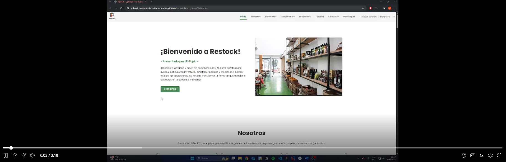

#### Backend (API) — Estado: ~70%

**Alcance entregado (Sprint 1)**

- Implementación de los endpoints core para soportar la lógica básica de la plataforma: autenticación, users/profiles, supplies, custom-supplies, recipes, batches, orders, business-categories y roles.
- Documentación mínima de endpoints (endpoints listos para pruebas con Postman/Swagger).
- Pruebas funcionales de endpoints principales (autenticación, listado/consulta de supplies, creación/consulta de orders y CRUD básico de recipes y custom supplies).

**Endpoints destacados implementados**

- **Autenticación**
  - `POST /api/v1/authentication/sign-up`
  - `POST /api/v1/authentication/sign-in`
- **Supplies (plataforma)**
  - `GET /api/v1/supplies`
  - `GET /api/v1/supplies/{supplyId}`
  - `GET /api/v1/supplies/categories`
- **Custom Supplies (usuario)**
  - `GET /api/v1/custom-supplies`
  - `POST /api/v1/custom-supplies`
  - `PUT /api/v1/custom-supplies/{id}`
  - `DELETE /api/v1/custom-supplies/{id}`
  - `GET /api/v1/custom-supplies/user/{userId}`
- **Recipes**
  - `GET /api/v1/recipes` / `GET /api/v1/recipes/{id}`
  - `POST /api/v1/recipes` / `PUT /api/v1/recipes/{id}` / `DELETE /api/v1/recipes/{id}`
  - `GET /api/v1/recipes/{id}/supplies` / `POST /api/v1/recipes/{id}/supplies`
  - `PUT /api/v1/recipes/{recipeId}/supplies/{supplyId}` / `DELETE /api/v1/recipes/{recipeId}/supplies/{supplyId}`
- **Orders & Batches**
  - `POST /api/v1/orders` / `GET /api/v1/orders` / `GET /api/v1/orders/{id}` / `DELETE /api/v1/orders/{id}`
  - `POST /api/v1/orders/{orderId}/batches` / `GET /api/v1/orders/{orderId}/batches`
  - `PUT /api/v1/orders/{id}/state`
  - Batches: `GET /api/v1/batches` / `GET /api/v1/batches/{id}` / `POST /api/v1/batches` / `PUT /api/v1/batches/{id}` / `DELETE /api/v1/batches/{id}` / `GET /api/v1/batches/user/{userId}`
- **Perfiles / Usuarios / Roles / Categorías**
  - `GET /api/v1/users` / `GET /api/v1/users/{userId}`
  - `PUT /api/v1/profiles/{userId}/personal` / `PUT /api/v1/profiles/{userId}/password` / `PUT /api/v1/profiles/{userId}/business` / `GET /api/v1/profiles/{userId}` / `DELETE /api/v1/profiles/{userId}`
  - `GET /api/v1/roles` / `GET /api/v1/business-categories`

**Qué se demuestra en el video**

- Ejecución de requests sobre los endpoints principales con Postman/Swagger.
- Flujo de autenticación (sign-up / sign-in) y consumo de un endpoint protegido.
- Creación y consulta de resources claves: supplies, custom-supplies, recipes, orders.
- Pruebas de cambio de estado en orders y creación de batches.

**Video del Backend (demostración / pruebas):** https://shorturl.at/CZzk9

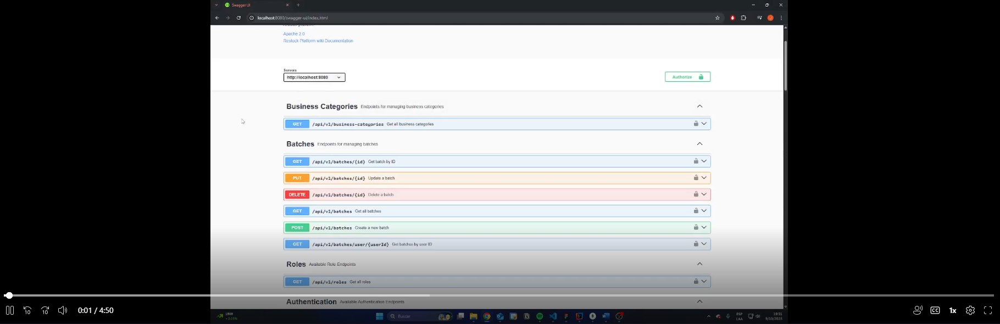

#### Aplicación Móvil (Administrador de Restaurantes — Android) — Pantallas integradas

**Alcance entregado (Sprint 1)**

- Desarrollo e integración de las **pantallas core** del flujo administrativo en Android: listas principales, búsquedas y vistas detalle.
- Conexión parcial con el backend para operaciones de lectura y algunas operaciones CRUD (dependiendo del endpoint).
- Validaciones visuales y estados básicos (loading, empty state, error).

**Pantallas incluidas (PRIMERA PARTE — ADMIN RESTAURANTES)**

1. **Supplies — Lista y tabla**

   - Ver lista de supplies (datos desde `GET /api/v1/supplies` y `GET /api/v1/custom-supplies/user/{userId}` según contexto).
   - Barra de búsqueda con filtros (por categoría: `GET /api/v1/supplies/categories`).
   - Estado vacío cuando no hay supplies.

2. **Modal / Interfaz CRUD de Supplies**

   - Modal para crear/editar supplies (consume `POST /api/v1/custom-supplies`, `PUT /api/v1/custom-supplies/{id}`, `DELETE /api/v1/custom-supplies/{id}`).
   - Alternativa: evaluación sobre si usar modal o pantalla separada según usabilidad.

3. **Recipes — Interfaz y CRUD**

   - Pantalla de listado `GET /api/v1/recipes`.
   - Detalle de receta `GET /api/v1/recipes/{id}` y listado de supplies de receta `GET /api/v1/recipes/{id}/supplies`.
   - Agregar supplies a receta `POST /api/v1/recipes/{id}/supplies`.
   - Operaciones de creación/edición/eliminación: `POST /api/v1/recipes`, `PUT /api/v1/recipes/{id}`, `DELETE /api/v1/recipes/{id}`.

4. **Sales — Primera parte (lista y búsqueda)**

   - Lista de sales disponibles (puede implementarse inicialmente con datos estáticos para mostrar UI).
   - Barra de búsqueda, filtros y mensaje “no hay elementos” cuando esté vacío.
   - Lista con botón de edición (navega a la segunda parte).

5. **Sales — Segunda parte (CRUD conectado)**
   - Interfaz y lógica para agregar/actualizar/eliminar una sale, conectada al backend cuando los endpoints estén listos.

**Mapeo rápido: pantallas → endpoints**

- Lista de Supplies (pantalla) → `GET /api/v1/supplies`, `GET /api/v1/custom-supplies/user/{userId}`
- Filtros por categoría → `GET /api/v1/supplies/categories`
- Crear/editar supply (modal) → `POST /api/v1/custom-supplies`, `PUT /api/v1/custom-supplies/{id}`, `DELETE /api/v1/custom-supplies/{id}`
- Recipes (lista, detalle, modificar) → endpoints bajo `/api/v1/recipes` (ver sección Recipes arriba)
- Orders / Batches (cuando se integre la gestión de compras) → endpoints bajo `/api/v1/orders` y `/api/v1/batches`

**Qué se demuestra en el video**

- Navegación por las pantallas core: lista de supplies, filtro/búsqueda, modal de creación/edición, listado y detalle de recipes.
- Conexión parcial con el backend: llamadas de lectura y ejemplos de POST/PUT donde se ha integrado.
- Comportamientos de validación y estados UI (loading / empty / success / error).

**Video de Aplicación Móvil:** https://shorturl.at/8adxX

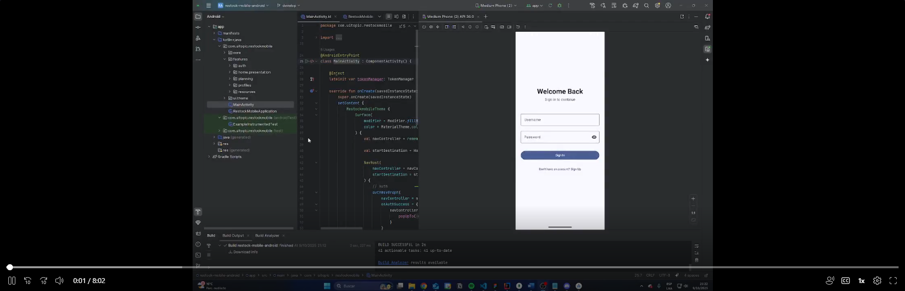

#### 4.2.1.6. Services Documentation Evidence for Sprint Review

Durante este sprint se avanzó significativamente en la `<strong>`documentación de los servicios web (REST API)`</strong>` del sistema `<em>`Restock `</em>`, cubriendo los módulos de `<strong>`Profiles `</strong>`, `<strong>`Recipes `</strong>`, `<strong>`Batches `</strong>` y `<strong>`Authentication `</strong>`.
La documentación se generó utilizando `<strong>`OpenAPI (Swagger)`</strong>` y fue validada mediante peticiones reales desde el entorno de desarrollo (`<em>`localhost `</em>` y Railway).
Se registraron los endpoints principales relacionados con la gestión de usuarios, perfiles empresariales, recetas, insumos y autenticación, cubriendo los métodos HTTP `<code>`GET `</code>`, `<code>`POST `</code>`, `<code>`PUT `</code>` y `<code>`DELETE `</code>`.

A continuación, se presenta la tabla resumen de los `<strong>`Endpoints documentados `</strong>`, incluyendo la acción implementada, verbo HTTP, parámetros o cuerpo de solicitud y ejemplos de uso.

<table>
  <thead>
    <tr style="background-color:#f2f2f2;">
      <th>Endpoint</th>
      <th>Acción</th>
      <th>Verbo HTTP</th>
      <th>Parámetros / Request Body</th>
      <th>Ejemplo</th>
    </tr>
  </thead>
  <tbody>
    <tr>
      <td>/api/v1/authentication/sign-up</td>
      <td>Registrar una cuenta</td>
      <td>POST</td>
      <td><pre>{
  "email": "string",
  "password": "string"
}</pre></td>
      <td><pre>{
  "email": "admin@restock.com",
  "password": "P@ssw0rd"
}</pre></td>
    </tr>
    <tr>
      <td>/api/v1/authentication/sign-in</td>
      <td>Iniciar sesión en la cuenta</td>
      <td>POST</td>
      <td><pre>{
  "email": "string",
  "password": "string"
}</pre></td>
      <td><pre>{
  "email": "admin@restock.com",
  "password": "P@ssw0rd"
}</pre></td>
    </tr>
    <tr>
      <td>/api/v1/profiles/{userId}/personal</td>
      <td>Actualizar información personal del usuario</td>
      <td>PUT</td>
      <td><pre>{
  "firstName": "string",
  "lastName": "string",
  "email": "string",
  "phone": "string",
  "address": "string",
  "country": "string",
  "avatar": "string"
}</pre></td>
      <td><pre>{
  "firstName": "Jahaziel",
  "lastName": "Guerra",
  "email": "admin@restock.com",
  "phone": "987654321",
  "address": "Av. Primavera 120",
  "country": "Perú",
  "avatar": "https://res.cloudinary.com/restock/avatar.png"
}</pre></td>
    </tr>
    <tr>
      <td>/api/v1/profiles/{userId}/password</td>
      <td>Cambiar la contraseña del usuario</td>
      <td>PUT</td>
      <td><pre>{
  "currentPassword": "string",
  "newPassword": "string"
}</pre></td>
      <td><pre>{
  "currentPassword": "P@ssw0rd",
  "newPassword": "NuevoP@ss2025"
}</pre></td>
    </tr>
    <tr>
      <td>/api/v1/profiles/{userId}/business</td>
      <td>Actualizar información del negocio</td>
      <td>PUT</td>
      <td><pre>{
  "businessName": "string",
  "businessAddress": "string",
  "description": "string",
  "businessCategoryIds": ["string"]
}</pre></td>
      <td><pre>{
  "businessName": "Restaurante San Miguel",
  "businessAddress": "Av. La Marina 2400",
  "description": "Comida criolla peruana",
  "businessCategoryIds": ["cat_01"]
}</pre></td>
    </tr>
    <tr>
      <td>/api/v1/recipes</td>
      <td>Crear una nueva receta</td>
      <td>POST</td>
      <td><pre>{
  "name": "string",
  "price": { "amount": "number", "currency": "string" }
}</pre></td>
      <td><pre>{
  "name": "Lomo Saltado",
  "price": { "amount": 28.90, "currency": "PEN" }
}</pre></td>
    </tr>
    <tr>
      <td>/api/v1/recipes/{id}</td>
      <td>Actualizar una receta existente</td>
      <td>PUT</td>
      <td><pre>{
  "name": "string",
  "price": { "amount": "number", "currency": "string" }
}</pre></td>
      <td><pre>{
  "name": "Ají de Gallina",
  "price": { "amount": 25.50, "currency": "PEN" }
}</pre></td>
    </tr>
    <tr>
      <td>/api/v1/recipes/{id}/supplies</td>
      <td>Agregar insumos a una receta</td>
      <td>POST</td>
      <td><pre>{
  "supplyId": "string",
  "quantity": "number"
}</pre></td>
      <td><pre>{
  "supplyId": "sup_beef",
  "quantity": 0.5
}</pre></td>
    </tr>
    <tr>
      <td>/api/v1/batches</td>
      <td>Crear un nuevo lote (batch)</td>
      <td>POST</td>
      <td><pre>{
  "supplyId": "string",
  "expirationDate": "string",
  "quantity": "number"
}</pre></td>
      <td><pre>{
  "supplyId": "sup_beef",
  "expirationDate": "2025-12-15",
  "quantity": 20
}</pre></td>
    </tr>
    <tr>
      <td>/api/v1/batches/{id}</td>
      <td>Actualizar un lote existente</td>
      <td>PUT</td>
      <td><pre>{
  "quantity": "number"
}</pre></td>
      <td><pre>{
  "quantity": 15
}</pre></td>
    </tr>
    <tr>
      <td>/api/v1/batches/{id}</td>
      <td>Eliminar un lote</td>
      <td>DELETE</td>
      <td><pre>N/A</pre></td>
      <td><pre>N/A</pre></td>
    </tr>
  </tbody>
</table>

Los endpoints fueron probados con datos de muestra y documentados con Swagger UI, disponible en el entorno de despliegue (`<em>`Railway `</em>`).
Repositorio de Web Services: `<a href="https://github.com/Jahazielgg/restock-backend" target="_blank">`https://github.com/Jahazielgg/restock-backend `</a>`
Últimos commits relacionados con documentación:

<ul>
  <li><code>58dcfa1</code> – Update OpenAPI definitions for Profiles and Recipes</li>
  <li><code>7b23a64</code> – Add Batches endpoints to Swagger spec</li>
  <li><code>c91bde4</code> – Improve schema examples for Authentication</li>
</ul>

#### 4.2.1.7. Software Deployment Evidence for Sprint Review

Durante este Sprint, se realizaron actividades de despliegue de la Landing Page utilizando GitHub Pages como plataforma de hosting. A continuación, se detallan los pasos ejecutados:

**1- Se accedió a la sección Settings del repositorio.**

Dentro de Pages, se seleccionó la rama (main o master) y la carpeta (root o /docs) desde la cual GitHub Pages debía publicar el sitio.
Se guardaron los cambios para activar la publicación automática.

2- Por default ya esta activado el https

3- En la seccion "All workflows" se puede ver que la app se esta desplegando.

4- Se obtuvo y verificó la URL pública proporcionada por GitHub Pages.

Link del landing page desplegado: https://aplicaciones-para-dispositivos-moviles.github.io/restock-landing-page/

A continuación, se detallan los pasos realizados para asegurar el funcionamiento correcto del servicio backend con acceso a base de datos y documentación mediante Swagger.

1. **Conexión del repositorio con Railway** : Se creó un nuevo proyecto en Railway y se conectó directamente el repositorio del backend desde GitHub.

   

2. **Selección de rama principal (`main`)**En la configuración del proyecto, se seleccionó la rama `main` como predeterminada para realizar el despliegue continuo.

   

3. **Adición de base de datos al proyecto**Desde la opción "Add Plugin" en Railway, se añadió un servicio de base de datos para el proyecto.

   

4. **Selección del tipo de base de dato** Se seleccionó el motor de base de datos **MongoDB**.

   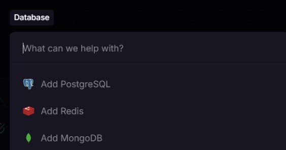

5. **Despliegue de imagen MongoDB** Railway desplegó automáticamente una instancia de base de datos con sus credenciales correspondientes.

   

6. **Obtención y configuración de credenciales**Se copiaron las credenciales de conexión (usuario, contraseña, host, puerto y nombre de base de datos) y se unificaron en una sola variable de entorno tipo `SPRING_DATASOURCE_URL`.

   

7. **Habilitación del link Swagger en la configuración**En el archivo `OpenApiConfiguration.java`, se habilitó el contexto de Swagger para permitir la visualización de los endpoints en producción.

   

8. **Creación de variables de entorno en Railway**Se añadieron manualmente todas las variables de entorno necesarias para que el backend funcione correctamente en Railway.

   

9. **Despliegue del proyecto**Railway ejecutó el despliegue del backend de forma automática al detectar la rama principal. Se monitoreó el log para validar la correcta inicialización del contenedor.

   

10. **Verificación con Swagger**
    Se accedió a la ruta `/swagger/index.html` del dominio generado por Railway, verificando el correcto funcionamiento de los endpoints expuestos por el sistema.

#### 4.2.1.8. Team Collaboration Insights during Sprint

#### Landing Page

Durante el desarrollo de la Landing Page se aplicaron prácticas de colaboración que facilitaron la entrega de un front público coherente y responsivo. A continuación se detallan las prácticas aplicadas:

- Las tareas se distribuyeron por secciones (Hero, Funcionalidades, Casos de uso, CTA, Contacto) y cada sección quedó asignada a un responsable para acelerar la implementación.
- Se realizaron **commits frecuentes y atómicos** con mensajes descriptivos para facilitar revisiones y trazabilidad.
- Las integraciones se realizaron mediante _pull requests_ hacia `develop` y se exigió una revisión mínima por otro miembro antes del merge.
- La comunicación se coordinó principalmente vía **Discord** y registros de decisiones quedaron documentados en el canal y en el README del submódulo.
- Se emplearon revisiones visuales en distintos tamaños de pantalla y se ordenaron los assets en `assets/landing/`

##### **Analíticos de colaboración — Landing Page**

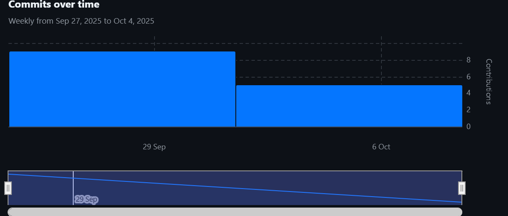

- Total de commits (Landing Page): **14**
- Total de autores contribuyentes: **5**
- Total de _pull requests_ relacionadas: **12**
- Observación: actividad concentrada en diseño inicial y ajustes de responsividad.

#### Backend (API)

El desarrollo del Backend siguió un flujo de trabajo enfocado en estabilidad y pruebas, garantizando que los endpoints core quedasen documentados y testeados:

- Se trabajó por dominios funcionales creando ramas temáticas como `feature/auth`, `feature/resources`, `feature/monitoring` para permitir despliegue paralelo y revisiones independientes.
- Se usó Swagger como fuente de verdad para la documentación de endpoints; las colecciones se actualizaron junto con los cambios en código.
- Commits atómicos y PRs con descripciones técnicas claras permitieron revisiones eficaces por pares (covering: controllers/services).
- Pruebas unitarias básicas y logs de integración se incluyeron en los PRs para facilitar el QA.
- Se definieron responsables por Bounded Context para planificar la migración a MongoDB y minimizar riesgos durante el cambio de persistencia.

##### **Analíticos de colaboración — Backend**

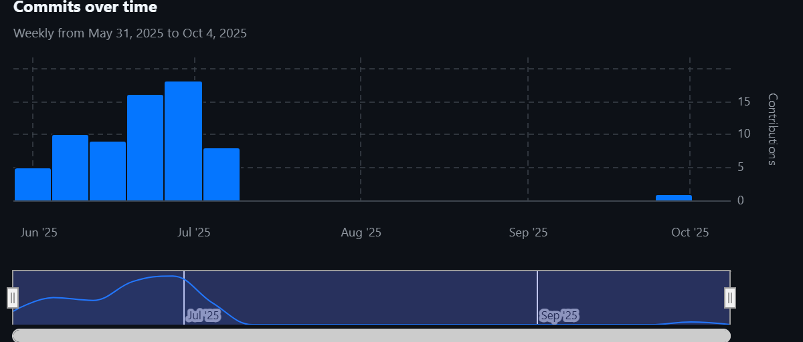

- Total de commits (Backend): **67**
- Total de autores contribuyentes: **5**
- Total de _pull requests_ relacionadas: **2**
- Endpoints documentados en Postman/Swagger: **28**
- Observación: respaldo sólido de pruebas y documentación para facilitar la futura migración de BD.

#### Aplicación Móvil (Android)

La colaboración en el módulo móvil se orientó a entregar pantallas core integradas con el backend y a mantener buena cohesión entre diseño y desarrollo:

- Ramas `feature/*` por pantalla (resource, recipes, sales) para aislar cambios y facilitar PRs pequeños y revisables.
- Se adoptó MVVM y convenciones de Kotlin en todo el módulo; los PRs incluyeron ejemplos de ViewModel y pruebas unitarias cuando fue posible.
- Coordinación continua con los responsables del backend para definir contratos (DTOs/JSON) y evitar retrabajo.
- Commits regulares con mensajes que enlazaban a issues/tickets de la planificación del sprint.
- Builds y APKs parciales compartidos en el canal de releases para revisión de UX y pruebas manuales.

##### **Analíticos de colaboración — Mobile**

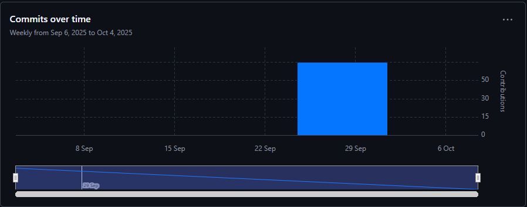

- Total de commits (Mobile): **x**
- Total de autores contribuyentes: **x**
- Total de _pull requests_ relacionadas: **x**
- Pantallas core implementadas: **5**

## 4.3. Validation Interviews

### 4.3.1. Diseño de Entrevistas

Para garantizar que la aplicación cumpla con las necesidades reales de los usuarios finales, se diseñó un proceso de entrevistas de validación centrado en dos segmentos objetivos clave: administradores de restaurantes y proveedores de insumos. Cada sesión de validación incluirá interacción con el Landing Page y la aplicación (desktop y mobile), siguiendo flujos de usuario específicos que cubren funcionalidades críticas del sistema.

Objetivo General

Validar la usabilidad, comprensión y utilidad de las funcionalidades del sistema a través de sesiones controladas de interacción, aplicando principios de evaluación heurística y recogiendo observaciones cualitativas.

<table border="1" cellpadding="8" cellspacing="0" width="100%" style="margin-bottom:18px; text-align: center">
  <thead>
    <tr>
      <th style="margin-bottom:18px; text-align: center">Segmento</th>
      <th style="margin-bottom:18px; text-align: center">Elementos a validar</th>
      <th style="margin-bottom:18px; text-align: center">Mobile User Flow</th>
      <th style="margin-bottom:18px; text-align: center">Actividades durante la sesión</th>
    </tr>
  </thead>
  <tbody style="margin-bottom:18px; text-align: center">
  <tr>
    <td>Segmento 1: Administradores de Restaurantes</td>
    <td>
      <ul>
        <li>Claridad del valor ofrecido en el landing page.</li>
        <li>Flujo de suscripción y pago.</li>
        <li>Registro y gestión de insumos.</li>
        <li>Gestión de lotes e inventario.</li>
        <li>Gestión de ventas y recetas.</li>
        <li>Visualización y selección de proveedores.</li>
        <li>Realización y seguimiento de pedidos.</li>
        <li>Panel de alertas y resúmenes.</li>
      </ul>
    </td>
    <td>
      <ul>
        <li>Suscripción y pago con Stripe.</li>
        <li>Registro y gestión de insumos.</li>
        <li>Resumen e indicadores.</li>
        <li>Visualización de proveedores y productos.</li>
        <li>Seguimiento de pedidos.</li>
        <li>Comentarios a proveedores.</li>
        <li>Registro y visualización de ventas.</li>
        <li>Creación y gestión de recetas.</li>
      </ul>
    </td>
    <td>
      <ul>
        <li>Navegar el Landing Page y explicar lo que entienden del producto.</li>
        <li>Simular una suscripción desde un plan.</li>
        <li>Usar el módulo de inventario: registrar, editar y filtrar insumos.</li>
        <li>Acceder al panel de resumen y describir lo que entienden.</li>
        <li>Navegar por proveedores, seleccionar uno y simular una orden.</li>
        <li>Realizar comentarios sobre proveedores.</li>
        <li>Registrar una venta.</li>
        <li>Crear una receta.</li>
      </ul>
    </td>
  </tr>

<table border="1" cellpadding="8" cellspacing="0" width="100%" style="margin-bottom:18px; text-align: center">
  <thead>
    <tr>
      <th style="text-align: center">Segmento</th>
      <th style="text-align: center">Elementos a validar</th>
      <th style="text-align: center">Mobile User Flow</th>
      <th style="text-align: center">Actividades durante la sesión</th>
    </tr>
  </thead>
  <tbody style="text-align: center">
    <tr>
      <td>Segmento 2: Proveedores de Restaurantes</td>
      <td>
        <ul>
          <li>Claridad del mensaje del landing page y valor percibido.</li>
          <li>Facilidad de registro como proveedor.</li>
          <li>Publicación de productos y gestión del catálogo.</li>
          <li>Recepción y actualización de pedidos.</li>
          <li>Comunicación con administradores de restaurantes.</li>
          <li>Visualización de historial de pedidos y métricas de venta.</li>
          <li>Comprensión de alertas y notificaciones del sistema.</li>
        </ul>
      </td>
      <td>
        <ul>
          <li>Registro como proveedor.</li>
          <li>Creación y edición de productos en catálogo.</li>
          <li>Recepción de pedidos y confirmación de entrega.</li>
          <li>Gestión de pedidos activos y completados.</li>
          <li>Mensajería con restaurantes asociados.</li>
          <li>Revisión de métricas de desempeño (ventas, entregas, reseñas).</li>
        </ul>
      </td>
      <td>
        <ul>
          <li>Explorar el landing page e indicar qué entienden del servicio ofrecido.</li>
          <li>Completar el flujo de registro como proveedor.</li>
          <li>Publicar un nuevo producto y modificar su precio o stock.</li>
          <li>Simular la recepción de un pedido y su actualización de estado.</li>
          <li>Acceder a la bandeja de mensajes y enviar una respuesta a un restaurante.</li>
          <li>Consultar las métricas de ventas y comentar su utilidad.</li>
          <li>Comentar percepciones generales sobre la facilidad de uso y claridad del sistema.</li>
        </ul>
      </td>
    </tr>
  </tbody>
</table>

### 4.3.2. Registro de Entrevistas

A continuación, se presenta el registro correspondiente a la entrevista realizada con un representante del segmento de **proveedores de restaurantes**, quien participó en la validación del **Landing Page** de la plataforma **Restock**. El objetivo fue evaluar la claridad del mensaje, la propuesta de valor y la percepción de utilidad del sistema desde la perspectiva de un proveedor.

#### **Entrevista 01 – Josue Ramírez**

**Datos del entrevistado:**

- **Nombre completo:** Josue Ramírez
- **Edad:** 26 años
- **Distrito:** Chorrillos
- **Segmento:** Proveedor de insumos gastronómicos
- **Fecha de entrevista:** 07 de octubre de 2025
- **Duración:** 8 minutos y 58 segundos
- **Registro audiovisual:** https://shorturl.at/kaGl4
- **Captura de entrevista:**  
  

#### **Resumen descriptivo de la entrevista:**

Durante la sesión, se mostró el **Landing Page de Restock** al entrevistado con el propósito de evaluar su comprensión del producto y su percepción sobre la utilidad para proveedores. Josue Ramírez indicó que el diseño del landing le pareció **claro y profesional**, destacando el mensaje principal que resalta la **conexión directa entre proveedores y administradores de restaurantes**.

Comentó que el apartado de **“gestión de catálogo”** le resultó relevante, ya que permitiría mantener actualizados sus productos sin necesidad de depender de terceros. Asimismo, valoró positivamente la posibilidad de **recibir pedidos en tiempo real y mantener comunicación directa con los restaurantes** mediante la plataforma.

Sin embargo, sugirió que sería útil incluir una sección más visible en el landing donde se expliquen los **beneficios específicos para proveedores**, como métricas de venta o testimonios de otros usuarios. También recomendó que el formulario de registro indique con mayor claridad los **requisitos de verificación** o documentos necesarios.

En general, el entrevistado expresó una **percepción positiva sobre la propuesta de Restock**, considerando que el sistema podría optimizar su relación con los clientes y mejorar la gestión de pedidos y stock de su negocio.

**Conclusión general:**  
La entrevista permitió validar que el mensaje principal del Landing Page es claro y atractivo para el segmento de proveedores. Sin embargo, se identificó la necesidad de reforzar la comunicación de los beneficios específicos para este grupo y mejorar la guía del proceso de registro.

#### **Entrevista 02 – Alicia Minaya**

**Datos del entrevistado:**

- **Nombre completo:** Alicia Soledad Minaya Maguiña
- **Edad:** 45 años
- **Distrito:** Chorrillos
- **Segmento:** Administradora de restaurantes
- **Fecha de entrevista:** 09 de octubre de 2025
- **Duración:** 8 minutos y 24 segundos
- **Registro audiovisual:** [https://shorturl.at/admnprov](https://upcedupe-my.sharepoint.com/:v:/g/personal/u202318274_upc_edu_pe/EV3jiWf-6jVMl50xDv9kLrcBLHD3N5U9uKAIh7VyXYtbdg?e=YSAKrh)
- **Captura de entrevista:**  
  

#### **Resumen descriptivo de la entrevista:**

Durante la sesión, se mostró el **Landing Page de Restock** al entrevistado con el propósito de evaluar su comprensión del producto y su percepción sobre la utilidad para proveedores. Alicia Minaya indicó que el diseño del landing le pareció **intuitivo y ordenado**, destacando el mensaje principal que resalta la **conexión directa entre administradores de restaurantes y su estado del inventario**. De esta manera afirma que la aplicación será de gran ayuda para tomar decisiones rápidas y acertadas en su negocio.

Comentó que las alertas en tiempo real le resultarán relevantes para realizar un rebastecimiento de inventario constante y evitar pérdidas por productos vencidos. Asimismo, valoró positivamente la posibilidad de **recibir reportes y métricas de consumo** mediante la aplicación.

Asimismo, no tuvo ninguna sugerencia para mejorar el landing page, ya que consideró que la información presentada es suficiente y clara.

En general , el entrevistado expresó una **percepción positiva sobre la propuesta de Restock**, considerando que el sistema podría optimizar su gestión de inventario y mejorar la eficiencia operativa de su restaurante.

**Conclusión general:**  
La entrevista permitió validar que el mensaje principal del Landing Page es claro y atractivo para el segmento de administradores de restaurantes. Asimismo, no se identificó la necesidad de reforzar la comunicación de los beneficios específicos para este grupo.

### 4.3.3. Evaluaciones según heurísticas

Esta sección contiene el proceso de evaluación de las sesiones de validación basado en heurísticas, considerando heurísticas de usabilidad, arquitectura de información e inclusive design de la experiencia propuesta.

<h1 style="text-align: center; margin-top: 40px; margin-bottom: -50px">UX Heuristics & Principles Evaluation</h1>
<h2 style="text-align: center; margin-top: 40px; margin-bottom: 0px;">Usability - Inclusive Design - Information Architecture</h2>
<container style="text-align: left;">
  
<strong>CARRERA:</strong> Ingeniería de Software

  
<strong>CURSO:</strong> CC238

  
<strong>SECCIÓN:</strong> 12617

  
<strong>PROFESORES:</strong> Todos

  
<strong>AUDITOR:</strong> Grupo 2

  
<strong>CLIENTES:</strong> Alicia Soledad Minaya Maguiña, Josue Ramírez, Alex Guardia, Lincoln Chauca Rubio, Amparo Soledad Robles Vásquez, José Santos Tapia Bustamente, Percy Polo Ferrera, Benjamín Pacheco Quesada

  
<strong style="color: rgba(43, 101, 237, 1)">Site o App a Evaluar:</strong>  Mobile App - Restock

  
<strong style="color:  rgba(43, 101, 237, 1)">TAREAS A EVALUAR:</strong>  
  
El alcance de esta evaluación incluye la revisión de la usabilidad de las siguientes tareas:
  

<ol>
    <li>Registro de un nuevo usuario</li>
    <li>Actualizar Stock de Insumos </li>
    <li>Recibir Notificaciones de Inventario</li>
    <li>Actualizar Recetas del Menú</li>
    <li>Consultar Información Detallada de Receta</li>
    <li>Actualizar Perfil de Usuario</li>
    <li>Visualizar Notificaciones Recientes (Dashboard)</li>
    <li>Registrar Registro de Ventas</li>
    <li>Visualizar Ventas</li>
    <li>Visualizar estado de Orden Específica</li>
    <li>Visualizar Órdenes Enviadas</li>
    <li>Visualizar Detalles de Orden Enviada</li>
    <li>Cambiar Idioma de Interfaz</li>
    <li>Visualizar los detalles de una venta realizada</li>
    <li>Eliminar una venta</li>
</ol>
  

  No están incluidas en esta versión de la evaluación las siguientes tareas:
  

  

<ol>
  <li>Actualizar Estado de Orden Enviada</li>
  <li>Actualizar Estado Manual de Orden Enviada</li>
  <li>Habilitar Navegación para Lector de Pantalla</li>
  <li>Actualizar Estado de Orden (Proveedor)</li>
  <li>Actualizar Estado de Entrega (Proveedor)</li>
  <li>Presentar Beneficios por Perfil</li>
</ol>
  
<strong style="color: rgba(43, 101, 237, 1)">ESCALA DE SEVERIDAD</strong> Los errores serán puntuados tomando en cuenta la siguiente escala de severidad

<table style="width:100%; margin-bottom:18px; text-align: center">
  <thead>
    <tr>
      <th style="text-align: center">Heurística / Principio</th>
      <th style="text-align: center">Descripción</th>
    </tr>
  </thead>
  <tbody style="text-align: left">
  <tr>
  <td>1</td>
  <td>Problema superficial: Puede ser fácilmente superador por el usuario y ocurre con muy poca frecuencia. No necesita ser arreglado a no ser que exista disponibilidad de tiempo.</td>
  </tr>
  <tr>
  <td>2</td>
  <td>Problema menor: Puede ocurrir un poco más frecuentemente o es un poco más difícil de superar para el usuario. Se le debería asignar una prioridad baja resolverlo de cara al siguiente reléase</td>
  </tr>
  <tr>
  <td>3</td>
  <td>Problema mayor: Ocurre frecuentemente o los usuarios no son capaces de resolverlos. Es importante que sean corregidos y se les debe asignar una prioridad alta.</td>
  </tr>
  <tr>
  <td>4</td>
  <td>Problema muy grave: Un error de gran impacto que impide al usuario continuar con el uso de la herramienta. Es imperativo que sea corregido antes del lanzamiento.</td>
  </tr>
  </tbody>
</table>
  
<strong style="color: rgba(43, 101, 237, 1)">TABLA DE RESUMEN</strong> 

<table style= "width:100%">
  <thead>
    <tr>
      <th style="text-align: center">#</th>
      <th style="text-align: center">Problema</th>
      <th style="text-align: center">Escala de severidad</th>
      <th style="text-align: center">Heurística/Principio volada(o)</th>
    </tr>
  </thead>
  <tbody style="text-align: left">
      <tr>
      <td>1</td>
      <td>Problema de Espaciado y Usabilidad en Carrusel</td>
      <td>3</td>
      <td>Usability: Libertad y control del usuario</td>
    </tr>
    <tr>
      <td>2</td>
      <td>Contraste de Color Subóptimo en Enlace de Registro y cambio de idioma</td>
      <td>3</td>
      <td>Usability: Libertad y control del usuario</td>
    </tr>
    <tr>
      <td>3</td>
      <td>Inconsistencia de Grosor de Líneas de Tabla</td>
      <td>1</td>
      <td>Estética y Diseño Minimalista.</td>
    </tr>
    <tr>
      <td>4</td>
      <td>Sombra de Botones Excesivamente Pesada</td>
      <td>1</td>
      <td>Estética y Diseño Minimalista.</td>
    </tr>
    <tr>
      <td>5</td>
      <td>Desalineación Vertical de Icono de Búsqueda</td>
      <td>1</td>
      <td>Estética y Diseño Minimalista.</td>
    </tr>
    <tr>
      <td>6</td>
      <td>Discrepancia de Jerarquía Tipográfica en Etiquetas</td>
      <td>1</td>
      <td>Estética y Diseño Minimalista.</td>
    </tr>
    <tr>
      <td>7</td>
      <td>Inconsistencia en el Tamaño de Títulos de Sección</td>
      <td>1</td>
      <td>Estética y Diseño Minimalista.</td>
    </tr>
    <tr>
      <td>8</td>
      <td>Baja Prominencia Visual del Botón "Reset"</td>
      <td>1</td>
      <td>Estética y Diseño Minimalista.</td>
    </tr>
    <tr>
      <td>9</td>
      <td>Inconsistencia en la Fuente del Número de Venta</td>
      <td>1</td>
      <td>Estética y Diseño Minimalista.</td>
    </tr>
    <tr>
      <td>10</td>
      <td>Falta de Consistencia Tipográfica en Estado</td>
      <td>1</td>
      <td>Estética y Diseño Minimalista.</td>
    </tr>
    <tr>
      <td>11</td>
      <td>Desequilibrio Visual en Icono de Descarga</td>
      <td>1</td>
      <td>Estética y Diseño Minimalista.</td>
    </tr>
    <tr>
      <td>12</td>
      <td>Bajo Contraste y Tamaño de Fuente de Paginación</td>
      <td>1</td>
      <td>Estética y Diseño Minimalista.</td>
    </tr>
    <tr>
      <td>13</td>
      <td>Inconsistencia Visual de Bordes y Margen</td>
      <td>1</td>
      <td>Estética y Diseño Minimalista.</td>
    </tr>
    <tr>
      <td>14</td>
      <td>Inconsistencia Cromática del Icono de Éxito</td>
      <td>1</td>
      <td>Estética y Diseño Minimalista.</td>
    </tr>
    <tr>
      <td>15</td>
      <td>Efecto Visual de Flotación en Icono de Eliminación</td>
      <td>1</td>
      <td>Estética y Diseño Minimalista.</td>
    </tr>

  </tbody>
</table>
  
<strong style="color: rgba(43, 101, 237, 1)">DESCRIPCIÓN DE PROBLEMAS</strong> 

<table>
<tbody>
<tr>
  <td style="width:60%">
    <strong>Problema #1:</strong> Problema de Espaciado y Usabilidad en Carrusel  
    <strong>Severidad:</strong> 3  
    <strong>Heuristica violada:</strong> Estética y Diseño Minimalista. 
    <strong>Problema:</strong> El borde que separa los dos elementos del carrusel de "Supplies" está demasiado cerca del texto interno ("Leche deslactosada"), haciendo que la columna de texto se sienta mínimamente apretada contra el límite de la tarjeta, pero es completamente legible. Asimismo falta un elemento visual para ingresar al detalle de cada supply 
    <strong>Recomendación:</strong> Aumentar el <em>padding</em> (margen interno) del texto dentro de la tarjeta del <em>supply</em> e Integrar un icono de flecha o botón <strong>"Ver Detalle"</strong> al <em>supply</em>.
  </td>
  <td style="width:40%">
    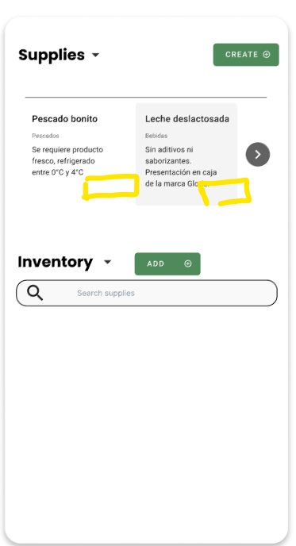
  </td>
</tr>
<tr>
  <td>
    <strong>Problema #2:</strong> Contraste de Color Subóptimo en Enlace de Registro y cambio de idioma  
    <strong>Severidad:</strong> 3  
    <strong>Heuristica violada:</strong> Consistencia y Estándares 
    <strong>Problema:</strong> El enlace de registro "Don't have an account? Sign Up" utiliza un color verde que, aunque es consistente con la paleta de la aplicación, tiene un contraste ligeramente menor que el texto negro principal, lo que disminuye mínimamente su escaneabilidad. Además no existe un icono de accesibilidad para cambios de idioma. 
    <strong>Recomendación:</strong> Incrementar el contraste del color del enlace "Sign Up" o Subrayarlo. Incluir un icono de accesibilidad o un selector de idioma visible.
  </td>
  <td>
    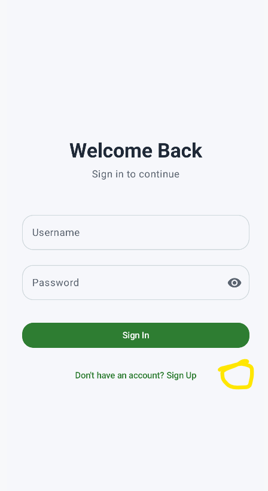
  </td>
</tr>
<tr>
  <td>
    <strong>Problema #3:</strong> Inconsistencia de Grosor de Líneas de Tabla  
    <strong>Severidad:</strong> 1  
    <strong>Heuristica violada:</strong> Estética y Diseño Minimalista. 
    <strong>Problema:</strong> La línea horizontal divisoria debajo de la cabecera de la tabla ("Ingredientes", "Estado", "Ver más") está ligeramente más gruesa que las líneas de separación entre las filas de datos, creando una mínima inconsistencia de estilo gráfico. 
    <strong>Recomendación:</strong> Unificar el grosor de todas las líneas divisorias de la tabla (cabecera y filas de datos) para garantizar la uniformidad visual del estilo gráfico.
  </td>
  <td>
    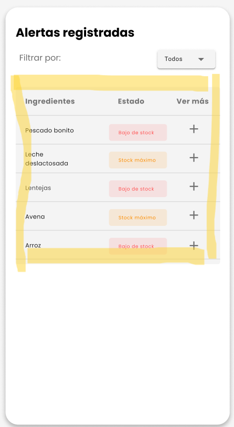
  </td>
</tr>
<tr>
  <td>
    <strong>Problema #4:</strong> Sombra de Botones Excesivamente Pesada  
    <strong>Severidad:</strong> 1  
    <strong>Heuristica violada:</strong> Estética y Diseño Minimalista 
    <strong>Problema:</strong> El botón "CANCEL" (rojo) y el botón "NEXT" (naranja) tienen una sombra de caja que es visualmente más pesada y distractora que el resto de los elementos del formulario, lo cual es una anomalía estética menor. 
    <strong>Recomendación:</strong> Reducir la opacidad y el radio de dispersión (<em>blur radius</em>) de la <strong>sombra de caja</strong> (<em>box-shadow</em>) de los botones "CANCEL" y "NEXT" para que el efecto sea más sutil.
  </td>
  <td>
    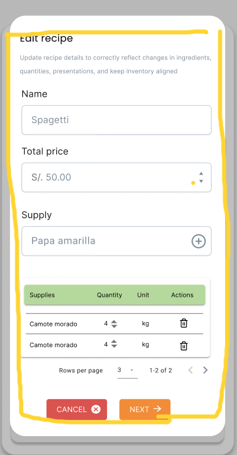
  </td>
</tr>
<tr>
  <td>
    <strong>Problema #5:</strong> Desalineación Vertical de Icono de Búsqueda  
    <strong>Severidad:</strong> 1  
    <strong>Heuristica violada:</strong> Estética y Diseño Minimalista 
    <strong>Problema:</strong> El icono de búsqueda (lupa) dentro del campo "Search recipes" no está perfectamente alineado verticalmente con el texto de placeholder ("Search recipes"), lo que representa una mínima imperfección visual que el usuario probablemente no notará. 
    <strong>Recomendación:</strong> Ajustar el <strong>alineamiento vertical</strong> (propiedad <code>align-items</code> o <em>padding</em> superior/inferior) del icono de la lupa para que quede centrado perfectamente con el texto de <em>placeholder</em>.
  </td>
  <td>
    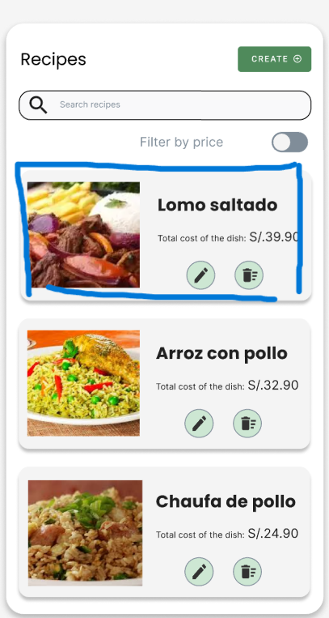
  </td>
</tr>
<tr>
  <td>
    <strong>Problema #6:</strong> Discrepancia de Jerarquía Tipográfica en Etiquetas  
    <strong>Severidad:</strong> 1  
    <strong>Heuristica violada:</strong> Estética y Diseño Minimalista 
    <strong>Problema:</strong> Hay una discrepancia sutil en el tamaño de la fuente utilizada para las etiquetas de los campos (Name, Last names, Email, etc.) en comparación con el texto del título principal (Edit your information), lo que rompe la jerarquía visual mínima. 
    <strong>Recomendación:</strong> Establecer una <strong>escala tipográfica estandarizada</strong> para las etiquetas de formulario que sea consistente y mantenga una jerarquía clara.
  </td>
  <td>
    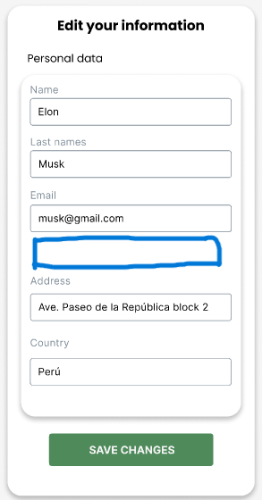
  </td>
</tr>
<tr>
  <td>
    <strong>Problema #7:</strong> Inconsistencia en el Tamaño de Títulos de Sección  
    <strong>Severidad:</strong> 1  
    <strong>Heuristica violada:</strong> Estética y Diseño Minimalista. 
    <strong>Problema:</strong> La tipografía utilizada para el título "Latest alerts" es notablemente más grande que la utilizada para los títulos de las secciones inferiores ("Account", "Frequent clients"), creando una inconsistencia visual en la jerarquía de títulos. 
    <strong>Recomendación:</strong> Estandarizar el tamaño de fuente y estilo (<code>h2</code> o <code>h3</code>) para todos los títulos de sección del dashboard ("Account", "Frequent clients", "Latest alerts").
  </td>
  <td>
    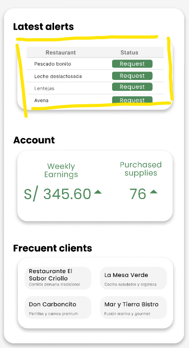
  </td>
</tr>
<tr>
  <td>
    <strong>Problema #8:</strong>  Baja Prominencia Visual del Botón "Reset"  
    <strong>Severidad:</strong> 1  
    <strong>Heuristica violada:</strong> Estética y Diseño Minimalista 
    <strong>Problema:</strong> El botón "Reset" ubicado en la parte inferior carece de un color de fondo distintivo (es transparente/blanco), lo que lo hace visualmente menos prominente que los botones "Cancel" y "Add sale", creando una leve anomalía en la jerarquía de llamadas a la acción. 
    <strong>Recomendación:</strong> Asignar al botón <strong>"Reset"</strong> un color de fondo claro (por ejemplo, blanco con un borde gris suave) para distinguirlo del <em>background</em> sin competir con los botones primarios (verde/rojo).
  </td>
  <td>
    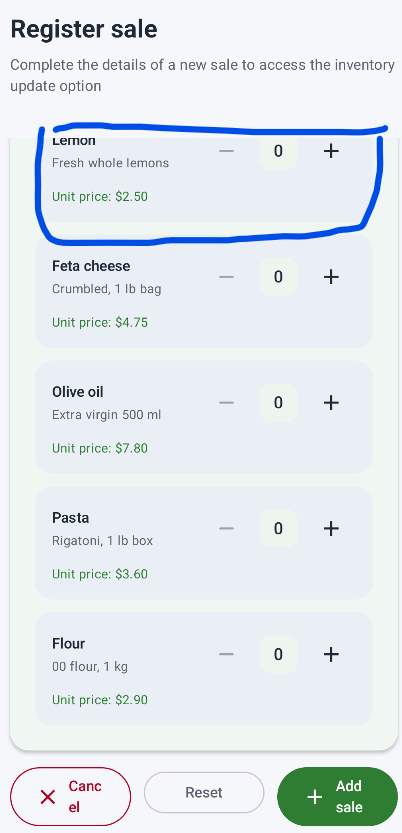
  </td>
</tr>
<tr>
  <td>
    <strong>Problema #9:</strong> Inconsistencia en la Fuente del Número de Venta  
    <strong>Severidad:</strong> 1  
    <strong>Heuristica violada:</strong> Estética y Diseño Minimalista 
    <strong>Problema:</strong> La fuente utilizada para el subtítulo "Sale number" es ligeramente más pequeña que la fuente utilizada para otros títulos de sección importantes (como "Total cost" o "Dishes (2)"), lo que resulta en una mínima inconsistencia en la jerarquía de la información dentro del resumen de venta. 
    <strong>Recomendación:</strong> Asegurar que la fuente, tamaño y peso del subtítulo <strong>"Sale number"</strong> sea consistente con el estilo de otras etiquetas informativas similares en la interfaz.
  </td>
  <td>
    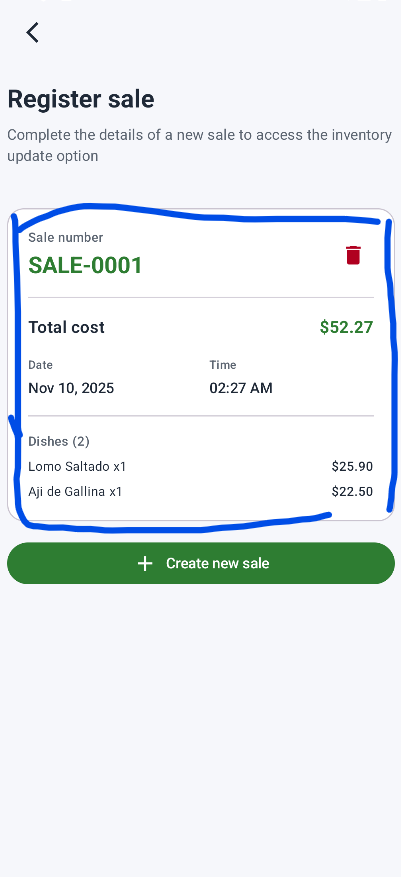
  </td>
</tr>
<tr>
  <td>
    <strong>Problema #10:</strong> Falta de Consistencia Tipográfica en Estado  
    <strong>Severidad:</strong> 1  
    <strong>Heuristica violada:</strong> Consistencia y Estándares 
    <strong>Problema:</strong> El botón "Aprobado" dentro de la sección "Situation" no utiliza una convención de mayúsculas estándar (debería ser "Aprobado" o "APROBADO"), presentando una falta de consistencia tipográfica menor con el resto de los textos de la interfaz. 
    <strong>Recomendación:</strong> Establecer una convención única de estilo para los botones de estado (ej: <strong>"Aprobado"</strong> con mayúscula inicial) y Aplicarla de manera uniforme.
  </td>
  <td>
    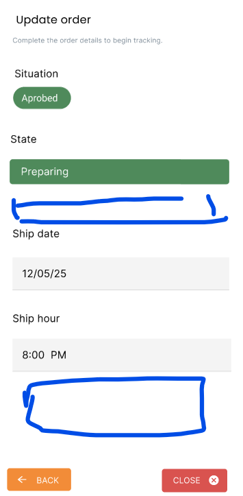
  </td>
</tr>
<tr>
  <td>
    <strong>Problema #11:</strong> Desequilibrio Visual en Icono de Descarga  
    <strong>Severidad:</strong> 1  
    <strong>Heuristica violada:</strong> Estética y Diseño Minimalista 
    <strong>Problema:</strong> El icono utilizado para el botón "DESCAGAR HISTORIAL" (que parece ser un icono de descarga o archivo) es muy pequeño en relación con el tamaño del texto y el botón, lo que resulta en un desequilibrio visual menor y una estética subóptima. 
    <strong>Recomendación:</strong> Incrementar ligeramente el tamaño del icono de descarga dentro del botón <strong>"DESCAGAR HISTORIAL"</strong> para equilibrarlo visualmente con el texto adyacente.
  </td>
  <td>
    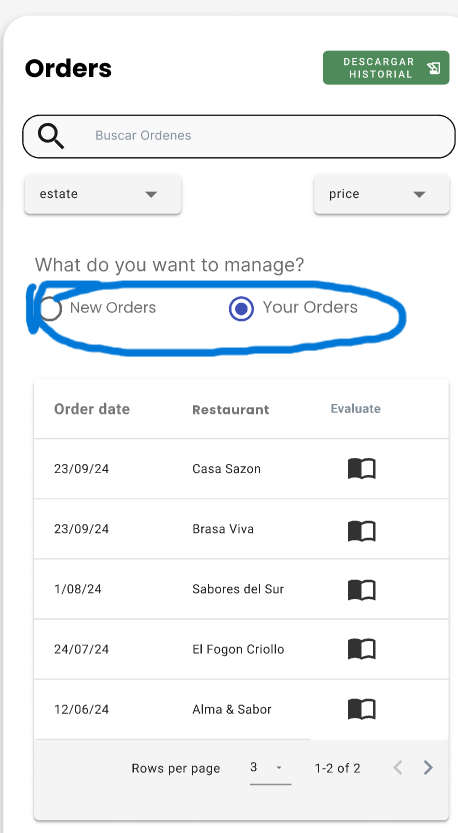
  </td>
</tr>
<tr>
  <td>
    <strong>Problema #12:</strong> Bajo Contraste y Tamaño de Fuente de Paginación  
    <strong>Severidad:</strong> 1  
    <strong>Heuristica violada:</strong> Estética y Diseño Minimalista 
    <strong>Problema:</strong> El tamaño de la fuente para el texto de paginación (Rows per page, page 1 of 2) es ligeramente menor o tiene menos contraste que el resto de los textos informativos, haciendo que la sección de paginación sea mínimamente más difícil de leer. 
    <strong>Recomendación:</strong> Aumentar mínimamente el tamaño de la fuente o el contraste del color del texto de paginación (<code>Rows per page</code>, etc.) para mejorar la lectura rápida.
  </td>
  <td>
    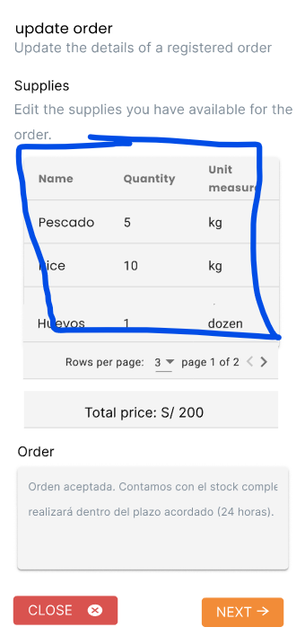
  </td>
</tr>
<tr>
  <td>
    <strong>Problema #13:</strong> Inconsistencia Visual de Bordes y Margen  
    <strong>Severidad:</strong> 1  
    <strong>Heuristica violada:</strong> Estética y Diseño Minimalista 
    <strong>Problema:</strong> La baja definición de los bordes de los campos de entrada, sumada a la mínima inconsistencia en la separación vertical antes del botón de acción, debilita levemente la estructura visual. 
    <strong>Recomendación:</strong> Aumentar el <em>padding</em> inferior del último campo de entrada y Definir un <strong>borde sólido</strong> o de <strong>alto contraste</strong> para todos los <em>inputs</em>.
  </td>
  <td>
    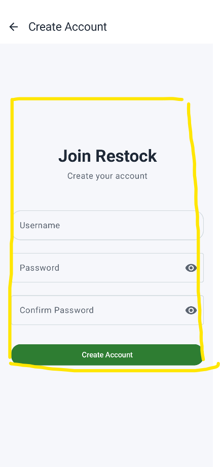
  </td>
</tr>
<tr>
  <td>
    <strong>Problema #14:</strong> Inconsistencia Cromática del Icono de Éxito  
    <strong>Severidad:</strong> 1  
    <strong>Heuristica violada:</strong> Consistencia y Estándares 
    <strong>Problema:</strong> El icono de verificación (check mark) verde claro en la parte superior tiene un color de fondo (verde muy pálido/grisáceo) que no corresponde exactamente al color verde vibrante utilizado en el botón "Close" o en la paleta principal, creando una mínima falta de consistencia cromática. 
    <strong>Recomendación:</strong> Ajustar el color de fondo del icono de verificación para que coincida exactamente con el <strong>verde primario</strong> utilizado en el botón "Close" y en la paleta principal.
  </td>
  <td>
    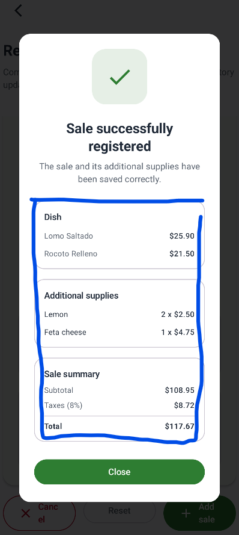
  </td>
</tr>
<tr>
  <td>
    <strong>Problema #15:</strong> Efecto Visual de Flotación en Icono de Eliminación  
    <strong>Severidad:</strong> 1  
    <strong>Heuristica violada:</strong> Estética y Diseño Minimalista 
    <strong>Problema:</strong> El icono de la papelera (Delete) en la parte superior derecha tiene un sombreado o borde que lo hace parecer ligeramente desconectado o flotante respecto a los elementos adyacentes, lo cual es una anomalía estética menor en el uso de los efectos visuales. 
    <strong>Recomendación:</strong> Eliminar o suavizar el <strong>sombreado o borde</strong> del icono de la papelera (Delete) para integrarlo mejor visualmente con el diseño limpio del contenedor de la venta.
  </td>
  <td>
    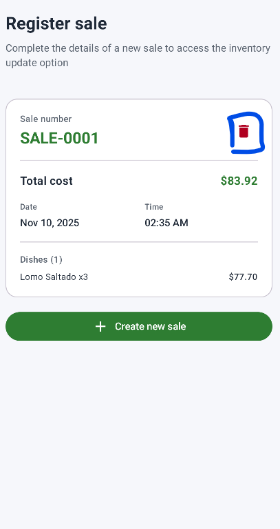
  </td>
</tr>
</tbody>
</table>
</container>
