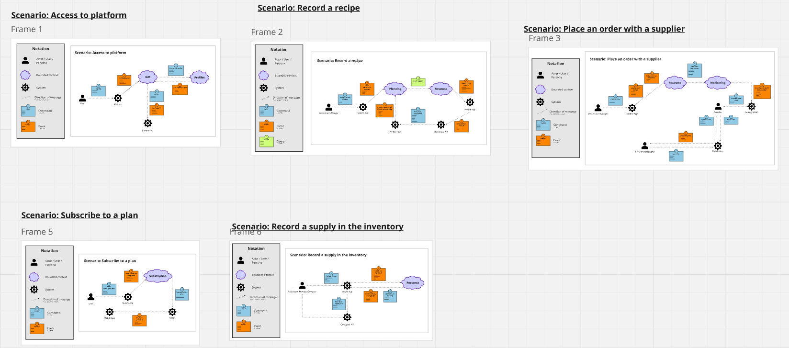

# Anexos

## Anexo A Diseño de Figma

- Link de Figma de diseño de la plataforma: https://shorturl.at/emvsb

## Anexo B Trello de Sprint Backlogs

- Link de Trello de Sprint Backlogs: https://short-link.me/11-Cx

## Anexo C Diagrama de clases

- Link de diagrama de clases: https://shorturl.at/iyMv9

## Anexo D Event Storming

- Link del Event Storming: https://shorturl.at/e40OQ

## Anexo E Stratic Domain Driven Design

- Link del Stratic Domain Driven Design: https://tinyurl.com/mt3j4knz

## Anexo F Organizacion de GitHub

- Link de la Organización GitHub: https://shorturl.at/tUbc6

## Anexo G Video Exposición TB2

- Link del video: https://drive.google.com/drive/folders/1CMhJrgJB3TtqhftKHbo4hGs5nWxApzfd?usp=sharing

