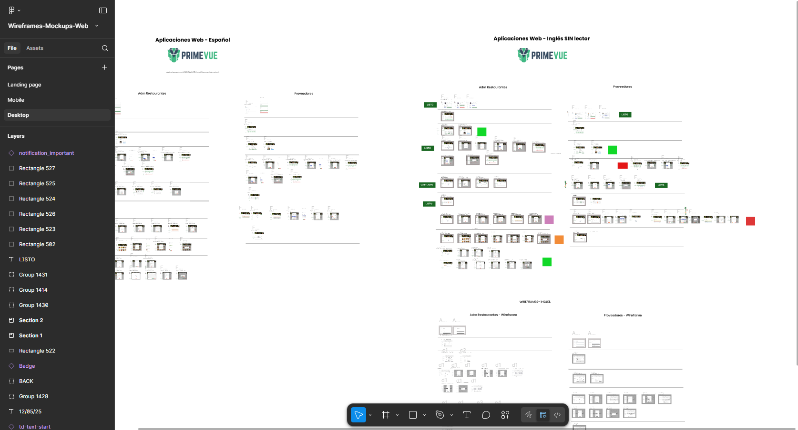
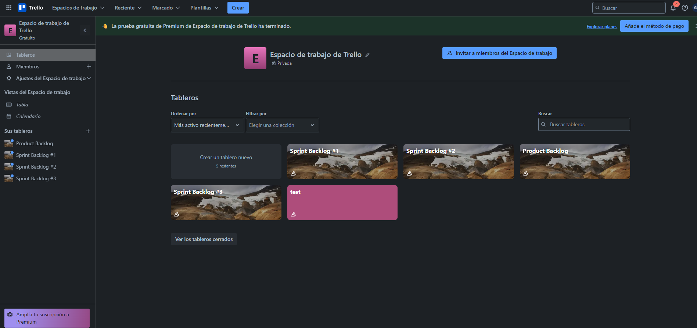
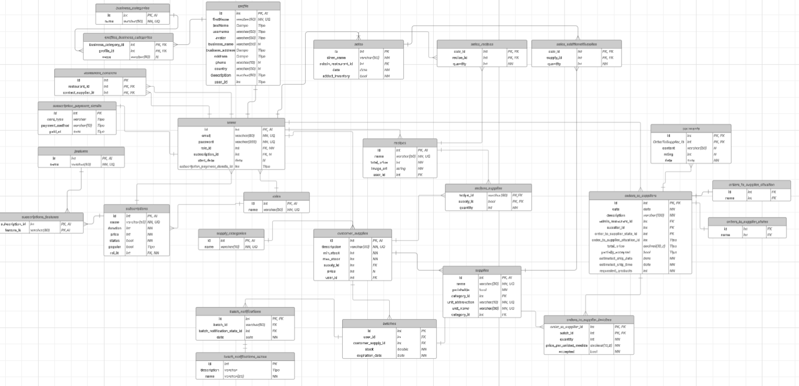
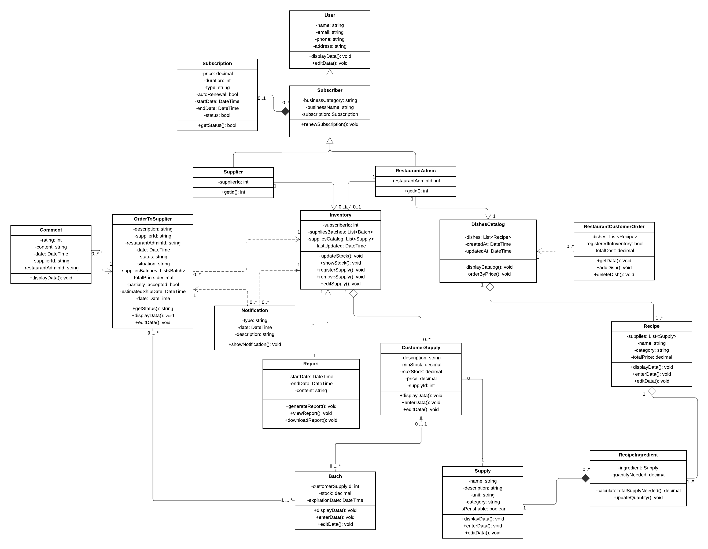
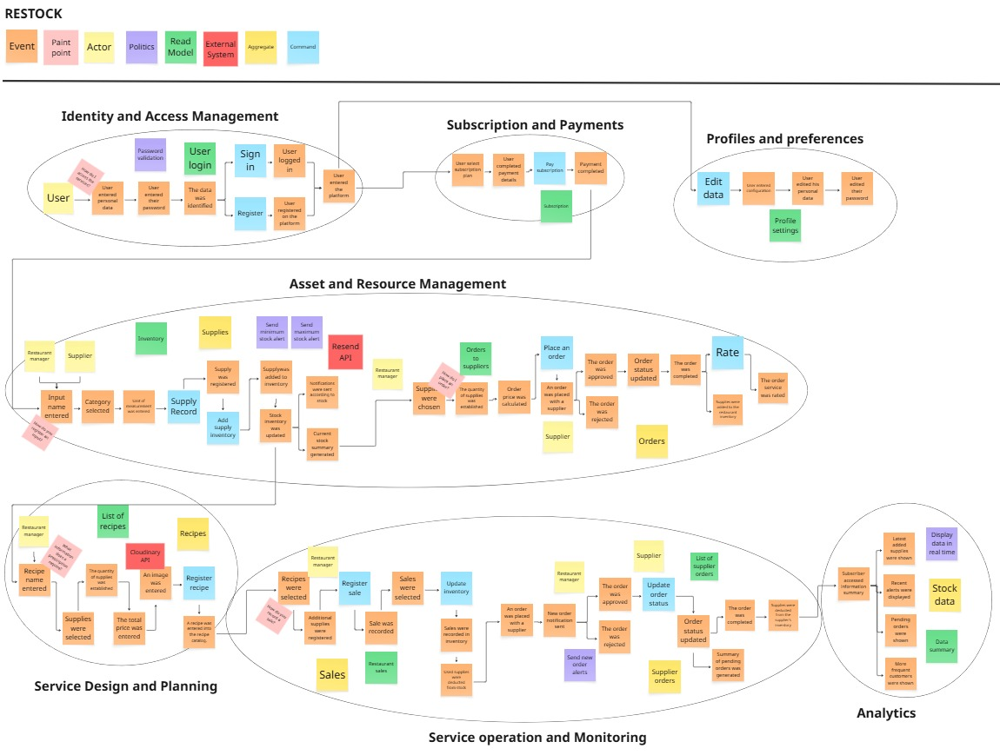
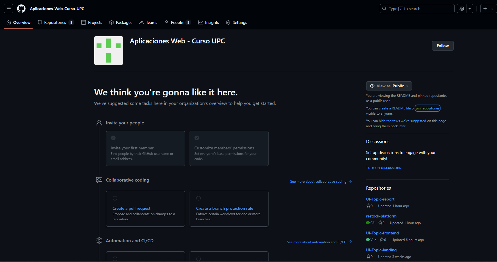
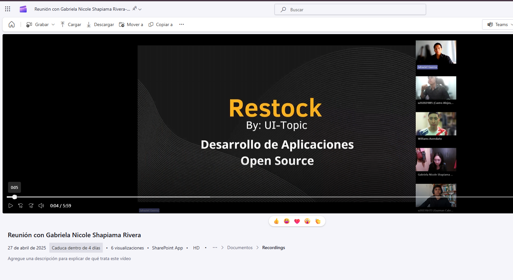
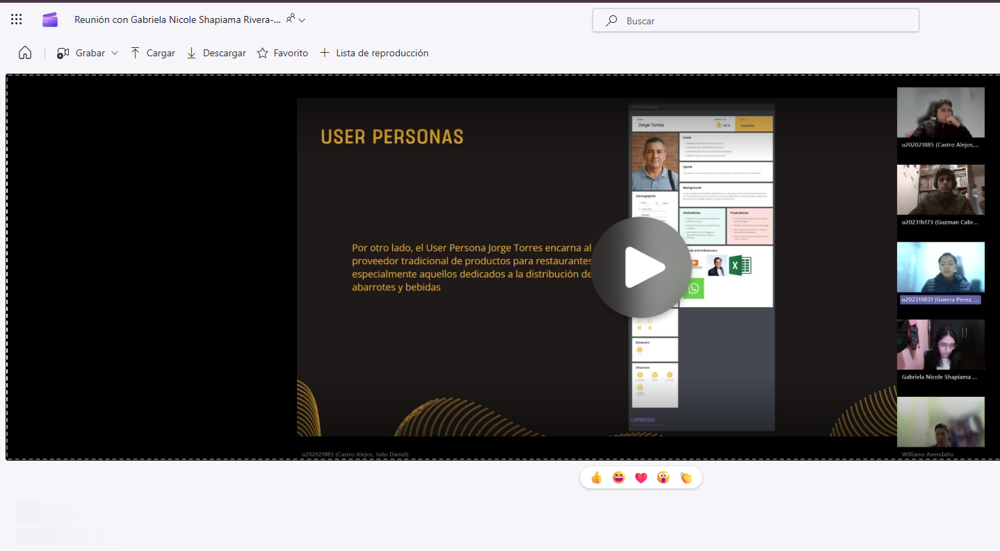

# Anexos

## Anexo A. XXXX

- Link de Figma de diseño de la plataforma: [poner short link]

## Anexo B. XXXX

- Link de Trello de Sprint Backlogs:

## Anexo C. Diagrama de Base de Datos

- Link de Diagrama de Base de Datos:

## Anexo D. Diagrama de Clases

- Link de Diagrama de Clases:

## Anexo E. Event Storming

- Link de Event Storming:

## Anexo F. Organización GitHub

- Link de la Organización GitHub:

## Anexo G. Organización de actividades

- Link de Documento de organización de actividades:

## Anexo H. Exposición TB1

- Link de Video exposición TB1:

