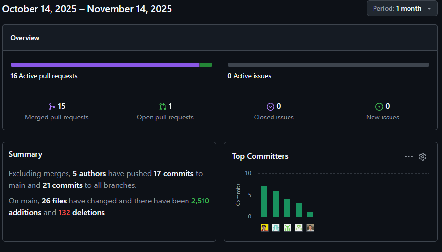

---

# **Informe de Trabajo Final**

---

_Universidad Peruana de Ciencias Aplicadas_

_Ingeniería de Software_

_2025-20_

**Curso:** _Aplicaciones para Dispositivos Móviles - 12617_

_Sección 12617_

_Prof. Jorge Luis, Mayta Guillermo_

## Nombre del Startup

**Nombre:** _UI-Topic_

## Nombre del Producto

**Producto:** _Restock_

## Relación de Integrantes

|  Código  |       Apellidos y Nombres       |
| :--------: | :------------------------------: |
| u202021885 |       Castro Alejos, Julio       |
| u202313354 |    Elescano Leon, Piero Hugo    |
| u202319831 |   Guerra Perez, José Jahaziel   |
| u202318274 |    Julca Minaya, Sergio Gino    |
| u202319448 | Shapiama Rivera, Gabriela Nicole |

---

**Mes y Año**
_Agosto 2025_

## Registro de Versiones

| *Versión* | *Fecha* | *Autor*         | *Descripción de modificación*                                                                                                                                        |
| :----------: | :-------: | :---------------- | :----------------------------------------------------------------------------------------------------------------------------------------------------------------------- |
|     1.1     | 14/09/25 | Julio Castro      | Se adjuntó segmentos objetivos, diseño de entrevistas, registro de entrevistas, User Stories, Software Architecture y Bounded Context Resource.                        |
|     1.2     | 15/09/25 | Piero Elescano    | Se elaboró Lean UX Hypothesis Statements, User personas, Empathy Mapping, User Stories, Bounded Context IAM y Profiles, y Bounded Context Canvases.                    |
|     1.3     | 15/09/25 | Jahaziel Guerra   | Se redactó analisis competitivo, User Stories, Ubiquitous Language, Product Backlog, Software Architecture Deployment Diagrams y Bounded Context Planning y Monitoring. |
|     1.4     | 16/09/25 | Sergio Julca      | Se redactó Lean UX Problem Statements y Assumptions, User Stories, Context Mappin, As-Is y To-Be Scenario Mapping y Bounded Context Analytics y Subscriptions.          |
|     1.5     | 16/09/25 | Gabriela Shapiama | Se adjuntó Lean UX Canvas, competidores, registro de entrevistas, Impact Mapping, User Stories, Event Storming y Bounded Context Resource.                             |
|     2.1     | 07/10/25 | Julio Castro      | Source Code Management, Registro de Entrevistas (co-responsable con Sergio), Project Report Collaboration Insights, Wireframes Mobile.                                   |
|     2.2     | 07/10/25 | Piero Elescano    | SEO Tags and Meta Tags, Sprint Backlog 1, Software Deployment Configuration, Avance bibliografía y anexos.                                                              |
|     2.3     | 07/10/25 | Jahaziel Guerra   | Se redactó analisis competitivo, User Stories, Ubiquitous Language, Product Backlog y Software Architecture Deployment Diagrams.                                        |
|     2.4     | 07/10/25 | Sergio Julca      | Mobile Applications Wireflow Diagrams, Diseño de Entrevistas, Registro de Entrevistas yDevelopment Evidence for Sprint Review.                                          |
|     2.5     | 07/10/25 | Gabriela Shapiama | Registro de Versiones del Informe, Labelling Systems, Software Development Environment Configuration, Sprint Planning 1, Software Deployment Evidence.                   |

# Project Report Collaboration Insights

Para el desarrollo del **Project Report**, el equipo utiliza un repositorio dentro de la organización en GitHub. A continuación, se presenta la evidencia de colaboración correspondiente al **TB1**, en coherencia con el **Registro de Versiones del Informe**.

**Repositorio del informe del proyecto:**[https://shorturl.at/NKl2Z](https://shorturl.at/NKl2Z)

- **Total de commits:** 50
- **Autores contribuyentes:**
  - Julio Castro Alejos (`JulioXC4`)
  - José Jahaziel Guerra Pérez (`jahazielgg`)
  - Sergio Gino Julca Minaya (`sergioJM05`)
  - Gabriela Nicole Shapiama Rivera (`GabrielaShapiama28`)
  - Piero Hugo Elescano León (`PieroHugo`)
- La actividad se distribuyó en ramas temáticas por secciones del informe, asegurando revisiones cruzadas mediante *pull requests*.

## TB1 - Informe inicial - (Semana 4)

Durante esta fase, el equipo elaboró el **informe inicial**, que incluyó los siguientes aspectos:

- **Carátula** con información institucional y de la startup.
- **Registro de Versiones del Informe**, documentando los cambios realizados.
- **Contenido preliminar** con tabla de contenidos, *Student Outcomes* y Capítulo I (*Presentación*).
- **Capítulo II** con los primeros avances en *Requirements Development and Software Solution Design*.
- **Conclusiones preliminares, bibliografía y anexos*.

- **Julio Castro Alejos (`JulioXC4`)**: 14 commits
- **José Jahaziel Guerra Pérez (`jahazielgg`)**: 20 commits
- **Sergio Gino Julca Minaya (`sergioJM05`)**: 15 commits
- **Gabriela Nicole Shapiama Rivera (`GabrielaShapiama28`)**: 28 commits
- **Piero Hugo Elescano León (`PieroHugo`)**: 22 commits
- **Total de commits en TB1:** 50

La colaboración fue activa y equitativa, con aportes sustanciales de todos los integrantes en la redacción y organización del informe.

## TP1 – Desarrollo del Informe, Landing Page, Backend y Aplicación Móvil (Sprint 1) - (Semana 7)

Durante este sprint, el equipo concentró sus esfuerzos en la construcción y documentación integral de los tres productos principales del proyecto: la **Landing Page**, el **Backend** y la **Aplicación Móvil**. De forma paralela, se avanzó en la elaboración del **Project Report**, incorporando nuevas secciones y consolidando el contenido técnico correspondiente al Sprint 1.

La **Landing Page** se desarrolló utilizando **HTML5**, **CSS3** y **JavaScript**, aplicando principios de diseño responsivo y buenas prácticas de accesibilidad. Se realizaron mejoras visuales y estructurales respecto al entregable anterior, optimizando la carga y adaptabilidad para distintos dispositivos.

En el **Backend**, implementado con **Java Spring Boot** y migrado a **MongoDB**, se construyeron y validaron los principales *endpoints* de los *bounded contexts* del sistema: gestión de recursos, recetas, órdenes y perfiles. También se revisó la documentación de servicios y la configuración del entorno de desarrollo para reflejar el nuevo modelo de persistencia.

Por su parte, la **Aplicación Móvil** se desarrolló en **Android Studio** con **Kotlin**, priorizando las pantallas core para el administrador de restaurantes, como *Supplies*, *Recipes* y *Sales*. Estas interfaces se diseñaron siguiendo los lineamientos del prototipo UX/UI y se integraron con el backend para garantizar la funcionalidad de los flujos principales.

En cuanto al **Project Report**, se incluyeron los siguientes apartados requeridos para esta entrega:

- **Capítulo III: Solution UI/UX Design**, donde se documentaron las guías de estilo, arquitectura de información y diseño de las aplicaciones web y móvil.
- **Capítulo IV: Product Implementation & Validation**, que detalla la configuración del entorno de desarrollo, gestión de código, planificación del sprint y evidencias de implementación.
- Además, se añadieron las secciones de **Conclusiones**, **Bibliografía** y **Anexos**, completando la estructura formal del informe para el *Stage Review*.

## TB2 – Actualización del Informe, Despliegue y Consolidación del Producto (Sprint 2) - (Semana 12)

Durante este sprint, el equipo concentró sus esfuerzos en la **actualización integral del informe**, la **finalización del desarrollo de los módulos restantes**, y el **despliegue completo de los componentes principales del sistema**. Asimismo, se elaboraron las primeras versiones de los videos requeridos y se inició el desarrollo de la versión multiplataforma en **Flutter**.  
 
En el **Backend**, implementado con **Java Spring Boot** y **MongoDB**, se completó el despliegue al **100% en un sitio público**, garantizando la disponibilidad del servicio y la correcta exposición de la documentación mediante **Swagger**. Se realizaron pruebas de validación de endpoints y ajustes en controladores, servicios y repositorios, mejorando la estructura y el manejo de respuestas HTTP.  

Por su parte, la **Aplicación Móvil Android**, desarrollada en **Kotlin**, alcanzó su versión funcional completa, integrando todos los flujos principales definidos: *Supplies*, *Recipes*, *Sales* y *Profile*. Se realizaron pruebas de integración con el backend y validaciones de persistencia de datos en tiempo real.  

De manera paralela, el equipo inició el **avance del desarrollo en Flutter**, con el objetivo de crear una versión multiplataforma del sistema. Se configuró el entorno de desarrollo, se implementaron las pantallas iniciales y se estableció la conexión base con el backend. Este avance representa el primer paso hacia una futura expansión del producto para el segmento de provedores de restaurantes en diferentes sistemas operativos móviles.  

En cuanto al **Project Report**, se actualizaron todas las secciones requeridas para esta entrega, cumpliendo con los criterios del *Sprint Review (Semana 12)*:

- **Registro de Versiones del Informe** actualizado, reflejando las mejoras y correcciones aplicadas.  
- **Project Report Collaboration Insights** con evidencias de commits, *pull requests* y contribuciones en equipo.  
- **Student Outcomes** revisado y ampliado según los aprendizajes y competencias logradas durante el desarrollo.  
- **Capítulo IV: Product Implementation & Validation**, con el detalle técnico de despliegue, pruebas y validaciones del sistema.  
- **Conclusiones, Bibliografía y Anexos**, completando la estructura del informe final.  

Asimismo, se elaboraron las **primeras versiones de los videos** solicitados para esta entrega:  
- **Video de Validación de la Aplicación**, mostrando las funcionalidades core en ejecución.  
- **Video About-the-Product**, presentando la propuesta, su impacto y los principales beneficios.  
- **Video About-the-Team**, destacando la participación y roles de los integrantes del grupo.  

- **Julio Castro Alejos (`JulioXC4`)**: 14 commits
- **José Jahaziel Guerra Pérez (`jahazielgg`)**: 20 commits
- **Sergio Gino Julca Minaya (`sergioJM05`)**: 15 commits
- **Gabriela Nicole Shapiama Rivera (`GabrielaShapiama28`)**: 28 commits
- **Piero Hugo Elescano León (`PieroHugo`)**: 22 commits
- **Total de commits en TB1:** 50

El trabajo del equipo se mantuvo alineado con la planificación del *Sprint 2*, documentando tanto el progreso técnico como el proceso de validación. La colaboración se organizó mediante *commits* individuales y revisiones de *pull requests*, reforzada por reuniones de coordinación y seguimiento en Discord.

## Herramientas colaborativas utilizadas

- **GitHub Projects & Branching:** Para control de versiones y revisiones.
- **Trello:** Organización de tareas por entregas y responsables.
- **Discord y Google Meet:** Reuniones periódicas para coordinación.
- **Figma:** Bocetos y prototipos de interfaz.
- **PlantUML & Draw.io:** Diagramas de arquitectura y flujo.
- **Structurizr DSL:** Modelado de arquitectura de software (C4 Model).
- **Swagger/OpenAPI:** Documentación interactiva de endpoints REST.
- **Markdown Preview & VSCode:** Redacción técnica en equipo del informe.

# Tabla de contenidos

## [Capítulo I: Presentación](02-chap1-introduction.md)

* [1.1 Startup Profile](02-chap1-introduction.md#11-startup-profile)

  * [1.1.1 Descripción de la Startup](02-chap1-introduction.md#111-descripción-de-la-startup)
  * [1.1.2 Perfiles de integrantes del equipo](02-chap1-introduction.md#112-perfiles-de-integrantes-del-equipo)
* [1.2 Solution Profile](02-chap1-introduction.md#12-solution-profile)

  * [1.2.1 Antecedentes y problemática](02-chap1-introduction.md#121-antecedentes-y-problemática)
  * [1.2.2 Lean UX Process](02-chap1-introduction.md#122-lean-ux-process)

    * [1.2.2.1 Lean UX Problem Statements](02-chap1-introduction.md#1221-lean-ux-problem-statements)
    * [1.2.2.2 Lean UX Assumptions](02-chap1-introduction.md#1222-lean-ux-assumptions)
    * [1.2.2.3 Lean UX Hypothesis Statements](02-chap1-introduction.md#1223-lean-ux-hypothesis-statements)
    * [1.2.2.4 Lean UX Canvas](02-chap1-introduction.md#1224-lean-ux-canvas)
* [1.3 Segmentos objetivo](02-chap1-introduction.md#13-segmentos-objetivo)

## [Capítulo II: Requirements Development and Software Solution Design](cap2-requirements-elicitation-and-analysis.md)

* [2.1 Competidores](03-chap2-requirements-elicitation-and-analysis.md#21-competidores)

  * [2.1.1 Análisis competitivo](03-chap2-requirements-elicitation-and-analysis.md#211-análisis-competitivo)
  * [2.1.2 Estrategias y tácticas frente a competidores](03-chap2-requirements-elicitation-and-analysis.md#212-estrategias-y-tácticas-frente-a-competidores)
* [2.2 Entrevistas](03-chap2-requirements-elicitation-and-analysis.md#22-entrevistas)

  * [2.2.1 Diseño de entrevistas](03-chap2-requirements-elicitation-and-analysis.md#221-diseño-de-entrevistas)
  * [2.2.2 Registro de entrevistas](03-chap2-requirements-elicitation-and-analysis.md#222-registro-de-entrevistas)
  * [2.2.3 Análisis de entrevistas](03-chap2-requirements-elicitation-and-analysis.md#223-análisis-de-entrevistas)
* [2.3 Needfinding](03-chap2-requirements-elicitation-and-analysis.md#23-needfinding)

  * [2.3.1 User Personas](03-chap2-requirements-elicitation-and-analysis.md#231-user-personas)
  * [2.3.2 User Task Matrix](03-chap2-requirements-elicitation-and-analysis.md#232-user-task-matrix)
  * [2.3.3 User Journey Mapping](03-chap2-requirements-elicitation-and-analysis.md#233-user-journey-mapping)
  * [2.3.4 Empathy Mapping](03-chap2-requirements-elicitation-and-analysis.md#234-empathy-mapping)
  * [2.3.5 Ubiquitous Language](03-chap2-requirements-elicitation-and-analysis.md#235-ubiquitous-language)
* [2.4 Requirements Specification](03-chap2-requirements-elicitation-and-analysis.md#24-requirements-specification)

  * [2.4.1 User Stories](03-chap2-requirements-elicitation-and-analysis.md#241-user-stories)
  * [2.4.2 Impact Mapping](03-chap2-requirements-elicitation-and-analysis.md#242-impact-mapping)
  * [2.4.3 Product Backlog](03-chap2-requirements-elicitation-and-analysis.md#243-product-backlog)
* [2.5 Strategic-Level Domain-Driven Design](03-chap2-requirements-elicitation-and-analysis.md#25-strategic-level-domain-driven-design)

  * [2.5.1 EventStorming](03-chap2-requirements-elicitation-and-analysis.md#251-eventstorming)

    * [2.5.1.1 Candidate Context Discovery](03-chap2-requirements-elicitation-and-analysis.md#2511-candidate-context-discovery)
    * [2.5.1.2 Domain Message Flows Modeling](03-chap2-requirements-elicitation-and-analysis.md#2512-domain-message-flows-modeling)
    * [2.5.1.3 Bounded Context Canvases](03-chap2-requirements-elicitation-and-analysis.md#2513-bounded-context-canvases)
  * [2.5.2 Context Mapping](03-chap2-requirements-elicitation-and-analysis.md#252-context-mapping)
  * [2.5.3 Software Architecture](03-chap2-requirements-elicitation-and-analysis.md#253-software-architecture)

    * [2.5.3.1 Software Architecture Context Level Diagrams](03-chap2-requirements-elicitation-and-analysis.md#2531-software-architecture-context-level-diagrams)
    * [2.5.3.2 Software Architecture Container Level Diagrams](03-chap2-requirements-elicitation-and-analysis.md#2532-software-architecture-container-level-diagrams)
    * [2.5.3.3 Software Architecture Deployment Diagrams](03-chap2-requirements-elicitation-and-analysis.md#2533-software-architecture-deployment-diagrams)
* [2.6 Tactical-Level Domain-Driven Design](03-chap2-requirements-elicitation-and-analysis.md#26-tactical-level-domain-driven-design)

  * [2.6.1. Bounded Context: `<Resource>`](03-chap2-requirements-elicitation-and-analysis.md#261-bounded-context)

    * [2.6.1.1. Domain Layer](03-chap2-requirements-elicitation-and-analysis.md#2611-domain-layer)
    * [2.6.1.2. Interface Layer](03-chap2-requirements-elicitation-and-analysis.md#2612-interface-layer)
    * [2.6.1.3. Application Layer](03-chap2-requirements-elicitation-and-analysis.md#2613-application-layer)
    * [2.6.1.4. Infrastructure Layer](03-chap2-requirements-elicitation-and-analysis.md#2614-infrastructure-layer)
    * [2.6.1.5. Bounded Context Software Architecture Component Level Diagrams](03-chap2-requirements-elicitation-and-analysis.md#2615-bounded-context-software-architecture-component-level-diagrams)
    * [2.6.1.6. Bounded Context Software Architecture Code Level Diagrams](03-chap2-requirements-elicitation-and-analysis.md#2616-bounded-context-software-architecture-code-level-diagrams)
    * [2.6.1.6.1. Bounded Context Domain Layer Class Diagrams](03-chap2-requirements-elicitation-and-analysis.md#26161-bounded-context-domain-layer-class-diagrams)
    * [2.6.1.6.2. Bounded Context Database Design Diagram](03-chap2-requirements-elicitation-and-analysis.md#26162-bounded-context-database-design-diagram)
  * [2.6.2. Bounded Context: `<Subscriptions>`](03-chap2-requirements-elicitation-and-analysis.md#262-bounded-context)

    * [2.6.2.1. Domain Layer](03-chap2-requirements-elicitation-and-analysis.md#2621-domain-layer)
    * [2.6.2.2. Interface Layer](03-chap2-requirements-elicitation-and-analysis.md#2622-interface-layer)
    * [2.6.2.3. Application Layer](03-chap2-requirements-elicitation-and-analysis.md#2623-application-layer)
    * [2.6.2.4. Infrastructure Layer](03-chap2-requirements-elicitation-and-analysis.md#2624-infrastructure-layer)
    * [2.6.2.5. Bounded Context Software Architecture Component Level Diagrams](03-chap2-requirements-elicitation-and-analysis.md#2625-bounded-context-software-architecture-component-level-diagrams)
    * [2.6.2.6. Bounded Context Software Architecture Code Level Diagrams](03-chap2-requirements-elicitation-and-analysis.md#2626-bounded-context-software-architecture-code-level-diagrams)
    * [2.6.2.6.1. Bounded Context Domain Layer Class Diagrams](03-chap2-requirements-elicitation-and-analysis.md#26261-bounded-context-domain-layer-class-diagrams)
  * [2.6.3. Bounded Context: `<Analytics>`](03-chap2-requirements-elicitation-and-analysis.md#263-bounded-context)

    * [2.6.3.1. Domain Layer](03-chap2-requirements-elicitation-and-analysis.md#2631-domain-layer)
    * [2.6.3.2. Interface Layer](03-chap2-requirements-elicitation-and-analysis.md#2632-interface-layer)
    * [2.6.3.3. Application Layer](03-chap2-requirements-elicitation-and-analysis.md#2633-application-layer)
    * [2.6.3.4. Infrastructure Layer](03-chap2-requirements-elicitation-and-analysis.md#2634-infrastructure-layer)
    * [2.6.3.5. Bounded Context Software Architecture Component Level Diagrams](03-chap2-requirements-elicitation-and-analysis.md#2635-bounded-context-software-architecture-component-level-diagrams)
    * [2.6.3.6. Bounded Context Software Architecture Code Level Diagrams](03-chap2-requirements-elicitation-and-analysis.md#2636-bounded-context-software-architecture-code-level-diagrams)
    * [2.6.3.6.1. Bounded Context Domain Layer Class Diagrams](03-chap2-requirements-elicitation-and-analysis.md#26361-bounded-context-domain-layer-class-diagrams)
  * [2.6.4. Bounded Context: `<Identity and Guess Managements>`](03-chap2-requirements-elicitation-and-analysis.md#264-bounded-context)

    * [2.6.4.1. Domain Layer](03-chap2-requirements-elicitation-and-analysis.md#2641-domain-layer)
    * [2.6.4.2. Interface Layer](03-chap2-requirements-elicitation-and-analysis.md#2642-interface-layer)
    * [2.6.4.3. Application Layer](03-chap2-requirements-elicitation-and-analysis.md#2643-application-layer)
    * [2.6.4.4. Infrastructure Layer](03-chap2-requirements-elicitation-and-analysis.md#2644-infrastructure-layer)
    * [2.6.4.5. Bounded Context Software Architecture Component Level Diagrams](03-chap2-requirements-elicitation-and-analysis.md#2645-bounded-context-software-architecture-component-level-diagrams)
    * [2.6.4.6. Bounded Context Software Architecture Code Level Diagrams](03-chap2-requirements-elicitation-and-analysis.md#2646-bounded-context-software-architecture-code-level-diagrams)
    * [2.6.4.6.1. Bounded Context Domain Layer Class Diagrams](03-chap2-requirements-elicitation-and-analysis.md#26461-bounded-context-domain-layer-class-diagrams)
  * [2.6.5. Bounded Context: `<Monitoring>`](03-chap2-requirements-elicitation-and-analysis.md#265-bounded-context)

    * [2.6.5.1. Domain Layer](03-chap2-requirements-elicitation-and-analysis.md#2651-domain-layer)
    * [2.6.5.2. Interface Layer](03-chap2-requirements-elicitation-and-analysis.md#2652-interface-layer)
    * [2.6.5.3. Application Layer](03-chap2-requirements-elicitation-and-analysis.md#2653-application-layer)
    * [2.6.5.4. Infrastructure Layer](03-chap2-requirements-elicitation-and-analysis.md#2654-infrastructure-layer)
    * [2.6.5.5. Bounded Context Software Architecture Component Level Diagrams](03-chap2-requirements-elicitation-and-analysis.md#2655-bounded-context-software-architecture-component-level-diagrams)
    * [2.6.5.6. Bounded Context Software Architecture Code Level Diagrams](03-chap2-requirements-elicitation-and-analysis.md#2656-bounded-context-software-architecture-code-level-diagrams)
    * [2.6.5.6.1. Bounded Context Domain Layer Class Diagrams](03-chap2-requirements-elicitation-and-analysis.md#26561-bounded-context-domain-layer-class-diagrams)
  * [2.6.6. Bounded Context: `<Profiles>`](03-chap2-requirements-elicitation-and-analysis.md#266-bounded-context)

    * [2.6.6.1. Domain Layer](03-chap2-requirements-elicitation-and-analysis.md#2661-domain-layer)
    * [2.6.6.2. Interface Layer](03-chap2-requirements-elicitation-and-analysis.md#2662-interface-layer)
    * [2.6.6.3. Application Layer](03-chap2-requirements-elicitation-and-analysis.md#2663-application-layer)
    * [2.6.6.4. Infrastructure Layer](03-chap2-requirements-elicitation-and-analysis.md#2664-infrastructure-layer)
    * [2.6.6.5. Bounded Context Software Architecture Component Level Diagrams](03-chap2-requirements-elicitation-and-analysis.md#2665-bounded-context-software-architecture-component-level-diagrams)
    * [2.6.6.6. Bounded Context Software Architecture Code Level Diagrams](03-chap2-requirements-elicitation-and-analysis.md#2666-bounded-context-software-architecture-code-level-diagrams)
    * [2.6.6.6.1. Bounded Context Domain Layer Class Diagrams](03-chap2-requirements-elicitation-and-analysis.md#26661-bounded-context-domain-layer-class-diagrams)
  * [2.6.7. Bounded Context: `<Planning>`](03-chap2-requirements-elicitation-and-analysis.md#267-bounded-context)

    * [2.6.7.1 Domain Layer](03-chap2-requirements-elicitation-and-analysis.md#2671-domain-layer)
    * [2.6.7.2 Interface Layer](03-chap2-requirements-elicitation-and-analysis.md#2672-interface-layer)
    * [2.6.7.3 Application Layer](03-chap2-requirements-elicitation-and-analysis.md#2673-application-layer)
    * [2.6.7.4 Infrastructure Layer](03-chap2-requirements-elicitation-and-analysis.md#2674-infrastructure-layer)
    * [2.6.7.5 Bounded Context Software Architecture Component Level Diagrams](03-chap2-requirements-elicitation-and-analysis.md#2675-bounded-context-software-architecture-component-level-diagrams)
    * [2.6.7.6 Bounded Context Software Architecture Code Level Diagrams](03-chap2-requirements-elicitation-and-analysis.md#2676-bounded-context-software-architecture-code-level-diagrams)
    * [2.6.7.6.1 Bounded Context Domain Layer Class Diagrams](03-chap2-requirements-elicitation-and-analysis.md#26761-bounded-context-domain-layer-class-diagrams)

## [Capítulo III: Solution UI/UX Design](04-chap3-solution-ui-ux-design.md)

* [3.1 Product Design](04-chap3-solution-ui-ux-design.md#31-product-design)

  * [3.1.1 Style Guidelines](04-chap3-solution-ui-ux-design.md#311-style-guidelines)

    * [3.1.1.1 General Style Guidelines](04-chap3-solution-ui-ux-design.md#3111-general-style-guidelines)
  * [3.1.2 Information Architecture](04-chap3-solution-ui-ux-design.md#312-information-architecture)

    * [3.1.2.1 Organization Systems](04-chap3-solution-ui-ux-design.md#3121-organization-systems)
    * [3.1.2.2 Labelling Systems](04-chap3-solution-ui-ux-design.md#3122-labelling-systems)
    * [3.1.2.3 SEO Tags and Meta Tags](04-chap3-solution-ui-ux-design.md#3123-seo-tags-and-meta-tags)
    * [3.1.2.4 Searching Systems](04-chap3-solution-ui-ux-design.md#3124-searching-systems)
    * [3.1.2.5 Navigation Systems](04-chap3-solution-ui-ux-design.md#3125-navigation-systems)
  * [3.1.3 Landing Page UI Design](04-chap3-solution-ui-ux-design.md#313-landing-page-ui-design)

    * [3.1.3.1 Landing Page Wireframe](04-chap3-solution-ui-ux-design.md#3131-landing-page-wireframe)
    * [3.1.3.2 Landing Page Mock-up](04-chap3-solution-ui-ux-design.md#3132-landing-page-mock-up)
  * [3.1.4 Mobile Applications UX/UI Design](04-chap3-solution-ui-ux-design.md#314-mobile-applications-uxui-design)

    * [3.1.4.1 Mobile Applications Wireframes](04-chap3-solution-ui-ux-design.md#3141-mobile-applications-wireframes)
    * [3.1.4.2 Mobile Applications Wireflow Diagrams](04-chap3-solution-ui-ux-design.md#3142-mobile-applications-wireflow-diagrams)
    * [3.1.4.3 Mobile Applications Mock-ups](04-chap3-solution-ui-ux-design.md#3143-mobile-applications-mock-ups)
    * [3.1.4.4 Mobile Applications User Flow Diagrams](04-chap3-solution-ui-ux-design.md#3144-mobile-applications-user-flow-diagrams)
    * [3.1.4.5 Mobile Applications Prototyping](04-chap3-solution-ui-ux-design.md#3145-mobile-applications-prototyping)

## [Capítulo IV: Product Implementation & Validation](05-chap4-product-implementation-&-validation.md)

* [4.1 Software Configuration Management](05-chap4-product-implementation-&-validation.md#41-software-configuration-management)

  * [4.1.1 Software Development Environment Configuration](05-chap4-product-implementation-&-validation.md#411-software-development-environment-configuration)
  * [4.1.2 Source Code Management](05-chap4-product-implementation-&-validation.md#412-source-code-management)
  * [4.1.3 Source Code Style Guide & Conventions](05-chap4-product-implementation-&-validation.md#413-source-code-style-guide--conventions)
  * [4.1.4 Software Deployment Configuration](05-chap4-product-implementation-&-validation.md#414-software-deployment-configuration)
* [4.2 Landing Page & Mobile Application Implementation](05-chap4-product-implementation-&-validation.md#42-landing-page--mobile-application-implementation)

  * [4.2.1 Sprint n](05-chap4-product-implementation-&-validation.md#421-sprint-n)

    * [4.2.1.1 Sprint Planning n](05-chap4-product-implementation-&-validation.md#4211-sprint-planning-n)
    * [4.2.1.2 Sprint Backlog n](05-chap4-product-implementation-&-validation.md#4212-sprint-backlog-n)
    * [4.2.1.3 Development Evidence for Sprint Review](05-chap4-product-implementation-&-validation.md#4213-development-evidence-for-sprint-review)
    * [4.2.1.4 Testing Suite Evidence for Sprint Review](05-chap4-product-implementation-&-validation.md#4214-testing-suite-evidence-for-sprint-review)
    * [4.2.1.5 Execution Evidence for Sprint Review](05-chap4-product-implementation-&-validation.md#4215-execution-evidence-for-sprint-review)
    * [4.2.1.6 Services Documentation Evidence for Sprint Review](05-chap4-product-implementation-&-validation.md#4216-services-documentation-evidence-for-sprint-review)
    * [4.2.1.7 Software Deployment Evidence for Sprint Review](05-chap4-product-implementation-&-validation.md#4217-software-deployment-evidence-for-sprint-review)
    * [4.2.1.8 Team Collaboration Insights during Sprint](05-chap4-product-implementation-&-validation.md#4218-team-collaboration-insights-during-sprint)
* [4.3 Validation Interviews](05-chap4-product-implementation-&-validation.md#43-validation-interviews)

  * [4.3.1 Diseño de Entrevistas](05-chap4-product-implementation-&-validation.md#431-diseño-de-entrevistas)
  * [4.3.2 Registro de Entrevistas](05-chap4-product-implementation-&-validation.md#432-registro-de-entrevistas)
  * [4.3.3 Evaluaciones según heurísticas](05-chap4-product-implementation-&-validation.md#433-evaluaciones-según-heurísticas)

## [Conclusiones](06-conclusions.md)

* [Conclusiones y recomendaciones](06-conclusions.md#conclusiones-y-recomendaciones)
* [Video App Validation](06-conclusions.md#video-app-validation)
* [Video About the product](06-conclusions.md#video-about-the-product)
* [Video About the team](06-conclusions.md#video-about-the-team)

## [Bibliografía](07-bibliography.md)

Cross, D. (2024). Innovating Restaurant Inventory Management Application Enhancing Quality And Efficiency Through Extreme Pro-gramming Approach. _JURNAL EKONOMI, 13_(2), 696-698. [https://ejournal.seaninstitute.or.id/index.php/Ekonomi/article/view/4476](https://ejournal.seaninstitute.or.id/index.php/Ekonomi/article/view/4476)

Valenzuela, A., Vera, B., Castillo, L., Valenzuela, J. (2024). Industry 4.0 in Logistics Management in Latin America: A Bibliometric Review. _Journal of Indutrial Ingineering and Management, 18_(1), 115-129. [https://www.jiem.org/index.php/jiem/article/view/8147/1117](https://www.jiem.org/index.php/jiem/article/view/8147/1117)

Lévesque, J., Godin, L., Perreault, V., & Mikhaylin, S. (2024). Identifying the factors affecting the implementation of food waste reduction strategies in independent restaurants: Moving towards eco-efficiency. _Journal of Cleaner Production, 440_, 140765. https://doi.org/10.1016/j.jclepro.2024.140765

Tan, Y., Hai, F., Popp, J., & Oláh, J. (2022). Minimizing Waste in the Food Supply Chain: Role of Information System, Supply Chain Strategy, and Network Design. _Sustainability, 14_(18), 11515. https://doi.org/10.3390/su141811515

## [Anexos](anexos.md)

# ABET – EAC - Student Outcome 7

**Criterio:** La capacidad de adquirir y aplicar nuevos conocimientos según sea necesario, utilizando estrategias de aprendizaje apropiadas.

En el siguiente cuadro se describe las acciones realizadas y enunciados de conclusiones por parte del grupo, que permiten sustentar el haber alcanzado el logro del ABET – EAC - Student Outcome 7.

| Criterio específico | Acciones realizadas | Conclusiones |
| -------------------- | ------------------ | ------------- |
| **Actualiza conceptos y conocimientos necesarios para su desarrollo profesional y en especial para su proyecto en soluciones de software.** | **Julio Castro Alejos**  TB1: Segmentos objetivo: Aplicó métodos de identificación de usuarios y mercados relevantes. Diseño y registro de entrevistas : Aprendió técnicas de levantamiento de información cualitativa. User Journey Mapping : Desarrolló habilidades de representación de experiencias de usuario para mejorar el diseño de soluciones.  **TP1:**  Project Report Collaboration Insights: Fortaleció habilidades de documentación colaborativa en entornos GitHub. Mobile Applications Prototyping: Aprendió a integrar diseño UX con desarrollo móvil en Android Studio y Kotlin. Source Code Management: Aplicó principios de control de versiones y ramas temáticas. Team Collaboration Insights: Adquirió conocimientos sobre métricas de colaboración y flujos de revisión de código. Bounded Context Resource (Backend): Profundizó en el uso de APIs REST y estructura por dominios. Interfaz móvil para Supplies: Aplicó buenas prácticas de consumo de APIs y manejo de listas dinámicas.  **TB2:**  Actualización del Project Report: Documentó la versión final del informe integrando evidencias de despliegue, videos y validaciones. Desarrollo completo del módulo de Inventario (Supplies) en Android: Finalizó la implementación, pruebas y conexión con backend. Refactorización y optimización del Backend: Mejoró la estructura de controladores, servicios y repositorios en Spring Boot. Avance en la aplicación Flutter: Inició el desarrollo de una versión multiplataforma con configuración de entorno y pantallas base. Videos About the Product y About the Team: Participó en la grabación y revisión de los videos de validación y presentación del proyecto.  **Piero Hugo Elescano Leon**  TB1: Descripción de la Startup : Estudió la estructura de negocio digital como base del proyecto. Lean UX Hypothesis Statements : Aplicó nuevas técnicas para plantear hipótesis y validar supuestos. Estrategias frente a competidores : Adquirió nociones de benchmarking estratégico. User Personas y Empathy Mapping : Profundizó en metodologías de caracterización de usuarios.  **TP1:**  SEO Tags and Meta Tags: Aprendió conceptos de optimización SEO y metadatos para visibilidad web. Sprint Backlog 1: Desarrolló competencias en planificación y priorización ágil. Software Deployment Configuration: Aplicó conocimientos en despliegue y configuración de entornos. Interfaz móvil de Sales (Parte 1): Profundizó en estructuras de UI dinámicas y comunicación con backend. Landing Page Mockups y código: Mejoró conocimientos en diseño responsivo y arquitectura web. Bounded Context Monitoring: Aprendió sobre seguimiento de procesos y monitoreo de datos desde backend.  **TB2:**  Sprint Backlog 2 y corrección de despliegues: Colaboró en la planificación y actualización del entorno productivo. Desarrollo del módulo de Suscripciones (Subscriptions): Participó en el modelado de su bounded context y en la integración con backend. Optimización de la Landing Page desplegada: Ajustó secciones visuales y metadatos SEO en el entorno público. Apoyo en los videos de entrega: Contribuyó en la edición del video About the Team.  **José Jahaziel Guerra Pérez**  TB1: Antecedentes y problemática : Investigó conceptos clave del sector gastronómico y tecnológico. Análisis competitivo : Aprendió a comparar fortalezas y debilidades frente al mercado. Ubiquitous Language : Incorporó conocimientos de DDD para uniformizar términos del proyecto. Product Backlog : Aplicó prácticas de gestión ágil en el levantamiento de requerimientos.  **TP1:**  Source Code Style Guide & Conventions: Aplicó estándares de codificación profesional en Java y Kotlin. Mobile Mock-ups: Aprendió a traducir prototipos visuales a vistas funcionales móviles. Testing Suite Evidence: Incorporó buenas prácticas de pruebas de software y validación. Services Documentation: Desarrolló habilidades de documentación técnica para APIs REST. Interfaces de Recipes (CRUD): Integró operaciones de base de datos con interfaz móvil. Bounded Contexts (Planning, Profiles, Identity): Aplicó principios de DDD en el desarrollo backend con MongoDB.  **TB2:**  Testing Suite y validación de endpoints: Implementó pruebas de integración para los servicios del backend desplegado. Actualización del módulo Recipes en Android: Culminó la integración con el backend y validación de flujos CRUD. Corrección de documentación Swagger: Ajustó la descripción de rutas y modelos para mayor consistencia técnica. Apoyo en grabación del video About the Product: Participó mostrando la interacción del usuario con la aplicación móvil.  **Sergio Gino Julca Minaya**  TB1: Lean UX Problem Statements y Assumptions : Practicó la definición de problemas y supuestos. Análisis de entrevistas : Adquirió experiencia en síntesis de datos cualitativos. Context Mapping : Incorporó técnicas para identificar relaciones entre actores y procesos. User Task Matrix : Estructuró las tareas de usuarios en función de objetivos de negocio.  **TP1:**  Wireflow Diagrams: Aprendió a representar flujos interactivos en prototipos móviles. Diseño y Registro de Entrevistas: Fortaleció habilidades de documentación y análisis de validaciones. Development Evidence: Incorporó estrategias de recolección de evidencia técnica. Interfaz móvil de Sales (Parte 2): Adquirió experiencia en operaciones CRUD con backend. Bounded Context Monitoring: Aplicó control de seguimiento de eventos y procesos.  **TB2:**  Finalización del módulo Sales en Android: Implementó y probó las operaciones de venta integradas al backend. Evaluación de usabilidad heurística: Aplicó criterios de Nielsen para evaluar la interfaz móvil. Corrección de evidencias de desarrollo: Revisó documentación y capturas para el Sprint Review. Colaboración en el video de validación: Explicó el flujo principal del sistema y sus mejoras.  **Gabriela Nicole Shapiama Rivera**  TB1: Lean UX Canvas : Aprendió a integrar problemas, hipótesis y métricas en un marco visual. Competidores : Desarrolló habilidades de análisis comparativo. Registro de entrevistas : Practicó técnicas de documentación y organización de hallazgos. Impact Mapping : Profundizó en la representación de impactos y objetivos estratégicos.  **TP1:**  Registro de Versiones del Informe: Consolidó conocimientos sobre control documental y versionamiento colaborativo. Labelling Systems: Aprendió a estructurar taxonomías y sistemas de etiquetas en UI. Software Development Environment Configuration: Aplicó conceptos de configuración de entornos multi-producto. Sprint Planning 1: Fortaleció su capacidad de organización y liderazgo ágil. Software Deployment Evidence: Aprendió a documentar despliegues y flujos de entrega. CRUD de Supplies (Mobile): Integró conocimientos de UI/UX con programación funcional en Kotlin.  **TB2:**  Actualización del Registro de Versiones y Student Outcomes: Coordinó la actualización completa del informe y su documentación técnica. Despliegue completo del Backend: Lideró la publicación del backend en un entorno público con documentación en Swagger. Evidencias de Deployment y Testing: Documentó resultados de pruebas y evidencias de integración final. Desarrollo del módulo Orders en Android: Implementó su funcionalidad y validó la comunicación con la base de datos en MongoDB Atlas. Planificación del Sprint 2: Coordinó actividades y validaciones del equipo para la entrega final. Participación en videos de entrega: Dirigió la grabación y presentación del video About the Team.  | **TB1:** Cada integrante incorporó nuevos conceptos y metodologías (Lean UX, entrevistas, análisis competitivo, mapeos, backlog ágil). Esto fortaleció su capacidad de adquirir conocimientos aplicables en la construcción del proyecto, alineando investigación, diseño estratégico y gestión de software.  **TP1:** Durante el segundo hito, los miembros ampliaron sus conocimientos técnicos y metodológicos al trabajar con herramientas de desarrollo profesional (Spring Boot, MongoDB, Android Studio, Kotlin) y técnicas de documentación colaborativa (GitHub, reportes técnicos, control de versiones). La integración entre diseño, backend y desarrollo móvil demostró una aplicación práctica del aprendizaje continuo y la capacidad de adaptación tecnológica.  **TB2:** En este tercer hito, el equipo consolidó el aprendizaje adquirido y lo aplicó en la fase final del proyecto. Se completaron los módulos móviles, el backend fue desplegado en un entorno público y se elaboraron las evidencias audiovisuales del producto. La incorporación de Flutter marcó una ampliación de competencias hacia el desarrollo multiplataforma, demostrando capacidad de adaptación, actualización tecnológica y autonomía profesional. |
| **Reconoce la necesidad del aprendizaje permanente para el desempeño profesional y el desarrollo de proyectos en soluciones de software.** | **Julio Castro Alejos**  TB1: Detectó la importancia del aprendizaje continuo al aplicar entrevistas y journey mapping para identificar nuevas necesidades de usuarios.  **TP1:**  Reconoció la necesidad de actualización constante al integrar backend y app móvil, adaptando flujos y modelos a nuevas tecnologías (Kotlin, REST APIs).  **TB2:**  Reforzó su compromiso con el aprendizaje permanente al actualizar el informe final, documentar el despliegue del backend y participar en la creación de videos demostrativos, aplicando nuevas técnicas de comunicación técnica y presentación de producto.  **Piero Hugo Elescano Leon**  TB1: Comprendió que el aprendizaje permanente es clave al generar hipótesis Lean UX y analizar competidores de manera iterativa.  **TP1:**  Identificó la importancia del aprendizaje continuo al documentar SEO y aplicar despliegues en distintos entornos, comprendiendo el valor de la optimización constante en proyectos reales.  **TB2:**  Reconoció la necesidad de actualizar conocimientos al trabajar con nuevos módulos backend y coordinar despliegues, fortaleciendo su comprensión sobre entornos de producción y documentación técnica.  **José Jahaziel Guerra Perez**  TB1: Reconoció que debe actualizarse constantemente al investigar antecedentes, problemáticas y aplicar backlog en metodologías ágiles.  **TP1:**  Reafirmó la necesidad del aprendizaje permanente al enfrentarse a configuraciones de backend complejas y aplicar nuevas convenciones de estilo de código profesional.  **TB2:**  Demostró aprendizaje permanente al implementar pruebas automatizadas y corregir documentación técnica, consolidando habilidades en mantenimiento y aseguramiento de calidad de software.  **Julca Minaya, Sergio Gino**  TB1: Entendió la importancia del aprendizaje continuo al analizar entrevistas y usar context mapping para representar dinámicas cambiantes.  **TP1:**  Reconoció la necesidad de aprendizaje permanente al incorporar nuevas herramientas para wireflows, evidencias técnicas y conexión entre interfaz y backend.  **TB2:**  Reafirmó la importancia del aprendizaje continuo al aplicar evaluaciones heurísticas de usabilidad y realizar mejoras en la interfaz móvil, demostrando la aplicación práctica de metodologías de evaluación profesional.  **Gabriela Nicole Shapiama Rivera**  TB1: Reafirmó la necesidad del aprendizaje permanente mediante el uso de herramientas de diseño estratégico (Lean UX Canvas, Impact Mapping) y el registro de entrevistas.  **TP1:**  Demostró aprendizaje continuo al asumir liderazgo en la documentación, planificación y despliegue, gestionando procesos técnicos complejos y guiando la integración de nuevos conocimientos dentro del equipo.  **TB2:**  Consolidó su rol de liderazgo en la gestión documental y despliegue, demostrando una actitud de aprendizaje constante al coordinar procesos técnicos y mantener la coherencia del producto final. | **TB1:** El equipo evidenció que el aprendizaje permanente es indispensable. La investigación constante, la validación de supuestos y la aplicación de metodologías ágiles y de diseño estratégico muestran cómo el conocimiento debe renovarse y ampliarse de manera continua para el éxito de un proyecto de software.  **TP1:** El equipo reafirmó su compromiso con el aprendizaje permanente al integrar tecnologías nuevas, frameworks y prácticas profesionales en la construcción de sus productos. La capacidad de adaptarse a nuevas herramientas y documentarlas correctamente evidenció un proceso de formación continua alineado al perfil del ingeniero de software.  **TB2:** Durante esta fase, los integrantes demostraron un alto nivel de autonomía y aprendizaje permanente al culminar el desarrollo, desplegar servicios en producción y ampliar el alcance tecnológico del proyecto. La aplicación de buenas prácticas de documentación, despliegue y validación de producto consolidó su perfil profesional orientado a la mejora continua. |

# Objetivos SMART

A continuación, se presentarán los objetivos SMART (Specific, Measurable, Achievable, Relevant y Time-bound) relacionados al desarrollo profesional de cada integrante del equipo una vez finalizada su carrera.

**-- Julio Castro --**

* En los primeros 6 meses posteriores a mi graduación, desarrollaré y publicaré en GitHub al menos 3 proyectos profesionales (uno en desarrollo web, uno en móvil y uno con enfoque en ciberseguridad básica). Cada proyecto deberá incluir documentación técnica y pruebas de funcionamiento. Esto me permitirá explorar las tres áreas con resultados tangibles para mi portafolio y decidir en cuál especializarme.
* En un plazo de 24 meses, obtendré un puesto de trabajo en el área que haya elegido (web, móvil o ciberseguridad) y habré alcanzado al menos una certificación internacional reconocida (ejemplo: AWS Certified Developer, Google Associate Android Developer o CompTIA Security+). Además, me fijaré como meta contribuir en al menos dos proyectos colaborativos open source relacionados a mi área para demostrar experiencia práctica y fortalecer mi red profesional.

**-- Piero Elescano --**

* En los primeros 12 meses posteriores a mi graduación, desarrollaré y publicaré al menos 2 proyectos aplicados en el ámbito FinTech o automatización de procesos (por ejemplo una aplicación web para gestión financiera personal). Cada proyecto deberá estar documentado, desplegado en un entorno de prueba/producción y presentado en al menos una red profesional (LinkedIn), con el fin de fortalecer mi portafolio en la intersección entre software e innovación financiera.
* En un plazo de 24 meses, consolidaré al menos un emprendimiento tecnológico con modelo de ingresos validado, obteniendo ingresos a través de licencias o servicios asociados a mis aplicaciones desarrolladas. Para lograrlo, escalaré mis plataformas con estrategias de crecimiento digital (marketing en redes, integraciones API, automatización de pagos) y estableceré alianzas estratégicas con empresas o instituciones que potencien la adopción de mis soluciones en el mercado.

**-- Jahaziel Guerra --**

* En los primeros 12 meses posteriores a mi graduación, desarrollaré y publicaré al menos 3 aplicaciones o MVPs funcionales orientados a resolver problemas cotidianos o de negocio (ejemplo: apps de productividad, automatización empresarial o soluciones móviles). Cada proyecto deberá estar documentado, desplegado en producción y con evidencia de usuarios reales (mínimo 100 descargas/usuarios activos por aplicación), con el fin de fortalecer mi portafolio y generar oportunidades de monetización temprana.
* En un plazo de 24 meses, consolidaré una agencia de desarrollo de software con alcance internacional, logrando al menos 3 clientes en el extranjero y un ingreso acumulado mínimo de USD 15,000 provenientes de servicios de software. Para alcanzarlo, ampliaré mi networking global participando en al menos 4 eventos internacionales de tecnología o emprendimiento (presenciales o virtuales), y estableceré alianzas estratégicas con profesionales de otras regiones, posicionándome como un referente en el desarrollo de soluciones tecnológicas exportables desde Perú.

**-- Sergio Julca --**

* En los 15 meses posteriores a mi graduación, completaré 2 proyectos aplicados de Data Science integrados a aplicaciones web (por ejemplo, un sistema de predicción de series temporales con dashboard interactivo y una API de recomendación con visualización en frontend). Del mismo modo, cada proyecto estará documentado en GitHub con repositorio, README técnico y despliegue funcional. Además, presentaré los aprendizajes en al menos 3 publicaciones en LinkedIn para construir visibilidad profesional y consolidar un portafolio orientado a roles de Data Scientist/Fullstack Developer.
* En los próximos 18 meses, obtendré una certificación básica en Ciberseguridad (por ejemplo, CompTIA Security+ o una especialización en Coursera) y aplicaré sus principios en al menos 1 proyecto personal de desarrollo fullstack (implementando autenticación segura, cifrado de datos y pruebas de penetración en la aplicación). De este modo, con el objetivo de lograr un desarrollo profesional conciso en base a los principios de un Ingeniero de Software.

**-- Gabriela Shapiama --**

* En los 12 meses posteriores a mi graduación, rotar por 3 áreas de software (por ejemplo, frontend, backend/API y DevOps/QA), realizando al menos 1 proyecto entregable por área y publicando una bitácora de aprendizaje por cada una. Esto me permitirá colaborar con equipos diversos, fortalecer habilidades end-to-end y, con evidencia de resultados, definir con mayor precisión mi futura especialización.
* En 18 meses ampliaré mi exposición a tecnología para entretenimiento participando en 1–2 eventos del sector (meetups, game jams o showcases académicos) para conocer prácticas y hacer networking; contribuiré con 1 o más PR(s) a un proyecto open source afín (por ejemplo, librerías de audio/gráficos, motores o tooling de streaming) y realizaré 1 entrega pública (demo técnica reproducible). Además, estableceré una mentoría con un profesional del área para revisar portafolio, priorizar habilidades y definir oportunidades concretas de siguiente paso.
