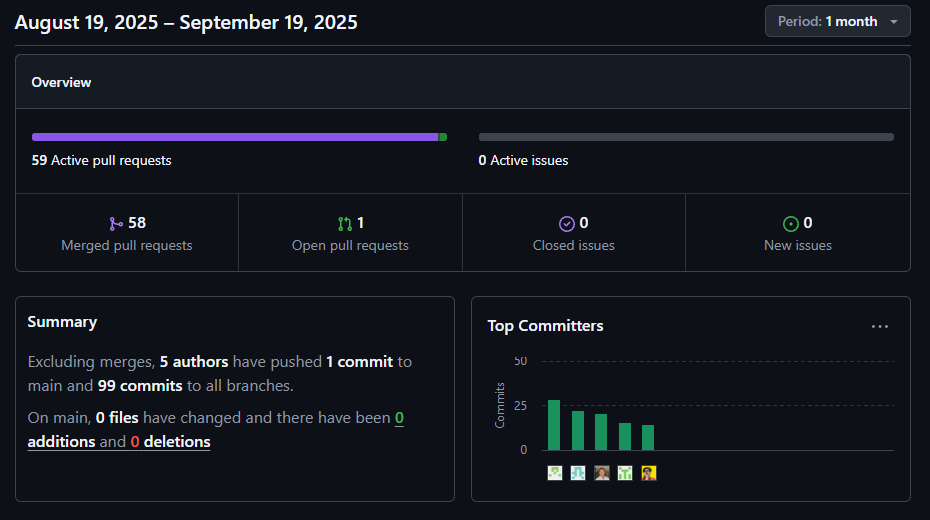

# Informe de Trabajo Final

_Universidad Peruana de Ciencias Aplicadas_

_Ingeniería de Software_

_2025-10_

**Curso:** _Aplicaciones para Dispositivos Móviles - 1ACC0238_

_Sección 12617_

_Prof. Mayta Guillermo, Jorge Luis_

## Nombre del Startup

**Nombre:** _UI-Topic_

## Nombre del Producto

**Producto:** _Restock_

## Relación de Integrantes

|  Código  |       Apellidos y Nombres       |
| :--------: | :------------------------------: |
| u202021885 |       Castro Alejos, Julio       |
| u202313354 |    Elescano Leon, Piero Hugo    |
| u202319831 |   Guerra Perez, José Jahaziel   |
| u202318274 |    Julca Minaya, Sergio Gino    |
| u202319448 | Shapiama Rivera, Gabriela Nicole |

---

**Mes y Año**
_Agosto 2025_

## egistro de Versiones

| *Versión* | *Fecha* | *Autor*          | *Descripción de modificación*                                                                                                                                                                                                                                        |
| :----------: | :-------: | :----------------- | :----------------------------------------------------------------------------------------------------------------------------------------------------------------------------------------------------------------------------------------------------------------------- |

# Project Report Collaboration Insights

Esta sección detalla cómo el equipo colaboró para construir el **Final Project Documentation Report** del sistema Restock, mostrando evidencia de trabajo conjunto mediante commits, revisiones, herramientas de organización y resultados integrados en el informe final. Se refleja la contribución de cada integrante en la planificación, desarrollo, documentación y presentación de la solución.

**Repositorio del informe del proyecto:**
[https://shorturl.at/i6Ps8](https://shorturl.at/i6Ps8)

- **Total de commits:** 507
- **Autores contribuyentes:**
  - Piero Elescano (`PieroHugo`)
  - Sergio Julca (`sergioJM05`)
  - Julio Castro (`JulioXC4`)
  - Gabriela Shapiama (`GabrielaShapiama28`)
  - Jahaziel Guerra (`jahazielgg`)

Todas las entregas se desarrollaron sobre ramas específicas con *pull requests* revisados en equipo. Se utilizaron issues de GitHub y tableros Trello para distribuir tareas, y herramientas como Figma, Draw.io, PlantUML y Structurizr para la elaboración de diagramas incluidos en el informe.

## TB1 – Informe inicial y Landing Page

*Periodo:* 27 de agosto – 18 de setiembre de 2025

Se redactaron las secciones base del informe: Introducción, Justificación, Objetivos, Guias de estilo, Usuarios y Flujo de Valor. Se construyó una **Landing Page estática** con HTML5, CSS3 y JS. Las decisiones se documentaron en Trello, y se utilizó Figma para el primer prototipo visual. Cada sección del informe fue escrita en ramas separadas y luego unificada en `develop`.

- **Contribuciones destacadas del informe:**

  - Definición de problema y objetivos.
  - Análisis de herramientas similares.
  - Diseño de flujo de valor y tipos de usuario.
  - Prototipo inicial en Figma.
  - Página informativa y formulario de contacto en Landing.
- **Commits por integrante:**

TO-DO

## Herramientas colaborativas utilizadas

- **GitHub Projects & Branching:** Para control de versiones y revisiones.
- **Trello:** Organización de tareas por entregas y responsables.
- **Discord y Google Meet:** Reuniones periódicas para coordinación.
- **Figma:** Bocetos y prototipos de interfaz.
- **PlantUML & Draw.io:** Diagramas de arquitectura y flujo.
- **Structurizr DSL:** Modelado de arquitectura de software (C4 Model).
- **Swagger/OpenAPI:** Documentación interactiva de endpoints REST.
- **Markdown Preview & VSCode:** Redacción técnica en equipo del informe.

# Tabla de contenidos

## [Capítulo I: Introducción](cap1-introduction.md)

- [1.1 Startup Profile](cap1-introduction.md#11-startup-profile)
  - [1.1.1 Descripción de la Startup](cap1-introduction.md#111-descripción-de-la-startup)
  - [1.1.2 Perfiles de integrantes del equipo](cap1-introduction.md#112-perfiles-de-integrantes-del-equipo)
- [1.2 Solution Profile](cap1-introduction.md#12-solution-profile)
  - [1.2.1 Antecedentes y problemática](cap1-introduction.md#121-antecedentes-y-problemática)
  - [1.2.2 Lean UX](cap1-introduction.md#122-lean-ux)
    - [1.2.2.1 Problem Statement](cap1-introduction.md#1221-lean-ux-problem-statement)
    - [1.2.2.2 Assumptions](cap1-introduction.md#1222-lean-ux-assumptions)
    - [1.2.2.3 Hypothesis](cap1-introduction.md#1223-lean-ux-hypothesis-statements)
    - [1.2.2.4 Lean UX Canvas](cap1-introduction.md#1224-lean-ux-canvas)
- [1.3 Segmentos Objetivos](cap1-introduction.md#13-segmentos-objetivos)

## [Capítulo II: Requirements Elicitation &amp; Analysis](cap2-requirements-elicitation-and-analysis.md)

- [2.1 Competidores](cap2-requirements-elicitation-and-analysis.md#21-competidores)
  - [2.1.1 Análisis competitivo](cap2-requirements-elicitation-and-analysis.md#211-análisis-competitivo)
  - [2.1.2 Estrategias y tácticas frente a competidores](cap2-requirements-elicitation-and-analysis.md#212-estrategias-y-tácticas-frente-a-competidores)
- [2.2 Entrevistas](cap2-requirements-elicitation-and-analysis.md#22-entrevistas)
  - [2.2.1 Diseño de entrevistas](cap2-requirements-elicitation-and-analysis.md#221-diseño-de-entrevistas)
  - [2.2.2 Registro de entrevistas](cap2-requirements-elicitation-and-analysis.md#222-registro-de-entrevistas)
  - [2.2.3 Análisis de entrevistas](cap2-requirements-elicitation-and-analysis.md#223-análisis-de-entrevistas)
- [2.3 Needfinding](cap2-requirements-elicitation-and-analysis.md#23-needfinding)
  - [2.3.1 User Personas](cap2-requirements-elicitation-and-analysis.md#231-user-personas)
  - [2.3.2 User Task Matrix](cap2-requirements-elicitation-and-analysis.md#232-user-task-matrix)
  - [2.3.3 User Journey Mapping](cap2-requirements-elicitation-and-analysis.md#233-user-journey-mapping)
  - [2.3.4 Empathy Mapping](cap2-requirements-elicitation-and-analysis.md#234-empathy-mapping)
  - [2.3.5 As-is Scenario Mapping](cap2-requirements-elicitation-and-analysis.md#235-as-is-scenario-mapping)
- [2.4 Ubiquitous Language](cap2-requirements-elicitation-and-analysis.md#24-ubiquitous-language)

## [Capítulo III: Requirements Specification](cap3-requirements-specification.md)

- [3.1 To-Be Scenario Mapping](cap3-requirements-specification.md#31-to-be-scenario-mapping)
- [3.2 User Stories](cap3-requirements-specification.md#32-user-stories)
- [3.3 Impact Mapping](cap3-requirements-specification.md#33-impact-mapping)
- [3.4 Product Backlog](cap3-requirements-specification.md#34-product-backlog)

## [Capítulo IV: Product Design](cap4-product-design.md)

- [4.1. Strategic-Level Domain-Driven Design](cap4-product-design.md#41-strategic-level-domain-driven-design)
  - [4.1.1. EventStorming](cap4-product-design.md#411-eventstorming)
    - [4.1.1.1. Candidate Context Discovery](cap4-product-design.md#4111-candidate-context-discovery)
    - [4.1.1.2. Domain Message Flows Modeling](cap4-product-design.md#4112-domain-message-flows-modeling)
    - [4.1.1.3. Bounded Context Canvases](cap4-product-design.md#4113-bounded-context-canvases)
  - [4.1.2. Context Mapping](cap4-product-design.md#412-context-mapping)
  - [4.1.3. Software Architecture](cap4-product-design.md#413-software-architecture)
    - [4.1.3.1. Software Architecture Context Level Diagrams](cap4-product-design.md#4131-software-architecture-context-level-diagrams)
    - [4.1.3.2. Software Architecture Container Level Diagrams](cap4-product-design.md#4132-software-architecture-container-level-diagrams)
    - [4.1.3.3. Software Architecture Deployment Diagrams](cap4-product-design.md#4133-software-architecture-deployment-diagrams)
- [4.2. Tactical-Level Domain-Driven Design](cap4-product-design.md#42-tactical-level-domain-driven-design)
  - [4.2.1. Bounded Context: <Resource>](cap4-product-design.md#42x-bounded-context)
    - [4.2.1.1. Domain Layer](cap4-product-design.md#42x1-domain-layer)
    - [4.2.1.2. Interface Layer](cap4-product-design.md#42x2-interface-layer)
    - [4.2.1.3. Application Layer](cap4-product-design.md#42x3-application-layer)
    - [4.2.1.4. Infrastructure Layer](cap4-product-design.md#42x4-infrastructure-layer)
    - [4.2.1.5. Bounded Context Software Architecture Component Level Diagrams](cap4-product-design.md#42x5-bounded-context-software-architecture-component-level-diagrams)
    - [4.2.1.6. Bounded Context Software Architecture Code Level Diagrams](cap4-product-design.md#42x6-bounded-context-software-architecture-code-level-diagrams)
    - [4.2.1.6.1. Bounded Context Domain Layer Class Diagrams](cap4-product-design.md#42x61-bounded-context-domain-layer-class-diagrams)
    - [4.2.1.6.2. Bounded Context Database Design Diagram](cap4-product-design.md#42x62-bounded-context-database-design-diagram)
  - [4.2.2. Bounded Context: <Subscriptions>](cap4-product-design.md#42x-bounded-context)
    - [4.2.2.1. Domain Layer](cap4-product-design.md#42x1-domain-layer)
    - [4.2.2.2. Interface Layer](cap4-product-design.md#42x2-interface-layer)
    - [4.2.2.3. Application Layer](cap4-product-design.md#42x3-application-layer)
    - [4.2.2.4. Infrastructure Layer](cap4-product-design.md#42x4-infrastructure-layer)
    - [4.2.2.5. Bounded Context Software Architecture Component Level Diagrams](cap4-product-design.md#42x5-bounded-context-software-architecture-component-level-diagrams)
    - [4.2.2.6. Bounded Context Software Architecture Code Level Diagrams](cap4-product-design.md#42x6-bounded-context-software-architecture-code-level-diagrams)
    - [4.2.2.6.1. Bounded Context Domain Layer Class Diagrams](cap4-product-design.md#42x61-bounded-context-domain-layer-class-diagrams)
  - [4.2.3. Bounded Context: <Analytics>](cap4-product-design.md#42x-bounded-context)
    - [4.2.3.1. Domain Layer](cap4-product-design.md#42x1-domain-layer)
    - [4.2.3.2. Interface Layer](cap4-product-design.md#42x2-interface-layer)
    - [4.2.3.3. Application Layer](cap4-product-design.md#42x3-application-layer)
    - [4.2.3.4. Infrastructure Layer](cap4-product-design.md#42x4-infrastructure-layer)
    - [4.2.3.5. Bounded Context Software Architecture Component Level Diagrams](cap4-product-design.md#42x5-bounded-context-software-architecture-component-level-diagrams)
    - [4.2.3.6. Bounded Context Software Architecture Code Level Diagrams](cap4-product-design.md#42x6-bounded-context-software-architecture-code-level-diagrams)
    - [4.2.3.6.1. Bounded Context Domain Layer Class Diagrams](cap4-product-design.md#42x61-bounded-context-domain-layer-class-diagrams)
  - [4.2.4. Bounded Context: <Identity and Guess Managements>](cap4-product-design.md#42x-bounded-context)
    - [4.2.4.1. Domain Layer](cap4-product-design.md#42x1-domain-layer)
    - [4.2.4.2. Interface Layer](cap4-product-design.md#42x2-interface-layer)
    - [4.2.4.3. Application Layer](cap4-product-design.md#42x3-application-layer)
    - [4.2.4.4. Infrastructure Layer](cap4-product-design.md#42x4-infrastructure-layer)
    - [4.2.4.5. Bounded Context Software Architecture Component Level Diagrams](cap4-product-design.md#42x5-bounded-context-software-architecture-component-level-diagrams)
    - [4.2.4.6. Bounded Context Software Architecture Code Level Diagrams](cap4-product-design.md#42x6-bounded-context-software-architecture-code-level-diagrams)
    - [4.2.4.6.1. Bounded Context Domain Layer Class Diagrams](cap4-product-design.md#42x61-bounded-context-domain-layer-class-diagrams)
  - [4.2.5. Bounded Context: <Monitoring>](cap4-product-design.md#42x-bounded-context)
    - [4.2.5.1. Domain Layer](cap4-product-design.md#42x1-domain-layer)
    - [4.2.5.2. Interface Layer](cap4-product-design.md#42x2-interface-layer)
    - [4.2.5.3. Application Layer](cap4-product-design.md#42x3-application-layer)
    - [4.2.5.4. Infrastructure Layer](cap4-product-design.md#42x4-infrastructure-layer)
    - [4.2.5.5. Bounded Context Software Architecture Component Level Diagrams](cap4-product-design.md#42x5-bounded-context-software-architecture-component-level-diagrams)
    - [4.2.5.6. Bounded Context Software Architecture Code Level Diagrams](cap4-product-design.md#42x6-bounded-context-software-architecture-code-level-diagrams)
    - [4.2.5.6.1. Bounded Context Domain Layer Class Diagrams](cap4-product-design.md#42x61-bounded-context-domain-layer-class-diagrams)
  - [4.2.6. Bounded Context: <Profiles>](cap4-product-design.md#42x-bounded-context)
    - [4.2.6.1. Domain Layer](cap4-product-design.md#42x1-domain-layer)
    - [4.2.6.2. Interface Layer](cap4-product-design.md#42x2-interface-layer)
    - [4.2.6.3. Application Layer](cap4-product-design.md#42x3-application-layer)
    - [4.2.6.4. Infrastructure Layer](cap4-product-design.md#42x4-infrastructure-layer)
    - [4.2.6.5. Bounded Context Software Architecture Component Level Diagrams](cap4-product-design.md#42x5-bounded-context-software-architecture-component-level-diagrams)
    - [4.2.6.6. Bounded Context Software Architecture Code Level Diagrams](cap4-product-design.md#42x6-bounded-context-software-architecture-code-level-diagrams)
    - [4.2.6.6.1. Bounded Context Domain Layer Class Diagrams](cap4-product-design.md#42x61-bounded-context-domain-layer-class-diagrams)
  - [4.2.7. Bounded Context: <Planning>](cap4-product-design.md#42x-bounded-context)
    - [4.2.7.1 Domain Layer](cap4-product-design.md#42x1-domain-layer)
    - [4.2.7.2 Interface Layer](cap4-product-design.md#42x2-interface-layer)
    - [4.2.7.3 Application Layer](cap4-product-design.md#42x3-application-layer)
    - [4.2.7.4 Infrastructure Layer](cap4-product-design.md#42x4-infrastructure-layer)
    - [4.2.7.5 Bounded Context Software Architecture Component Level Diagrams](cap4-product-design.md#42x5-bounded-context-software-architecture-component-level-diagrams)
    - [4.2.7.6 Bounded Context Software Architecture Code Level Diagrams](cap4-product-design.md#42x6-bounded-context-software-architecture-code-level-diagrams)
    - [4.2.7.6.1 Bounded Context Domain Layer Class Diagrams](cap4-product-design.md#42x61-bounded-context-domain-layer-class-diagrams)

## [Capítulo V: Product Implementation, Validation &amp; Deployment](cap5-prod-implementation-validation-deployment.md)

- [5.1 Software Configuration Management](cap5-prod-implementation-validation-deployment.md#51-software-configuration-management)
  - [5.1.1 Software Development Environment Configuration](cap5-prod-implementation-validation-deployment.md#511-software-development-environment-configuration)
  - [5.1.2 Source Code Management](cap5-prod-implementation-validation-deployment.md#512-source-code-management)
  - [5.1.3 Source Code Style Guide &amp; Conventions](cap5-prod-implementation-validation-deployment.md#513-source-code-style-guide--conventions)
  - [5.1.4 Software Deployment Configuration](cap5-prod-implementation-validation-deployment.md#514-software-deployment-configuration)
- [5.2 Landing Page, Services &amp; Applications Implementation](cap5-prod-implementation-validation-deployment.md#52-landing-page-services--applications-implementation)
  - [5.2.X Sprint n](cap5-prod-implementation-validation-deployment.md#521-sprint-1)
    - [5.2.X.1 Sprint Planning n](cap5-prod-implementation-validation-deployment.md#5211-sprint-planning-1)
    - [5.2.X.2 Aspect Leaders and Collaborators](cap5-prod-implementation-validation-deployment.md#5212-aspect-leaders-and-collaborators)
    - [5.2.X.3 Sprint Backlog n](cap5-prod-implementation-validation-deployment.md#5213-sprint-backlog-1)
    - [5.2.X.4 Development Evidence for Sprint Review](cap5-prod-implementation-validation-deployment.md#5214-development-evidence-for-sprint-review)
    - [5.2.X.5 Execution Evidence for Sprint Review](cap5-prod-implementation-validation-deployment.md#5215-execution-evidence-for-sprint-review)
    - [5.2.X.6 Services Documentation Evidence for Sprint Review](cap5-prod-implementation-validation-deployment.md#5216-services-documentation-evidence-for-sprint-review)
    - [5.2.X.7 Software Deployment Evidence for Sprint Review](cap5-prod-implementation-validation-deployment.md#5217-software-deployment-evidence-for-sprint-review)
    - [5.2.X.8 Team Collaboration Insights during Sprint](cap5-prod-implementation-validation-deployment.md#5218-team-collaboration-insights-during-sprint)

## [Conclusiones](conclusiones.md)

- [Conclusiones y recomendaciones](conclusiones.md#conclusiones-y-recomendaciones)
- [Video About-the-Team](conclusiones.md#video-about-the-team)

## [Bibliografía](bibliography.md)

## [Anexos](anexos.md)

# ABET – EAC - Student Outcome 3

**Criterio:** Capacidad de comunicarse efectivamente con un rango de audiencias.

En el siguiente cuadro se describen las acciones realizadas y enunciados de conclusiones por parte del grupo, que permiten sustentar el haber alcanzado el logro del ABET – EAC - Student Outcome 3.

| **Criterio específico**                                                                     | **Acciones realizadas**                                                                                                                                                                                                                                                                                                                                                                                                                                                                                                                                                                                                                                                                                                                                                                                                                                                                                                                                                                                                                                                                                                                                                                                                                                                                                                                                                                                                                                                                                                                                                                                                                                                                                                                                                                                                                                                                                                                                                                                                                                                                                                                                                                                                                                                                                                                                                                                                                                                                                                                                                                                                                                                                                                                | **Conclusiones**                                                                                                                                                                                                                                                                                                                                                                                                                                                                                                                                                                                                                                                                                                                                                                                                                                                                                                                                                                                                                                                                                                                                                                                                                                                                                                                                                                                                     |
| -------------------------------------------------------------------------------------------------- | -------------------------------------------------------------------------------------------------------------------------------------------------------------------------------------------------------------------------------------------------------------------------------------------------------------------------------------------------------------------------------------------------------------------------------------------------------------------------------------------------------------------------------------------------------------------------------------------------------------------------------------------------------------------------------------------------------------------------------------------------------------------------------------------------------------------------------------------------------------------------------------------------------------------------------------------------------------------------------------------------------------------------------------------------------------------------------------------------------------------------------------------------------------------------------------------------------------------------------------------------------------------------------------------------------------------------------------------------------------------------------------------------------------------------------------------------------------------------------------------------------------------------------------------------------------------------------------------------------------------------------------------------------------------------------------------------------------------------------------------------------------------------------------------------------------------------------------------------------------------------------------------------------------------------------------------------------------------------------------------------------------------------------------------------------------------------------------------------------------------------------------------------------------------------------------------------------------------------------------------------------------------------------------------------------------------------------------------------------------------------------------------------------------------------------------------------------------------------------------------------------------------------------------------------------------------------------------------------------------------------------------------------------------------------------------------------------------------------------------------- | -------------------------------------------------------------------------------------------------------------------------------------------------------------------------------------------------------------------------------------------------------------------------------------------------------------------------------------------------------------------------------------------------------------------------------------------------------------------------------------------------------------------------------------------------------------------------------------------------------------------------------------------------------------------------------------------------------------------------------------------------------------------------------------------------------------------------------------------------------------------------------------------------------------------------------------------------------------------------------------------------------------------------------------------------------------------------------------------------------------------------------------------------------------------------------------------------------------------------------------------------------------------------------------------------------------------------------------------------------------------------------------------------------------------------- |
| **Comunica oralmente  con efectividad a  diferentes rangos  de audiencia.**   | **Yaku Guzmán**  TB1: Lideró la presentación de mock-ups y flujos funcionales a usuarios durante sesiones grupales; además, condujo entrevistas como parte del proceso de *needfinding*. TP: Explicó objetivos y organización de tareas durante el Sprint Planning 2. TB2: Presentó el avance técnico del módulo de pedidos en reuniones internas y contribuyó con el tutorial en la landing page. **TF:** Participó en la implementación del sistema de autenticación y redactó la documentación correspondiente sobre los flujos de login y registro en el backend.  **Gabriela Shapiama**  TB1: Lideró la explicación del Lean UX Canvas y su relación con hallazgos del usuario. TP: Coordinó la exposición de contextos delimitados durante el Event Storming. TB2: Explicó los avances en el módulo de configuración y colaboró en la exposición del Event Storming actualizado. **TF:** Se encargó de la redacción y revisión de la sección de entrevistas finales, así como de la documentación sobre validaciones en la interfaz del sistema.  **Williams Avendaño**  TB1: Lideró la exposición de benchmarking y la propuesta inicial del sistema de búsqueda. TP: Elaboró y narró el video explicativo para la revisión del Sprint 2. TB2: Explicó el despliegue del sistema en la revisión del sprint.  **Jahaziel Guerra**  TB1: Lideró la presentación oral del análisis del backlog y la arquitectura funcional en sesiones grupales. TP: Explicó las evidencias de desarrollo técnico en reuniones internas. TB2: Presentó la estructura del módulo de recetas en el frontend. **TF:** Desarrolló funcionalidades del backend relacionadas a seguridad y gestión de recetas; redactó la documentación técnica correspondiente.  **Julio Castro**  TB1: Lideró la presentación del perfil de usuarios y user personas, enfocando en los hallazgos del proceso de necesidad. TP: Explicó el Sprint Backlog 2 en reuniones de planificación. TB2: Presentó los avances del módulo de inventario y participó en la explicación del video del producto. **TF:** Implementó el módulo de inventario y lotes en el sistema; además, redactó la documentación técnica de este módulo en el informe final.  **Antonio Navarro** **TF:** Participó en el desarrollo de pruebas funcionales del sistema y en la revisión completa del informe final. Se encargó de verificar la coherencia entre las secciones técnicas del documento. | **TB1:** Cada integrante asumió liderazgo en al menos una sección clave de comunicación oral. Esto permitió no solo desarrollar habilidades expresivas, sino también adaptar el lenguaje según el tipo de audiencia. A través de entrevistas, presentaciones de análisis, prototipos y flujos, el equipo transmitió efectivamente conceptos complejos y decisiones de diseño.  **TP:** La participación activa y rotativa en presentaciones orales fortaleció la cohesión del grupo y la claridad de los mensajes. Los videos, reuniones y exposiciones contribuyeron a comunicar con precisión el progreso técnico y organizacional del proyecto.  **TB2:** Durante el TB2, el equipo continuó con una comunicación oral efectiva al presentar avances técnicos, funcionales y organizacionales en diferentes contextos. La explicación de módulos específicos, el despliegue del sistema y los videos demostrativos evidencian la capacidad de comunicar de forma clara tanto entre el equipo como frente a evaluadores y usuarios.  **TF:** La presentación final reflejó un dominio avanzado de la comunicación oral. Se explicó con claridad la arquitectura, validación y despliegue ante una audiencia académica variada. La asignación de temas permitió mostrar seguridad, fluidez y profundidad técnica. |
| **Comunica por escrito  con efectividad a  diferentes rangos  de audiencia.** | **Yaku Guzmán**  TB1: Lideró la redacción de escenarios de usuario y tareas funcionales; documentó el desarrollo inicial del flujo base. TP: Redactó las conclusiones del equipo y afinó la coherencia de los supuestos. TB2: Redactó el Sprint Backlog 3 y contribuyó con el registro de entrevistas y evidencias de desarrollo. **TF:** Redactó la documentación de los flujos de autenticación y rutas seguras en el backend para el informe final.  **Gabriela Shapiama**  TB1: Lideró la elaboración escrita del Lean UX Canvas y síntesis de hallazgos. TP: Redactó reflexiones del equipo sobre colaboración durante el Sprint. TB2: Actualizó el registro de versiones, anexos, bibliografía y documentación del Event Storming. **TF:** Redactó la sección de entrevistas finales y documentación de validaciones en el informe final.  **Williams Avendaño**  TB1: Lideró la documentación del proceso de entrevistas y validación de usuarios. TP: Documentó las evidencias del despliegue de software para revisión técnica. TB2: Documentó evidencias de desarrollo del backend, despliegue de software y entrevistas del sprint.  **Jahaziel Guerra**  TB1: Lideró la redacción técnica del análisis contextual, arquitectura y despliegue inicial. TP: Redactó el documento de evidencias técnicas del servicio durante el Sprint Review. TB2: Redactó y corrigió entregables relacionados a clases del backend y heurísticas del sistema. **TF:** Redactó el capítulo técnico sobre seguridad, controladores REST y gestión de recetas en backend.  **Julio Castro**  TB1: Lideró la redacción del perfil estratégico y user personas. TP: Documentó y revisó las User Stories y ejecución del Sprint. TB2: Actualizó el informe con avances en el módulo de inventario, redactó insights de colaboración y el Student Outcome actualizado. **TF:** Documentó el módulo de inventario, gestión de lotes, stock y validaciones funcionales en el informe final.  **Antonio Navarro** **TF:** Redactó los anexos técnicos de pruebas funcionales, elaboró tablas de trazabilidad y verificó la consistencia escrita de los flujos de usuario documentados en el informe.                                                                                                                                                                                                                                                                   | **TB1:** Cada integrante tomó liderazgo en la elaboración de entregables escritos clave, garantizando una comunicación clara, precisa y estructurada. Esto permitió representar con fidelidad el trabajo realizado, desde documentos metodológicos como el Lean UX Canvas, hasta descripciones funcionales, user personas y análisis técnicos.  **TP:** El equipo fortaleció su redacción técnica corrigiendo y mejorando entregas anteriores, lo cual se refleja en la calidad y claridad de los nuevos documentos. Cada evidencia escrita permitió comunicar adecuadamente tanto los avances del producto como el proceso seguido por el equipo.  **TB2:** Durante TB2, se evidenció un avance en la precisión de los documentos técnicos y colaborativos. La documentación de entrevistas, evidencias de desarrollo, actualizaciones del informe y análisis de módulos muestra la capacidad del equipo de comunicar información compleja a diferentes audiencias a través de medios escritos.  **TF:** La entrega del informe final reflejó una comunicación escrita sólida, clara y coherente. Se documentaron procesos técnicos, resultados de validación, artefactos y conclusiones en un formato riguroso y profesional, adecuado para una audiencia académica y técnica.                                       |

# Objetivos SMART

*2 objs por integrante
